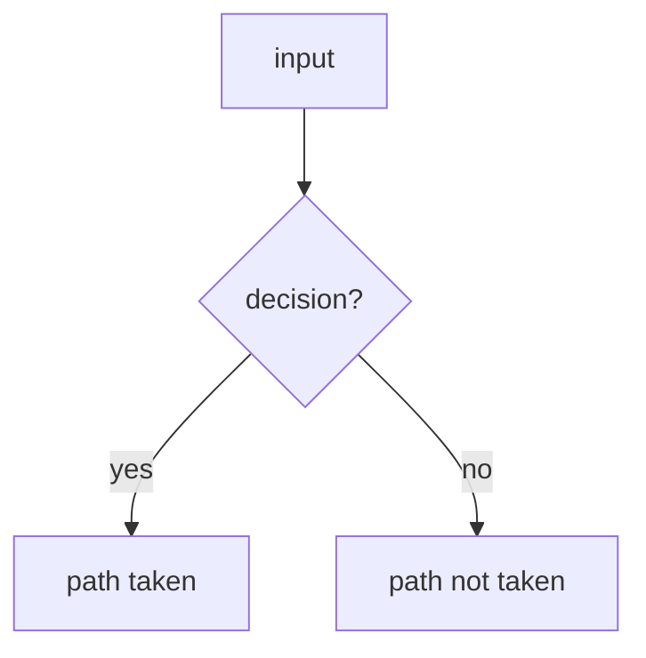

<!--
HOW TO USE THIS TEMPLATE

  task rfc:new TITLE="Artifact retention policies" SETTLES="How long a cached artifact is kept, and who decides"

That copies this file to docs/rfc/NNNN-<slug>.md, fills in the number, the
author, today's date and the header rows below, and regenerates the /rfc/ index
and sidebar. A bis of an existing RFC: add BIS=0004. To do it by hand instead,
copy this file to docs/rfc/NNNN-short-slug.md and run `task rfc:index` after.

- NNNN is the next free number, zero-padded to 4. Numbers are never reused, even
  if an RFC is rejected or withdrawn.
- The slug is kebab-case and describes the change, not the solution:
  `0002-artifact-retention-policies`, not `0002-add-a-cron-job`.
- `Status`, `Short` and `Settles` are read back out of the header table by
  `docs/build/rfc-meta.mjs`: the status banner on the published page, the table
  on /rfc/ and the /rfc/ sidebar are all generated from them. Edit them here and
  run `task rfc:index`; never edit those three surfaces directly.
- Delete every HTML comment (including this one) as you fill the file in. What is
  left should read as a document, not as a filled-in form.
- Sections that genuinely do not apply are deleted, not left with "N/A". Keep the
  numbering of the ones that remain contiguous.
- An RFC is for a change worth arguing about *before* it is written: new
  user-facing surface, a cross-crate refactor, a security-relevant default, or
  anything where the wrong choice is expensive to undo. A bug fix is not an RFC.

STATUS VOCABULARY
  Draft            — being written; open questions still open
  In review        — open questions resolved, awaiting sign-off
  Accepted         — agreed; implementation may start
  Implemented      — merged; link the PRs/commits in the header
  Rejected         — decided against; keep the file, it records why
  Superseded by NNNN
-->

# RFC NNNN — <Title>

| Field       | Value                                                        |
| ----------- | ------------------------------------------------------------ |
| Status      | Draft                                                         |
| Short       | <How this is listed: a few words, no number>                  |
| Settles     | <One line: what this settles, for the /rfc/ table>            |
| Author      | Name <email>                                                  |
| Co-author   | —                                                             |
| Created     | YYYY-MM-DD                                                    |
| Supersedes  | —                                                             |
| Touches     | `extensions/…`, `tests/heavy`, `docs/…`                       |

---

## 1. Summary

<!--
Three to six sentences. What changes, for whom, and what it looks like from the
outside. A reader who stops here should be able to describe the feature to
someone else.

Prefer showing over telling: a short before/after of the config, the CLI
invocation, or the client-side snippet is worth a paragraph of prose.
-->

### Before / after

```text
# today

# with this RFC
```

---

## 2. Motivation

<!--
Numbered list of concrete problems, strongest first. Each one should be
falsifiable — something a reviewer could disagree with on the facts.

"It would be cleaner" is not a motivation. "Cargo publishes to /api/v1/crates/new
and our path prefix breaks it" is.
-->

1. **<Problem>.** <Why it hurts today, with the specific code path or workflow.>
2. …

---

## 3. Goals / non-goals

**Goals**

- <One capability per bullet, phrased as an outcome, not an implementation.>

**Non-goals**

<!--
The most useful section in the document. Every non-goal you write is a review
cycle you do not spend. Include the things a reasonable reader would assume are
in scope.
-->

- <Thing deliberately not done, and one clause on why.>

---

## 4. User-facing design

<!--
Everything an operator or user sees: config surface, CLI flags, API shape,
behaviour rules. This section should be readable by someone who will never open
the source.
-->

### 4.1 Configuration

```toml
[section]
option = "value"    # what it does
```

- <Defaults, and what "absent" means as distinct from "empty".>

### 4.2 Behaviour rules

- <Normalisation, precedence, and what happens in the uninteresting case.>

### 4.3 Validation

<!--
Split hard errors from warnings explicitly. If something degrades rather than
fails, say where the operator will actually see it — a `tracing::warn!` nobody
reads is not an answer.
-->

Hard errors (notification, feature disabled until fixed):

| Condition | Rationale |
| --- | --- |
| <what> | <why this must fail rather than degrade> |

Warnings (logged and surfaced to the admin):

| Condition | Behaviour |
| --- | --- |
| <what> | <what happens instead of failing> |

---

## 5. Architecture

<!--
The mechanism, at the level of "which layer does what". Name the existing types
and functions you are extending — an RFC that invents vocabulary the codebase
does not use is hard to review and harder to implement.

Diagrams: mermaid, rendered natively by the forge. Two to four is usually right.
Reach for a `flowchart` for control flow and decisions, a `sequenceDiagram` for a
request crossing components, a `graph` for build/wiring relationships.

Label-escaping gotchas: wrap labels in double quotes, use `<br/>` for line
breaks, and HTML entities for brackets and braces — `#91;` `#93;` `#123;` `#125;`.
-->

### 5.1 <Mechanism>



<!--
State the invariant the design protects, not just the steps. "Because X rewrites
everything, Y cannot be reached here" is the sentence a reviewer checks.
-->

---

## 6. Detailed design

<!--
One subsection per component, in dependency order. Name real files, types and
functions — `extensions/java-core/src/jdk/resolve.ts`, `resolve()` — so the
implementer does not have to re-derive where things go.

Include a short "deliberately untouched" list for anything a reviewer will
reasonably expect to change and that does not. It saves a round trip.
-->

### 6.1 `extensions/<name>`

- <Change, with the concrete symbol or file.>

### 6.2 …

**Deliberately untouched**, so reviewers do not go looking:

- `<path>` — <why it looks relevant but is not.>

---

## 7. Security considerations

<!--
Required, even when the answer is short. Cover, where they apply: trust
boundaries and which inputs are attacker-controlled; whether the change adds
authenticated or unauthenticated surface; what an attacker gains if a check is
bypassed (often "nothing they could not already do" — say so, and say why);
existing defences that still apply after the change.

If the change genuinely has no security dimension, write one sentence saying so
and why, rather than deleting the section.
-->

- **<Property>.** <Statement, and the reason it holds.>

---

## 8. Alternatives considered

<!--
Anything a reviewer might propose. Rejecting an alternative well is the strongest
evidence the chosen design was actually chosen.
-->

| Alternative | Why rejected |
| --- | --- |
| <approach> | <the concrete cost, not "it is worse"> |

---

## 9. Rollout and compatibility

- **Default behaviour** when the feature is not configured.
- **Config migration**, if any.
- **Operator prerequisites** — DNS, certificates, infrastructure, credentials.
- **Rollback** — what it takes to undo, and whether anything is persisted.

---

## 10. Test plan

<!--
Per layer, and specific enough to be a checklist during review. Name the test
files. Say which existing suites act as the regression signal — for a refactor
that is often the strongest guarantee in the plan.
-->

- **Unit** (`<path>`): <cases>.
- **Integration** (`<path>`): <cases>.
- **Existing suites** that must pass unchanged: <which, and what they prove>.

---

## 11. Decisions and open questions

<!--
Start with everything under "Still open". As questions are answered, move them up
with the decision and its one-line rationale — the record of *why* is the point.
Do not delete answered questions.

The RFC is ready for sign-off when "Still open" is empty.
-->

### Resolved

| # | Question | Decision |
| --- | --- | --- |
| 1 | <question> | **<decision>.** <one-line rationale.> |

### Still open

1. <Question, with the trade-off stated and a recommendation if you have one.>

---

## 12. Implementation phases

<!--
Ordered, independently reviewable, each leaving the tree green (`task check`). Call out any phase that is useful on its own even if the rest
never lands — those can ship early.
-->

| Phase | Content |
| --- | --- |
| 1 | <scope> |
