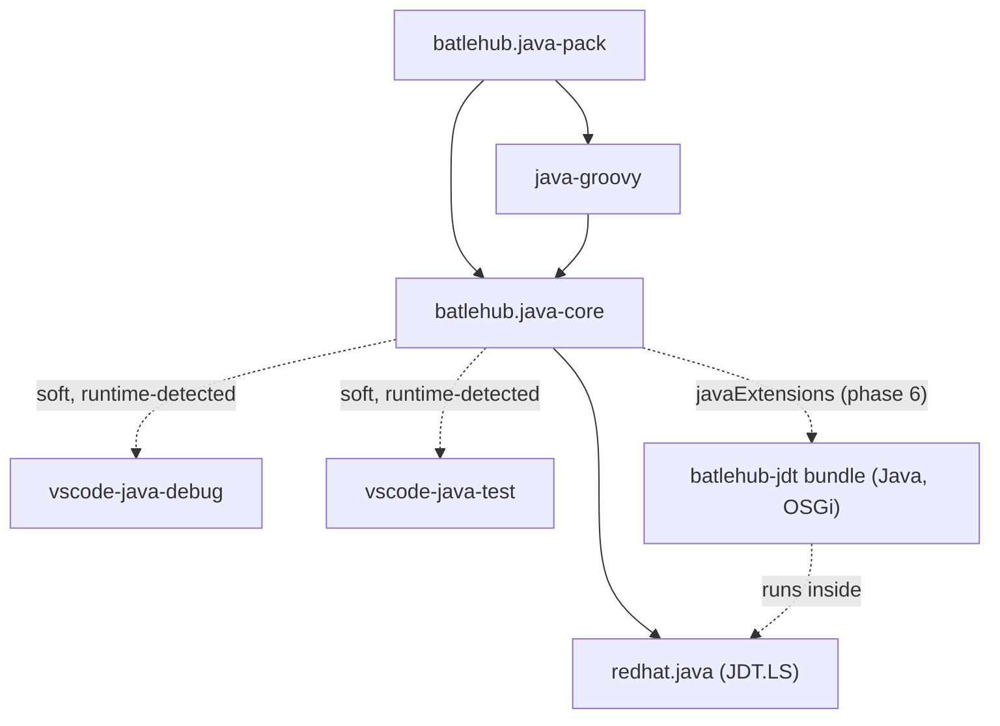
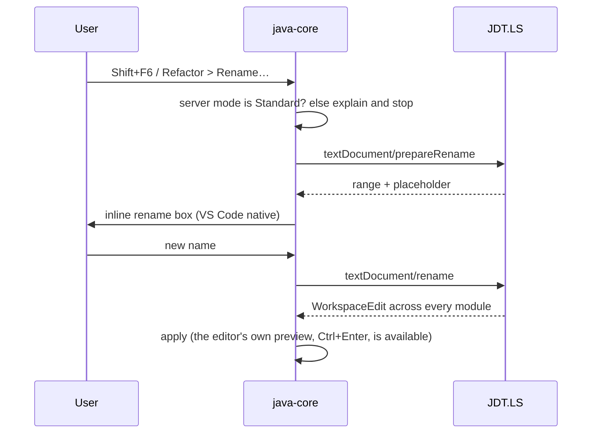

# RFC 0001 — Java for VS Code: one core, cut to what ships

| Field       | Value                                                        |
| ----------- | ------------------------------------------------------------ |
| Status      | Implemented — revision 8, 2026-09-18; phases 0–8 landed and proven in a real editor, everything revision 7 owed in code written, the split (phase 9) deliberately not earned |
| Short       | Java extensions                                               |
| Settles     | How BatleHub closes the gap between VS Code and IntelliJ IDEA for Java: one core extension that orchestrates the Red Hat language stack and adds what it lacks, the contract a later satellite plugs into, and what is deliberately deferred to its own RFC |
| Author      | Max Batleforc <maxleriche.60@gmail.com>                       |
| Co-author   | —                                                             |
| Created     | 2026-09-17                                                    |
| Revised     | 2026-09-17 — revision 2, the v1 scope cut (§8, §11 decisions 3, 19, 21, 31). Same day, revision 3, read against the tree: the registry token asked from `batlehub-vsx` instead of a second contract-file reader (decision 38), the Java heavy half without a BatleHub (decision 39), m2e's profile preference tried before the credential-bearing overlay (decision 14), v0.1 shrunk to the newcomer story (decision 37), untrusted means nothing runs (decision 40), `fr` and the `.batlehub/java/*.toml` files dropped, `.forgejo` mirror and Sonar removed, diagrams rendered by the docs site. 2026-09-18, revision 4, written from the implementation (`todo.md` of this repository): `redhat.java` a soft dependency (§4.1, decision 41), the language server's own JDK written by the core (§4.2), decisions 8 and 14 answered, Maven + bnd instead of Tycho (§6.2), the scope notes of §15. Same day, revision 5, after the last real-editor runs: the registry link driven against a real BatleHub (`/maven2`, §4.2), the build tool resolved through the manager like the JDK (§4.2), the Groovy heap capped, §15 brought up to date. Same day, revision 6, after the first green CI on a runner (PR #7): what the runner found (§15.5). Same day, revision 7, after the series was reviewed against its goal: the red lines and the memory rule (§7.1), the contract changelog and `token()` leaving the contract (§5.2), the server's JDK written only when `redhat.java` found none (§4.2), what would reopen decision 1 (§11), the stale rows of revisions 3–6 corrected, Appendix A rows linked to their RFCs. No new feature enters this document; everything new is a draft of the series. Same day, revision 8, **Implemented**: the six things revision 7 owed in code are written and proven (§15.7) — the server's JDK read off `redhat.java` and never off the core's own scan, file modes in the manifest, the workspace `settings.json` and m2e's preference under the lock, `registry.token()` deprecated in 1.0, the "tested up to" warning, and the home probes answering before trust (§7.1's gate, decision 40). Nothing is owed; the RFC closes and the series moves to [0008](/rfc/0008-kotlin-satellite) phase 0 (§14) |
| Supersedes  | —                                                             |
| Depends on  | BatleHub RFC 0011 (the credential `batlehub-vsx` holds; the optional registry link asks that extension for it and never reads the file); BatleHub RFC 0018 (verdicts the dependency views may surface); BatleHub RFC 0023 (the che-code the extensions are exercised in). BatleHub RFCs live in `batleforc/batlehub/docs/rfc/`; this series is the extensions' own. |
| Touches     | `extensions/java-core`, `java-groovy`, `java-pack`; `jdt/` (phase 6); `tests/heavy` (a `java` half); `docs/rfc/` (this series), `docs/guide/java/`; `extensions/batlehub-vsx` (one exported method, phase 5) |

---

## 1. Summary

A Java developer moving from IntelliJ IDEA to VS Code (stock or che-code) loses
less than they think on the language itself — JDT.LS, shipped by `redhat.java`,
covers completion, navigation, rename, refactorings and code generation — and
more than they expect on everything around it: which JDK runs, how modules and
dependencies are laid out, how a run configuration is edited, how many
inspections have a one-click fix, and whether Groovy files open with anything
better than syntax colouring.

Appendix A inventories every gap found, domain by domain, with where each one
is handled — this RFC, a later one, or nowhere on purpose. The body of the RFC
covers the part this RFC settles.

This RFC adds **one** extension to `batlehub-vsx` that matters:
`batlehub.java-core` depends on `redhat.java` and adds a JDK manager, a
unified project explorer, a run-configuration editor, an IDEA-style context
menu, the Maven and Gradle integration, and — from phase 6 — an inspection
and generator bundle loaded into JDT.LS. `batlehub.java-groovy` is the one
satellite of v1, and it is the extension that proves the core's contract.
`batlehub.java-pack` installs the lot. The link to the BatleHub registry
(mirror + token) is a core feature, on by proposal and off by a setting.

Maven and Gradle live *inside* the core until one of them needs its own
release cycle; the satellite split, the TypeScript contract package and the
headless Rust engine are phase 9 and their own RFCs (§8, §14). Revision 1 of
this RFC front-loaded all three; revision 2 cut them, because none is needed
to ship the features a Java developer actually notices.

### Before / after

```text
# today (stock VS Code + Extension Pack for Java)
- "Which JDK?"                  → JAVA_HOME, or settings.json by hand
- "Run with -Xmx2g and profile X" → edit launch.json, guess the keys
- Right-click > "Source Action…" → a flat list; getters/setters, no options
- build.gradle, Jenkinsfile      → colours only
- Unused import                  → a warning, no fix chain, no batch

# with this RFC
- status bar: one item, "Java ✓" (or "Java ⚠ JDK 17, project wants 21"); click opens the Java panel
- Java panel, tabs: JDK · Build · Run · (Profiles · Inspections) — everything configurable in one place
- Run > Edit configurations…     → form: main class, VM args, env, profile, working dir, before-launch
- Right-click > Generate > Getters and setters… → Red Hat's own pickers, grouped, in v0.2; options from phase 6
- build.gradle, Jenkinsfile      → completion, hover, diagnostics
- Inspections view               → grouped, batch quick fix, "fix all in file" (phase 6)
```

---

## 2. Motivation

1. **The JDK is invisible.** `redhat.java` reads `java.configuration.runtimes`
   from `settings.json`; nothing detects a `mise`/`sdkman` install, nothing
   installs one, and a workspace whose `pom.xml` targets 21 on a machine that
   has 17 fails with a message deep in the Java output channel. In a Che
   workspace this is the first thing a newcomer hits.
2. **Run configurations are JSON.** IDEA's run configuration dialog is the
   surface most people use ten times a day. VS Code has `launch.json`, whose
   `java` keys (`vmArgs`, `env`, `projectName`, `preLaunchTask`) nobody
   remembers; there is no form, no template, no "copy this one".
3. **Code generation is thin where it matters.** Rename across the workspace
   works (JDT.LS). Generating accessors works, but as a flat "Source Action…"
   with no options — no prefix, no fluent setters, no field selection dialog
   worth the name.
4. **Inspections are the real IDEA moat.** IDEA ships hundreds with quick
   fixes and a batch mode; JDT.LS ships compiler warnings plus a few cleanups.
   There is no view, no "fix all", no way to add one without forking the
   language server.
5. **Groovy has no viable server.** `build.gradle`, `Jenkinsfile` and Groovy
   test suites open as plain text. The only existing server (Prominic's) is
   unmaintained and not packaged for che-code.
6. **The Java ecosystem on VS Code is six extensions with six styles.** Project
   manager, Maven, Gradle, debug, test, dependency viewer: six trees, six
   settings prefixes, no shared notion of "the active module". A core that
   owns those notions is the only way anything can compose.
7. **A Che workspace is a memory budget, not a laptop.** JDT.LS, a Gradle
   daemon, a Groovy server and Maven in one container with a `memoryLimit`
   nobody set is an `OOMKilled` pod, and the newcomer of point 1 reads it as
   "VS Code cannot do Java". Nothing in the stock stack says a word about it.

---

## 3. Goals / non-goals

**Goals**

- A Java developer can open a Maven or Gradle project in stock VS Code or in
  che-code, be told which JDK will be used, and change or install one without
  leaving the editor.
- Rename and code generation reach IDEA parity for the everyday cases: rename
  across the workspace, generate accessors/constructors/`equals`/`hashCode`/
  `toString`/delegates from the context menu — through `redhat.java`'s own
  generators in v0.2, with options once the bundle lands (phase 6).
- Run configurations are edited in a form, stored in `launch.json` so the
  stock debugger and other tooling keep reading them.
- Inspections are pluggable: a rule and its fix are one class in the bundle,
  the user sees them grouped and can fix in batch (phase 6).
- The workspace tells the developer when its own resources are the problem,
  and the docs say what to put in the devfile.
- The BatleHub registry link is offered, never imposed:
  `batlehub.java.registry.enabled` defaults to `"ask"`, and `false` disables
  every registry call.
- One extension is enough to be useful. The contract exists because
  `java-groovy` uses it, not because a future satellite might.

Beyond parity — what neither IDEA nor Eclipse offers, and this family does:

- **No `.idea`.** Inspection profile, run configurations, templates and
  toolchain live in committed files (`launch.json`, workspace
  `settings.json`, `mise.toml`) read identically by the editor and the CI.
- **Usable before indexing.** JDK, module structure and build files are read
  by the extension host itself, so the panel answers within a second of
  opening; JDT.LS features arrive when the server is ready, and the UI says
  which state it is in.
- **Supply chain in the tree**: BatleHub verdicts (BatleHub RFC 0018),
  signatures and provenance on each dependency node, and git-forge
  dependencies (BatleHub RFC 0019) with their mutable-ref warning.
- **Headless engine** — every operation also a CLI subcommand and an MCP
  tool, so CI and coding agents drive the same engine the editor uses. It is
  the point of the `headless-engine-mcp` RFC (§14), not of this one: the
  engine is worth building once the bundle's delegates exist to wrap.

**Non-goals**

- Writing or forking a Java language server. `redhat.java` is a dependency;
  if it proves insufficient the fallback is a *bundled* JDT.LS behind the same
  core API (§11 decision 1), not a new server.
- Reimplementing what the Red Hat / Microsoft stack does well: debugging
  (`vscjava.vscode-java-debug`), test running and coverage
  (`vscjava.vscode-java-test`). The core uses them when they are installed
  and degrades when they are not (§4.2).
- A native helper binary in v1. Everything v1 needs — directory probing,
  `mise`/`sdkman` listing, XML rewriting — the extension host does in
  TypeScript. A Rust engine is the `headless-engine-mcp` RFC's subject
  (§11 decision 3).
- Downloading a JDK ourselves in v1. `mise` and `sdkman` install JDKs; that
  is their job, and in a Che workspace `mise` is already there
  (§11 decision 10).
- Semantic inspections outside JDT.LS. Anything that needs types or the
  classpath runs inside the language server as a Java OSGi bundle; nothing
  else is eligible (§5.3).
- Writing to the devfile. The extensions never add or edit devfile commands
  or components; they *read* the container's limits to warn (§4.2), and a
  later RFC may read devfile commands as run-configuration templates.
- Orchestrated run sequences (a server started, ready, then the tests, then
  stopped). The engine and the server step kinds are one subject and one RFC
  (`server-run-step-kinds`, §14).
- Kotlin and Scala, and every framework satellite (Spring, Quarkus,
  Jakarta EE, …). They fit the contract and get their own RFCs in this
  series; here they only appear in Appendix A as handled elsewhere.
- A database client, HTTP client, or Docker integration. IDEA Ultimate
  features, out of scope for a Java core.
- Replacing IDEA's keymap extension. The pack recommends
  `k--kato.intellij-idea-keybindings`; the core only binds its own commands.

---

## 4. User-facing design

### 4.1 Extensions and settings

| Extension id                | Depends on                                                             | Ships |
| --------------------------- | ---------------------------------------------------------------------- | ----- |
| `batlehub.java-core`        | **soft:** `redhat.java` (≥ 1.56.0, a hard *error* when absent, §4.3), `vscjava.vscode-java-debug`, `vscjava.vscode-java-test` | JDK manager, project explorer, the Java panel (tabs), run configs, Generate menu, Maven, Gradle, registry link, satellite host; from phase 6 the `javaExtensions` bundle and the inspections view |
| `batlehub.java-groovy`      | `batlehub.java-core`                                                   | Groovy language server, Gradle DSL and Jenkinsfile modes |
| `batlehub.java-pack`        | both + recommended keymap and theme                                    | nothing but the pack |

**Every dependency is soft, and `redhat.java` had to become one** (revision 4,
decision 41). Revision 3 made it an `extensionDependencies` entry — an entry
makes the extension *uninstallable* in an editor whose gallery lacks that id,
which reads as a guarantee. The real editor showed the cost: when
`redhat.java` finds no JDK — the newcomer of §2 point 1, a fresh Che
workspace with `mise` and no global `java` — its own activation rejects, and
the editor then refuses to activate every extension that depends on it. The
one extension whose job is to fix "no JDK" was switched off by "no JDK". So
`redhat.java`, the debugger and the test runner are all found at runtime
through `extensions.getExtension`; `redhat.java` absent or below the pinned
minimum is a hard *error* (§4.3, a notification, the language features off,
everything else — JDK, memory, panel — working), and the pack's
`extensionPack` keeps the lot installed together. What is given up is that
installing the core alone no longer pulls `redhat.java` in.

Settings share the `batlehub.java.*` prefix — **not** `java.batlehub.*`:
`java.*` is `redhat.java`'s configuration namespace, and the Settings UI
groups keys by contributing extension anyway, so squatting a foreign prefix
buys nothing and risks colliding with its schema validation.

```jsonc
// Environment keys: absent = auto-detected; a value = override. See "Detected by default" below.
"batlehub.java.jdk.sources": ["mise", "sdkman", "env", "wellKnown"], // detection order (this one has a default)
"batlehub.java.jdk.installVia": "auto",              // auto | mise | sdkman | none
"batlehub.java.jdk.matchProject": true,              // pick the runtime the build tool asks for
"batlehub.java.generate.getterPrefix": "get",        // honoured from phase 6 (bundle)
"batlehub.java.generate.booleanPrefix": "is",
"batlehub.java.generate.fluentSetters": false,
"batlehub.java.generate.finalFields": "keepSetters",  // keepSetters | skipSetters
"batlehub.java.report.url": "",                       // empty: the GitHub issue template of batlehub-vsx
"batlehub.java.log.level": "info",
"batlehub.java.statusBar.items": {},                  // satellite item id -> shown; absent: the satellite's default
"batlehub.java.resources.warnBelow": "2Gi",           // container memory under which the panel warns; "" disables
"batlehub.java.inspections.enabled": true,            // phase 6
"batlehub.java.inspections.severityOverrides": {},    // ruleId -> error | warning | info | hint | off
"batlehub.java.maven.configurations": [               // absent: detected from ~/.m2/settings*.xml
  { "name": "corp", "settingsFile": "~/.m2/settings-corp.xml", "profiles": ["corp-mirror"] },
  { "name": "oss",  "settingsFile": "~/.m2/settings-oss.xml" }
],
"batlehub.java.maven.activeConfiguration": "corp",    // workspace scope
"batlehub.java.maven.activeProfiles": ["dev"],        // workspace scope, -P on every goal
"batlehub.java.registry.enabled": "ask",              // ask | true | false
"batlehub.java.registry.url": "",                     // empty: the one batlehub-vsx is signed into
"batlehub.java.coexistence": {},                      // written by the core: the answer to the hide-views prompt, per workspace
"batlehub.java.experimental": {}                      // feature flags, e.g. { "intellijImport": true }
```

That list is exhaustive on purpose, but it is the design, not the schema:
the `lint` job's settings-schema check (§13) compares `package.json` with
the docs' settings page and fails on a key missing from either. This
section is not in the check; a phase that renegotiates a key updates it by
hand.

- **Detected by default, overridable, re-detectable.** Every key above that
  describes the environment rather than a taste — JDK sources and the active
  runtime, `installVia`, Maven configurations (every `~/.m2/settings*.xml`,
  `mvnw`, `MAVEN_HOME`), the profiles declared, Gradle wrapper and home, the
  registry URL — is *absent* by default and computed by detection. The build
  tool gets the JDK's treatment (revision 5): `MAVEN_HOME`/`GRADLE_HOME`,
  then `mise ls maven|gradle --json`, and tasks run that home before `PATH`
  — in the newcomer's workspace a `mise` shim with no version set *fails*
  rather than being absent, for `mvn` exactly as for `java`. A key the
  user writes is an override and wins until removed. Detection runs at
  activation and on demand: `Java: Detect environment` (everything) and a
  `Detect` button on each panel tab (that domain only). Detected values are
  displayed in the panel with their origin (`detected: mise`, `set by you`)
  and are not written to `settings.json`, except the keys other extensions
  read (`java.configuration.runtimes`, `java.configuration.maven.userSettings`),
  which the core keeps in sync at workspace scope. Only taste keys
  (`generate.*`, `inspections.*`, `statusBar.items`, `resources.warnBelow`)
  have plain defaults.
- Absent `registry.url` with `registry.enabled: true` asks `batlehub-vsx` for
  the registry it is signed into (§4.2, registry link); `batlehub-vsx` absent
  or signed out → warning in the status bar, no registry calls.
- `jdk.sources` absent means the default order — `mise` first, because in
  every image this repository targets `mise` is the package manager that is
  actually there; empty means "detect nothing, only what
  `java.configuration.runtimes` already lists".

### 4.2 Behaviour rules

- **Status bar.** The core contributes one item, `Java`, whose text is the
  worst current state (✓ ready · ⟳ importing · ⚠ warning · ✗ error) with a
  one-line tooltip (JDK, build tool, active Maven configuration and profiles,
  server mode); it cannot be turned off. A satellite may add items through
  `registerStatusBarItem` — never directly — and every such item is a
  toggle in `batlehub.java.statusBar.items` (`{ "groovy.server": false }`),
  also switchable from the Java panel's `Build` tab; the core hides an item
  the developer turned off before it is ever created. Satellites declare
  a default per item, and default to hidden for anything that is not a
  one-glance state.
- **The Java panel's look.** The panel lives with the editor's theme: every
  colour, font and control comes from the `--vscode-*` tokens, so it looks
  native in light, dark and high contrast and needs no design work of its
  own. BatleHub's identity does not go into the panel; it goes into a
  **BatleHub colour theme** — a separate, tiny extension
  (`contributes.themes`, dark and light variants derived from BatleHub's `DESIGN.md` (that repository, not this one))
  that the pack recommends. Own RFC (§14).
  The webview is plain HTML, CSS and TypeScript bundled by the `esbuild.mjs`
  every extension of this repository already has — no framework, no
  Tailwind: it is five tabs of form controls styled by tokens the editor
  provides, and a build step for that is a build step for nothing. A
  framework comes back the day a tab needs real interaction, and it will be
  visible in the diff.
- **The Java panel** is a webview in the `Java` view container with tabs
  contributed by the core (`JDK`, `Build`, `Run`, `Profiles`, and
  `Inspections` from phase 6) and by satellites through `registerPanelTab`.
  Every setting of §4.1 is editable there and written to the same
  `settings.json` keys, so the panel and the Settings UI never disagree; the
  core listens on `onDidChangeConfiguration` and repaints.
- **Detection is a pure function of the machine and the workspace**, returning
  a JSON snapshot; the core diffs it against the previous one and against
  overrides, then updates the panel and the keys other extensions read.
  Re-running detection never discards an override; the panel offers
  "Clear override" per key to go back to the detected value.
- **JDK resolution.** For each workspace folder: build-tool requirement
  (`maven.compiler.release`, `<toolchains>`, Gradle `toolchain`) → matching
  installed runtime → otherwise the newest installed → otherwise offer an
  install.
- **JDK install is delegated, always.** `installVia: auto` looks for a manager
  the user already has, in order `mise`, `sdkman`, and delegates to it
  (`mise use java@<ver>`, `sdk install java <id>`), listing the versions the
  manager offers; the JDK then belongs to the manager, shows up in its own
  tooling, and is detected like any other. With no manager at all, the core
  says so and links the guide — it does not download, extract or checksum
  anything itself (§11 decision 10; direct download is its own RFC). The
  result is written to `java.configuration.runtimes` (workspace scope) so
  `redhat.java` sees exactly what the status bar says. The core never edits
  user-scope settings.
- **The language server's own JDK is a second write** (revision 4).
  `java.configuration.runtimes` tells JDT.LS which JDKs *projects* use, not
  which JDK *it* runs on; `redhat.java` finds that one through
  `java.jdt.ls.java.home`, `JDK_HOME`, `JAVA_HOME` or `PATH`, and does not
  scan a manager's install directory. A fresh Che workspace with `mise` and
  no global `java` has none of those, so the server never starts — which
  is the whole of §2 point 1, and revision 3 had only half of it. When
  nothing names a JDK ≥ 17, the core writes `java.jdt.ls.java.home`
  (workspace scope, through the manifest) to the newest runtime it found
  and lets `redhat.java` ask for the reload. Proven by the heavy suite's
  `NEWCOMER-OK` step. **Only then** (revision 7): "nothing names a JDK" is
  read off `redhat.java` itself — its activation failed, or `serverRunning()`
  is false with no `javaRequirement` — never off the core's own scan. A
  desktop or a CI runner has `/usr/lib/jvm`, which `redhat.java` scans and the
  core did not count: the core then wrote the setting under a server that was
  already starting, the reload put a second JDT.LS on the same `jdt_ws`, and
  the bundle ping waited ten minutes (§15.5). A server that is running is
  never reloaded by the core; the resolved JDK goes to
  `java.configuration.runtimes`, and the panel's `Language server` section
  and the status bar tooltip both say which JDK the server itself runs on
  (`javaRequirement`'s `tooling_jre`). Written in revision 8: the rule is one
  pure function with its own unit table, and the heavy half's `DESKTOP` step
  proves the other side — a `redhat.java` holding its own JDK is left alone.
- **The container's resources are a first-class diagnostic.** At activation
  the core reads the cgroup limit (`/sys/fs/cgroup/memory.max`, v1 fallback
  `memory/memory.limit_in_bytes`; absent on a laptop, present in every Che
  pod) and compares it against what this workspace is about to run: JDT.LS's
  `-Xmx` (`java.jdt.ls.vmargs`), a Gradle daemon, the Groovy server when
  `java-groovy` is installed. Below `resources.warnBelow` the status bar
  turns ⚠ and the `JDK` tab explains in one line what will be killed first,
  with a link to `docs/guide/java/resources.md` — which gives the
  `memoryLimit` / `memoryRequest` to put in the devfile's tools container
  for a Java workspace, and the `java.jdt.ls.vmargs` that fits under it. The
  extension never edits the devfile; the developer does, and restarts the
  workspace. One warning per session, dismissible.
- **The server mode gates half the features.** `redhat.java` runs in
  `Standard`, `LightWeight` or `Hybrid` (`java.server.launchMode`), and in
  `LightWeight` there is no full JDT.LS: no rename, no generators, no
  `java.execute.workspaceCommand`. The core follows the mode through the API
  `redhat.java` exports (`serverMode`, `onDidServerModeChange`, verified by
  phase 0 spike (c)), shows it in the status bar tooltip, disables the menu
  entries that cannot work (`when` clauses on a context key the core sets),
  and offers to switch the mode rather than failing a command.
- **Run configurations** are read from and written to `.vscode/launch.json`
  entries of `type: "java"`. The editor adds no key the stock debugger does
  not understand; BatleHub-specific fields (template origin, profile) live
  under `"batlehub": {}` inside the entry and are ignored by the debugger.
- **Generate menu, v0.2 versus phase 6.** In v0.2 the submenu is a curated,
  grouped front end over `redhat.java`'s own generators
  (`java.action.generateAccessorsPrompt`, `…generateConstructorsPrompt`,
  `…generateToStringPrompt`, `…hashCodeEqualsPrompt`, `…generateDelegateMethodsPrompt`):
  the ergonomics improve, the options do not — Red Hat's commands take none.
  From phase 6 the same menu entries route to the bundle's delegates
  (§6.2) with the options of §4.1 as JSON, and fall back to Red Hat's
  command, with a one-line notice, whenever a delegate is missing (bundle not
  yet loaded, `LightWeight` mode, an incompatible `redhat.java`). No menu
  entry ever dead-ends.
- **The bundle is loaded at server start only** (phase 6). `contributes.javaExtensions`
  is read when JDT.LS starts, so installing or updating `java-core` leaves
  the delegates absent until the server restarts. The core probes with
  `batlehub.ping` after activation and, when it fails while the mode is
  `Standard`, offers "Restart the Java language server" (the command
  `redhat.java` exposes for it) instead of letting the Generate menu and the
  inspections view fail one command at a time.
- **Inspections** (phase 6) are JDT.LS diagnostics with a `source` of
  `batlehub` and a `code` of `<area>/<ruleId>`; severity overrides apply
  client-side before display. "Fix all in file" is a single workspace edit.
- **Running build commands.** A goal, task or lifecycle phase runs through
  the VS Code Task API: the core registers a task provider of type
  `batlehub-java` (so tasks are also writable by hand in `tasks.json` and
  reusable as `preLaunchTask`), and runs them in an integrated terminal with
  the resolved JDK, the active Maven configuration and the active profiles
  applied. The devfile is neither read nor written for this; the terminal is
  the workspace's own shell, so whatever the devfile provides (wrapper, cache,
  env) is there anyway.
- **Maven configurations.** `batlehub.java.maven.configurations` is a list of
  named entries (`settingsFile`, optional `toolchainsFile`, `mavenHome`,
  `env`, default `profiles`); one is active per workspace folder, switched
  from the `Build` tab. Switching rewrites
  `java.configuration.maven.userSettings` (workspace scope) so JDT.LS
  re-imports with the same settings the goals use, and re-runs the import.
- **Maven profiles.** The active set is a multi-select over the profiles
  declared in the POM hierarchy and in the active settings file, stored in
  workspace settings (`batlehub.java.maven.activeProfiles`), toggled in the
  `Profiles` tab, and passed as `-P` to every goal.
  For the language server's import, which has no profile setting of its own,
  the core writes the set where m2e already reads it: `activeProfiles=` in
  the project's `.settings/org.eclipse.m2e.core.prefs` (a file JDT.LS
  already generates beside `.classpath`; the manifest records the previous
  value), then asks for a re-import. **Spike (a) answered yes** (decision
  14, revision 4): the profile-only dependency reached the classpath after
  re-import in the real editor. The overlay below is therefore *not* on any
  default path; it stays as an explicit command (`Java: Maven: apply the
  profiles through a settings overlay`) for a JDT.LS that stops reading the
  preference.
- **The overlay, when someone runs that command, is a secret-bearing file
  and is treated as one.** Maven has
  no include mechanism, so the overlay is a *copy* of the active
  settings file with `<activeProfiles>` added — credentials, mirrors and
  tokens included, inside the work tree. Therefore: the core writes it
  `0600`, adds `/.batlehub/java/` to the workspace's `.gitignore` (creating
  the file if needed, one fenced line it owns) **before** writing the
  overlay, refuses to write it at all if that `.gitignore` edit fails, copies
  only the elements the import needs (`<profiles>`, `<activeProfiles>`,
  `<mirrors>`, `<servers>` — the last one because m2e resolves through it)
  and never logs its content. `Java: Remove BatleHub settings` deletes it.
- **Coexistence with the stock Java extensions.** At activation the core
  checks for `vscjava.vscode-maven`, `vscjava.vscode-gradle`,
  `vscjava.vscode-java-dependency`. Once per workspace it proposes to quiet
  what they duplicate — through their own settings, never by disabling the
  extension — remembers the answer in `batlehub.java.coexistence`, and the
  Java panel's `Build` tab shows what was changed and puts it back. What a
  setting can quiet is what is quieted (revision 4): those extensions have
  no setting that hides a view, so the writes are the duplicate context-menu
  entries and the explorer sync (`maven.showInExplorerContextMenu`,
  `java.dependency.syncWithFolderExplorer`, `gradle.showStoppedDaemons`),
  each recorded in the manifest; a view itself is hidden by the developer
  from its title menu, as the editor intends.
- **Import from IntelliJ** (phase 4, behind `experimental.intellijImport`).
  `Java: Import IntelliJ run configurations` reads `.idea/runConfigurations/*.xml`
  and `workspace.xml` and writes `launch.json` entries of type `java`
  (Application, JUnit, Remote). That is the whole scope: run configurations
  are what people actually miss, and `compiler.xml`, `misc.xml` and
  `inspectionProfiles/` map onto settings this RFC does not yet have. A
  report lists what was skipped. Nothing in `.idea/` is modified or deleted;
  the panel shows the plan before applying. The rest is the
  `intellij-import-full` RFC.
- **Report a problem.** `Java: Report a problem` builds one zip locally:
  versions (extensions, JDT.LS, editor, OS), the detection snapshot with home
  paths and user names redacted, the container limits, the `BatleHub Java`
  output channels, and the workspace-scope `java.*` and `batlehub.java.*`
  settings — never tokens, never source. It then opens a prefilled GitHub
  issue on `batlehub/batlehub-vsx` (issue template `java-problem.yml`, body
  carrying the versions and the redacted snapshot summary); the user reviews
  the text, attaches the zip if they want, and submits. Nothing is uploaded
  without that click, and `batlehub.java.report.url` overrides the target (a
  Forgejo instance, an internal tracker).
- **Feature flags.** `batlehub.java.experimental` is one object
  (`{ "intellijImport": true }`) gating anything shipped before its phase
  declares it P0; a flagged feature is off by default, listed in the panel's
  `Experimental` section, and its key is removed when the feature becomes P0.
- **Performance is measured before it is gated.** The heavy suite records
  activation time, first detection snapshot, status bar visibility and panel
  first paint on every run from phase 2, and prints them; the numbers become
  a **gate** in phase 3, at thresholds set from what phase 2 measured on the
  CI runner. A budget invented before the first measurement blocks a release
  for a number nobody stood behind.
- **Localisation.** Every user-visible string goes through `package.nls.json`
  (commands, settings, views) and `l10n/bundle.l10n.*.json` (runtime and the
  panel). `en` ships; a second language is added the day someone asks for
  one, the layout costs nothing to keep. Satellites follow the same layout.
- **Workspaces.** `extensionKind: ["workspace"]`, `virtualWorkspaces: false`,
  no web-extension build: JDT.LS needs a filesystem. Untrusted workspaces:
  limited mode (§7).
- **Nothing is downloaded at runtime.** Everything an extension needs ships in
  its VSIX (the JDT bundle from phase 6, the Groovy server). JDKs come from
  the user's manager, which has its own mirror configuration
  (BatleHub RFC 0010 toolchain managers apply there). No telemetry, ever:
  nothing leaves the machine unless the user clicks.
- **Trust.** The core runs `mvn`, `gradle`, `sdk`, `mise` and the wrappers
  `mvnw` / `gradlew`. In an untrusted workspace it runs nothing the workspace
  controls: no goal, no task, no wrapper, no `PATH` `mvn`, and every command
  that would execute one is disabled with the reason. A build file is code
  whichever binary runs it, so "`PATH` tools only" would protect nothing
  (decision 40). Once the workspace is trusted, wrapper first, `PATH` tool
  second. **The home probes are the one exception, and §7.1 is why**:
  `mise ls java --json`, `mise --version` and `sdk version`, run from the home
  directory with no argument taken from the workspace, are a fact about the
  machine rather than an input from the project — the same class of thing as
  reading `~/.m2`. They answer before trust, which is what lets a Restricted
  Mode panel say "JDK 21, from mise" instead of nothing at all to the very
  newcomer of §2 point 1. Running them from the home directory is also what
  keeps a repository's own `mise.toml` out of the answer (revision 8). Writes to shared
  files (`~/.m2/settings.xml`, `~/.gradle/init.d/batlehub.gradle`, the
  overlay) take a lock file so two windows cannot interleave.
- **Logging.** One output channel per component — `BatleHub Java`,
  `BatleHub Java: JDT` — with `batlehub.java.log.level`
  (`error | warn | info | debug | trace`, default `info`); `Report a problem`
  collects exactly these.
- **Clean removal, from a manifest.** Every write the family makes outside its
  own settings is appended to `.batlehub/java/written.json` (path, key, the
  value before the write). `Java: Remove BatleHub settings` replays that
  manifest backwards — workspace `java.configuration.runtimes` and
  `java.configuration.maven.userSettings` restored to their previous value
  rather than deleted, the overlay and the `.gitignore` line removed, the
  fenced registry blocks removed, the coexistence settings written into other
  extensions restored — lists what it will do, and asks. `launch.json`
  entries are asked separately; installed JDKs are never removed, they belong
  to the manager or the user. Without the manifest the command deletes
  runtimes the developer added by hand, which is worse than not having the
  command.
- **Satellite registration** happens at activation: a satellite calls
  `core.registerLanguage(...)` or `registerPanelTab(...)`. A satellite whose
  contract major does not match the core's is refused with a notification
  naming both versions.
- **Registry link.** On first detection of a Maven/Gradle project with
  `registry.enabled: "ask"`, one notification proposes to route the build
  through BatleHub; "Never" writes `false` to workspace settings. Enabled, the
  core writes a mirror into `~/.m2/settings.xml` (Maven, in a
  `<!-- batlehub -->` fenced block it owns; the hub serves Maven under
  `/proxy/<name>/maven2`, revision 5) or `~/.gradle/init.d/batlehub.gradle`
  and injects the token `batlehub-vsx` hands it — as an `Authorization:
  Bearer` header in both (revision 4: BatleHub reads Bearer and no Basic
  scheme, and Maven's `<server><configuration><httpHeaders>` sends one); disabled, it removes only its
  own block. The core never opens the contract file: `batlehub-vsx` exports
  `token()` and `url()` from its `activate` (phase 5, its only change) and
  stays the one extension that signs in (decision 38).

### 4.3 Validation

Hard errors (notification, feature disabled until fixed):

| Condition | Rationale |
| --- | --- |
| `redhat.java` absent or below the minimum version pinned in `java-core/package.json` | every language feature is delegated; degrading silently would look like a broken editor |
| Satellite contract major ≠ core contract major | mixing APIs across majors produces wrong trees, not errors |
| `.batlehub/java/` or the workspace `.gitignore` not writable, **when the overlay command is run** (revision 7: the overlay is an explicit command since decision 14 was answered, so this is that command's refusal, not an activation error) | the overlay carries credentials; no place to write it safely means no overlay |

Warnings (status bar item turns yellow, details in the `BatleHub Java` output channel):

| Condition | Behaviour |
| --- | --- |
| No runtime matches the project's requirement | newest installed is used; status bar shows ⚠, the JDK tab explains "JDK 17 (project wants 21)" |
| No JDK manager found and no runtime installed | the JDK tab links the guide; no download is attempted |
| Container memory below `resources.warnBelow` | ⚠ once per session, the JDK tab names what gets killed first and links `docs/guide/java/resources.md` |
| `java.server.launchMode` not `Standard` | rename, Generate and inspections are greyed out with the reason; the panel offers to switch the mode |
| A bundle delegate is missing while the mode is `Standard` (phase 6) | offer to restart the language server; Generate falls back to Red Hat's commands meanwhile |
| `vscjava.vscode-java-debug` absent | no Run/Debug gutter; the run editor still writes `launch.json` |
| `vscjava.vscode-java-test` absent | no test gutter and no coverage row in the run editor |
| `registry.enabled: true` but `batlehub-vsx` absent or signed out | build runs against the default remotes; no token is written anywhere |
| Groovy server fails to start | Groovy files keep TextMate colouring; one warning per session |

---

## 5. Architecture

### 5.1 Layers



The invariant: **the core is the only extension that talks to JDT.LS, the
debugger and the test runner.** A satellite that wants a diagnostic, a code
action or a launch registers it with the core; it never depends on
`redhat.java` directly. That is what lets the core swap `redhat.java` for a
bundled server later (§11 decision 1) without touching a satellite — and what
lets Maven and Gradle leave the core for their own extensions (phase 9)
without touching anything else: they already sit behind the internal
`BuildToolProvider` seam.

### 5.2 The contract

The API lives in `java-core/src/api.ts`, is exported from the extension's
`activate` and consumed through
`vscode.extensions.getExtension('batlehub.java-core').exports`. Its types
ship as a generated `java-core/api.d.ts` that a satellite imports by relative
path — one consumer, one file, no workspace package. `packages/java-api` (and
the `pnpm-workspace.yaml` entry it needs) appears at the satellite split,
phase 9, when there is a second consumer to keep honest.

```ts
export interface JavaCoreApi {
  readonly contractVersion: { major: number; minor: number };
  registerLanguage(provider: LanguageProvider): Disposable;
  registerPanelTab(tab: PanelTab): Disposable;
  registerStatusBarItem(item: SatelliteStatusBarItem): Disposable;
  registerInspectionBundle(bundle: InspectionBundle): Disposable;  // phase 6
  readonly jdk: JdkService;            // list, resolve(folder)
  readonly project: ProjectService;    // modules, sourceRoots, onDidChange
  readonly registry: RegistryLink;     // enabled(), url(); writeCredential(target) from 1.1 — never the token
  assertContract(satelliteMajor: number): void;
}
```

Internal to the core, and *not* exported until phase 9, the build-tool seam
the Maven and Gradle code implements:

```ts
interface BuildToolProvider {
  readonly id: "maven" | "gradle";
  detect(folder: WorkspaceFolder): Promise<BuildDescriptor | undefined>;
  modules(desc: BuildDescriptor): Promise<Module[]>;
  requiredJava(desc: BuildDescriptor): Promise<JavaVersionRange | undefined>;
  tasks(desc: BuildDescriptor): Promise<BuildTask[]>;
  dependencyTree(module: Module): Promise<DependencyNode>;
  configureRegistry?(link: RegistryLink, enable: boolean): Promise<void>;
}
```

Exported members are versioned by `contractVersion`; a minor bump adds
optional members, a major bump is a coordinated release of every satellite.
Moving a member from the internal seam to the exported API is a minor bump.

#### Contract changelog

The one place the contract's next version is written (revision 7). A satellite
RFC says "needs member X" and links here; it does not define a version. Four
drafts had each defined 1.1 on their own.

| Version | Member | Asked by | Notes |
| --- | --- | --- | --- |
| 1.0 | everything in the interface above | `java-groovy` | shipped; `registry.token()` is **deprecated in 1.0 and gone in 1.1** — one consumer, in this repository, moved with it |
| 1.1 | `registry.writeCredential(target)` | [0008](/rfc/0008-kotlin-satellite), [0009](/rfc/0009-scala-satellite) | the core writes the fenced block — `0600`, under the lock, in the manifest with the file's previous mode — into a target it knows (`maven-settings`, `gradle-init`; `coursier` when BatleHub accepts what Coursier sends). A new target is a reviewed change in the core, not satellite code |
| 1.1 | `manifest.writeSetting(key, value)` | 0008, [0010](/rfc/0010-spring-boot-satellite), [0011](/rfc/0011-quarkus-satellite), [0013](/rfc/0013-spell-checking) | a satellite's foreign-setting write lands in the core's one manifest, so `Remove BatleHub settings` stays one command; applies the default-on rule of §7.1 |
| 1.1 | `process.start(spec)` — the managed process | [0003](/rfc/0003-server-run-step-kinds), every satellite that spawns | declared cap, readiness probe, clean stop, peak RSS recorded; the only way anything long-lived starts (§7.1) |
| 1.1 | `process.declare(estimate)` | 0008 (fallback bridge), 0009, 0010, 0011, [0016](/rfc/0016-inspections-growth) | a JVM another extension starts (Spring Tools, MicroProfile, Metals, SonarLint): not managed, but counted in the sum as an estimate the satellite names |
| 1.1 | `registerRunStepKind(kind)` | 0003, 0010, 0011 | the built-in kinds go through it too |
| 1.1 | `registerRunTemplate(template)` | 0009, 0010, 0011 | with `upsertTask` and a template's `extraArgs`, which 0011 and [0004](/rfc/0004-run-config-sources) both need |
| 1.1 | `BuildTool` gains `"sbt"` | 0009 | see the union rule below |
| 1.1 | `projectConfig(id)` | [0006](/rfc/0006-shared-project-config) | a satellite's own section of the committed `.batlehub/java/project.json`, read-only |

**Widening an exported union is a major bump** — a consumer may switch over
it exhaustively — **unless the type was published as open**. From 1.1 every
exported string union is documented as open ("handle a value you do not
know"), and `api.d.ts` types it `Known | (string & {})`; `"sbt"` is then a
minor.

**The extension host has no isolation.** Any installed extension can read
`~/.m2/settings.xml` or call another extension's exports; taking `token()` off
the contract does not stop a hostile extension, and this RFC does not claim
it does. It keeps the credential in one code path that is reviewed, locked
and recorded, which is what the core can actually promise.

### 5.3 Where each thing runs

| Concern | Runs in | Why |
| --- | --- | --- |
| Completion, rename, refactor, generation edits, semantic inspections | JDT.LS (Java, OSGi bundle from phase 6) | needs the type system and classpath; only the compiler has them |
| JDK discovery, `mise`/`sdkman` probing, POM / `settings.xml` / `init.gradle` parsing and rewriting, dependency graph and conflict detection from the build tool's output, cgroup limits | extension host (TypeScript) | filesystem probing, a child process and XML editing; Node does all three, and every line of it is testable under vitest with no cross-compilation, no per-platform VSIX and no native toolchain |
| Views, forms, menus, settings, orchestration | extension host (TypeScript) | the only place with a UI |
| The same operations headless, for CI and agents | a native engine, own RFC (`headless-engine-mcp`) | a CLI and an MCP server are a different product with a different release cadence; they are worth building over the bundle's delegates, not before them |

There is no native binary in v1. That single cut removes: a Rust crate and
its task file, the cross-compilation matrix, one VSIX per target platform,
ARM runners, reproducible-build and signing jobs for the binary, `insta` /
`proptest` / `cargo-fuzz` suites, and the download-and-extract attack surface
that came with the JDK downloader. What it costs is the headless engine, and
that has its own RFC and its own trigger.

### 5.4 A rename, end to end



Nothing here is new code: the sequence exists in `redhat.java`. The core's
contribution is the keybinding, the menu entry and the mode check. Revision
3 also had a "preview threshold" setting; a threshold that forces the
preview would need a rename provider wrapped around JDT.LS's, which is
exactly the new code this section argues against, so the editor's own
preview is the preview.

---

## 6. Detailed design

### 6.1 `extensions/java-core`

```
src/extension.ts        activation, satellite host, exports JavaCoreApi
src/api.ts              the JavaCoreApi implementation (+ generated api.d.ts)
src/detect/index.ts     the detection snapshot: jdk, maven, gradle, registry, resources
src/detect/resources.ts cgroup limits, the -Xmx sum, the warning
src/jdk/discover.ts     mise/sdkman/env/well-known probing, merged with java.configuration.runtimes
src/jdk/resolve.ts      §4.2 resolution rule, writes workspace settings
src/jdk/install.ts      delegates to mise or sdkman, lists what they offer
src/server/mode.ts      redhat.java's serverMode, the context key, the mode switch offer
src/statusbar.ts        the single "Java" item: state + tooltip, opens the panel
src/panel/panel.ts      the Java panel webview, tab registry (core + satellites)
src/panel/tabs/*.ts     jdk, build, run, profiles, inspections (phase 6)
media/panel/            the webview: HTML, CSS on --vscode-* tokens, one esbuild bundle
src/project/explorer.ts unified tree: folders → modules → source roots / deps / JDK
src/project/service.ts  ProjectService, fed by the BuildToolProviders
src/build/maven/*.ts    BuildToolProvider, configurations, profiles, overlay, lifecycle, dependency tree
src/build/gradle/*.ts   BuildToolProvider, tasks, dependency insight
src/build/tasks.ts      the batlehub-java task provider
src/run/configs.ts      read/write launch.json entries of type java
src/run/editor.ts       the run-configuration form: the editor's multi-step quick input, templates (no webview — see §15)
src/run/gutter.ts       CodeLens "Run | Debug", when vscode-java-debug is present
src/generate/menu.ts    Generate submenu: Red Hat's commands in v0.2, delegates from phase 6
src/refactor/rename.ts  keybinding, mode check (no preview threshold: §5.4)
src/inspections/*.ts    view, fix-all, the JDT.LS diagnostic bridge (phase 6)
src/idea/import.ts      .idea/runConfigurations → launch.json (flagged, phase 4)
src/registry/link.ts    RegistryLink over batlehub-vsx's exports; never opens the contract file
src/written.ts          the .batlehub/java/written.json manifest and its replay
src/log.ts, src/config.ts
jdt/                    phase 6: batlehub-jdt-*.jar, referenced by contributes.javaExtensions
```

- `contributes.menus["editor/context"]`: a `BatleHub Java` group with
  `Generate…`, `Refactor…`, `Go to…` submenus, `when: resourceLangId == java`
  and the server-mode context key.
- `contributes.viewsContainers.activitybar`: one container, `Java`, holding
  the project explorer, run configurations and (phase 6) inspections.
- `contributes.javaExtensions: ["./jdt/batlehub-jdt-core.jar"]` from phase 6,
  not before: the key makes `redhat.java` load a bundle at server start, and
  an empty one is a restart prompt for nothing.

### 6.2 `jdt/batlehub-jdt-core` (Java, phase 6)

- A Maven project with `maven-bundle-plugin` (bnd) producing the OSGi bundle
  — not Tycho (revision 4, see below); one `IDelegateCommandHandler`
  (`batlehub.ping`, `batlehub.generate.accessors`, `batlehub.inspections.list`,
  `batlehub.inspections.fixAll`). The other generators (constructor,
  `toString`, `equals`/`hashCode`, delegates) stay on Red Hat's prompts,
  whose pickers are what those need; adding one is a handler case.
- Generators use `org.eclipse.jdt.core.dom.rewrite.ASTRewrite`, the same
  machinery JDT's own `GenerateGetterSetterOperation` uses, with the options
  of §4.1 passed as JSON.
- Inspections implement one interface, `Inspection { id, visit(CompilationUnit, ctx) }`,
  registered by `META-INF/services`. Phase 6 ships eleven (unused private
  field and method, redundant `this`, `size() == 0`, string concatenation in
  a loop, missing `@Override`, `Objects.equals` on a literal, boxing
  constructors, empty catch, boolean-literal comparison, `if … return true
  else return false`), each with a `QuickFix` producing a `WorkspaceEdit`
  where a fix is safe. **They are syntactic** (revision 4): they run on the
  AST without bindings, so they work before indexing and are unit-tested
  from a string; the first rule that needs types is the trigger to resolve
  bindings against the compilation unit's project (one flag in the parser),
  and each rule's known ceiling is named beside it.
- The Java build chain arrives in phase 6 with the inspections that
  amortise it, not in phase 1 for the sake of a getter prefix (§11 decision
  6). **Tycho and a p2 target platform turned out not to be needed**
  (revision 4): the jars the bundle compiles against are the ones the pinned
  `redhat.java` VSIX ships (`task jdt:deps` installs them into `~/.m2`;
  `org.eclipse.jdt.ls.core` is not on Maven Central at all), which is the
  same guarantee a target platform gives — the bundle compiles against
  exactly the server it is loaded into — without hours of p2 download and
  without a p2 mirror in CI. Two costs, recorded: `org.eclipse.jdt.core` and
  `org.eclipse.jdt.ls.core` export their packages unversioned, so decision
  26's `Import-Package` ranges exist only where the exporter versions them
  (`gson`, `core.runtime`) and the pin is the VSIX version; and layer 1b is
  JUnit 5 over `ASTParser`-built units rather than the
  `AbstractProjectsManagerBasedTest` harness — the same engine the handler
  runs, and a headless JDT.LS smoke (`task jdt:smoke`) covers the loading.
  The bundle stays small and headless: no UI, no settings, options in, edits
  out.

### 6.3 `extensions/java-groovy` (phase 8)

- Bundles a Groovy language server: Prominic `groovy-language-server`
  (Apache-2.0, Java, runs on the same JDK the core resolved). The jar is the
  prebuilt one the `DontShaveTheYak.groovy-guru` extension ships on Open VSX
  (the same sources, built 2022), fetched by `task groovy:fetch` with a
  pinned sha256 and a committed `NOTICE.md`, not built with Gradle (revision
  4). Registered through `registerLanguage` so the core knows which JDK and
  classpath to hand it. **Gradle DSL and Jenkinsfile are one language id**
  (`groovy`, the builtin, extended with `.gradle`, `.gvy`, `.gy`, `.gsh` and
  the `Jenkinsfile` name) over one server: revision 3's per-mode classpath
  hints have nowhere to go, the server reads a single `groovy.classpath`
  for the workspace. The Gradle API jars as hints are the next step once
  phase 7 knows where a Gradle distribution is. It is also the first real
  consumer of the contract, which is why the contract tests start here.
- If the server proves unusable, the extension is not shipped and the gap
  goes back to Appendix A. There is no second implementation to fall back on:
  a tree-sitter outline maintained beside a dead language server is two
  half-features.

**Touched once, or not at all**, so reviewers do not go looking:

- `extensions/batlehub-vsx` — gains one export (`token()`, `url()`) in
  phase 5 and nothing else; the registry client and the sign-in stay there,
  `java-core` never opens the contract file.
- `.tasks/ext.yaml` — every `ext:*` task already picks up a new directory
  under `extensions/`; only `.tasks/jdt.yaml` is added, in phase 6.
- `pnpm-workspace.yaml` — unchanged until the satellite split adds
  `packages/*`.

---

## 7. Security considerations

- **The Maven overlay is the sharpest edge in this RFC, which is why spike (a)
  tries m2e's own preference first.** If it stays, it is a copy of a
  settings file that may hold registry credentials, generated into the work
  tree. The rules of §4.2 are the mitigation and they are not optional:
  `.gitignore` first and the write refused without it, `0600`, only the
  elements the import needs, never logged, deleted by the removal command.
  A committed overlay is a leaked token, and the guide says so in those words.
- **The registry token never leaves `batlehub-vsx`'s trust model.** The
  core gets it from that extension through `registry.token()`, never from
  the contract file, and writes it only into the file the
  user chose to route through BatleHub (`settings.xml` / `init.gradle`),
  inside a block it owns and can remove; the file's permissions are set to
  `0600` when the block is written. Disabled means the block is gone, not
  commented.
- **No runtime download, no extraction, no checksum to get wrong.** v1
  installs JDKs by delegating to `mise` or `sdkman`; the trust is the
  manager's, which the user chose and which verifies its own artefacts.
  Nothing is fetched by the extension, so there is no archive to validate, no
  path traversal to defend and no mirror to trust. The `jdk-direct-download`
  RFC brings that surface back only if someone needs it, with the checksum
  and traversal rules it requires.
- **The OSGi bundle runs with the language server's privileges** (phase 6),
  i.e. the user's. It executes no project code: inspections and generators are
  AST operations. This is the same boundary `redhat.java` already has.
- **Run configurations execute what `launch.json` says.** Unchanged from the
  stock debugger; the form edits the same file the user could edit by hand,
  and workspace trust gates it the same way.
- **Nothing is executed before trust.** Wrappers (`mvnw`, `gradlew`),
  `.mvn/jvm.config`, `.mvn/maven.config` and any file under the workspace
  are read but not run in an untrusted workspace, and neither is a `PATH`
  `mvn` or `gradle`: the build file they would execute is repository code.
  This is stricter than `redhat.java`'s own limited mode, on purpose.
- **Child processes take arguments, not shell strings.** `mvn`, `gradle`,
  `mise`, `sdk` and the wrappers are spawned with an argument array and a
  resolved cwd inside the workspace; no shell, no interpolation of a value
  that came from a POM.
- **`Report a problem` uploads nothing.** The zip is local, the issue is
  prefilled text the user reads before submitting, and the redaction list is
  in §4.2. No telemetry channel exists to leak through.
- **Untrusted workspaces**: the core activates in read-only mode (no JDK
  resolution written, no run, no registry prompt, no overlay), matching
  `redhat.java`'s own `untrustedWorkspaces: { supported: "limited" }`.

### 7.1 Red lines (revision 7)

What "safe" means in this series is **safe to adopt**: a developer leaving
IntelliJ can install the pack, try it for a week and take every trace of it
back out. The goal itself is comfort — the practical threat to this project
is a missing feature, not an attacker — and the adversaries the extensions
own are a hostile repository and the developer's own mistake (a committed
token). Whether an upstream package is safe is the registry's verdict
(BatleHub's or another's), surfaced here, not decided here. Every RFC of the
series answers the following in its own §7 (the template carries the form).

**The gate is the editor's.** VS Code's workspace trust decides whether
project-controlled code may run; the series adds no second trust model.
Before trust nothing the workspace controls is executed — no wrapper, no build
file, no `PATH` `mvn`, no tool that evaluates a workspace file to list it.
What lives outside the workspace in a known place is a fact, not an input:
the JDKs a manager installed, `~/.m2`, `~/.gradle`, and `mise ls … --json`
run from the home directory with no argument from the workspace.

**Red line 1 — every write is in the manifest, and one command undoes it.**
Anything written outside the extension's own storage — a setting of ours or
of another extension, a file, a fenced block, a file's *mode* — is recorded
in the one manifest with what was there before, by the core or through
`manifest.writeSetting`; no satellite keeps a second manifest. Source edits
(a generator, a fix-all, an agent's rename) are not configuration: the
editor's undo and git are their undo, and the manifest is never stretched to
cover them.

**Red line 2 — the registry token is written only by the core, in fenced
blocks, and handed to no one.** Not to a satellite (`token()` leaves the
contract, §5.2), not to a log, not to a report. A new place a build tool
reads credentials from is a `writeCredential` target added to the core.

**The memory rule.** An OOM-killed pod reads as "VS Code cannot do Java" (§2
point 7), and it is the likeliest way to lose a team in its first week.
Everything long-lived — a language server, a dev mode, an application
server, a bridge's JVM where the core starts it — starts through the core's
managed process ([RFC 0003](/rfc/0003-server-run-step-kinds)): a declared
cap, a readiness probe, a clean stop, its peak RSS recorded into `Report a
problem`. Before starting one the resource diagnostic sums the declared caps
against the container limit and offers to skip what does not fit, instead of
starting and hoping. The pack's default set is JDT.LS plus one framework
server; everything else is opt-in per workspace. The budget is the pod's
memory *request* (8 GiB for a Java workspace today), not its limit.

**Defaults — crossed only with the reason written in the RFC that crosses
them.**

- *Bridge a maintained extension; do not rebuild it.*
- *The extension downloads nothing at runtime.* What another extension
  downloads (Metals, JetBrains' Kotlin) is that extension's trust, not ours.
- *A bridge may write another extension's setting by default* only at
  workspace scope, through the manifest, shown once in the panel with its
  undo, and never over a value the user already set.
- *Every feature traces to a row of Appendix A* (the `Closes` header row;
  `task rfc:index:check` enforces it). A draft that closes nothing is
  **Parked**. A **Product** RFC (the theme) serves BatleHub's identity: exempt
  from tracing, bound by the red lines, never on the path of a traced row.
- *No source or comment text is sent to a third party* by anything the
  extension configures.

**Who pulls a trigger.** Each team keeps a committed diary
([`docs/diary/`](/diary/)): what was tried, what was missing, which Appendix A
row it maps to. A missing row is added; three dated entries un-park a draft.
The end goals the series is measured by: a newcomer goes from clone to a green
test with no manual JDK step, and a named developer works a week without
opening IDEA.

**Distribution.** The pack cannot pin versions; the core checks the minimum
`redhat.java` (hard error below it) and warns — never blocks — above the
newest version the nightly matrix has passed. Each release publishes the
sha256 of every VSIX. Reproducible packaging waits for BatleHub verdicts on
the VSX registry.

---

## 8. Alternatives considered

| Alternative | Why rejected |
| --- | --- |
| Bundle JDT.LS in the core instead of depending on `redhat.java` | Two JDT.LS instances collide on the same workspace when both are installed (which they will be on any machine that had Java before); the Red Hat build tracks Eclipse releases monthly. Kept as the fallback behind the same API (§11 decision 1). |
| Five extensions from day one (`java-maven`, `java-gradle` as satellites, `packages/java-api`, a contract test layer) — revision 1's plan | The stated benefits are a smaller install (~30 KB of JavaScript) and crash isolation (Gradle and Maven run as child processes either way); the real one is an independent release cadence, which neither has needed yet. The cost is paid immediately: a workspace package with one consumer, a contract test layer with nothing to compare, three `package.json` to keep in step. The seam that makes the split cheap (`BuildToolProvider`, §5.2) ships in v1; the split happens in phase 9, when one of them has a reason. |
| One monolithic `batlehub.java` including Groovy | A Groovy server that fails to start would be shipped to every Java user, and the language satellite is exactly the case the contract exists for. `java-groovy` stays separate. |
| Hard `extensionDependencies` on the debugger and the test runner | Makes the pack uninstallable in an editor whose gallery lacks either id — che-code with a partial mirror, an air-gapped gallery — to save two `getExtension` calls and one degraded feature each. |
| Hard `extensionDependencies` on `redhat.java` (revision 3's choice) | A failed `redhat.java` activation — no JDK, the newcomer's case — makes the editor refuse to activate its dependents, so the core is dead exactly when it is needed. Soft, with §4.3's hard error (decision 41). Kept as the middle path if the distribution guarantee ever matters more than the newcomer: the core then cannot help before a JDK exists. |
| A Rust helper in v1 | Directory probing, `mise ls`, XML rewriting and a cgroup read are a few hundred lines of TypeScript that the existing vitest setup tests directly. The binary brings a cross-compilation matrix, per-platform VSIX, ARM runners, signing and fuzzing before a single feature ships. Deferred to `headless-engine-mcp`, which is the use case that justifies it (§11 decision 3). |
| Download JDKs from Adoptium in v1 | Decision 10 already prefers a manager when one exists, and in every image this repository targets `mise` is there. The remaining case — no manager at all — is a link to the guide, against a downloader with checksums, archive validation, mirror settings and an air-gapped guide to maintain. Own RFC. |
| Ship generator options in v0.2 through our own OSGi bundle | Options are worth having, but they drag Java, Tycho, a p2 target platform, spotless and a JUnit layer into phase 1 for a getter prefix. v0.2 groups Red Hat's own generators in the menu; phase 6 adds the options with the inspections that make the Java build chain worth its weight (§11 decision 6). |
| Vue + Tailwind in the panel, like the console | The panel is five tabs of form controls styled by `--vscode-*` tokens. The console's stack is right for the console; here it is a second build system for markup that has no state to manage. |
| An orchestrated-run engine in v1 | `compounds` plus a `preLaunchTask` that waits covers the common case; ordered steps with readiness probes, reverse stop and pluggable step kinds only pay off with the server kinds (Tomcat, Jetty, Karaf) that motivated them, and that is one RFC, not two. |
| `scripts/scope.sh` + `scopes.yaml` to condition CI jobs | A dependency map, a Conventional-Commit cross-check and a `ci:full` escape hatch, to save minutes on a gate that has four extensions in it. Everything runs on every PR until the gate actually hurts; then the map is written against measurements. |
| Reuse `vscjava.vscode-java-dependency` as the project explorer | Its tree is Maven/Gradle-agnostic and cannot show what the core knows (profiles, conflicts, toolchain); extending it means forking it. |
| Run configurations in a BatleHub-owned file | Anything not in `launch.json` is invisible to the debugger, to Che's devfile commands and to every other tool; the form is the value, not the storage. |
| Copy `contract.ts` into `java-core` to read the token | Two readers of a credential file in one repository, drifting apart; a `packages/` extraction is a phase 9 question. `batlehub-vsx` exporting `token()` / `url()` is one function and keeps the sign-in where it is (decision 38). |
| A BatleHub behind the Java heavy suite from phase 0 | The Java extensions call no registry before phase 5. A Postgres sidecar and a BatleHub build for a suite that never talks to them is what would keep `heavy` out of the PR gate (decision 39). |
| Ship the IDEA keymap in the core | `k--kato.intellij-idea-keybindings` exists, is on Open VSX and is maintained; duplicating 400 bindings buys nothing. |

---

## 9. Rollout and compatibility

- **Default behaviour:** installing `java-core` alone yields JDK detection and
  install-by-manager, the resource warning, the explorer, run configs, the
  Generate menu, Maven and Gradle; no registry call is ever made without the
  `"ask"` prompt being answered.
- **Config migration:** none; `java.configuration.runtimes` written by the
  core is the format `redhat.java` reads today.
- **Prerequisites:** `redhat.java` ≥ the version pinned in `package.json`,
  reachable from the editor's gallery (BatleHub mirrors Open VSX,
  BatleHub RFC 0011). The debugger and test runner are recommended, not
  required. A JDK manager (`mise`, `sdkman`) for the install feature.
- **Che:** the extensions are `extensionKind: ["workspace"]`. The tools
  container needs the memory of `docs/guide/java/resources.md`; the
  extension warns when it does not have it and never edits the devfile.
- **Rollback:** `Java: Remove BatleHub settings` replays the manifest of
  §4.2, then uninstall. Installed JDKs stay; stock `launch.json` entries stay
  (they are the user's).
- **Platforms:** no native binary, so the VSIX is universal and runs wherever
  `redhat.java` does. Linux (`x64`, `arm64`) is what CI tests; macOS and
  Windows are best-effort until someone runs the heavy suite there — the
  known gaps are `mvnw.cmd`, path handling and the absence of both sdkman and
  cgroups on Windows.
- **Packaging:** one universal VSIX per extension (`vsce package`), Open VSX
  and BatleHub, BatleHub RFC 0020 signing on tags.

---

## 10. Test plan

Each layer guards one kind of regression and is wired the phase it first has
something to assert. A change is merged when layers 1 to 4 pass on the PR;
layer 6 is the same layer 4 against a matrix, nightly.

| Layer | Tool | Guards against | Where | From |
| --- | --- | --- | --- | --- |
| 1 · Unit, TypeScript | vitest + `test/vscode-mock.ts` (as the other extensions) | logic regressions: JDK resolution table, `mise`/`sdkman` output parsing, cgroup reading and the warning threshold, `launch.json` round-trip with unknown keys preserved, `settings.xml` set·set·unset leaving the fixture byte-identical, overlay content filtering, the `written.json` manifest replay, diagnostic overrides, override/detect precedence, server-mode gating, contract-major refusal, redaction | `extensions/java-*/test/*.test.ts` | phase 1 |
| 1b · Unit, Java | JUnit 5 under plain Maven surefire over `ASTParser`-built units (no Tycho, no `AbstractProjectsManagerBasedTest`: §6.2); a rule that needs types is proven by `task jdt:smoke` against the real server instead; golden file per generator × option set; positive / negative / fix triplet per inspection | generator and inspection regressions, JDT API drift | `jdt/batlehub-jdt-core.tests/` | phase 6 |
| 2 · Extension host | `@vscode/test-cli` + `@vscode/test-electron`: real extension host, no browser | activation, commands, settings and `launch.json` writes, coexistence, removal (a workspace with every write ends identical to its pristine copy), the `.gitignore`-before-overlay rule, panel tab registry, status-bar toggles, degradation with the debugger absent | `extensions/java-*/test-host/` | phase 1 |
| 3 · Panel | `@vscode/test-cli` (the panel is plain DOM in the webview; no component framework to mount) | tab logic, forms, override/detected origin display, keyboard navigation and ARIA roles | `extensions/java-core/test-host/panel.*.ts` | phase 3 |
| 4 · Heavy (real editor) | the existing suite (`tests/heavy/view.sh` + `view.mjs`) gains a `java` half, `HEAVY_ONLY=java`: the same VS Code web build in the browser sidecar, **no BatleHub and no Postgres** — the Java extensions need neither before the registry link, whose one scenario joins the marketplace half in phase 5 (decision 39). Adds: golden screenshots of the panel on light / dark / high-contrast (`pixelmatch`), accessibility-tree walk, the performance numbers (printed from phase 2, gated from phase 3), JDT.LS-dependent scenarios (rename across modules, Generate, run, LSP profiles) | what only a real editor shows: rendering, a11y, timing, JDT.LS integration | `tests/heavy/view.mjs`, the `java` scenarios | phase 0 |
| 5 · Contract | the last tagged `java-groovy` VSIX against the PR's core, and the PR's satellite against the last tagged core | breaking the satellite without bumping `contractVersion` | `tests/contract/` | phase 8 |
| 6 · Compatibility matrix | layer 4 on stock VS Code × the che-code image, with `redhat.java` pinned × previous × pre-release, and JDT.LS nightly | drift of the dependency this RFC chose to depend on | nightly | phase 3 |

A green empty suite proves only the runner, so phase 1 wires layers 1 and 2
and nothing else.

Fixtures, all under `tests/heavy/fixtures/` and shared by every layer that
opens a project: `maven-multi/` (two modules, `main`, JUnit, the accessor
class, a profile-only dependency for decision 14), `gradle-multi/` (same
shape, Groovy DSL), `groovy-project/` (Spock test, `Jenkinsfile`, phase 8),
`idea-import/` (a real `.idea/` with run configurations), `pristine/` copies
for the removal test. Maven and Gradle fixtures exist from phase 1 so the
core is exercised on both before either integration is complete.

**Existing suites** that must pass unchanged: everything under `tests/heavy`
for `batlehub-vsx` (it gains an export in phase 5 and its suites must not notice) and the unit suites of
`che-remote-ssh`, `che-notify`, `che-clipboard` (they share `vscode-mock.ts`
and the `ext:*` tasks).

**Flaky policy.** A heavy test that fails intermittently is tagged `@flaky`
with a linked issue and moved out of the gate; it comes back or is deleted
within two weeks. One retry on the heavy suite, none elsewhere, never a
silent retry.

---

## 11. Decisions and open questions

### Resolved

| # | Question | Decision |
| --- | --- | --- |
| 1 | Depend on `redhat.java` or bundle JDT.LS? | **Depend.** Bundling only if it proves insufficient; the core API is the seam that makes the switch a core-only change. Revision 7: replacing the server altogether (a Rust one was examined) is reopened only by a **red flag**, any one of: (1) on a team's largest real project, the editor, a tuned JDT.LS, one framework server and a running build together peak above 6 GiB — three quarters of the 8 GiB memory *request* a Java workspace is scheduled with; the 16 GiB limit is burst, not budget; (2) `redhat.java` removes the internal commands or the `javaExtensions` loading the bundle rests on, with no replacement; (3) the project goes unmaintained or its licence changes; (4) the server prevents a feature the register ranks P2 or higher from being built at all. The measurement of (1) is free once every process starts through the managed process (§7.1). A small syntactic Rust tier for the time before indexing is its own parked RFC (§14) and lives only as long as this decision stands. |
| 2 | Which build tool first? | **Maven, then Gradle**, both inside the core (decision 31). |
| 3 | Rust helper or the extension host? | **The extension host, in v1.** Everything v1 needs is filesystem probing, a child process, XML editing and a cgroup read. A native engine is the `headless-engine-mcp` RFC's subject, triggered by the bundle's delegates existing (phase 6), and it brings its own platform matrix when it lands. |
| 4 | Is the BatleHub registry link part of v1? | **Yes, opt-in.** `registry.enabled` = `ask` / `true` / `false`; `false` removes every trace. |
| 5 | Is the feature list frozen? | **No.** §12's register is the living list; a phase's scope is renegotiated at its start, not at the RFC's. |
| 6 | Reuse `redhat.java`'s generator commands? | **Yes in v0.2, no from phase 6.** Red Hat's `java.action.generate*Prompt` commands take no options and cannot be driven headless, but they work, and the v0.2 win is the grouped menu. Our own delegates — with options, and drivable by a headless engine — land in phase 6 together with the inspections, because both need the same Maven/OSGi chain (Tycho in revision 3, bnd since revision 4) and only the pair justifies it. The menu falls back to Red Hat's command whenever a delegate is missing. |
| 7 | Groovy server | **Prominic `groovy-language-server`**; if it proves unusable, `java-groovy` is not shipped and the gap returns to Appendix A. No second implementation. |
| 8 | Minimum `redhat.java` version | **The oldest release that has every API spike (b) needs, checked against Open VSX — `1.56.0`** (revision 4), pinned in `package.json` and bumped only when a new API is needed, each bump its own Renovate PR read against the nightly first. Open VSX — what che-code and a BatleHub mirror install from — carries `1.56.0`, `1.55.0` and dated pre-releases; `1.57.0` exists on `main` and the Microsoft marketplace only. "Latest at each release" would hard-fail every Che image one release behind, for nothing. Revision 8: there are now **two** pins beside each other in `server/mode.ts`, and they are different questions — `MIN_REDHAT_JAVA` is this row (below it, a hard error) and `TESTED_REDHAT_JAVA` is the newest the nightly matrix has passed (above it, a warning, never a refusal — §7.1 "Distribution"). They happen to hold the same value today; the second moves whenever the nightly passes a newer version, the first only when a new API is needed. |
| 9 | Where do the RFCs of the extensions live? | **In `batlehub-vsx/docs/rfc/`**, own numbering starting here; the template and the `rfc:new` / `rfc:index` tasks are ported from BatleHub in phase 1. Kotlin, Scala and each framework satellite get their own RFC in this series. |
| 10 | JDK install path | **Delegate to `mise` or `sdkman`, in that order; nothing else in v1.** The JDK stays owned by the user's manager. No manager and no JDK is a warning and a link, not a downloader (decision 21). |
| 11 | What happens to gaps this RFC does not build? | **Each gets its own RFC in this series**; only A.14 is parked for a later review. |
| 12 | Which "beyond IDEA" features are in scope? | **v1:** config-as-files instead of `.idea`, usable before indexing, supply-chain verdicts and git-forge dependencies in the dependency tree, the resource diagnostic. **Own RFCs:** headless engine (CLI + MCP), devfile-aware run configurations, JDK matrix runs, shared inspection profiles with rationale. |
| 13 | Does the core write into the devfile? | **Never.** It reads the container's limits to warn (decision 30) and may, in a later RFC, read devfile commands as templates. |
| 14 | Maven profiles and the language server's import | **Answered: the m2e preference works** (revision 4). Spike (a), in the real editor (JDT.LS 1.61.0 of `redhat.java` 1.56.0): `activeProfiles=dev` in `core/.settings/org.eclipse.m2e.core.prefs` plus a re-import put the profile-only `commons-lang3` on `core`'s classpath. That is the mechanism; the credential-bearing overlay of §4.2 is an explicit command and on no default path; decision 1's bundled-server trigger is not fired. The heavy suite keeps the scenario (`SPIKE-A-OK`) so a JDT.LS that stops reading the file is seen. |
| 15 | Where does configuration live in the UI? | **A `Java` panel with tabs** (JDK, Build, Run, Profiles, Inspections), not the status bar. The core's own item summarises state and opens the panel; satellites may add items through the core, each one switchable off by the developer. |
| 16 | How are settings populated? | **Auto-detected by default, overridable, re-detectable** — environment keys are absent unless the user sets them; `Java: Detect environment` and a per-tab `Detect` button re-run detection; overrides always win and can be cleared from the panel. |
| 17 | v1 additions | **All in, spread over phases 2–4:** IntelliJ *run configurations* import (phase 4, flagged, decision 33), coexistence rule with the stock extensions (phase 3), performance numbers measured in phase 2 and gated in phase 3 (decision 34), CI matrix stock VS Code × che-code × two `redhat.java` versions (phase 3), `Report a problem` (phase 3), `en` only until a second language is asked for, feature flags, `virtualWorkspaces: false` and no web build. |
| 18 | Panel design system | **The editor's theme, full stop** (`--vscode-*` tokens only), in plain HTML/CSS/TS through the repository's existing `esbuild.mjs` — no framework, no Tailwind. BatleHub's look is a **colour theme extension** (own RFC), recommended by the pack. |
| 19 | Complex acceptance runs (a server started, ready, then tests, then stopped) | **Out of this RFC.** The engine and the server step kinds are one subject: `server-run-step-kinds` (§14). Until then, `compounds` and a waiting `preLaunchTask`, which the run editor can write. |
| 20 | Helper distribution | **No helper, so one universal VSIX per extension.** The question returns with the `headless-engine-mcp` RFC. |
| 21 | Runtime downloads and telemetry | **Nothing is downloaded at runtime**: everything ships in the VSIX, JDKs come from the user's manager. **No telemetry**; `Report a problem` opens a prefilled issue the user submits. A direct JDK download, with its checksums, archive validation, mirror settings and air-gapped guide, is the `jdk-direct-download` RFC. |
| 22 | Third-party licences | **`THIRD-PARTY.md` generated per VSIX in CI** (`task ext:licenses`) listing every bundled dependency and its licence; from phase 6 it covers the JDT bundle, whose EPL-2.0 dependencies are compatible with Apache-2.0 distribution when the notice ships — the task proves it stays so. |
| 23 | Platforms | **One universal VSIX; Linux is what CI tests**, macOS and Windows best-effort with the gaps of §9 named. The platform matrix comes back with a native binary, i.e. with the headless-engine RFC. |
| 24 | Clean removal | **`Java: Remove BatleHub settings`, driven by a manifest** (`.batlehub/java/written.json`) that records the previous value of every foreign key and file the family touched; the command restores rather than deletes, lists what it will do, and never removes a JDK. |
| 25 | Fixtures | **Maven and Gradle fixtures from phase 1**, Groovy from phase 8. |
| 26 | JDT.LS drift | **`redhat.java` pre-release in the nightly matrix; `Import-Package` version ranges** in the bundle manifest where the exporter versions its packages (`gson`, `core.runtime`); `jdt.core` and `jdt.ls.core` export unversioned, so for those the pin is the VSIX version the bundle was built against (§6.2, revision 4). |
| 27 | Accessibility | **Full keyboard navigation and ARIA roles in the panel**, asserted in layer 3 and through the accessibility tree the heavy suite already reads. |
| 28 | Test and CI layers | **The layers of §10, wired the phase they first assert something**, and the job set of §13; PR gate under 20 minutes, matrix nightly with auto-opened drift issues; Renovate for dependencies. |
| 29 | Scope-aware CI | **No.** Every job runs on every PR while the gate fits in its budget; a dependency map and a Conventional-Commit cross-check are written when a measurement says the gate hurts, not before. |
| 30 | The container's resources | **A first-class diagnostic.** The core reads the cgroup limit, compares it with JDT.LS's `-Xmx` plus the daemons this workspace runs, warns once per session below `resources.warnBelow`, and `docs/guide/java/resources.md` gives the devfile values. The extension never edits the devfile. |
| 31 | Satellites or one core? | **One core for v1** (JDK, panel, run, explorer, Maven, Gradle), plus `java-groovy` and the pack. The `BuildToolProvider` seam ships in v1; the split into `java-maven` / `java-gradle` with `packages/java-api` is phase 9, when one of them needs its own release cadence. |
| 32 | Hard or soft dependency on the debugger and the test runner? | **Soft.** `extensionDependencies` is empty — `redhat.java` went soft too in revision 4 (decision 41); a missing debugger or test runner degrades one feature each (§4.3) instead of making the pack uninstallable in a gallery that lacks the id. |
| 33 | How much of `.idea/` is imported? | **Run configurations and nothing else** in phase 4 (flagged), because that is what people miss and the rest maps onto settings this RFC does not have. Code style, live templates, keymap and inspection profiles are `intellij-import-full`. |
| 34 | Performance budget | **Measured from phase 2, gated from phase 3**, at thresholds set from what phase 2 measured on the CI runner. |
| 35 | Settings prefix | **`batlehub.java.*`.** `java.*` belongs to `redhat.java`'s schema, and the Settings UI groups by contributing extension, so the prefix buys no grouping and risks a collision. |
| 36 | `java.server.launchMode` | **Followed, never assumed.** The core tracks `redhat.java`'s server mode, puts it in the tooltip, gates rename / Generate / inspections behind a context key, and offers to switch the mode instead of failing a command. |
| 37 | What is v0.1? | **The newcomer story only** (§2 points 1 and 7): JDK detect / resolve / install-by-manager, the resource diagnostic, mode gating, one status bar item, the removal manifest. The panel, the menus and everything that needs a design pass are v0.2 (phase 3). A first release that closes the two things a Che newcomer hits is worth more than one that ships most of the product late. |
| 38 | Who reads the credential? | **`batlehub-vsx`, and only it.** It exports `token()` / `url()` in phase 5 — to the core, which forwards `url()` and never the token (revision 7, §5.2, §7.1); `java-core` soft-depends on it the way it does on the debugger. Copying `contract.ts` would put two readers of a credential file in one repository to drift apart; a `packages/` extraction is the phase 9 question. |
| 39 | Does the Java heavy suite need a BatleHub? | **No.** The Java extensions call no registry before phase 5, so the `java` half of `tests/heavy` runs against the editor alone — no Postgres, no BatleHub build — which is also what makes it affordable as a PR gate. The registry-link scenario joins the marketplace half when it exists. |
| 40 | Untrusted workspace | **Nothing the workspace controls runs.** Not the wrappers, not a `PATH` `mvn`: the build file is the code. Every executing command is disabled with the reason. Revision 8 draws the line where §7.1 put it: the home probes (`mise ls … --json`, `sdk version`, run from the home directory with no workspace argument) are a fact about the machine, like `~/.m2`, and answer before trust — the newcomer of §2 point 1 meets Restricted Mode first, and a panel that can name their JDK there is the whole point. |
| 41 | Is `redhat.java` a hard dependency? | **No — soft, like the debugger** (revision 4). A dependent of a failed activation is never activated, and `redhat.java` fails exactly in the newcomer's workspace (no JDK). §4.1 has the argument; §8 the alternative kept. |

### Still open

None at this revision. Decision 14's overlay is a proving step, not an open
question; decisions 3, 19, 21 and 31 name the trigger that reopens each cut.

---

## 12. Implementation phases

Each phase is a release of the extensions it names; the tree stays green
throughout (`task check`).

| Phase | Content |
| --- | --- |
| 0 | Spikes, each a heavy test kept afterwards: (a) **Maven profiles through the import** — write `activeProfiles=dev` into the fixture's `.settings/org.eclipse.m2e.core.prefs`, re-import, assert the profile-only dependency appears in the classpath; only if it does not, point `java.configuration.maven.userSettings` at a settings overlay carrying `<activeProfiles>` and assert again; both failing is decision 14's trigger; (b) read `redhat.java`'s exported API in che-code and stock VS Code: `serverMode`, `onDidServerModeChange`, the restart command, the list of JDT.LS commands the core will rely on, and the `java.action.generate*Prompt` commands with the argument shape they take — they are internal to `redhat.java`, absent from its `contributes.commands`, and phase 3's Generate menu rests on them, so the spike pins their names and arguments against the pinned, previous and pre-release versions; (c) read the cgroup limit in a Che pod and on a laptop, and check the `-Xmx` JDT.LS actually starts with. |
| 1 | Skeleton: `extensions/java-core` activating on a Java folder, `extensions/java-pack`, layers 1 and 2 of §10 wired (vitest, `@vscode/test-cli`), the Maven and Gradle fixtures, the `rfc:*` tasks, and the jobs of §13 that apply (`lint`, `unit`, `host`, `package`, `docs`, `security`) green. The `java` heavy half runs once on CI and its time is recorded: under the budget it is phase 2's `heavy` PR job, otherwise nightly. Nothing functional ships; the point is that phase 2 adds tests to slots that already run. |
| 2 | **`java-core` v0.1 — the newcomer story** (§2 points 1 and 7, decision 37): JDK detect / resolve / switch / install-by-manager, the resource diagnostic, server-mode gating, the single status bar item (its click opens the JDK quick pick until the panel exists), per-component channels and `log.level`, the trust rule, the `written.json` manifest and `Remove BatleHub settings` (v0.1 already writes `java.configuration.runtimes`), performance numbers printed by the `java` heavy half. Nothing else. |
| 3 | **`java-core` v0.2 — the surface:** Java panel (JDK · Build · Run) with keyboard navigation and ARIA, rename with keybinding and preview, the grouped Generate menu over Red Hat's generators, Run/Debug gutter, IDEA-style context menu, goals and tasks through the Task API, coexistence prompt, `Report a problem`, shared-file locks, `en` strings through `l10n`, the performance numbers become a gate, the nightly compatibility matrix. |
| 4 | `java-core` v0.3: unified project explorer, run-configuration editor and templates, IntelliJ run-configuration import behind `experimental.intellijImport`. |
| 5 | `java-core` v0.4 — Maven: named configurations, profiles (goals and the LS import, m2e preference or overlay per decision 14), lifecycle, dependency tree with conflicts, effective POM, registry link (opt-in; `batlehub-vsx` gains its `token()` / `url()` export here and the one registry scenario joins the marketplace heavy half), supply-chain verdicts on dependency nodes. |
| 6 | `java-core` v0.5 — the JDT bundle: `jdt/batlehub-jdt-core` with the generator delegates (options of §4.1) and the first 10–15 inspections with fixes, the inspections view with fix-all, severity overrides, `.tasks/jdt.yaml`, layer 1b (no Tycho and no p2 cache: §6.2). |
| 7 | `java-core` v0.6 — Gradle: tasks, dependency insight, `init.gradle` registry link. |
| 8 | `java-groovy` v0.1: server, Gradle DSL and Jenkinsfile modes; the contract's first external consumer, so layer 5 (contract tests) and `tests/contract/` land here. |
| 9 | The split, if it has earned itself: `packages/java-api` (+ the `pnpm-workspace.yaml` entry), `java-maven` and `java-gradle` as satellites over the existing `BuildToolProvider`, then the framework / Kotlin / Scala satellites — each under its own RFC in this series. |

### Feature register (living)

Priority: **P0** blocks the phase's release; **P1** ships in the phase if the
phase is not late; **P2** is a candidate for the next one. Rows move; the RFC
does not need a bis for that.

| Feature | Phase | Priority | Status |
| --- | --- | --- | --- |
| Rename across the workspace, keybinding, preview | 3 | P0 | reuse JDT.LS |
| Grouped Generate menu over Red Hat's generators | 3 | P0 | build (menu only) |
| Generate with options (fields, prefix, fluent, final), constructor / `equals` / `toString` / delegate | 6 | P0 | build (Java bundle) |
| JDK detect (mise, sdkman, env, well-known) | 2 | P0 | build (TS) |
| JDK install by delegating to mise / sdkman | 2 | P1 | build (TS) |
| JDK per project from build-tool requirement | 2 | P1 | build |
| Container resource diagnostic + devfile guide | 2 | P0 | build (TS) |
| Single status bar item (opens the JDK quick pick, then the panel) | 2 | P0 | build |
| Server-mode gating (`launchMode`) and mode switch offer | 2 | P0 | build |
| Java panel (tabs) | 3 | P0 | build |
| Environment detection: default, on demand, overrides win | 2 | P0 | build (TS) |
| Detection origin shown in the panel, per-tab `Detect`, "Clear override" | 3 | P0 | build |
| Run / Debug gutter on `main` and tests, degrading without the debugger | 3 | P0 | reuse debug/test |
| IDEA-style context menu (Generate, Refactor, Go to) | 3 | P0 | build |
| Run any goal / task from the editor (Task API, terminal, resolved JDK) | 3 | P0 | build |
| Coexistence with stock Java extensions (hide redundant views once, reversible) | 3 | P0 | build |
| `written.json` manifest + `Java: Remove BatleHub settings` | 2 | P0 | build |
| `Report a problem`: redacted zip + prefilled issue (GitHub or `report.url`) | 3 | P1 | build |
| Per-component output channels + `log.level` | 2 | P0 | build |
| Trust rule (nothing runs before trust) | 2 | P0 | build |
| Shared-file locks (`settings.xml`, `init.d`, overlay) | 3 | P0 | build |
| Panel accessibility (keyboard, ARIA) asserted in tests | 3 | P0 | build |
| Localisation: `en` through `l10n`, a second language on request | 3 | P1 | build |
| Performance numbers printed | 2 | P0 | build |
| Unified project explorer | 4 | P0 | build |
| Run-configuration editor + templates | 4 | P0 | build |
| Import IntelliJ run configurations (`.idea/runConfigurations` → launch.json) | 4 | P1 | build (flag) |
| Performance budget gated | 3 | P0 | build |
| Config as files (`launch.json`, workspace `settings.json`, `mise.toml`), no `.idea` | 4 | P0 | build |
| Maven: switch named configurations (settings.xml, toolchains, home, env) | 5 | P0 | build |
| Maven: activate a set of profiles, applied to goals and to the LS import (m2e's own preference, decision 14; the overlay is an explicit fallback command, off every default path) | 5 | P0 | build |
| Maven lifecycle, dependency tree + conflicts, effective POM | 5 | P0 | build |
| Registry link (mirror + token), opt-in | 5 | P1 | build |
| Supply-chain verdicts, signatures, provenance on dependency nodes | 5 | P1 | build (BatleHub RFC 0018/0020) |
| Git-forge dependencies with mutable-ref warning | 5 | P2 | build (BatleHub RFC 0019) |
| Inspections bundle (10–15) + fix-all + severity overrides | 6 | P0 | build (Java) |
| Gradle tasks, dependency insight, registry link | 7 | P0 | build |
| Groovy server, Gradle DSL, Jenkinsfile | 8 | P0 | integrate |
| Contract tests (core × last tagged satellite) | 8 | P0 | build |
| Satellite split (`packages/java-api`, `java-maven`, `java-gradle`) | 9 | P2 | build |
| Headless engine (CLI + MCP over the bundle's delegates), direct JDK download, orchestrated runs and server kinds, devfile-aware run configs, JDK matrix runs, shared inspection profiles | — | — | own RFCs |
| Structure view, Search everywhere | — | P2 | undecided |
| Spring Boot / Quarkus / Kotlin / Scala satellites | 9 | — | own RFC |

---

## 13. CI

All in `.github/workflows/`. **PR gate** must finish under 20 minutes; everything slower
is nightly. Every job runs on every PR (decision 29).

| Job | Gate | Content |
| --- | --- | --- |
| `lint` | PR | existing `task lint`, the non-localised-string check, the settings-schema check (`package.json` ↔ the docs' settings page; fails on a key missing from either), `task ext:licenses` → `THIRD-PARTY.md` (Java sources are hand-formatted: no spotless, a second formatter in a prettier tree) |
| `unit` | PR | layer 1 (and 1b from phase 6); coverage kept as a build artifact (`task ext:coverage`) |
| `host` | PR | layers 2 and 3 under `@vscode/test-cli`, stock VS Code, pinned `redhat.java` |
| `contract` | PR, from phase 8 | layer 5 |
| `package` | PR | one universal VSIX per extension; **size budget** per VSIX (fails above the threshold in `.tasks/ext.yaml`); BatleHub RFC 0020 signing on tags only |
| `heavy` | PR from phase 2, once phase 1 has timed it under the budget; nightly otherwise | layer 4, the `java` half only: VS Code web build and browser, a JDK and Maven on the runner, pinned `redhat.java`, **no BatleHub, no Postgres**; the registry scenario runs with the marketplace half, nightly (decision 39) |
| `docs` | PR | existing VitePress build + `rfc:index:check` + link check |
| `security` | PR + weekly | CodeQL (TypeScript, and Java from phase 6), `pnpm audit`, gitleaks (hook already) |
| `nightly` | nightly | layer 6: full matrix (stock VS Code × che-code × `redhat.java` pinned / previous / pre-release), JDT.LS nightly; a failure opens or updates one issue per (dependency, version) so drift is visible before users see it |
| `release` | tag | per-extension tag (existing `releasing.md`): package, sign, publish to Open VSX and to BatleHub, VS Code pre-release channel for builds carrying flagged features, `THIRD-PARTY.md` attached to the GitHub / Forgejo release |

Dependencies are kept current by **Renovate** over pnpm (and Maven from
phase 6) in one configuration, grouped weekly, with `redhat.java`
minimum-version bumps as their own PR so the nightly's verdict on that
version is read before merging.

Caches: pnpm store, `~/.m2`, and the pinned `redhat.java` VSIX under
`~/.cache/batlehub-heavy` (the jars the bundle compiles against come from
it, §6.2) — no p2 mirror, there is no p2.

---

## 14. Related RFCs to create

Each row is a future RFC of this series, numbered when it is opened (`task
rfc:new`); thirteen were opened as drafts on 2026-09-18 (0002–0014) and four more
the same day by revision 7 (0015–0018, two of them born parked), each
carrying its use cases as acceptance scenarios in its §2.1. "Depends on" is always this RFC unless stated; "Trigger" says what
has to exist before it is worth writing. The first table is what revision 2
cut out of this RFC, with the trigger that brings each one back.

### The order of work (revision 7)

Set against the goal of §7.1, with two teams waiting: **Team A** (Spring
Boot, Quarkus, the generate shortcuts, cspell) switches first; **Team B**
(Kotlin, Scala) depends on a pre-alpha language server and on BatleHub
accepting what Coursier sends, so only its measurement jumps the queue.

1. ~~This RFC's revision 7 and what it owes in code~~ — **done** (revision 8,
   §15.7); this RFC is Implemented and the series starts at 2.
2. [0008](/rfc/0008-kotlin-satellite) **phase 0 only** — the gate measured; a
   failed gate is cheaper known now than after Team A's track.
3. [0007](/rfc/0007-intellij-import-full) — the switching aid itself.
4. [0012](/rfc/0012-chain-completion) phase 1.
5. [0003](/rfc/0003-server-run-step-kinds) — the orchestrator and the managed
   process, without the server kinds ([0017](/rfc/0017-server-kinds), parked).
6. [0010](/rfc/0010-spring-boot-satellite) and
   [0011](/rfc/0011-quarkus-satellite) together.
7. [0015](/rfc/0015-generate-shortcuts).
8. [0013](/rfc/0013-spell-checking) — cspell, nothing else.
9. [0016](/rfc/0016-inspections-growth).
10. [0002](/rfc/0002-headless-engine-mcp) — the live editor as an MCP server
    first, the command-line twin second.
11. [0005](/rfc/0005-shared-inspection-profiles) and
    [0006](/rfc/0006-shared-project-config).
12. 0008's remaining phases, then [0009](/rfc/0009-scala-satellite).

Outside the order: [0014](/rfc/0014-batlehub-theme) (Product, independent,
built whenever). Parked: 0017, [0018](/rfc/0018-rust-syntactic-tier), and
[0004](/rfc/0004-run-config-sources) keeps its place behind 0003 with no
team asking yet.

### Deferred out of this RFC

| Slug (proposed) | Settles | Trigger |
| --- | --- | --- |
| `headless-engine-mcp` — [RFC 0002](/rfc/0002-headless-engine-mcp) | The native engine: every operation of the bundle (rename, generate, inspections, fix-all) as a CLI subcommand and an MCP tool — the crate, its platform matrix, per-platform VSIX, signing and fuzzing, the auth model, what never leaves the machine | phase 6 (delegates exist to wrap) |
| `server-run-step-kinds` — [RFC 0003](/rfc/0003-server-run-step-kinds) | Orchestrated runs — ordered steps with readiness probes and reverse stop in `launch.json` — and the managed process everything long-lived starts through (§7.1). Revision 7: the Tomcat, Jetty, WildFly and Karaf kinds are split into [RFC 0017](/rfc/0017-server-kinds), parked | phase 4 (run editor); Spring Boot and Quarkus need it first |
| `jdk-direct-download` | Downloading a JDK without a manager: vendor choice, checksums, archive validation, mirror settings, the air-gapped guide | a user with no `mise` and no `sdkman` asking for it |
| `java-satellites-split` | Splitting Maven and Gradle out of the core: `packages/java-api`, the release cadence, the contract tests that guard it — if phase 9 needs more than a paragraph | one of the two needing its own release |
| `intellij-import-full` — [RFC 0007](/rfc/0007-intellij-import-full) | Beyond phase 4's run configurations: code style, live templates, file templates, keymap customisations, inspection profiles | phase 4 import proven, phase 6 for the profiles |

### Satellites — languages and frameworks

| Slug (proposed) | Settles | Trigger |
| --- | --- | --- |
| `kotlin-satellite` — [RFC 0008](/rfc/0008-kotlin-satellite) | A Kotlin language server (JetBrains' official LSP vs `fwcd`), Gradle Kotlin DSL, mixed Java + Kotlin modules on the core's project model | core v0.3 (explorer) |
| `scala-satellite` — [RFC 0009](/rfc/0009-scala-satellite) | Metals integration with the core's JDK, explorer and run configs | core v0.3 |
| `spring-boot-satellite` — [RFC 0010](/rfc/0010-spring-boot-satellite) | Detection, properties completion, bean navigation, dashboard; relationship with `vmware.vscode-spring-boot` | core v0.4, `server-run-step-kinds` |
| `quarkus-satellite` — [RFC 0011](/rfc/0011-quarkus-satellite) | Dev mode as a managed process, properties, extensions; relationship with `redhat.vscode-quarkus` | same |
| `jakarta-microprofile-satellite` | Jakarta EE / MicroProfile support; relationship with `redhat.vscode-microprofile` | same |
| `jpa-hibernate-satellite` | Entity navigation, JPQL completion, an ER view — how much of an Ultimate feature is worth building | inspections bundle (phase 6) |
| `test-frameworks-awareness` | AssertJ / Mockito / Spock-aware completion, inspections and templates beyond running tests | phase 6, `java-groovy` |

### Runs and engine

| Slug (proposed) | Settles | Trigger |
| --- | --- | --- |
| `run-config-sources` — [RFC 0004](/rfc/0004-run-config-sources) | Reading devfile commands (never writing), `Taskfile`, Makefile targets as run-configuration templates | phase 4 |
| `jdk-matrix-runs` | One configuration, several JDKs (17 / 21 / 25), results side by side | JDK manager + run editor |
| `jfr-profiler` | Java Flight Recorder start / stop / open from a run, flame view or hand-off to an external viewer | run editor |
| `stream-collection-debugger` | Stream trace and collection views in the debugger — feasibility on `vscode-java-debug` | phase 4 |
| `bundled-jdtls` | Only if decision 14's proving step fails or `redhat.java` proves insufficient: bundling JDT.LS behind the core API, coexistence with an installed `redhat.java` | decision 14 result |

### Editing and quality

| Slug (proposed) | Settles | Trigger |
| --- | --- | --- |
| `shared-inspection-profiles` — [RFC 0005](/rfc/0005-shared-inspection-profiles) | Team profiles as committed files, every disabled rule carrying its rationale, precedence with user overrides | phase 6 |
| `shared-project-config` — [RFC 0006](/rfc/0006-shared-project-config) | Everything under `.batlehub/java/` : schema, precedence with `settings.json`, what is committed and what is not (the overlay never is) | phase 4 |
| `chain-completion` — [RFC 0012](/rfc/0012-chain-completion) | Chained-call completion in the bundle, cost and ranking | phase 6 |
| `navigation-plus` | Structure view, Search everywhere, Find usages grouped by kind, bytecode viewer | after v0.4 |
| `spell-checking` — [RFC 0013](/rfc/0013-spell-checking) | Identifiers and comments spell-check inside the inspections flow, or a bridge to an existing extension | phase 6 |
| `generate-shortcuts` — [RFC 0015](/rfc/0015-generate-shortcuts) | What A.8 still owes after phase 6: the Builder pattern, `with` methods, surround-with — each a bundle delegate, the list taken from Team A's diary | Team A's list |
| `inspections-growth` — [RFC 0016](/rfc/0016-inspections-growth) | SonarLint bridged for breadth, the bundle grown only where a diary names a missing rule or a fix; type-aware rules and the admission policy | phase 6, the teams' lists |
| `rust-syntactic-tier` — [RFC 0018](/rfc/0018-rust-syntactic-tier) | A small Rust language server for the time before indexing, beside the Red Hat server and never instead of it | **Parked**: decision 1's memory measurement, or three diary entries |

### Product

| Slug (proposed) | Settles | Trigger |
| --- | --- | --- |
| `batlehub-theme` — [RFC 0014](/rfc/0014-batlehub-theme) | A BatleHub colour theme extension (dark, light, high-contrast), derived from BatleHub's `DESIGN.md` (that repository, not this one); on the gallery, neither installed nor recommended by the pack (revision 7) | any time; independent |
| `parked-ultimate-review` | Revisit A.14: database tools, HTTP client, remote deployment — build, bridge, or keep parked | after v1 |

---

## 15. Implementation notes (revisions 4–8)

Written from the implementation of phases 0–8 (2026-09-17/18). It was kept as
a running log (`todo.md`) while there was something owed; with revision 8
there is not, so this section is the whole of it — what a reader of the RFC
needs, and the only place it is now written.

### 15.1 What the real editor found that nothing else could

Every item below was invisible to the unit layer and found by the `java`
heavy half (§10 layer 4), which is the argument for that layer being the
gate rather than a nightly:

- **The hard dependency on `redhat.java`** (§4.1, decision 41).
- **The language server's own JDK** (§4.2): half of §2 point 1 was missing.
- **A UMD bundle in the extension host.** `jsonc-parser`'s `main` is a
  UMD whose wrapper finds the host's AMD `define` and throws at load;
  esbuild's node platform prefers `main`. `mainFields: ["module", "main"]`.
- **A command registered twice fails the activation after most of it ran**:
  the status bar and commands registered before the throw keep working, so
  the symptom is "the panel never loads" and "the satellite never registers".
  Layer 2 asserts activation and would have seen it.
- **A webview bundle's path depends on esbuild's `outbase`**: cutting the
  second webview entry moved the first one's output and the VSIX shipped a
  stale placeholder in its place.
- **The registry link needed a real hub** (the `registry` heavy half,
  revision 5): revision 3's `<server>` password would have gone out as HTTP
  Basic, which BatleHub refuses (§4.2's Bearer header), and the derived
  mirror URL lacked `/maven2` — twenty 404s before a dependency resolved
  through the hub.
- **The build tool needed the JDK's treatment** (revision 5): the first
  `maven compile` task ran `mvn` from `PATH` and got `mise`'s "No version
  is set for shim"; detection now resolves the manager's Maven and Gradle
  the way it resolves its JDKs (§4.2).
- **`serverRunning()` answers a promise, and it settles late** (revision 8).
  Two findings in one line, both invisible to the unit layer. Read as a
  boolean it is *always* true, which silently killed one branch of the rule
  above: the core would have written `java.jdt.ls.java.home` only on a
  rejected activation, never on an activation that resolved no JDK. Nothing
  failed — both heavy steps passed — and what showed it was the log line
  printing `running [object Promise]`. Awaiting it then moved activation from
  1.8 s to 9.3 s, because the promise settles when the *server* does: the
  `PERF-GATE` of §4.2 failed the run, which is the first time that gate has
  earned its keep. So the fact is asked last, and only when it decides
  (§15.7 item 1) — an ordering that is now inside the tested function rather
  than in the caller's head.

### 15.2 Measured (this repository's Che workspace, VS Code 1.136.1 web)

Activation about 1.1 s; the first detection tens of milliseconds once the
manager's answer is warm (400 ms cold); the status bar item 1–3 s after
the page loads; Standard mode about 2.1 s after the reload with an imported
workspace. The gate of §4.2 (`PERF-GATE` in `tests/heavy/view.sh`) is five
times those; `HEAVY_PERF_FACTOR` widens it on a slower runner.

### 15.3 The suite inside the container's budget

§2 point 7 was measured on the suite that tests it: in a 16 GiB tools
container that also runs the workspace's own editor and its language
servers, three runs were killed for memory — the editor under test, a 2 GiB
JDT.LS and a Groovy JVM with the JDK's default quarter-of-RAM heap. The
suite starts JDT.LS at `-Xmx1G` and every other JVM the editor spawns at
6 % of the container through `JAVA_TOOL_OPTIONS`; the Groovy satellite
starts its server at `-Xmx512m` itself (revision 5).

### 15.4 Smaller than revision 3 said, with the trigger to grow

- The run-configuration form is the editor's multi-step quick input, not
  a webview (`media/run-editor/` does not exist): native, themed and
  accessible for free. A webview returns the day a field needs layout the
  quick input cannot give.
- Run/Debug gutter lenses are the debugger's and the test runner's own.
- The panel's screenshots in the three themes are kept as artifacts; no
  `pixelmatch` gate — a renderer-dependent gate nobody stood behind.
- Everything else the RFC names has been through a real client (revision
  5): the registry link against a BatleHub release with the Postgres
  sidecar (`task heavy:view:registry`, a real Maven resolving a profile-only
  dependency through the hub), the Groovy hover through the driver, and a
  `batlehub-java` task run to `BUILD SUCCESS` in the terminal; layer 2 and
  the `java` heavy half green on a GitHub runner (revision 6). What is not:
  the nightly matrix, which waits for its schedule.

### 15.5 What the runner found (revision 6)

The first CI runs of the branch failed five times before going green,
each on something this workspace could not show:

- **A local exclude rule had hidden a third of the work.** A `core`
  core-dump pattern in `.git/info/exclude` matched every directory of that
  name: the bundle's sources (`…/batlehub/jdt/core/`) and both fixtures'
  `core` module were in the tree, in every heavy run, and in no commit.
- **A test flake that needs contention.** che-clipboard's shims test wrote
  stdin to children that never read it; two more vitest processes on the
  runner made the child exit first and the `EPIPE` unhandled.
- **The heavy job had no `task`** for `view.sh`'s `jdt:*` and `groovy:fetch`.
- **The audit gate**: serialize-javascript under mocha, pinned below its
  advisory by the mocha 11 line; a workspace override.
- **A runner is not a newcomer's workspace.** ubuntu-latest ships Temurin
  under `/usr/lib/jvm`, one of the two directories `redhat.java`'s own JDK
  discovery scans. The first session started a JDT.LS on it before the
  core's `java.jdt.ls.java.home` write; the reload started a second server
  on the same `jdt_ws`; the bundle ping then sat in `serverReady()` for
  ten minutes, because `ServiceReady` never came — and the "Standard" the
  status bar showed was only the launch mode. The heavy job moves
  `/usr/lib/jvm` away, the bridge logs each ping stage, and `view.sh`
  prints the extension host, JDT.LS and client logs on any failure. §2
  point 1's "no JDK but a manager" is a precondition the suite must
  create, not assume.
  **Revision 8 split the two halves of that sentence.** The race itself is
  fixed in the product (§4.2): the core asks `redhat.java` whether *it* found
  a JDK, so a `/usr/lib/jvm` it never scanned can no longer make it write
  under a starting server. The `/usr/lib/jvm` move stays, because it is what
  *creates* the newcomer, not what avoids the race — and the opposite
  precondition now has its own step, `DESKTOP`: a second, short session
  (four phases, `--stop-after reload`) where `JAVA_HOME` hands `redhat.java`
  a JDK of its own and the suite asserts that the core wrote nothing and
  reloaded nothing.

### 15.6 Phase 9

Not earned: no satellite has needed its own release cadence (decision 31),
and the one consumer of the contract (`java-groovy`) is held to it by
`tests/contract`. The split waits for its trigger.

### 15.7 What revision 7 owed in code, and where it landed (revision 8)

Revision 7 changed six rules on paper and left them owed. They are written,
and with them the RFC has nothing outstanding:

1. **The server's JDK is read off `redhat.java`** (§4.2, §15.5). `serverNeedsJdk`
   is a pure function of three facts — activation failed, it resolved a
   `javaRequirement`, it is running — in that order, the last one a thunk it
   calls only when the first two have not decided (§15.1). The unit table has
   a row each, and asserts that the thunk is *not* called otherwise; the
   core's own scan no longer votes. `ServerTracker` exposes it, and the
   JDK the server runs on reaches the panel and the tooltip. The heavy half
   keeps both preconditions: `NEWCOMER-OK` (no JDK, the write happens) and
   `DESKTOP-OK` (`JAVA_HOME` set, nothing is written and nothing reloaded).
2. **A file's mode is a write** (red line 1). The manifest's `file` and
   `block` entries carry the permission bits the file had before the core
   touched them; `~/.m2/settings.xml` that was `0644` before the token block
   went in is `0644` again after `Remove BatleHub settings`, and the removal
   dialog says so in words.
3. **The workspace `settings.json` is a shared file too.** Every foreign and
   coexistence setting write goes through the same `withLock` as
   `~/.m2/settings.xml`, and so does m2e's `org.eclipse.m2e.core.prefs` — two
   windows on one workspace were the one case `src/lock.ts` did not cover.
4. **`registry.token()` is deprecated in 1.0** and documented as gone in 1.1
   (§5.2, red line 2), in `api-types.ts` and the generated `api.d.ts`.
   `java-groovy` never called it; the two callers are inside the core, which
   is what makes the removal a minor bump rather than a coordinated release.
5. **"Tested up to"** (§7.1 Distribution): above the newest `redhat.java` the
   nightly matrix has passed, the status bar turns ⚠ with both versions
   named. It never blocks — only the minimum of decision 8 does.
6. **The home probes answer before trust** (§7.1's gate, decision 40): `mise
   ls … --json`, `mise --version` and `sdk version` run from the home
   directory through one `homeIo()`, so Restricted Mode can still name the
   developer's JDKs, and no workspace `mise.toml` is ever the configuration
   the probe reads. Everything the workspace controls stays behind `trusted`.

---

## Appendix A — Gap inventory: what VS Code lacks to be a better Java tool

Everything found while comparing a stock VS Code with the Extension Pack for
Java against IntelliJ IDEA Community (Ultimate-only features are marked). The
last column says where the gap is handled: a phase of §12, a satellite, or a
later RFC of this series. **exists** marks what the current stack already
does and the core only surfaces. Nothing is dropped: every gap this RFC does
not build gets its own RFC, except A.14, parked for a later review.
This appendix is the source the §12 register draws from; rows are added as
they are found.

### A.1 JDK and toolchain

| Gap | VS Code today | Handled |
| --- | --- | --- |
| Detect installed JDKs (mise, sdkman, jabba, asdf, distro paths) | `java.configuration.runtimes` by hand; `JAVA_HOME` only | phase 2 (extension host) |
| Install a JDK from the editor by delegating to mise / sdkman | none | phase 2, P1 |
| Install a JDK with no manager present (direct download, checksums, mirrors) | none | own RFC (unopened) (`jdk-direct-download`) |
| Pick the JDK the project asks for (`release`, toolchains, Gradle toolchain) | one default runtime for everything | phase 2, P1 |
| Show which JDK the language server, the build and the run use, separately | Java output channel | phase 2 (status bar) |
| Per-module language level | JDT reads it from the build; no UI | phase 4 explorer |
| Attach JDK sources / javadoc automatically | works when the JDK ships `src.zip`; no fetch | exists for manager-installed JDKs; fetching them → own RFC (unopened) (`jdk-direct-download`) |

### A.2 Project model

| Gap | VS Code today | Handled |
| --- | --- | --- |
| One project view: modules → source roots → resources → dependencies → JDK | six trees across six extensions | phase 4 |
| Mark directory as sources / tests / resources / excluded | edit the build file | phase 4 (writes the build file through the `BuildToolProvider`) |
| Module dependency graph, cycles | none | phase 5 / 6 |
| "Sync" state after editing `pom.xml` / `build.gradle`, with a one-click reload | reload happens or does not; no indicator | phase 4 |
| Multi-root workspaces with several build tools | fragile | phase 4 (one `BuildDescriptor` per folder) |
| Open a single `.java` file outside a project with a working classpath | works, minimal | exists (JDT.LS) |

### A.3 Build tools

| Gap | VS Code today | Handled |
| --- | --- | --- |
| Run any Maven goal / Gradle task from the editor, in a terminal, as a reusable task | `vscode-maven` runs goals; not reusable as tasks | phase 3 (Task API) |
| Switch between several Maven configurations (settings.xml, toolchains, home) | one `java.configuration.maven.userSettings`, by hand | phase 5 |
| Activate Maven profiles for goals *and* for the language server's import | `vscode-maven` for goals only; LS import ignores it | phase 5 |
| Maven lifecycle and plugin goals as a tree | `vscode-maven`, adequate | phase 5 (integrated into the explorer) |
| Dependency tree with conflict resolution shown (which version won, why) | `mvn dependency:tree` in a terminal | phase 5 |
| Effective POM, diff against the raw one | command exists in `vscode-maven`; no diff | phase 5 |
| Add a dependency by search, with version ranges and scope | `vscode-maven` searches Central only | phase 5 (BatleHub registry search when linked) |
| Route the build through a private registry with a token, without hand-editing `settings.xml` | none | phase 5 / 6, opt-in |
| Gradle tasks tree, dependency insight, build scans | `vscode-gradle`, adequate | phase 7 |
| Gradle build script editing (Groovy DSL, Kotlin DSL) | colours only | phase 8 (Groovy); Kotlin DSL → Kotlin RFC |
| Maven wrapper / Gradle wrapper detection and use | partial | phase 5 / 6 |
| Toolchains (`~/.m2/toolchains.xml`, Gradle toolchains) generation from installed JDKs | none | phase 5 / 6 |
| Incremental "Build project" that is not the language server's compile | `java.project.build` exists, undocumented | phase 4 (explorer action + keybinding) |

### A.4 Run and debug

| Gap | VS Code today | Handled |
| --- | --- | --- |
| Run configuration editor (main class, module, VM args, program args, env, working dir, JRE, before-launch) | `launch.json` by hand | phase 4 |
| Templates, "copy configuration", shared vs local configs | none | phase 4 |
| Run gutter on `main` and tests | `vscode-java-debug` and `-test` lenses | phase 3 (unified) |
| Hot swap on save | `vscode-java-debug` supports it (`java.debug.settings.hotCodeReplace`) | exists; surfaced in the run editor |
| Run with coverage | `vscode-java-test` supports JaCoCo since 2024 | phase 4 (run editor exposes it) |
| Attach to a remote JVM with a saved config | `launch.json` `attach` | phase 4 (template) |
| Evaluate expression / watches with completion | works | exists |
| Stream / collection debugger views (IDEA's "Stream Trace") | none | own RFC (unopened) (needs a JDT-side implementation) |
| Run dashboard for several services (Spring Boot dashboard) | `vmware.vscode-spring-boot` | framework RFC |
| Acceptance runs with a server or OSGi runtime started, ready, then tests, then stopped | `compounds` start in parallel, no readiness, no stop order | own RFC — [RFC 0003](/rfc/0003-server-run-step-kinds) (`server-run-step-kinds`: the engine and the server kinds together) |
| Application server configurations (Tomcat, Jetty, WildFly, Karaf) | none (Ultimate) | own RFC — the orchestrator in [RFC 0003](/rfc/0003-server-run-step-kinds), the four kinds in [RFC 0017](/rfc/0017-server-kinds), parked — (`server-run-step-kinds`) |
| Import run configurations from `.idea/` | none | phase 4 (flagged); SDK, code style, templates, profiles → `intellij-import-full` |
| Profiler (CPU, allocation) integrated | none | own RFC (unopened) (JFR) |

### A.5 Testing

| Gap | VS Code today | Handled |
| --- | --- | --- |
| JUnit 4/5, TestNG discovery and run | `vscode-java-test`, good | exists |
| Run a single parameterised case, rerun failed | partial | phase 4 (run editor + test view actions) |
| Coverage per file / gutter | exists since 2024 | exists |
| Generate test class for a class, test method stubs | none | phase 6 (generator in the bundle) |
| Test frameworks in Groovy (Spock) | nothing | phase 8 |

### A.6 Editing and navigation

| Gap | VS Code today | Handled |
| --- | --- | --- |
| Completion, imports on completion, postfix completion | JDT.LS, good | exists |
| Chain completion (`foo.getBar().get…` suggested as one item) | JDT.LS 1.61 ships `ChainCompletionProposalComputer` behind `java.completion.chain.enabled`, off by default (found writing RFC 0012; revision 6 of this row said "none") | [RFC 0012](/rfc/0012-chain-completion): turn it on through the manifest, gate its latency, extend it only if measured |
| Parameter hints, inlay hints | exist | exists |
| Type / call hierarchy | exist | phase 3 (Go to submenu) |
| Structure view with members, sorted, filtered | outline, unsorted | P2 |
| Search everywhere (classes, symbols, actions, files in one box) | four separate pickers | P2 |
| Go to implementation, super method | exist | phase 3 (Go to submenu) |
| Find usages with grouping by kind (read / write / import) | references, flat | P2 |
| Decompiler for library classes | JDT.LS has a fernflower-based decompiler since 1.x, enabled | exists; core turns it on |
| Bytecode viewer | none | own RFC (unopened) |
| Local history | Timeline view, per file | exists (Timeline) |
| Sticky scroll, breadcrumbs, folding | exist | exists |
| Javadoc rendering with links, external javadoc | hover renders it | exists |
| Spell-checking in identifiers and comments | external extension | own RFC — [RFC 0013](/rfc/0013-spell-checking) |

### A.7 Refactoring

| Gap | VS Code today | Handled |
| --- | --- | --- |
| Rename across modules, with preview | JDT.LS; preview exists but hidden | phase 3 |
| Extract method / variable / constant / field / interface / superclass | method, variable, constant, field exist; interface and superclass do not | phase 3 (exist); phase 6 (missing ones in the bundle) |
| Inline (method, variable, constant) | exist | phase 3 (Refactor submenu) |
| Change signature (add / remove / reorder parameters, update callers) | none | phase 6 |
| Move class / method / static member, move to inner/outer | move class exists; members do not | phase 6 |
| Introduce parameter object, introduce parameter | none | phase 6 |
| Safe delete with usage search | none | phase 6 |
| Convert anonymous → lambda → method reference, loop → stream | cleanups exist as code actions | exists; Refactor submenu |
| Migrate to records, sealed types, pattern matching | partial cleanups | phase 6 |

### A.8 Code generation

| Gap | VS Code today | Handled |
| --- | --- | --- |
| Getters / setters with prefix, fluent, final handling, position | field picker only | phase 3 (Red Hat's, grouped in the menu, no options); phase 6 (options, bundle) |
| Constructor with super choice, Builder pattern | constructor exists; builder does not | phase 3 (constructor, no options); phase 6 landed the accessors delegate only — options + builder are [RFC 0015](/rfc/0015-generate-shortcuts) |
| `equals` / `hashCode` / `toString` with style options | exist, options only in settings | phase 3 (as-is); phase 6 (options, bundle) |
| Override / implement, delegate methods | exist | phase 3 (reused) |
| Live templates (`psvm`, `sout`, `fori`, `iter`, surround-with) | snippets, no surround-with | phase 6 did not build it — [RFC 0015](/rfc/0015-generate-shortcuts) |
| Generate test class | none | phase 6 |
| Implement missing abstract methods as a quick fix | exists | exists |
| Create class / interface / enum / record from a file template with package resolved | `vscode-java-dependency` "New Java file"; templates fixed | phase 4 |

### A.9 Inspections and quality

| Gap | VS Code today | Handled |
| --- | --- | --- |
| Hundreds of inspections with quick fixes and batch mode | compiler warnings + a few cleanups | phase 6 (first 10–15, then per satellite) |
| Inspection profiles, per-project severity | `java.errors.*` settings | phase 6 (overrides); profiles P2 |
| "Fix all in file / project" | none | phase 6 |
| Checkstyle / PMD / SpotBugs / SonarLint in the same problems flow | three separate extensions, three styles | phase 6 (bridge; the tools stay external) |
| Nullability analysis (`@Nullable`, JSpecify) | JDT null analysis, off by default | phase 6 (on by default with JSpecify annotations) |
| Dependency vulnerability flags in the dependency tree | none | phase 5 (BatleHub RFC 0018 verdicts when linked) |
| Unused code detection across the project | per file only | phase 6 |

### A.10 Languages of the JVM

| Gap | VS Code today | Handled |
| --- | --- | --- |
| Groovy: completion, navigation, diagnostics, Gradle DSL, Jenkinsfile, Spock | colours only | phase 8 |
| Kotlin: language server, Kotlin DSL for Gradle | `fwcd.kotlin`, unmaintained; JetBrains' official LSP in preview | own RFC — [RFC 0008](/rfc/0008-kotlin-satellite) |
| Scala | Metals, good | own RFC — [RFC 0009](/rfc/0009-scala-satellite) (mostly integration with the core's JDK and explorer) |
| Mixed Java + Kotlin modules | none | own RFC — [RFC 0008](/rfc/0008-kotlin-satellite) |

### A.11 Frameworks (each under its own RFC)

| Gap | VS Code today | Handled |
| --- | --- | --- |
| Spring Boot: properties completion, bean navigation, endpoints, dashboard | `vmware.vscode-spring-boot`, good | framework RFC |
| Quarkus: dev mode, properties, extensions | `redhat.vscode-quarkus`, good | framework RFC |
| Jakarta EE / MicroProfile | `redhat.vscode-microprofile` | framework RFC |
| JPA / Hibernate: entity navigation, JPQL completion, ER view | none (Ultimate) | framework RFC, scope to decide |
| Lombok | supported in `redhat.java` since 1.x | exists |
| JUnit / AssertJ / Mockito awareness beyond running tests | none | own RFC (unopened) |

### A.12 Ergonomics

| Gap | VS Code today | Handled |
| --- | --- | --- |
| IDEA keymap | `k--kato.intellij-idea-keybindings` | pack recommends it |
| Context menu organised by intent (Generate, Refactor, Go to) | flat list | phase 3 |
| Consistent settings prefix and Settings UI section for all Java tooling | six prefixes | this RFC (`batlehub.java.*`) |
| First-run experience: "we found a Maven project, JDK 21, here is what to do" | nothing | phase 3 (Java panel) + phase 4 (walkthrough) |
| One place to configure everything, instead of settings keys and status bar items | scattered | phase 3 (Java panel with tabs) |
| Environment settings detected instead of typed (JDKs, Maven settings files, wrappers, homes) | every key by hand | phase 2 (detect + override); phase 3 (origin shown in the panel) |
| The workspace's own limits explained (container memory vs JDT.LS `-Xmx`, what gets `OOMKilled` first) | nothing; the pod dies | phase 2 (resource diagnostic + devfile guide) |
| Project-wide settings shared in the repo (`.idea` equivalent) | `.vscode/settings.json`, partial | own RFC — [RFC 0006](/rfc/0006-shared-project-config) (shared project config) |

### A.13 Beyond parity (not in IDEA or Eclipse)

| Feature | Handled |
| --- | --- |
| Headless engine: rename, generate, inspections, fix-all as CLI subcommands and MCP tools | own RFC — [RFC 0002](/rfc/0002-headless-engine-mcp) (`headless-engine-mcp`), triggered by phase 6 |
| Project config as committed files, no `.idea` | phase 4 |
| Usable before indexing (the extension host answers JDK, structure and build files; JDT.LS when ready) | phase 2 |
| The container's resource limits diagnosed against what the workspace runs | phase 2 |
| Supply-chain verdicts, signatures, provenance in the dependency tree | phase 5 / 6 |
| Git-forge dependencies with mutable-ref warning | phase 5 / 6 |
| Devfile commands as run-configuration templates (read-only, never written) | own RFC — [RFC 0004](/rfc/0004-run-config-sources) |
| Run tests on a JDK matrix from one configuration | own RFC (unopened) |
| Shared inspection profile where every disabled rule carries its rationale | own RFC — [RFC 0005](/rfc/0005-shared-inspection-profiles) |

### A.14 Parked — to be reviewed later (IDEA Ultimate territory)

| Gap | Why parked |
| --- | --- |
| Database tools, HTTP client, Docker/Kubernetes panels | not Java tooling; good VS Code extensions exist |
| Application servers as a *deployment target* (remote WildFly, cloud) | the local server step kinds are [RFC 0017](/rfc/0017-server-kinds), parked; remote deployment stays parked |
| Collaborative editing, remote development | VS Code already owns these |

