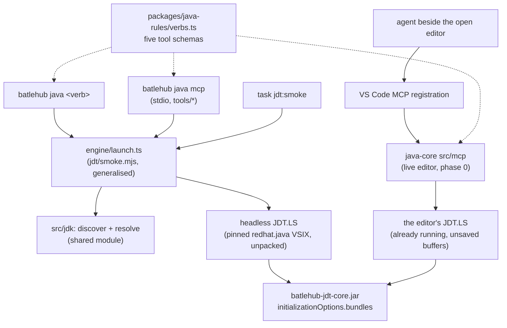
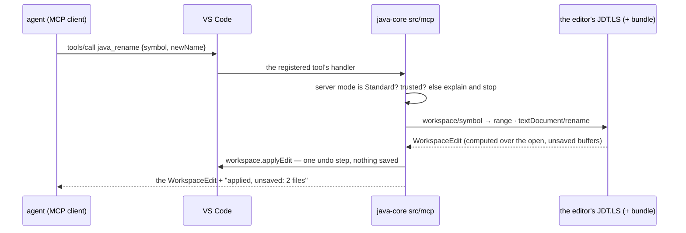

# RFC 0002 — Headless engine: the bundle's operations as a CLI and an MCP server

| Field       | Value                                                        |
| ----------- | ------------------------------------------------------------ |
| Status      | Draft                                                         |
| Short       | Headless engine                                               |
| Settles     | The native engine: every operation of the JDT bundle (rename, generate, inspections, fix-all) as a CLI subcommand and an MCP tool — the crate, its platform matrix, per-platform VSIX, signing and fuzzing, the auth model, what never leaves the machine |
| Closes      | A.13 — the same operations for the developer's agents and for CI: the editor is driven by both |
| Author      | Max Batleforc <maxleriche.60@gmail.com>                       |
| Co-author   | —                                                             |
| Created     | 2026-09-18                                                    |
| Revised     | 2026-09-18 — revision 2, after the series was reviewed against its goal (RFC 0001 §7.1): two surfaces over one tool table — the live editor as an MCP server first (no second JVM), the command-line twin second; live-editor writes are unsaved edits; both surfaces report under the committed `.batlehub/java/` files and never read a `settings.json`; `inspect --profile` and `config --print` added |
| Supersedes  | —                                                             |
| Depends on  | RFC 0001 (the bundle of §6.2 and its delegates, phase 6; the JDK resolution of §4.2; the red lines of §7.1); RFC 0003 (the managed process and its cap accounting); RFC 0006 and RFC 0005 (the committed `.batlehub/java/` files, the only configuration either surface reports under); BatleHub RFC 0011 (`batlehub-cli`, whose subcommand the command-line twin becomes) |
| Touches     | `extensions/java-core` (new `src/mcp/`: the tools registered with the editor over the running JDT.LS; one setting, one command), `packages/java-rules` (the verbs table both surfaces render), `jdt/batlehub-jdt-core` (one new delegate, `batlehub.rename`), a new `engine/` directory (Node, the launcher `jdt/smoke.mjs` already is), `tests/heavy` (live-editor steps in the `java` half, an `engine` half), `docs/guide/java/engine.md` |

---

## 1. Summary

Everything the JDT bundle can do inside the editor — list the inspections of
a file, fix them all, generate accessors with options, rename a symbol across
a workspace — becomes callable without an editor: `batlehub java inspect
core/`, `batlehub java fix --rule sizeIsZero core/`, `batlehub java generate
accessors Person.java:5`, `batlehub java rename com.acme.core.Greeter#greet
hello`, and the same four as tools of an MCP server (`batlehub java mcp`) an
agent or a CI job talks to over stdio. The engine is **not a second
implementation**: it is `jdt/smoke.mjs` grown up — a launcher for the same
headless JDT.LS the pinned `redhat.java` ships, with the same bundle loaded
through `initializationOptions.bundles`, sending the same
`workspace/executeCommand` calls the extension sends. RFC 0001 §11 decision 3
deferred the *native* engine to this RFC; this RFC's first decision is that
the engine is Node, not Rust, because the whole engine is JSON-RPC over a
child process and every line of it already exists in TypeScript. Rust
returns the day a subcommand needs something Node cannot give (§11;
[RFC 0018](/rfc/0018-rust-syntactic-tier) parks the one candidate).

**Revision 2 — the IDE is driven by the developer and by their agents.**
There are two surfaces over the same five tool schemas, and the order
changed. **First, the live editor as an MCP server**: `java-core` registers
the tools with VS Code (`vscode.lm.registerMcpServerDefinitionProvider`, the
editor's MCP registration), and they run over the JDT.LS the developer
already has — same classpath, same index, **unsaved buffers included**, and
no second JVM in the pod. The memory rule of RFC 0001 §7.1 is the argument:
an agent working beside an open editor must not cost a second language
server. **Second, the command-line twin** described above (own JDT.LS, own
`-data`), for CI and for agents with no editor; where an editor is present
it starts its server through the same cap accounting, and it declares its
cap either way (§4.2).

### Before / after

```text
# today: the operations exist, but only behind a menu
  Java: Getters and setters…            (editor, quick pick)
  Inspections view → Fix all in file    (editor, tree)
  Shift+F6                              (editor)
  node jdt/smoke.mjs                    (a test, hard-coded to one fixture)

# with this RFC
  $ batlehub java inspect core/                      # every finding, one line each, exit 1 when any
  core/src/main/java/com/acme/core/Greeter.java:8:3  unused/privateField    'unused' is never read
  core/src/main/java/com/acme/core/Greeter.java:23:9 collections/sizeIsZero size() == 0 → isEmpty() [fix]
  $ batlehub java fix --rule collections/sizeIsZero core/ --write    # applies, prints the diff stat
  $ batlehub java generate accessors core/src/main/java/com/acme/core/Person.java:5 --fluent
  $ batlehub java rename 'com.acme.core.Greeter#greet' hello --dry-run   # the WorkspaceEdit as a diff
  $ batlehub java mcp                                # stdio MCP server: java_inspect, java_fix, java_generate, java_rename
  $ batlehub java config --print                     # the committed .batlehub/java/ values, origin per key (RFC 0006)

# revision 2, built first: the same five tools in the open editor
  agent → VS Code MCP → java-core → the running JDT.LS     (no second JVM, unsaved buffers seen)
  java_rename {"symbol": "…Greeter#greet", "newName": "hello"}
      → both files dirty in the editor, one undo step, nothing saved
```

---

## 2. Motivation

1. **A rule that runs only when someone opens the file is a rule that does
   not hold.** The eleven inspections of RFC 0001 §6.2 are enforced by the
   Problems panel; a pull request built by CI never sees them. `batlehub java
   inspect --fail-on warning` is the gate; without it every inspection is a
   suggestion.
2. **Agents edit Java without a type system.** An agent driving this
   repository (Claude Code, a routine) renames a method with `sed` and misses
   the two callers in another module; JDT.LS would not have. The MCP tools
   give an agent the rename, the fixes and the generators the editor has,
   with the same bundle behind them. That agent usually sits beside an
   open editor, in the same pod: it should use the server that is already
   running and see the buffer the developer has not saved, not start a
   second JVM against a stale copy on disk.
3. **The bundle's headless proof is a test with a hard-coded fixture.**
   `jdt/smoke.mjs` already launches JDT.LS, loads the jar, waits for
   `ServiceReady` and calls three delegates — on `tests/heavy/fixtures/maven-multi`
   only. The launcher is 150 lines from being a product; leaving it as a test
   means writing it twice when the CLI comes.
4. **The RFC 0001 generators take `CodeActionParams` for a reason.** Decision
   6 rejected Red Hat's prompt commands *because* they cannot be driven
   headless; the delegates were shaped for this RFC. Not shipping the CLI
   leaves that shaping as dead design.

### 2.1 Use cases

Each one is an acceptance case: the `engine` heavy half (§10) drives it and
asserts the proof.

1. **A CI gate on inspections.** *Who:* a repository's `check` job. *Start:*
   `tests/heavy/fixtures/maven-multi` checked out, a JDK 21 through `mise`,
   no editor, `~/.m2` cold. *Action:* `batlehub java inspect --fail-on
   warning .`. *Proof:* stdout has exactly the four `Greeter.java` findings
   RFC 0001 §6 proved (`unused/privateField @8`, `style/redundantThis @11`,
   `performance/stringConcatInLoop @17`, `collections/sizeIsZero @23`),
   one per line in `path:line:col code message` form, exit code `1`; with
   `--fail-on error` the same lines and exit `0`; `--format json` gives the
   bundle's rows unchanged (`ruleId`, `area`, `code`, `range`, `fixTitle`).
2. **Fix a whole module in one command.** *Who:* a developer cleaning up
   before a review. *Start:* the same fixture, a git checkout with a clean
   tree. *Action:* `batlehub java fix --rule collections/sizeIsZero --write
   core/`. *Proof:* `git diff --stat` names `Greeter.java` only; the diff
   replaces `size() == 0` with `isEmpty()` and nothing else; the command
   printed `1 file, 1 edit`; a second run prints `0 files` and exits `0`;
   without `--write` the tree is untouched and the diff is on stdout.
3. **An agent renames across modules.** *Who:* an MCP client (the heavy
   suite plays it with a 40-line stdio client). *Start:* `maven-multi`, the
   engine started with `batlehub java mcp`. *Action:* `tools/call
   java_rename {"symbol": "com.acme.core.Greeter#greet", "newName":
   "hello", "dryRun": true}`. *Proof:* the result is one `WorkspaceEdit`
   touching `core/…/Greeter.java` and `app/…/Main.java` (the caller in the
   other module), each edit with `range` and `newText`; `dryRun: false`
   writes both files and the next `java_inspect` on `Main.java` sees no
   unresolved symbol. `tools/list` returns exactly `java_inspect`,
   `java_fix`, `java_generate`, `java_rename`, `java_status`, each with a
   JSON schema whose `required` matches the CLI's mandatory arguments.
4. **Generate with options, no prompt.** *Who:* a routine adding accessors
   to a DTO. *Start:* `Person.java` with three fields and no accessors.
   *Action:* `batlehub java generate accessors core/src/main/java/com/acme/core/Person.java:5 --getter-prefix get --fluent --write`.
   *Proof:* the file gains the sixteen edits `task jdt:smoke` already checks,
   fluent setters return `this`, the indentation matches the file's (tabs
   or the detected spaces, `Engine.indentUnit`), and the same command with
   `--format json` prints the `WorkspaceEdit` and writes nothing.
5. **The newcomer, headless.** *Who:* a fresh Che workspace with no
   `JAVA_HOME` and no `java` on `PATH`, only `mise`. *Start:* no JDK
   resolved by anything. *Action:* `batlehub java status`. *Proof:* stdout
   says `JDK: JavaSE-21 (21.0.11, mise)` and `server: redhat.java 1.56.0 at
   ~/.cache/batlehub/jdtls/1.56.0`, or, with no JDK at all, exit `2` and
   the one line `no JDK ≥ 17: install one with 'mise use java@temurin-21'`
   — the same resolution rule as the extension (`src/jdk/resolve.ts`),
   because it is the same code.
6. **The editor and the CLI on the same workspace do not fight.** *Who:*
   a developer with VS Code open on `maven-multi` running use case 2 in the
   terminal. *Start:* the editor's JDT.LS in Standard mode. *Action:* the
   `fix --write`. *Proof:* the engine started its own server on its own
   `-data` directory (`~/.cache/batlehub/jdtls/ws/<hash>`), the editor's
   `jdt_ws` lock was never touched, and the editor picked up the file
   change through its watcher (the Problems panel loses the `sizeIsZero`
   row within its refresh delay). The engine's declared cap appears in the
   core's resource diagnostic beside the editor's JDT.LS while it runs;
   with a container limit the two caps do not fit under, the engine exits
   `2` naming both caps and the live-editor tools, and starts nothing.
7. **An agent drives the open editor.** *Who:* an MCP client attached to VS
   Code's registered server (the heavy suite plays it through the editor).
   *Start:* `maven-multi` open, JDT.LS in Standard mode, `Greeter.java`
   holding an **unsaved** edit that adds a second caller of `greet`. *Action:*
   `tools/call java_rename {"symbol": "com.acme.core.Greeter#greet",
   "newName": "hello"}`. *Proof:* the unsaved caller is renamed too;
   `Greeter.java` and `Main.java` are dirty in the editor and unchanged on
   disk (`git status` stays clean); one `Undo` in either file reverts the
   whole rename; no second `java` process exists in the pod (`ps` shows one
   JDT.LS); `tools/list` is the same five names and schemas as use case 3,
   the default of `dryRun` apart (§4.2).
8. **A hostile or personal `settings.json` changes nothing an agent or CI
   reports.** *Who:* the `check` job on a fresh clone, and an agent in the
   live editor. *Start:* the repository commits
   `.vscode/settings.json` with `"batlehub.java.inspections.severityOverrides":
   { "performance/stringConcatInLoop": "off" }` and no
   `.batlehub/java/inspections.json`; the developer's user settings turn
   `style/redundantThis` off. *Action:* `batlehub java inspect .` and
   `java_inspect` in the editor. *Proof:* both return the four findings of
   use case 1 at the bundle's default severities; the developer's Problems
   panel shows three (their own override, RFC 0005), and `java_inspect`
   marks that row `"differsFromEditor": true`.

---

## 3. Goals / non-goals

**Goals**

- The four bundle operations and rename, as `batlehub java <verb>`
  subcommands with a stable text format, a `--format json` form and exit
  codes a script can branch on.
- The same five as MCP tools, with JSON schemas rendered from one table, on
  two surfaces: registered in the live editor over the running JDT.LS
  (built first), and over stdio from the binary with one flag.
- The live editor starts no process: an agent beside an open editor costs
  no second JVM (RFC 0001 §7.1, the memory rule).
- Command line: one server per workspace per engine process, started on
  the JDK RFC 0001's resolution picks, from the pinned `redhat.java` VSIX,
  cached once, with a declared cap.
- Command line: every operation is a dry run by default; `--write` is the
  only thing that touches the tree. Live editor: an edit is applied as
  unsaved changes, one undo step per tool call; the tool saves nothing.
- Both surfaces report under the committed `.batlehub/java/` files alone,
  so an agent, CI and a colleague's agent agree on a finding.
- The engine sends nothing anywhere: no telemetry, no network listener, no
  download but the VSIX (from the gallery the extension already trusts,
  sha256-pinned). What the server it starts fetches is m2e's dependency
  resolution, through the user's `~/.m2/settings.xml` — stated precisely
  in §7.

**Non-goals**

- **A Rust crate, a platform matrix, signed binaries** — §11 decision 1;
  the engine is Node and ships inside `batlehub-cli`'s existing
  distribution.
- **Semantic inspections in the engine** — the bundle's rules are the
  bundle's (syntactic, RFC 0001 revision 4); the engine adds no rule.
- **An HTTP/SSE MCP transport** — stdio only. A remote MCP is a network
  listener with an auth model this RFC does not want (§7).
- **Running builds, tests or the debugger** — `mvn`, `gradle` and
  `launch.json` are the editor's and the task runner's; the engine is the
  language server's operations only.
- **Replacing `redhat.java`'s server with a bundled one** — decision 1 of
  RFC 0001 stands; the engine uses the pinned VSIX's server, unpacked, and
  nothing else.

---

## 4. User-facing design

### 4.1 Configuration

**The engine never reads a `settings.json`** — not the workspace's, not the
user's. `.vscode/settings.json` is personal in the editor and
attacker-written in a fresh clone (§7); neither is what a gate or an agent
should report under. The only configuration input, on both surfaces when
they report, is the committed half of `.batlehub/java/`
([RFC 0006](/rfc/0006-shared-project-config)):

```text
.batlehub/java/project.json       jdk.requirement, maven.* — RFC 0006, through the shared resolve()
.batlehub/java/inspections.json   the team's severities and reasons — RFC 0005
```

- Everything else is a flag or a tool argument: `--getter-prefix`,
  `--fluent` (the `generate.*` keys are taste, RFC 0006 §3, and stay the
  developer's), `--fail-on`, `--profile <file>`, `--server <version>`.
- Absent `--server` means the version `java-core`'s `package.json` pins
  (`MIN_REDHAT_JAVA`, `1.56.0`); the engine and the extension load the
  same server, so a finding is the same finding.
- JDK discovery uses the default source order (`mise`, `sdkman`, `env`,
  `wellKnown`); `jdk.requirement` of `project.json` narrows it as it does
  in the editor.
- **The live-editor tools report under the same project values**, not under
  the developer's `severityOverrides`: an agent's `java_inspect` and CI's
  `inspect` return the same rows at the same severities even when the
  developer's own Problems panel differs. A row the developer's override
  changes carries `differsFromEditor: true`, the mirror of the editor's
  "differs from project" marker (RFC 0005 §4.2).
- The extension gains one setting, `batlehub.java.mcp.enabled` (default
  `true`): whether `java-core` registers the tools with the editor. It is
  read by the extension, never by the engine.
- Environment: `BATLEHUB_JDTLS_HOME` points at an already unpacked server
  (CI caches it; `jdt/deps.sh` produces exactly that layout);
  `BATLEHUB_JAVA_HOME` forces a JDK, bypassing discovery.
- Cache: `~/.cache/batlehub/jdtls/<version>/` (the VSIX, unpacked once,
  sha256 checked against the gallery's) and `~/.cache/batlehub/jdtls/ws/<hash
  of workspace path>/` (the server's `-data`).

### 4.2 Behaviour rules

- **`batlehub java <verb> [paths…]`.** Verbs: `status`, `inspect`, `fix`,
  `generate accessors`, `rename`, `config`, `mcp`. The binary name is
  `batlehub java` everywhere — in this RFC, in RFCs 0005 and 0006, in the
  docs. Paths default to the current directory; a path is a file or a
  directory (recursed, `*.java`, the server's exclusion list applies).
- **`inspect --profile <file>`.** `inspect` applies
  `.batlehub/java/inspections.json` whenever the workspace has one;
  `--profile <file>` names the file explicitly (a CI job that wants the
  input visible in its log, or a profile under review), and
  `--print-profile` prints the effective severities with each `why` and
  starts no server. The profile's format, its `why` rule and its
  unknown-rule rows are RFC 0005's; the engine calls the same
  `validate()`/`mergeSeverities()` from `packages/java-rules` with no
  overrides layer.
- **`config --print`.** Prints the effective configuration — `resolve()` of
  RFC 0006 fed the committed `project.json`, detection, and an empty
  settings layer — as JSON with an origin per key. No server is started.
  It is a CLI verb only; the MCP tools stay five.
- **Two surfaces, one table.** `packages/java-rules/verbs.ts` holds each
  tool's name, arguments and documentation; the CLI parser, the stdio MCP
  server and the live-editor registration all render it. The live editor
  answers `java_status` with the editor's resolved JDK and server,
  `java_inspect`/`java_fix`/`java_generate` through the bridge's existing
  `executeCommand` calls, and `java_rename` through the running server's
  rename at the resolved symbol.
- **Live-editor writes are unsaved edits.** A tool call that edits applies
  one `WorkspaceEdit` through `vscode.workspace.applyEdit` — one undo step
  per call across every file it touched — and saves nothing: the files are
  dirty, the developer reviews, saves or undoes. `dryRun: true` returns the
  edit without applying it, as on the command line. The tool never calls
  `save`, never writes through `fs`.
- **Command line: dry run by default.** `inspect` never writes. `fix`,
  `generate` and `rename` print the edit (a unified diff in text mode, the
  `WorkspaceEdit` in JSON) and write only with `--write`. `--write` refuses
  when the file changed on disk between the server's read and the apply (mtime
  comparison), exit `3`.
- **Exit codes.** `0` done (for `inspect`: nothing at or above
  `--fail-on`); `1` findings at or above `--fail-on` (`inspect`) or the
  operation produced no edit (`generate`, `rename` on an unknown symbol);
  `2` no usable JDK or server; `3` a write refused; `4` the server did not
  reach `ServiceReady` within `--timeout` (default 300 s).
- **The server's life (command line).** One JDT.LS per engine process,
  started on the first verb that needs it, stopped at exit
  (`shutdown`/`exit`, then SIGTERM after 5 s). `mcp` keeps it for the
  session. It is started the way the core's managed process starts
  anything (RFC 0003, RFC 0001 §7.1): a **declared cap** (`-Xmx1G` unless
  `--heap` says otherwise, printed by `status`), `ServiceReady` as the
  readiness probe, the clean stop above, peak RSS on the last line of
  `--verbose`. Where an editor is present on the workspace the engine goes
  through the same cap accounting — its cap is summed with the editor's
  declared caps against the container limit, and a sum that does not fit
  is exit `2` naming the live-editor tools as the way that costs nothing
  (open question 5 is the mechanism). With no editor it checks its own cap
  against the cgroup limit alone. The workspace is the
  nearest ancestor of the first path holding a `pom.xml`, `build.gradle`,
  `settings.gradle` or `.git`; `--workspace` overrides.
- **`rename` addresses a symbol, not a position**, because a headless
  caller has no cursor: `Fully.Qualified.Type[#member]`; the engine resolves
  it through `workspace/symbol` and the document's symbols, then sends
  `textDocument/rename` at that range. A position form
  (`path:line:col`) is accepted too, for tools that have one.
- **MCP (command line).** `batlehub java mcp` speaks the Model Context
  Protocol over stdio: `tools/list` returns the five tools with schemas
  generated from the same argument definitions the CLI parses (one table, two
  renderers); `tools/call` runs the verb and returns its JSON form as the tool
  result. Every tool that can write takes `dryRun`; its default is `true` on
  the command line, where `false` writes to disk, and `false` in the live
  editor, where an applied edit is an unsaved, undoable one.
- **The profile's severities apply headless** through the same function as
  client-side (`applyOverrides` of `src/inspections/rules.ts` moves to the
  shared package), fed the profile alone; `off` drops the row from
  `inspect` and from `fix`.
- **Output formats.** Text is for humans and `grep`; JSON is the bundle's
  rows and LSP `WorkspaceEdit`s verbatim, plus `{ "exit": n }`. SARIF
  (`--format sarif`) for `inspect` only, so a forge's code-scanning view
  can ingest it; it is a 60-line renderer over the same rows.

### 4.3 Validation

Hard errors (exit `2`, one line on stderr, nothing started):

| Condition | Rationale |
| --- | --- |
| The declared cap does not fit: alone against the cgroup limit, or summed with an editor's declared caps on the same workspace | RFC 0001 §7.1: an OOM-killed pod is the failure to avoid; the message names the caps and, when an editor is open, the live-editor tools |
| No JDK ≥ 17 found by discovery and none forced | the server cannot start; the message names the `mise`/`sdk` command, as the extension's notification does |
| The cached VSIX's sha256 does not match the pinned one | a tampered or truncated download must not be unpacked and executed |
| The workspace is not under a directory the caller owns (`--workspace` outside `$HOME` and not the cwd's ancestor) | the server indexes what it is pointed at; pointing it at `/` is a mistake, not a feature |
| `--write` and the target is a symlink outside the workspace | an edit must land inside the tree the caller named |

Warnings (stderr, the operation continues):

| Condition | Behaviour |
| --- | --- |
| `.batlehub/java/project.json` or `inspections.json` does not parse, or a key fails its schema | RFC 0006 §4.3 and RFC 0005 §4.3 unchanged: the file or the key is treated as absent, one line per problem with the file and line |
| a `.vscode/settings.json` holds `batlehub.java.*` keys | not read; one line under `--verbose` saying so, so nobody wonders why CI ignores it |
| The server took longer than 60 s to reach `ServiceReady` (cold `~/.m2`) | a progress line every 10 s naming the last `language/status` message, so a CI log shows an import and not a hang |
| the profile names a rule the bundle does not have | entry ignored, one line with the closest known id (RFC 0005 §4.3) |

---

## 5. Architecture

### 5.1 One launcher, three callers



The invariant: **there is one implementation of each operation, in the
bundle, one table of tool schemas, and one launcher for a headless
server.** The CLI adds argument parsing and rendering; the MCP surfaces add
a transport; none adds a rule or an edit. Both surfaces report under the
committed files alone (§4.1), so if an agent in the editor and CI disagree
on a finding, the bug is in one caller's input, not in two engines.

### 5.2 A `fix --write`, end to end

```mermaid
sequenceDiagram
    participant U as caller (shell / MCP client)
    participant E as engine
    participant LS as JDT.LS (+ bundle)
    U->>E: fix --rule collections/sizeIsZero --write core/
    E->>E: workspace root, JDK (resolve), server (cache or unpack)
    E->>LS: initialize (bundles: [jar]) · initialized
    LS-->>E: language/status ServiceReady
    loop each *.java under core/
        E->>LS: textDocument/didOpen
        E->>LS: executeCommand batlehub.inspections.fixAll(uri, rule)
        LS-->>E: WorkspaceEdit
    end
    E->>E: mtime unchanged? apply edits to the file; else exit 3
    E->>LS: shutdown · exit
    E-->>U: "1 file, 1 edit", exit 0
```

The engine applies the edits itself (`WorkspaceEdit` → file), rather than
asking the server to (`workspace/applyEdit` is a server → client request the
engine would have to answer anyway). Applying client-side is what the editor
does too.

### 5.3 What the bundle gains

One delegate, `batlehub.rename(symbol | position, newName)`, so that a
headless rename is one `executeCommand` rather than three LSP requests the
MCP tool would have to sequence. It calls JDT's `RenameSupport` — the same
refactoring JDT.LS's own `textDocument/rename` runs — and returns the
`WorkspaceEdit`. The editor keeps using `textDocument/rename` (RFC 0001
§5.4: nothing new there); the delegate exists for callers without a cursor.

### 5.4 The live editor as an MCP server



This is "attach to the editor's server" done where it is sound: in the
extension host, which is already that server's one client. Nothing is
started, no `-data` directory is shared between two processes, and the
server answers from the buffers the developer is looking at. What §8
rejects is the *command line* attaching to that server from outside.

---

## 6. Detailed design

### 6.1 `engine/` (Node, TypeScript, part of `batlehub-cli`'s tree)

```
engine/launch.ts      spawn JDT.LS: JDK, -data, initialize/initialized, wait ServiceReady, executeCommand, shutdown
engine/server.ts      the cache: VSIX download (gallery URL of RFC 0001 decision 8), sha256, unpack; BATLEHUB_JDTLS_HOME
engine/verbs.ts       verb → handler over launch.ts; the table itself (name, type, required, doc) is packages/java-rules/verbs.ts
engine/render.ts      text, json, sarif, unified diff
engine/apply.ts       WorkspaceEdit → files, the mtime guard
engine/mcp.ts         stdio JSON-RPC, tools/list and tools/call over verbs.ts
engine/config.ts      .batlehub/java/project.json and inspections.json only, through packages/java-rules; no settings.json reader exists
```

- `launch.ts` is `jdt/smoke.mjs` with the fixture and the assertions taken
  out; `jdt/smoke.mjs` becomes a 30-line caller of it and stays the bundle's
  proof (`task jdt:smoke` unchanged from the outside).
- JDK discovery and resolution: `extensions/java-core/src/jdk/discover.ts`
  and `resolve.ts` import nothing from `vscode` (RFC 0001 §10 layer 1 is
  built on that) — they move to a shared package
  `packages/java-rules` (discover, resolve, `rules.ts`'s `applyOverrides`,
  `redact.ts`, the verbs table, and — when they land — RFC 0006's
  `resolve()` and RFC 0005's `profile.ts`: one description of each, not
  two) that both the extension and the engine import. This is the
  `packages/*` entry RFC 0001 §6.3 deferred to phase 9; the engine is the
  second consumer that earns it.
- The `Io` interface of `discover.ts` is what makes the engine testable:
  the fake `Io` of `test/jdk.test.ts` drives the engine's resolution in
  vitest with no JDK on the machine.

### 6.2 `batlehub-cli` (BatleHub repository)

- Gains a `java` subcommand group that executes `engine/` — the CLI is
  Rust (BatleHub RFC 0011), so `batlehub java …` is a thin exec of the Node
  engine shipped beside it, the way `batlehub-vsx`'s own CLI shells out
  today. Argument: the CLI is where users already are (`batlehub login`
  gives the registry token the extension reads), and one binary name is
  the whole point of a CLI. Cost: Node must be present, which every Che
  image and every runner this repository targets has (§9).
- **Or** the engine ships as `batlehub-java`, a Node package with a `bin`,
  and `batlehub java` is a later alias. §11 decision 2 picks the alias from
  day one to avoid two names in the docs; open question 1 records what it
  costs BatleHub's repository.

### 6.3 `jdt/batlehub-jdt-core`

- `batlehub.rename` in `Handler` and `plugin.xml`; `Rename.java` wraps
  `org.eclipse.jdt.ls.core.internal.corrections.RefactoringCorrectionProposal`'s
  path or `RenameSupport` directly (open question 2 — which one survives
  the `Import-Package` unversioned-export situation of RFC 0001 revision
  4). A JUnit test over a two-unit workspace joins layer 1b — the first
  test that needs a project, so it uses `AbstractProjectsManagerBasedTest`
  after all, for this one class.

### 6.4 `extensions/java-core`

- **`src/mcp/` (new, phase 0).** `register.ts` registers the five tools
  with the editor (`vscode.lm.registerMcpServerDefinitionProvider`; open
  question 6 is the exact registration form) from
  `packages/java-rules/verbs.ts`. `handlers.ts` maps each tool to what the
  extension already does: `java_inspect`/`java_fix`/`java_generate` call
  the bridge's delegates on the running server, `java_rename` resolves the
  symbol (`vscode.executeWorkspaceSymbolProvider`, then the document's
  symbols) and runs `vscode.executeDocumentRenameProvider`, `java_status`
  reads the core's resolved JDK and server. `report.ts` applies the
  committed profile and `project.json` — not `readSettings()` — to what the
  tools return, and sets `differsFromEditor`. Handlers are thin; the
  schema rendering and the report rule are pure and tested without
  `vscode`.
- The handlers refuse before workspace trust and outside Standard mode,
  with the same sentence the rename command uses (RFC 0001 §5.4).
- One setting (`batlehub.java.mcp.enabled`) and one command, `Java: Copy
  the engine command for this file`, which puts
  `batlehub java inspect <path>` on the clipboard: the discovery path from the editor to the CLI.
  The extension does not spawn the command-line engine (§5.1 — own
  server, own `-data`).

### 6.5 Tests

- `engine/test/*.test.ts` (vitest): verbs table → CLI parsing and MCP
  schema agree (one property test over the table), render formats, the
  mtime guard, `symbol` parsing, and that no code path opens a
  `settings.json` (a fake `Io` that throws on one).
- `extensions/java-core/test/mcp.test.ts` (vitest): the live-editor
  schemas equal the stdio ones, `dryRun`'s default apart; `report.ts` under a profile and a
  differing override.
- The `java` heavy half gains use cases 7 and 8's live-editor side
  (`MCP-LIVE-OK`, `MCP-PROJECT-VALUES-OK`).
- `tests/heavy/engine.mjs` + a section of `view.sh` (`HEAVY_ONLY=engine`):
  the six use cases of §2.1 against `maven-multi` with a real server —
  no browser needed, so it runs in the `check` job after `jdt:smoke`.

**Deliberately untouched**, so reviewers do not go looking:

- `src/inspections/bridge.ts` — the editor's ping, diagnostics and fix-all
  stay as they are; the live-editor tools call it, the command-line engine
  never talks to the editor's server.
- `contributes.javaExtensions` — unchanged; the engine loads the same jar
  through `initializationOptions.bundles`, as `smoke.mjs` does.
- `jdt/deps.sh` — already produces the unpacked layout `server.ts` reads.

---

## 7. Security considerations

- **Attacker-controlled input is the workspace.** Java sources, `pom.xml`,
  `.batlehub/java/*.json` and `.mvn/*` are repository content; the server
  parses them and m2e reads the POM. Nothing in them is executed by the
  engine: no build, no wrapper, no `settings.xml` overlay. This is
  narrower than the extension (which runs `mvn` after trust) and is stated
  as a non-goal, not a limitation.
- **`.vscode/settings.json` is not an input at all.** In a fresh clone it
  is written by whoever wrote the repository — a committed
  `severityOverrides` turning a rule `off` would silently open the gate —
  and in the editor it is one developer's taste. The engine has no reader
  for it (§6.1, and a test that fails if one appears). The committed
  profile can also turn a rule off, but only with a `why`, in a file a
  reviewer knows to read (RFC 0005 §7).
- **"Nothing leaves the machine", precisely.** The engine opens no
  connection but the one VSIX download. The JDT.LS it starts runs m2e's
  import, and **m2e resolves dependencies over the network** through the
  user's `~/.m2/settings.xml` — mirrors, repositories and credentials
  included, so through BatleHub when the registry link is on (RFC 0001
  §4.2), and to Maven Central when it is not. That is the same traffic
  `redhat.java` causes in the editor, to the hosts the user's own Maven
  configuration names; the workspace's POM chooses *which* artefacts, the
  user's `settings.xml` chooses *where from*. What never leaves is source
  text, findings, edits, and the token (the engine neither reads nor logs
  `settings.xml`; `redact.ts` is in the shared package). A CI job that
  wants no network at all runs with a warm `~/.m2` and Maven's offline
  setting in that `settings.xml`.
- **The live editor adds no listener and no process.** The tools are
  handlers in the extension host behind the editor's own MCP registration;
  the editor decides which agent may call them and asks the developer as
  it does for any MCP server. They refuse before workspace trust. Their
  edits are unsaved: an agent cannot put bytes on disk through them, and
  one undo takes a call back.
- **The server is the user's.** JDT.LS runs as the caller with the
  caller's privileges, as it does under `redhat.java`; the bundle executes
  no project code (RFC 0001 §7). The engine adds no privilege.
- **The command line's MCP is stdio only, so there is no listener, no token,
  no origin check to get wrong.** The client is whatever process spawned the
  engine; that process already had the user's shell. An SSE transport would
  need bearer tokens, loopback binding and CSRF rules — this RFC does not add
  that surface, and §3 says so.
- **On the command line `--write` is the only side effect and it is
  guarded**: inside the workspace, not through a symlink out of it, only
  when the file is as the server read it. A stdio MCP tool defaults to
  `dryRun: true`; an agent must ask for the write.
- **The one download is the VSIX** the extension already installs, from
  the same gallery, with its sha256 checked before unpacking; unpacking
  refuses entries with `..` or absolute paths (a 10-line check the
  extension host never needed because the editor unpacks for it).
- **Fuzzing, scoped to what the engine parses**: the symbol grammar, the
  `path:line:col` form, the two `.batlehub/java/` files, and MCP frames — a
  `fast-check` property suite in vitest, not a native fuzzer, because the
  only native code is the JVM's. What the server parses (Java) is JDT's
  own concern and has JDT's own fuzzing.
- **No telemetry**, as in RFC 0001; `trackEvent` of `redhat.java` is never
  called because the engine does not load `redhat.java`, only its server.

### Red lines

- **Every write is in the manifest.** Neither surface writes a setting, a
  file mode or a fenced block, so the manifest gains nothing. What is
  written: the command line's cache under `~/.cache/batlehub/jdtls/` (the
  engine's own storage, removed by deleting it, §9), and **source edits**
  — `--write` on the command line, unsaved edits in the live editor. Red
  line 1 does not cover source edits and is not stretched to: the editor's
  undo (one step per tool call) and git are their undo. `.mcp.json` is
  written by the developer from the guide, never by the engine.
- **The token is the core's.** No credential is read, held or written. The
  server's m2e reads `~/.m2/settings.xml`, where the core's fenced block
  may sit, as Maven itself would; the engine never opens that file, and
  no tool result or log line can carry it (`redact.ts`, shared).
- **Memory.** Live editor: **none** — that is why it is built first; it
  reuses the JDT.LS the developer already pays for. Command line: one
  JDT.LS, declared cap `-Xmx1G` by default (`--heap`), `ServiceReady` as
  readiness, clean stop, peak RSS reported; summed with the editor's
  declared caps through the same accounting when an editor is present
  (§4.2, open question 5), checked against the cgroup limit otherwise. A
  pod never gets a second JVM it was not told about.
- **Defaults crossed.** *The extension downloads nothing at runtime* is
  crossed by the **command line only**: its first run fetches the pinned
  `redhat.java` VSIX, because CI has no editor that installed it. Reason
  and bounds: same gallery, sha256 checked before unpacking, and
  `BATLEHUB_JDTLS_HOME` makes the download unnecessary. The live editor
  crosses none. *No source or comment text is sent to a third party*
  holds: a tool result goes to the MCP client the developer attached, and
  where that agent sends it is the developer's choice of agent, not
  something this extension configures.

---

## 8. Alternatives considered

| Alternative | Why rejected |
| --- | --- |
| A Rust crate (RFC 0001 §11 decision 3's "native engine") | The engine's work is: spawn a JVM, speak JSON-RPC, walk files, apply text edits, parse JSONC. Node does each in the standard library or a dependency the extension already has, and `jdt/smoke.mjs` proves the first two in 150 lines. Rust would add a cross-compilation matrix, ARM runners, signing and per-platform packaging for a program whose hot path is inside a JVM it does not own. Decision 3 named the trigger as "when it lands, it brings its own platform matrix"; the honest reading today is that nothing in the engine needs one. Kept for the day a verb needs a native library: [RFC 0018](/rfc/0018-rust-syntactic-tier) parks the one candidate (a syntactic tier with no JVM), and RFC 0001 decision 1's red flags say when to reopen it. |
| Re-implement the inspections in the engine (no JVM) | Two engines drift. The bundle exists so that the editor and CI agree on a finding; a TypeScript port of eleven rules is a second truth. |
| Drive the *editor's* server **from the CLI** (an outside process attaching to the running JDT.LS) | **Not for the CLI.** JDT.LS is stdio to one client and its workspace is locked (`.metadata/.lock`); an outside process needs an editor-side proxy, which is RFC 0001 §15.5's two-servers-one-workspace failure by design, and a CI run has no editor to attach to anyway. The CLI keeps its own server and its own `-data`. The idea itself is not rejected: the live-editor surface (§5.4) is exactly that, in-process, in the extension host that already is the server's one client — and it is built first. |
| Only the command-line surface (revision 1) | An agent beside an open editor would start a second JDT.LS in the same pod — a second gigabyte against the memory rule of RFC 0001 §7.1 — and would rename against the file on disk while the developer's unsaved buffer says something else. |
| Live-editor tools that save what they edit | An agent's edit would reach disk, the watcher and a running dev mode before the developer saw it. Unsaved edits keep the developer in the loop at the cost of one `Ctrl+S`; an agent that needs the bytes on disk uses the command line, where `--write` is explicit. |
| The engine reads `.vscode/settings.json` (revision 1) | Personal in the editor, attacker-written in a fresh clone; and RFC 0006 exists so that the engine does not reimplement VS Code's scope resolution. The committed `.batlehub/java/` files are the one input. |
| HTTP MCP transport with a loopback token | Adds a listener, an auth model and a CSRF surface for a client that can spawn a process instead. If a remote agent needs it, a stdio-to-HTTP bridge is the agent host's job. |
| `redhat.java`'s own `java.execute.workspaceCommand` through `code --command` | The editor CLI cannot return a command's result to the shell, and it needs a running editor. |
| Ship the engine inside the VSIX and let the extension expose a terminal command | The engine has a different release cadence and a different user (CI, agents); RFC 0001 §5.3 says so, and a VSIX is not a CLI distribution. |

---

## 9. Rollout and compatibility

- **Order**: the live editor first, the command line second — RFC 0001
  §14's order of work, step 10.
- **Default behaviour, live editor**: `java-core` registers five tools with
  the editor (`batlehub.java.mcp.enabled`, default `true`). Nothing starts
  and nothing is written; an agent's first call goes through the editor's
  own MCP consent. A developer with no agent sees no change.
- **Default behaviour, command line**: the engine exists when
  `batlehub-cli` with the `java` group is installed; its first run
  downloads and unpacks the pinned VSIX (one-time, ~90 MB) into the cache,
  or reads `BATLEHUB_JDTLS_HOME`.
- **Behaviour change from revision 1**: a repository that relied on a
  committed `.vscode/settings.json` to configure the gate gets the bundle's
  defaults headless; `Save as project profile` (RFC 0005) is the move.
- **Prerequisites (command line)**: Node ≥ 22 (present in every image this
  repository targets and on GitHub runners), a JDK ≥ 17 reachable by RFC
  0001's discovery, network to the gallery once.
- **Version coupling**: the engine's server pin follows `java-core`'s
  `MIN_REDHAT_JAVA`; a bump is one Renovate PR touching both, read against
  the nightly matrix first (RFC 0001 decision 8).
- **Rollback**: remove the cache directory; nothing is written to the
  workspace but what `--write` was asked for, and that is a normal diff.
- **Docs**: `docs/guide/java/engine.md` — the live-editor tools first
  (which agents see them, that edits arrive unsaved), then the verbs, the
  exit codes, the CI snippet, the MCP client configuration for an agent
  with no editor
  (`.mcp.json`: `{"batlehub-java": {"command": "batlehub", "args": ["java", "mcp"]}}`).

---

## 10. Test plan

- **Unit** (`engine/test/*.test.ts`, vitest, no JVM): the verbs table
  renders the same argument set to the CLI parser and the MCP schema
  (property test); `symbol` and `path:line:col` parsing including
  rejection cases; text/json/sarif rendering from recorded bundle rows;
  `apply.ts` on a temp dir including the mtime refusal and the symlink
  refusal; input precedence (bundle defaults < the committed
  `.batlehub/java/` files < flags) and that a `settings.json` is never
  opened; resolution through the fake `Io` of `test/jdk.test.ts`.
- **Unit, live editor** (`extensions/java-core/test/mcp.test.ts`): the
  registered schemas equal the stdio ones (`dryRun`'s default apart); `report.ts` returns project
  values and `differsFromEditor` under a differing override.
- **Heavy, live editor** (the `java` half, a real editor): use case 7 —
  the unsaved caller renamed, both files dirty and unchanged on disk, one
  undo, one `java` process; use case 8's editor side.
- **Layer 1b** (`jdt/batlehub-jdt-core/src/test`): `RenameTest` over a
  two-unit project — the caller in the second unit is renamed.
- **Headless integration** (`tests/heavy/engine.mjs`, `HEAVY_ONLY=engine`,
  runs in the `check` job — no browser): §2.1 use cases 1, 2, 4, 5 with
  exit codes and stdout asserted; use case 3 through a minimal stdio MCP
  client (`tools/list`, `tools/call`); use case 8's command-line side;
  use case 6 in the `java` heavy half (editor + engine on one workspace,
  the lock untouched, the Problems panel refreshed, the cap refusal under
  a lowered limit).
- **Existing suites that must pass unchanged**: `task jdt:smoke` (now a
  caller of `launch.ts`: same output, same `SMOKE-OK`); `task ext:test`
  after the move of `discover.ts`/`resolve.ts`/`rules.ts` to
  `packages/java-rules` (48 java-core tests, same assertions, new import
  path); the `java` heavy half.

---

## 11. Decisions and open questions

### Resolved

| # | Question | Decision |
| --- | --- | --- |
| 1 | Rust or Node? | **Node.** The engine is a launcher and a renderer around a JVM; every piece exists in TypeScript today (`smoke.mjs`, `src/jdk`, `rules.ts`, jsonc-parser). Rust returns with the first verb that needs native code, and §8 records what it would cost now. RFC 0001 decision 3 is amended, not contradicted: "native" was the assumption, "headless" was the requirement. Revision 2: stands. The one Rust candidate is parked as [RFC 0018](/rfc/0018-rust-syntactic-tier) (a syntactic tier), and what would reopen the larger question is RFC 0001 decision 1's red flags, not this RFC. |
| 2 | `batlehub java …` or `batlehub-java …`? | **`batlehub java`**, a subcommand group of `batlehub-cli` that execs the Node engine shipped beside it. One name in the docs, one login. Open question 1 is what the BatleHub repository has to accept for that. |
| 3 | Own server or the editor's? | **Per surface.** The live editor uses **the editor's**, in-process, as that server's one client (§5.4). The command line uses its **own**, own `-data` under the cache: an outside process as a second client of one JDT.LS workspace is the failure RFC 0001 §15.5 documented; use case 6 proves the two coexist and are counted together. |
| 4 | Where does `rename` live? | **A bundle delegate** (`batlehub.rename`), symbol-addressed. The editor keeps `textDocument/rename`; the delegate is for callers without a cursor and makes an MCP rename one call. |
| 5 | Which MCP transport? | **stdio only** on the command line. No listener, no auth model; the spawning process is the trust boundary. The live editor uses the editor's own registration and consent (decision 9, open question 6) and opens no TCP listener either. |
| 6 | Dry run or write by default? | **Command line: dry run.** `--write` / `dryRun: false` is explicit for every verb that edits; `inspect` never writes. **Live editor: applied as unsaved edits**, one undo step per tool call, nothing saved by the tool; `dryRun: true` is available. Red line 1 (the manifest) does not cover source edits — the editor's undo and git do. |
| 7 | Where does the shared TypeScript go? | **`packages/java-rules`**, the `packages/*` entry RFC 0001 deferred to phase 9 — the engine is the second consumer that earns it. Only modules that import nothing from `vscode` move; the rule "a rule that needs the editor is in the wrong module" is now enforced by a package boundary. |
| 8 | SARIF? | **Yes, `inspect` only**, a renderer over the rows. It is what a forge's code-scanning tab reads and it costs a file. |
| 9 | One surface or two, and which first? (revision 2) | **Two, the live editor first.** Same five tool schemas from one table. The live editor reuses the running JDT.LS and sees unsaved buffers, with no second JVM in the pod — RFC 0001 §7.1's memory rule is the argument. The command-line twin is second, for CI and editor-less agents; it declares its cap and joins the editor's cap accounting where there is one. |
| 10 | What configuration does the engine read? (revision 2) | **Only the committed `.batlehub/java/` files** (`project.json`, `inspections.json`) plus flags — never a `settings.json`: personal in the editor, attacker-written in a fresh clone. The live-editor tools report under the same project values, so agent and CI agree even when the developer's override differs; the difference is marked, not applied. |
| 11 | Which verbs do RFCs 0005 and 0006 call? (revision 2) | **`batlehub java inspect --profile <file>`** (the committed profile is the default input; `--print-profile` prints it) and **`batlehub java config --print`**. No `batlehub-java` binary exists, in this RFC or in theirs. |

### Still open

1. **What `batlehub-cli` has to carry** to exec a Node engine: a bundled
   Node runtime (the CLI's distribution grows by ~50 MB per platform) or a
   `node` on `PATH` requirement (every target image has it; a bare
   developer laptop may not). Recommendation: require `node` on `PATH`,
   with the one-line error naming `mise use node@24`, and revisit if a
   user without Node appears — the same shape as decision 10 of RFC 0001
   for JDKs.
2. **`RenameSupport` versus JDT.LS's `RenameHandler`** for the delegate,
   given that `org.eclipse.jdt.ls.core` exports unversioned (RFC 0001
   revision 4): whichever compiles against the pinned jars with the fewest
   internal imports. A spike in phase 1 answers it.
3. **Recursion and exclusions for `inspect .`**: the server's
   `java.project.resourceFilters` defaults, or the engine's own walk with
   `.gitignore`? Recommendation: ask the server for its projects' source
   roots (`java.project.listSourcePaths`, already advertised) and walk
   those — no second exclusion list.
4. **Whether `fix` should run the server's own quick fixes** (Red Hat's
   `java.action.organizeImports` and friends) besides the bundle's. Not in
   phase 1; the bundle's fixes are the ones with a known, tested edit.
5. **How the command line joins the editor's cap accounting.** The core's
   managed process (RFC 0003) knows the declared caps of what it started;
   an outside process does not. Recommendation: the core keeps a small
   ledger of running declared caps per workspace under the user's cache
   directory (no secret, `0600`), written under the manifest's lock
   discipline; the engine reads it, adds its own line while it runs and
   removes it at exit, and a stale line is dropped when its pid is gone.
   RFC 0003 owns the ledger's shape; this RFC only consumes it.
6. **The exact registration form in the editor.**
   `vscode.lm.registerMcpServerDefinitionProvider` hands the editor a
   server *definition* (stdio or HTTP) that the editor launches, where the
   handlers here must run in the extension host beside the language
   client. Two candidates for phase 0's spike: a JVM-less stdio relay
   (a few dozen lines of Node, no listener: a unix socket in the
   extension's storage, `0600`) between the editor-launched definition and
   the extension host; or `vscode.lm.registerTool`, which is in-process but
   seen only by the editor's own agents. Recommendation: the relay if an
   external agent (Claude Code in the pod's terminal) must reach the live
   editor, `registerTool` otherwise; the tool table and the handlers are
   the same either way.

---

## 12. Implementation phases

| Phase | Content |
| --- | --- |
| 0 | **The live editor as an MCP server, built first.** `packages/java-rules/verbs.ts` (the five tool schemas), `extensions/java-core/src/mcp/` (registration — open question 6's spike —, handlers over the running JDT.LS and the bridge, edits applied unsaved as one undo step, `report.ts` under the committed files), `batlehub.java.mcp.enabled`; `mcp.test.ts`; use cases 7 and 8 (editor side) in the `java` heavy half. No new process, no bundle change. Useful alone: an agent beside the editor has the rename, the fixes and the generators. |
| 1 | `packages/java-rules` grows (move `discover`, `resolve`, `rules`, `redact`; both consumers green); `engine/launch.ts` from `smoke.mjs`, `task jdt:smoke` reduced to a caller; the `RenameSupport` spike (open question 2). Useful alone: the shared package is RFC 0001 phase 9's first half. |
| 2 | `status`, `inspect` (text, json, sarif, `--fail-on`, `--profile`, `--print-profile`), `config --print`, `engine/config.ts`, `server.ts` with the cache and sha256, the declared cap and the cgroup check; `tests/heavy/engine.mjs` use cases 1 and 5 in the `check` job. Useful alone: the CI gate. |
| 3 | `fix`, `generate accessors`, `apply.ts` with the guards; use cases 2 and 4. |
| 4 | `batlehub.rename` in the bundle, `RenameTest`, the `rename` verb; use case 3's rename through the CLI. |
| 5 | `mcp.ts` (stdio) over the same verbs table as phase 0, the schema property test, the stdio client in the heavy half; use case 3 as an MCP call; `.mcp.json` snippet in the guide. |
| 6 | `batlehub java` in `batlehub-cli` (BatleHub repository, open question 1), `docs/guide/java/engine.md`, use case 6 in the `java` heavy half with the cap accounting (open question 5); RFC status → Implemented. |
