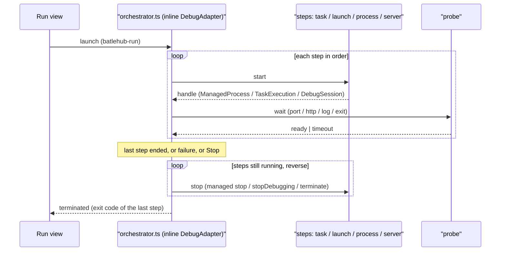
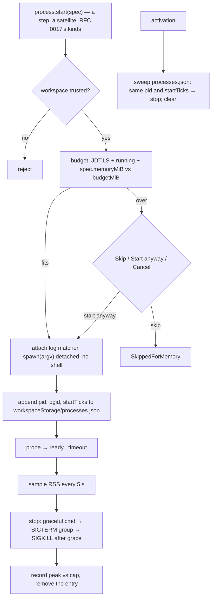

# RFC 0003 — Orchestrated runs and the managed process

| Field       | Value                                                        |
| ----------- | ------------------------------------------------------------ |
| Status      | Draft                                                         |
| Short       | Orchestrated runs                                             |
| Settles     | The orchestrator and the managed process: ordered steps with readiness probes and reverse stop in `launch.json`, and the one way anything long-lived is started in the whole series — a declared memory cap, a readiness probe, a clean stop, its peak RSS recorded. The server kinds (Tomcat, Jetty, WildFly, Karaf) are [RFC 0017](/rfc/0017-server-kinds), parked |
| Closes      | A.4 — acceptance runs: processes started in order, waited ready, stopped in reverse; the managed process every satellite starts through |
| Author      | Max Batleforc <maxleriche.60@gmail.com>                       |
| Co-author   | —                                                             |
| Created     | 2026-09-18                                                    |
| Revised     | 2026-09-18 — revision 2, after the series was reviewed against its goal (RFC 0001 §7.1): the four server kinds split out to RFC 0017 (parked), the managed process specified as the memory rule's mechanism (§4.2, §5.2, §6.3), JDWP on `localhost` everywhere, `deploy` paths held inside the workspace, the contract version left to RFC 0001 §5.2 |
| Supersedes  | —                                                             |
| Depends on  | RFC 0001 (the run editor of phase 4, the `batlehub-java` task provider, the contract of §5.2, the resource diagnostic of §4.2, the memory rule of §7.1, the heavy suite); `vscjava.vscode-java-debug` for every `launch` and `attach` step |
| Touches     | `extensions/java-core/src/run/` (new `steps.ts`, `orchestrator.ts`), `src/process/` (new `managed.ts`, `budget.ts`, `sweep.ts`), `src/detect/resources.ts` (the sum), `api.d.ts` (the members of RFC 0001 §5.2's changelog), `package.json` (`debuggers`, settings), `extensions/java-groovy` (its server started through the managed process), `tests/heavy/` (the java half), `docs/guide/java/run.md` |

---

## 1. Summary

RFC 0001 decision 19 left "a server started, ready, then tests, then stopped"
out of v1: `compounds` start everything at once, know nothing about readiness
and stop in no order. This RFC adds one `launch.json` entry type,
`batlehub-run`, whose body is an ordered list of **steps** — a task, a named
launch configuration, a process, a wait — each with an optional **readiness
probe** (a port, an HTTP status, a log line) and stopped in **reverse order**
when the run ends, fails or is stopped from the Run view. The run is a real
debug session (an inline adapter), so the editor's own Stop button, debug
console and "running" indicator are the UI; nothing new is drawn.

Under the steps sits the **managed process**, and it is the larger half of
this RFC since revision 2. RFC 0001 §7.1's memory rule makes it the one way
anything long-lived starts in the whole series — a language server, a dev
mode, an application server: `process.start(spec)` takes a **declared memory
cap**, a readiness probe and a stop, records the process's **peak RSS** into
`Report a problem`, and before starting asks the resource diagnostic whether
the declared caps still fit the pod's budget, offering to skip what does not.
`java-groovy` is its first consumer; Kotlin, Spring Boot and Quarkus
follow. A `process` step of a run is the same call.

A `server` step remains in the schema **only as an extension point**: a kind
a satellite (or RFC 0017) registers through `registerRunStepKind`. This RFC
ships no kind. The four application servers that revision 1 carried are
[RFC 0017](/rfc/0017-server-kinds), parked until a team deploys to one.

In the order of work (RFC 0001 §14) this RFC is step 5, **ahead of RFCs 0010
and 0011**: Spring Boot's and Quarkus's dev modes are managed processes, and
neither satellite is written before the thing they start through exists.

### Before / after

```jsonc
// today — .vscode/launch.json: parallel start, no readiness, no stop order
"compounds": [{ "name": "IT", "configurations": ["App (manual)", "Run IT"] }]

// with this RFC
{
  "type": "batlehub-run", "request": "launch", "name": "Acceptance: app then IT",
  "steps": [
    { "task": "batlehub-java: maven package" },
    { "process": ["java", "-Xmx256m", "-jar", "app/target/app.jar"], "memoryMiB": 384,
      "ready": { "http": "http://localhost:8080/health" } },
    { "launch": "Run IT" }
  ]
}
```

Run it: the jar is built, the application starts in a terminal, `/health`
answers `200`, `Run IT` runs to completion, the application is stopped — and
the debug console reads `step 3 exited 0 · stopped 2, 1 · step 2 peak 212 MiB
of 384`.

---

## 2. Motivation

1. **An OOM-killed pod reads as "VS Code cannot do Java"** (RFC 0001 §2
   point 7, §7.1). Today every part of the series that spawns decides its own
   heap: `java-groovy` caps its server at `-Xmx512m` itself (RFC 0001 §15.3),
   and four drafts each planned their own `child_process.spawn`. Nothing sums
   them, nothing records what they actually used, and the first the developer
   hears of it is the pod restarting. One start path is the only place a sum
   and a measurement can live.
2. **`compounds` cannot express "then".** Every configuration of a compound
   starts at once; an integration test that needs the server up races it,
   and the usual fix is a `sleep` in a `preLaunchTask`, which is wrong on a
   slow runner and slow on a fast one. IDEA's "Before launch" list is ordered
   and its run configurations know when the process is ready.
3. **Nothing stops what was started.** A compound ends when its last session
   ends; a server started by a `preLaunchTask` outlives the run and holds
   the port for the next one. The second run then fails on `Address already
   in use`, which is the single most common question about compounds. The
   same holds when the extension host dies: a detached child survives it.
4. **Satellites need the same engine.** Spring Boot dev mode, Quarkus dev
   mode (RFCs 0010, 0011) are managed processes with readiness and stop
   semantics; without a step kind they can register, each satellite would
   write its own process supervisor — and its own memory accounting.

### 2.1 Use cases

Each is an acceptance case; the proof is what the driver asserts. Cases 1–3
and 5 run in the `java` heavy half (RFC 0001 §10 layer 4) with the resolved
JDK's own `jwebserver` (JDK 18+; the `maven-multi` fixture is on 21) as the
long-lived process — nothing is downloaded for them.

1. **An ordered run, from the run editor.** Starting state: the
   `maven-multi` fixture, the debugger installed. Action: `Java: New run
   configuration` → template "Orchestrated run (steps)" → a `process` step
   `["jwebserver", "-p", "8080"]` with `memoryMiB: 128` and `ready: { port:
   8080 }`. Proof: `launch.json` gains a `batlehub-run` entry; F5 on it → a
   terminal titled `step 1: jwebserver` shows `Serving`, `curl
   localhost:8080/` answers, the status bar item reads `run ● 1 process`,
   and the `BatleHub Java: Run` channel has `step 1 ready (port 8080 in
   0.4 s)`.
2. **The acceptance run of RFC 0001 §14.** Steps: `task` (`maven package`),
   `process` (as case 1, ready by HTTP), `launch` (`Run IT`, a JUnit console
   launch that GETs the server and asserts `200`). Proof: the terminal of
   `Run IT` ends with `Tests succeeded`, the debug console prints `step 3
   exited 0`, then `stopping 2 (jwebserver) … stopped`, then `stopping 1
   (task) … already done`; the port is free afterwards
   (`(exec 3<>/dev/tcp/127.0.0.1/8080)` fails).
3. **Readiness never comes.** Same run, the probe changed to
   `http://localhost:8080/nope`. Proof: after `ready.timeoutMs` (default
   60 000) the run fails with `step 2 not ready after 60 s: http 404
   (last)`, the process is stopped (reverse stop still runs), the Problems
   panel is untouched (a run failure is not a diagnostic), and the status
   bar segment is gone.
4. **Stop from the Run view.** Run of case 1; action: the Stop button.
   Proof: the process receives `SIGTERM`, exits within `stopGraceMs`, the
   terminal stays open with the log, the channel reads `stopped by user: 1
   (jwebserver) in 0.2 s · peak 61 MiB of 128`.
5. **A satellite's server is a managed process.** Starting state:
   `java-groovy` installed, a Groovy file opened. Proof: the `JDK` tab's
   resources line lists `groovy-ls 768 MiB declared`; `Java: Report a
   problem` → `processes.json` in the zip holds `{ id: "groovy-ls",
   declaredMiB: 768, peakRssMiB: <n> }`; the `LanguageClient` of
   `java-groovy` no longer spawns by itself (§6.5).
6. **The budget does not fit.** Host layer, the budget forced to 1 024 MiB:
   JDT.LS declared at 768, a `process` step declaring 512. Proof: before the
   step starts a modal reads `1 280 MiB declared of a 1 024 MiB budget`
   with `Skip this step` / `Start anyway` / `Cancel the run`; `Skip` marks
   the step `skipped (memory)` in the console and the run continues; nothing
   was spawned.
7. **The extension host dies.** Host layer: a run of case 1, then the
   extension host process is killed (`SIGKILL`), the editor reloaded. Proof:
   at the next activation the channel reads `swept 1 orphan: step 1:
   jwebserver (pid N, started 14:02)`, the port is free, `processes.json` in
   workspace storage is empty.

---

## 3. Goals / non-goals

**Goals**

- One start path for everything long-lived in the series: declared cap,
  readiness, clean stop, peak RSS recorded — exported on the contract.
- The declared caps summed against the pod's budget **before** a start, with
  a skip offered instead of an OOM kill discovered.
- An ordered run: steps start one after another, each waited on by its
  probe, and stop in reverse whatever ended the run.
- Nothing this RFC started outlives the editor by more than one activation.
- The editor's own surfaces: Run view, Stop button, debug console, the
  status bar item of RFC 0001 §4.2 — no new panel.
- The engine open to satellites: a step kind registered through the
  contract.

**Non-goals**

- **The application server kinds.** Tomcat, Jetty, WildFly and Karaf are
  [RFC 0017](/rfc/0017-server-kinds), parked. The `server` step and the
  `RunStepKind` interface stay here because RFCs 0010 and 0011 need them.
- **Enforcing the cap.** No root, no cgroup of our own: the cap is a
  declaration that is summed before the start and compared with the peak
  afterwards. A JVM's `-Xmx` is the caller's argv (§4.2).
- **Starting JDT.LS.** `redhat.java` starts it; the core declares it in the
  sum from `java.jdt.ls.vmargs` (RFC 0001 §4.2) and does not manage it.
- **A run dashboard** of several services. Spring Boot's exists
  (`vmware.vscode-spring-boot`); RFC 0010 decides its relationship to this
  engine.
- **Remote processes.** A step runs on this machine (the tools container).
- **Docker/Podman steps.** No container engine in a Che workspace
  (CLAUDE.md golden rule); a database for an acceptance run is a devfile
  sidecar already running, which a `ready: { port }` step can wait on
  without starting anything (a step with no command and a probe is legal).
- **Parallel steps.** A step starts when the previous one is ready. A run
  that needs two servers lists them; the second waits on the first's probe,
  seconds, not minutes.

---

## 4. User-facing design

### 4.1 Configuration

`launch.json`, one entry type. Every key the debugger does not know is
BatleHub's; `type: "batlehub-run"` is registered by the core so the editor
validates and completes it (`contributes.debuggers[].configurationAttributes`).

```jsonc
{
  "type": "batlehub-run",
  "request": "launch",
  "name": "Acceptance: app then IT",
  "steps": [
    // exactly one of task | launch | process | server per step, or none (a wait)
    { "task": "batlehub-java: maven package" },                       // a tasks.json label or a provided task's name
    { "launch": "Run IT" },                                            // a launch.json entry of any type, started as a child session
    { "process": ["./bin/fake-smtp", "--port", "2525"], "cwd": "${workspaceFolder}/tools",
      "env": { "LOG": "debug" }, "memoryMiB": 128, "ready": { "port": 2525 } },
    { "server": "spring-boot-dev",                                     // a kind a satellite registered; none is built in (RFC 0017 parks four)
      "deploy": "webapp",                                              // a module name (its packaged artifact), or a path inside the workspace
      "port": 8080, "debug": true, "jvmArgs": ["-Xmx512m"], "memoryMiB": 768,
      "ready": { "http": "http://localhost:8080/health", "status": 200, "timeoutMs": 90000 } },
    { "ready": { "port": 5432 } }                                      // no command: wait for something else (a sidecar)
  ],
  "stopGraceMs": 10000                                                 // graceful command / SIGTERM → SIGKILL after this
}
```

Readiness probes, one per step, all with `timeoutMs` (default 60 000) and
`intervalMs` (default 500):

| Probe | Ready when |
| --- | --- |
| `{ "port": 8080 }` | a TCP connect to `localhost:8080` succeeds |
| `{ "http": "…", "status": 200 }` | a GET returns that status (default: any 2xx) |
| `{ "log": "Started in" }` | the step's stdout/stderr matched the regex; the matcher is attached to the streams **before** the process is spawned, so a line cannot scroll past it |
| `{ "exit": 0 }` | the step's process exited with that code (the default for `task`) |
| absent | `task` → exit 0; `launch` → the session started; `process` → the process is alive after `intervalMs`; `server` → the kind's default |

Settings:

```jsonc
"batlehub.java.run.stopGraceMs": 10000,          // default for every run and every managed process
"batlehub.java.run.showTerminals": true,         // a terminal per process/server step; false: the debug console only
"batlehub.java.resources.budgetMiB": 8192,       // what the declared caps are summed against (§4.2); never above the cgroup limit
"batlehub.java.run.defaultMemoryMiB": 512        // what a process step with no memoryMiB declares
```

### 4.2 Behaviour rules

**The managed process** — every rule here holds for a `process` step, a
`server` step, and a satellite's `process.start(spec)` alike:

- **A cap is declared, always.** `memoryMiB` on a step, `memoryMiB` in a
  spec; a step without one declares `run.defaultMemoryMiB` and the console
  says so. The cap is the process group's expected resident memory, not a
  heap: a JVM at `-Xmx512m` declares about 768. The core does not rewrite
  argv — a caller that declares 768 and passes `-Xmx2g` is caught by the
  measurement, not prevented (§3 non-goals).
- **The sum comes before the start.** The resource diagnostic (RFC 0001
  §4.2, `src/detect/resources.ts`) sums: JDT.LS as declared by
  `java.jdt.ls.vmargs`, every managed process running, and the one about to
  start. The **budget** is `resources.budgetMiB` — default 8 192, the memory
  *request* a Java workspace pod is scheduled with, not its 16 GiB limit,
  which is burst (RFC 0001 §7.1) — and never more than the cgroup limit
  read from `memory.max`. The request cannot be read from inside the pod
  (the cgroup exposes the limit only), which is why it is a setting.
- **What does not fit is offered, not refused.** Over budget, a modal names
  the sum, the budget and the process, with `Skip` / `Start anyway` /
  `Cancel`. In a run, `Skip` marks the step `skipped (memory)` and a later
  step whose probe depends on it fails on its own probe; for a satellite,
  `Skip` rejects `process.start` with a typed `SkippedForMemory` the
  satellite shows as "not started — memory" in its panel row. The answer is
  remembered per process id for the session. On a laptop (no cgroup) the
  sum is still shown in the `JDK` tab and nothing is asked.
- **Stop is clean, in three stages.** The spec's graceful command when it
  has one (`stop: { cmd, args }`, run as an argv), else `SIGTERM` to the
  process group; `SIGKILL` to the group after `stopGraceMs`. Each stage is
  logged with its duration.
- **Peak RSS is recorded.** While the process runs the core samples
  `VmHWM` of the leader and `VmRSS` of its descendants from `/proc` every
  5 s and once more at stop; the peak, the declared cap and the start and
  stop times go to `<globalStorage>/processes-history.json` (last 50
  entries), which `Java: Report a problem` zips. A peak above the cap is a
  warning in the channel naming both numbers. Off Linux the peak is
  `unknown`; nothing fails.
- **Nothing outlives the editor by more than one activation.** Each start
  appends `{ id, pid, pgid, startTicks, argv0 }` to
  `<workspaceStorage>/processes.json` before the probe begins; each stop
  removes it. At activation the core **sweeps** the file: an entry whose
  `/proc/<pid>/stat` start time still equals `startTicks` (so a recycled pid
  is never killed) gets the `SIGTERM` → `SIGKILL` of above, and every entry
  is then removed. A pod restart clears the processes by itself; the sweep
  is for an extension host that died and an editor that reloaded.

**The run**:

- **Start order is list order; a step starts when the previous one is
  ready.** A step's probe failing, its process exiting before its probe
  (unless the probe is `exit`), or its `launch` session ending in error,
  fails the run.
- **Stop is reverse order, always.** On the last step's end, on a failure,
  on the Stop button, on the editor closing the session: every step still
  running gets its stop — the managed stop above for processes and servers;
  `vscode.debug.stopDebugging(child)` for launches;
  `TaskExecution.terminate()` for tasks. A stop that fails is logged and the
  next one proceeds.
- **When does the run end?** When the last step ends. A last step that is
  a process or a server (case 1) keeps the run alive until Stop. A last step
  that is a task or a launch (case 2) ends the run when it exits, then the
  stop cascade runs.
- **A `launch` step is a child session** (`parentSession` set), so the Run
  view shows the tree; stopping the parent stops the children through the
  same cascade.
- **Exit codes are reported, not interpreted**, except by an `exit` probe:
  `step 3 exited 1` is a failure only when the probe says `exit: 0`
  (the default for tasks and for a last-step launch of a JUnit console).
- **Terminals stay open** after a stop (`showTerminals: true`) so the log
  can be read; the next run of the same configuration reuses the terminal
  name and clears it.
- **Untrusted workspace**: nothing runs (RFC 0001 decision 40, §7.1); the
  run fails at step 1 with the trust message, and `process.start` rejects.
- **`debug: true` binds `localhost`.** A kind that starts a JVM with a JDWP
  agent passes `address=localhost:<port>` — never `*`. A Che pod's
  containers share one network namespace, so `localhost` already reaches a
  debugger in any sidecar; `*` would add nothing but the pod's IP, open to
  the cluster network.

**The server kinds** are [RFC 0017](/rfc/0017-server-kinds): Tomcat, Jetty,
WildFly and Karaf, their base directories, their deploy targets and their
hot redeploy. It is parked (RFC 0001 §7.1: no team deploys a war or an ear
today) and registers its kinds through `registerRunStepKind` like any
satellite when three diary entries un-park it. Nothing in this RFC waits on
it.

### 4.3 Validation

Hard errors (the run does not start; a notification names the step):

| Condition | Rationale |
| --- | --- |
| a step with several of `task` / `launch` / `process` / `server`, or none and no `ready` | ambiguous; the schema catches it at edit time, the engine at run time for hand-written files |
| `launch` names an entry that does not exist, or names the run itself | a cycle or a typo; both would hang |
| `server` kind unknown (not registered by a satellite or by RFC 0017) | nothing can start it; the message lists the registered kinds |
| a `process` step with a shell string instead of an array | no shell is ever involved (§7); the message shows the array form |
| `deploy` is a path that resolves (`realpath`, symlinks followed) outside every workspace folder | a committed `launch.json` must not copy `~/.ssh` or `/etc` into a served directory; a module name is resolved by the core and cannot leave the workspace |
| `deploy` names a module that has no packaged artifact | say "run `maven package` first (a `task` step does)" rather than deploy nothing |
| `memoryMiB` not a positive integer, or above the cgroup limit | a cap larger than the container is a typo, and the sum would be meaningless |

Warnings (channel `BatleHub Java: Run`, and the debug console):

| Condition | Behaviour |
| --- | --- |
| `debug: true` without `vscjava.vscode-java-debug` | the step runs **without** the JDWP agent (an agent nobody attaches to is an open port for nothing), the console says `debug ignored: debugger not installed`, the run does not fail |
| a step with no `memoryMiB` | it declares `run.defaultMemoryMiB`; the console prints the number so the next edit is informed |
| peak RSS above the declared cap | reported at stop with both numbers; the history keeps it |
| a probe's `timeoutMs` under the last measured ready time of that step | the run proceeds; the console prints the measured time |
| the port a step's probe names is taken before start | the run fails at that step with `port 8080 in use by pid N (cmd)`; the sweep (§4.2) has already run, so this is someone else's process and the message says so |

---

## 5. Architecture

### 5.1 A run is a debug session



The invariant: **every start has a stop, and stops run in reverse whatever
the cause.** The adapter owns the list of started handles; `disconnect`
(Stop button, editor exit) and any failure route through one `stopAll()`,
and the session is not reported terminated until it has returned.

### 5.2 The managed process



The invariant: **no long-lived child of the series exists that is not in
`processes.json`**, so there is exactly one list to sum, to stop and to
sweep. It holds because `managed.ts` is the only module of `java-core` and
of every satellite allowed to import `child_process` for a process that
outlives the call (a lint rule, §6.5); short-lived calls (`mise ls`, `mvn
-v`) are not its business.

A `server` step is the kind's three pure functions — how a base is laid
out, where an artifact goes, what argv starts it — handed to the same
`process.start`. That is the whole `RunStepKind` interface (§6.4).

---

## 6. Detailed design

### 6.1 `src/run/steps.ts` — pure

- `interface RunConfig { type: "batlehub-run"; name: string; steps: Step[]; stopGraceMs?: number }`,
  `type Step = TaskStep | LaunchStep | ProcessStep | ServerStep | WaitStep`,
  `interface Probe { port?; http?; status?; log?; exit?; timeoutMs?; intervalMs? }`.
- `validate(config, known: { launches: string[]; kinds: string[]; folders: string[]; limitMiB?: number }): string[]`
  — the hard errors of §4.3 as messages; empty means runnable. The
  `deploy` boundary check takes already-resolved real paths, so it stays
  pure.
- `defaultProbe(step, kind?): Probe` — the table of §4.1.
- `plan(config): Step[]` — the steps with defaults applied, in order; the
  reverse is `plan(config).reverse()`, nothing cleverer.
- `parseLog(regex)` and `matches(line)` — the `log` probe over a rolling
  buffer of the last 200 lines.

### 6.2 `src/run/orchestrator.ts` — the session

- `contributes.debuggers`: `{ type: "batlehub-run", label: "BatleHub run", configurationAttributes: { launch: <schema of §4.1> } }`
  and a `DebugAdapterDescriptorFactory` returning
  `new vscode.DebugAdapterInlineImplementation(new Orchestrator(...))`.
- `class Orchestrator implements vscode.DebugAdapter`: handles
  `initialize`, `launch` (runs the plan), `disconnect` / `terminate`
  (`stopAll()`), answers `threads` with one thread so the Run view shows
  the session as running; every other request gets an empty success. Output
  goes to the session as `output` events (the debug console) and, per
  step, to a terminal (`vscode.window.createTerminal({ name, pty })` with
  a pseudoterminal fed by the child's stdout/stderr — the same mechanism as
  a task's terminal, no shell involved).
- Step runners, one function each:
  - `runTask(label)`: `vscode.tasks.fetchTasks()` → match by
    `"<type>: <name>"` or a `tasks.json` label → `executeTask` →
    `onDidEndTaskProcess` for the exit code.
  - `runLaunch(name)`: `readAll(folder).configs` (RFC 0001's
    `src/run/editor.ts`) or any entry of `launch.json` →
    `vscode.debug.startDebugging(folder, cfg, { parentSession })`;
    `onDidTerminateDebugSession` ends the step.
  - `runProcess(step)`: `managed.start(specOf(step))` — nothing else.
  - `runServer(step)`: the kind's `prepare()`, then `managed.start` with the
    kind's argv, then the attach (a child `java` attach session on
    `localhost:<port>`) when `debug` and the debugger is present.
- `stopAll()`: reverse over the started handles; each stop awaited;
  failures logged to the channel and the console.
- Status bar: the core's own item (RFC 0001 §4.2) gains a segment `run ● N
  processes` while a run holds managed processes, clickable to the
  terminal.

### 6.3 `src/process/` — the managed process

```ts
export interface ProcessSpec {
  id: string;                         // stable: "groovy-ls", "run:<config>:<step>"
  argv: [string, ...string[]];        // never a shell string
  cwd?: string; env?: Record<string, string>;
  memoryMiB: number;                  // the declared cap, required
  ready?: Probe;                      // steps.ts's Probe
  stop?: { cmd: string; args: string[] };  // graceful stop, tried first
  stopGraceMs?: number;
  jdk?: "resolved" | "none";          // "resolved": JAVA_HOME and PATH from the core's JDK (commandFor's environment)
  stdio?: "log" | "streams";          // "streams": stdin/stdout are the caller's (LSP over stdio); only stderr is logged and matched
}
export interface ManagedProcess extends vscode.Disposable {
  readonly pid: number;
  readonly ready: Promise<void>;
  readonly onOutput: vscode.Event<string>;
  readonly onExit: vscode.Event<number | null>;
  readonly streams?: { reader: NodeJS.ReadableStream; writer: NodeJS.WritableStream }; // stdio: "streams"
  stop(): Promise<{ peakRssMiB?: number; stage: "graceful" | "term" | "kill" }>;
}
```

- `managed.ts` — `start(spec): Promise<ManagedProcess>`: the trust check,
  `budget.ask(spec)`, the log matcher attached to the pipes, `spawn(argv[0],
  argv.slice(1), { detached: true, shell: false })`, the `processes.json`
  append, the probe, the sampler; `stop()` as §4.2. `deactivate()` stops
  everything still running, in reverse start order.
- `budget.ts` — pure: `sum(declared: { id; mib }[]): number`,
  `verdict(sum, budgetMiB, limitMiB?): "fits" | "over"`, the budget clamped
  to the limit. `resources.ts` supplies JDT.LS's figure and the cgroup
  limit it already reads, and lists the declared caps in the `JDK` tab.
- `sweep.ts` — `parseStat(text): { startTicks }` pure (field 22 of
  `/proc/<pid>/stat`, read after the last `)` so a command name with spaces
  cannot shift it); `sweep(io, file)` as §4.2, called first thing in
  `activate()`, before any start.
- `history.ts` — the last 50 `{ id, declaredMiB, peakRssMiB, startedAt,
  stoppedAt, stage }`; `src/report.ts` adds it to the zip as
  `processes.json`. It holds no argv and no env: a `-Dpassword=` on a
  command line never reaches a report.

### 6.4 The `server` step — an extension point

```ts
export interface RunStepKind {
  id: string;                                                          // open: "spring-boot-dev", "tomcat", …
  locate(io: Io, settings: Settings): Promise<string | undefined>;      // home, or undefined when the kind needs none
  prepare(home: string | undefined, base: string, opts: ServerStep): Promise<void>; // lay out base, copy the artifact
  argv(home: string | undefined, base: string, jdk: Runtime, opts: ServerStep): { cmd: string; args: string[]; env: Record<string, string> };
  defaultProbe(opts: ServerStep): Probe;
  defaultMemoryMiB: number;                                             // what the kind declares when the step does not
  stop?(home: string | undefined, base: string): { cmd: string; args: string[] };
}
```

`base` is `<workspaceStorage>/servers/<kind>/<name>/` — never inside the
repository, so nothing to gitignore and no manifest entry; `Java: Remove
BatleHub settings` deletes the directory. The core ships the step, the
interface and the attach; it ships **no kind**. RFC 0017's four and the
satellites' dev modes each are one file of pure functions over this
interface.

### 6.5 Run editor, templates, the first consumer

- `TEMPLATES` gains `orchestrated` ("Orchestrated run (steps)"); a
  registered kind adds its own template through the contract.
- `JavaLaunch` is unchanged; `RunConfig` is a second shape `readLaunch`
  returns beside it (`runConfigs(file)` filters `type === "batlehub-run"`).
  `upsertConfig` / `removeConfig` already work by name and type.
- `startConfig` starts a `batlehub-run` like any other entry; the debugger
  check applies only to steps that need it.
- **`java-groovy` moves onto the managed process.** Today its
  `LanguageClient` is given `{ command, args }` (`src/server.ts`) and
  `vscode-languageclient` spawns the JVM itself, outside any sum. It
  becomes the function form of `ServerOptions`: `() => core.process.start({
  id: "groovy-ls", memoryMiB: 768, argv: [java, "-Xmx512m", "-jar", jar],
  stdio: "streams" }).then(p => p.streams)` — the client speaks LSP over the
  streams, the core owns the pid. Both extensions run in one extension
  host, so the streams cross the contract as plain objects. This is the
  proof the API is sufficient before RFCs 0008, 0010 and 0011 are written
  against it.
- A lint rule (`no-restricted-imports` on `child_process`, with
  `src/process/managed.ts` and the short-lived `src/io.ts` exempted) in
  `java-core` and every satellite keeps §5.2's invariant true.

### 6.6 The contract

This RFC **needs members `process.start(spec)` and
`registerRunStepKind(kind)`** —
[RFC 0001 §5.2 contract changelog](/rfc/0001-java-env#contract-changelog).
It defines no version; the changelog is where the next one is written.
`registerRunTemplate` is asked by RFCs 0009–0011, not by this one.

### 6.7 Heavy suite

- `java.mjs` gains `RUN-ORDER-OK` (case 1), `RUN-ACCEPT-OK` (case 2),
  `RUN-TIMEOUT-OK` (case 3), `PROC-GROOVY-OK` (case 5), each asserting the
  terminal rows, the channel lines and the port state as §2.1 lists them.
  The long-lived process is the fixture JDK's `jwebserver`: no download, no
  new fixture module.
- Cases 4, 6 and 7 are host-layer tests: they need no browser.

**Deliberately untouched**, so reviewers do not go looking:

- `compounds` — still valid, still parallel; the run editor does not
  rewrite them.
- `src/build/tasks.ts` — the task provider is consumed, not changed; tasks
  are the editor's processes, short-lived by contract, and are not managed.
- `vscode-java-debug` — attach and launch are its own; this RFC starts
  sessions, it does not wrap the adapter. A `launch` step's JVM is the
  debugger's child, not ours: it is **not** in the sum (§11 open 1).
- JDT.LS — started by `redhat.java`; declared in the sum, never managed.
- The devfile — a sidecar a run waits on is declared there by the user
  (`WaitStep` reads nothing); RFC 0004 is where the devfile is read.

---

## 7. Security considerations

- **What is attacker-controlled: `launch.json`, a committed file.** A
  cloned repository can carry a `batlehub-run` entry whose `process` step
  is anything. This is exactly the standing of `tasks.json` and of every
  `launch` entry today, and the editor's workspace trust is the boundary:
  nothing runs untrusted (RFC 0001 decision 40 and §7.1, enforced in
  `managed.start` — so a satellite cannot forget it — and again in
  `Orchestrator.launch` before step 1).
- **Argument arrays, never a shell.** `process`, a graceful `stop` and every
  kind's `argv` are `spawn(cmd, args)`; a string is a hard error (§4.3).
  `env` values are passed as given, not expanded by a shell.
- **`deploy` cannot read outside the workspace.** A path is `realpath`ed and
  must sit under a workspace folder (§4.3); without it a trusted-but-careless
  clone could have a run copy a home-directory file into a directory a
  server then serves.
- **The JDWP agent listens on `localhost` only**, for every kind, with no
  exception (§4.2). In a Che pod that is already every container of the pod;
  the port is not exposed outside the pod unless the devfile says so, and
  the RFC does not change that. A JDWP port is remote code execution for
  whoever reaches it, which is why `*` is not offered even as an option.
- **The sweep kills only what it started.** A pid is signalled only when
  its kernel start time equals the recorded one; `processes.json` lives in
  workspace storage, which the repository cannot write, so a clone cannot
  plant a pid to have killed.
- **The history holds no argv and no env** (§6.3), so `Report a problem`
  gains process names, caps and peaks, never a secret from a command line.
- **What an attacker gains from a bypassed check: nothing new.** Running
  a process in a trusted workspace is what a task already does.

### Red lines

- **Every write is in the manifest.** This RFC writes nothing outside the
  extension's own storage: `processes.json`, the history and a kind's base
  directory are workspace or global storage, deleted by `Java: Remove
  BatleHub settings` without a manifest entry because there is no previous
  value to restore. `launch.json` entries are written by the run editor on
  the user's action, as RFC 0001 phase 4 already does; they are source, and
  git is their undo.
- **The token is the core's.** No registry credential is involved. A
  process's `env` is the caller's; the core adds `JAVA_HOME` and `PATH`,
  never a token, and the history records no environment.
- **Memory.** This RFC *is* the mechanism. Every process it starts declares
  a cap (a step's `memoryMiB`, else `run.defaultMemoryMiB` = 512), is summed
  against `resources.budgetMiB` (8 GiB, the request) before it starts, and
  has its peak RSS recorded. What it does not manage, it says: JDT.LS is
  declared, not started; a `launch` step's JVM is the debugger's (§11
  open 1).
- **Defaults crossed.** None. Nothing is bridged or rebuilt — no maintained
  extension supervises ordered processes; nothing is downloaded (the heavy
  suite uses the JDK's `jwebserver`); no foreign setting is written; no
  source or comment text leaves the machine.

---

## 8. Alternatives considered

| Alternative | Why rejected |
| --- | --- |
| Steps as a `preLaunchTask` chain (`dependsOn` with `dependsOrder: sequence`) | Tasks have no readiness probe, no stop, and a background task's "problem matcher begins/ends pattern" is a regex the user writes per server; the reverse stop is the feature, and tasks cannot express it. |
| A `DebugConfigurationProvider` that runs the steps in `resolveDebugConfiguration` and returns `undefined` | No session, so no Stop button, no console, no child tree; the run would be invisible the moment it started. The inline adapter is ~150 lines and gives all three. |
| A webview "run dashboard" | RFC 0001 feedback 8's argument: a second UI to test. The Run view already shows sessions and children; the debug console already streams. |
| Each satellite supervises its own process | Four supervisors, four heap decisions, no sum, no shared sweep — the state revision 1 of the series was in. The memory rule cannot be kept by convention; it needs one code path. |
| Enforce the cap (a cgroup per process, `systemd-run`, `ulimit -v`) | No root and no delegated cgroup in a Che pod; `ulimit -v` limits address space, which a JVM reserves far beyond its RSS, so it kills healthy processes. A declaration that is summed and then measured is what the container allows. |
| Orphans: not `detached`, let the children die with the extension host | Without `detached` there is no process group, so `SIGTERM` reaches a wrapper script and not the JVM under it — the common case (`mvnw`, `gradlew`, `catalina.sh`). And a `SIGKILL`ed host takes no child with it either way. |
| Orphans: a watchdog process that outlives the host and reaps | A second long-lived process to account for, to stop and to orphan. A file swept at activation is one function and is tested pure. |
| Keep the four server kinds in this RFC | They close a row no team has asked for and they were what made this RFC large; the satellites wait on the managed process, not on Tomcat. RFC 0017, parked. |
| Parallel step groups | Nobody asked; two servers in sequence cost seconds. Revisit with a use case, not before. |

---

## 9. Rollout and compatibility

- **Default behaviour**: nothing until a `batlehub-run` entry exists; the
  run editor's existing templates are unchanged. The one visible change
  without configuration: the `JDK` tab's resources line lists declared caps,
  and `java-groovy`'s server appears in it.
- **Config migration**: none; `compounds` keep working.
- **Prerequisites**: the debugger for `debug: true` and `launch` steps.
  `/proc` for the peak and the sweep — Linux, which every Che pod is;
  elsewhere the peak reads `unknown` and the sweep falls back to `kill(pid,
  0)` plus the recorded `argv0` compared with `ps -o comm=`.
- **Rollback**: remove the entries; `Java: Remove BatleHub settings`
  deletes `processes.json`, the history and any kind's base directory.
  `launch.json` entries the user keeps and `compounds` are untouched.
- **Contract**: the members of §6.6 are additive; `java-groovy` moves onto
  `process.start` in the same release and is the compatibility proof.
- **Order of work**: step 5 of RFC 0001 §14, ahead of RFCs 0010 and 0011,
  which are written against §6.3 and §6.4.

---

## 10. Test plan

- **Unit** (`extensions/java-core/test/steps.test.ts`, `budget.test.ts`,
  `sweep.test.ts`): `validate` over every hard error of §4.3, the `deploy`
  boundary with a symlink pointing out; `plan` defaults; the `log` probe
  over a buffer with the match split across two chunks; `sum` and `verdict`
  with the budget above, equal to and below the limit; `parseStat` on a
  command name containing `) (`; the sweep's decision table (pid gone, pid
  alive with the same ticks, pid alive with other ticks).
- **Host** (`test-host/`): a `batlehub-run` of two `process` steps
  (`node -e` scripts that listen on a port) — start order, `port` probe,
  Stop → reverse order observed through the scripts' exit logs; a failing
  probe stops step 1; the untrusted refusal from the run **and** from
  `process.start`; a script that ignores `SIGTERM` is `SIGKILL`ed after the
  grace and the stage is `kill`; a `log` line printed in the first
  millisecond is matched; cases 4, 6 and 7 of §2.1.
- **Heavy** (`tests/heavy/java.mjs`): cases 1, 2, 3 and 5 of §2.1.
- **Contract** (`tests/contract`): a fixture satellite registers a
  `RunStepKind` and calls `process.start`; a 1.0 satellite still activates.
- **Existing suites** unchanged: RFC 0001's `launch.test.ts` proves the
  round trip still keeps comments and unknown keys with a second entry type
  present; the `groovy` step of `tests/heavy/java.mjs` (the registration line, the
  Groovy log, the hover on `Hello.groovy`) is the regression signal for
  moving its server.

---

## 11. Decisions and open questions

### Resolved

| # | Question | Decision |
| --- | --- | --- |
| 1 | A run is what, to the editor? | **A debug session with an inline adapter.** Stop, console and the child tree come free; the alternatives (§8) lose at least one. |
| 2 | Where does a kind's base directory live? | **Workspace storage**, never the repository: no gitignore, no manifest entry, deleted by the remove command. |
| 3 | The server kinds? | **RFC 0017, parked** (revision 2). The `server` step and `RunStepKind` stay here as the extension point. |
| 4 | Stop semantics? | **Reverse order; per process a graceful command when declared, then `SIGTERM` to the group, then `SIGKILL` after `stopGraceMs`.** |
| 5 | Satellites? | **`registerRunStepKind` and `process.start` on the contract** (RFC 0001 §5.2 changelog); any built-in kind goes through the same call, so the path is exercised. |
| 6 | Is the cap enforced? | **No — declared, summed before the start, measured after.** A Che pod gives no cgroup to delegate (§8). |
| 7 | The budget? | **The pod's memory request, 8 GiB, as a setting clamped to the cgroup limit.** The 16 GiB limit is burst (RFC 0001 §7.1, decision 1's red flag uses the same figure). |
| 8 | Over budget? | **Offer to skip; never refuse.** The developer may know the declared caps are pessimistic; the measurement will say. |
| 9 | Orphans? | **A pid file in workspace storage, swept at activation, guarded by the kernel start time.** No watchdog (§8). |
| 10 | JDWP bind address? | **`localhost`, every kind, no option for `*`.** Revision 1 contradicted itself between §6.3 and §7. |
| 11 | `debug: true` without the debugger? | **A warning; the step runs without the agent.** Revision 1 listed it under hard errors while saying it did not fail. |

### Still open

1. **A `launch` step's JVM is not in the sum.** `vscode-java-debug` spawns
   it; the core sees a session, not a pid. Counting it means reading the
   launch's `vmArgs` for an `-Xmx` and declaring that. Recommendation: do
   so when `vmArgs` carries one, declare `run.defaultMemoryMiB` otherwise,
   and say "estimated" in the tab.
2. **Reading the request instead of setting it.** The devfile's
   `memoryRequest` is the real figure and RFC 0004 already reads the
   devfile. Recommendation: keep the setting as the override, let RFC 0004's
   reader fill the default when it lands; do not make this RFC depend on it.
3. **`launch` steps of non-Java types** (a `node` server before a Java
   client). Nothing prevents it; the question is whether the run editor
   lists them. Recommendation: list every `launch.json` entry, the Java
   ones first.
4. **Descendant RSS double-counts shared pages.** Summing `VmRSS` over a
   process tree overstates a forking server. Recommendation: accept it —
   the JVMs this series starts do not fork — and switch to `Pss` from
   `smaps_rollup` only if a measurement misleads someone.

---

## 12. Implementation phases

This RFC is step 5 of RFC 0001 §14's order of work and sits ahead of RFCs
0010 and 0011; phases 1 and 2 are what they wait on.

| Phase | Content |
| --- | --- |
| 1 | `src/process/`: `managed.ts`, `budget.ts`, `sweep.ts`, `history.ts`; the sum in `resources.ts` and the `JDK` tab line; `Report a problem` gains `processes.json`; unit + host tests (cases 6, 7). Useful on its own: the memory rule has its mechanism. |
| 2 | `process.start` on the contract; `java-groovy` moved onto it (`stdio: "streams"`), the lint rule on; heavy case 5. |
| 3 | `steps.ts`, `orchestrator.ts`: `task`, `launch`, `process`, wait steps; the four probes; reverse stop; the `orchestrated` template; heavy cases 1–3, host case 4. |
| 4 | The `server` step, `RunStepKind`, the attach, `registerRunStepKind` on the contract; the contract test extended with a fixture kind. RFCs 0010 and 0011 build on this; RFC 0017 too, if it is ever un-parked. |
