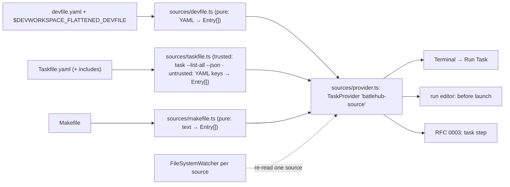

# RFC 0004 — Run configurations from devfile, Taskfile and Makefile

| Field       | Value                                                        |
| ----------- | ------------------------------------------------------------ |
| Status      | Draft                                                         |
| Short       | Run-config sources                                            |
| Settles     | Reading devfile commands (never writing), Taskfile and Makefile targets as run-configuration templates |
| Closes      | A.13, A.4 — the devfile, Taskfile and Makefile commands a team already has, as run configurations |
| Author      | Max Batleforc <maxleriche.60@gmail.com>                       |
| Co-author   | —                                                             |
| Created     | 2026-09-18                                                    |
| Revised     | 2026-09-18 — revision 2, after the series was reviewed against its goal (RFC 0001 §7.1): `task --list-all --json` never run before workspace trust (a plain YAML read lists the top-level tasks until then), Taskfile ids validated like make targets, the interpolation boundary defined, a size cap on parsed YAML, RFC 0023 named as BatleHub's |
| Supersedes  | —                                                             |
| Depends on  | RFC 0001 (the `batlehub-java` task provider, the run editor, the detection snapshot); RFC 0003 for the "as a run configuration" half (a `task` step); the devfile 2.x schema; Task v3 (`task --list-all --json`, after workspace trust only) |
| Touches     | `extensions/java-core/src/run/sources/` (new: `devfile.ts`, `taskfile.ts`, `makefile.ts`, `provider.ts`), `src/run/editor.ts` (the before-launch field, templates), `package.json` (`taskDefinitions`, settings), `tests/heavy/fixtures/` (a devfile, a Taskfile, a Makefile in `maven-multi`), `docs/guide/java/run.md` |

---

## 1. Summary

A Java project in a Che workspace already says how it is built and run —
three times: the devfile's `commands`, a `Taskfile.yaml` (this repository's
own convention, `desc` required), a `Makefile`. None of it reaches the
editor's Run view or the run editor's "before launch" field, so the
developer retypes `mvn -Pdev package` into `tasks.json` and drifts from the
file the CI runs.

This RFC reads those three sources — **never writing any of them** — and
provides their entries as **tasks** (a `batlehub-source` task provider, no
`tasks.json` needed) and as **run-configuration templates**: a "before
launch" choice in the run editor, and, with RFC 0003, a `task` step of an
orchestrated run. The devfile is read from the repository and from the
flattened file the DevWorkspace operator mounts; commands bound to another
container are listed and refused with the reason, not run in the wrong
place. Before the workspace is trusted nothing is executed even to *list*:
Task evaluates the Taskfile to enumerate it, so until trust the Taskfile
source is a plain read of the top-level file, marked partial.

No team has asked for this yet; in the order of work it sits behind RFC
0003 (RFC 0001 §14) and stays a Draft until one does.

### Before / after

```jsonc
// today — tasks.json, typed by hand, a copy of what devfile.yaml already says
{ "label": "build", "type": "shell", "command": "mvn -B -Pdev -DskipTests package" }

// with this RFC — nothing written; Terminal → Run Task lists
//   devfile: build      (mvn -B -Pdev -DskipTests package · component tools · group build)
//   taskfile: ext:build (Build every extension …)
//   make: test          (## run the unit tests)
// and the run editor's "before launch" offers the same three; launch.json then carries only
"preLaunchTask": "batlehub-source: devfile:build"
```

---

## 2. Motivation

1. **The devfile is the workspace's contract and the editor ignores it.**
   `commands[].exec` carries the command line, the working directory, the
   environment and the component (container) it runs in; RFC 0001 §4.2
   deliberately did not read it for the `batlehub-java` tasks. A Che user
   sees "Run Task" offer everything except what the workspace author wrote.
2. **Taskfile and Makefile are the project's build API**, and in this
   repository every command goes through Task (Weebo guideline: `desc`
   mandatory so anyone reads what it does). A description that exists for
   humans should be the task's label in the editor.
3. **"Before launch" has nothing to offer.** The run editor's before-launch
   field (RFC 0001 phase 4) takes a task label typed blind; the sources
   would give it a list.
4. **Drift.** A `tasks.json` copy of a devfile command diverges the day the
   devfile changes; a provided task cannot, because it is read at use.

### 2.1 Use cases

Each is an acceptance case for the `java` heavy half (RFC 0001 §10 layer
4) or the host layer; the proof is what the driver asserts.

1. **Devfile commands as tasks.** Starting state: the `maven-multi` fixture
   gains a `devfile.yaml` with `commands: [{ id: build, exec: { component:
   tools, commandLine: "mvn -B -DskipTests package", workingDir:
   "${PROJECT_SOURCE}", group: { kind: build } } }, { id: db-shell, exec: {
   component: db, commandLine: "psql" } }]`; the editor's `HOSTNAME` names
   a container `tools` (the suite sets `DEVWORKSPACE_COMPONENT_NAME=tools`,
   as the operator does). Action: `Terminal → Run Task`. Proof: the picker
   lists `devfile: build` with the description `mvn -B -DskipTests package ·
   tools · build` and `devfile: db-shell (component db — not this container)`;
   running `build` opens a terminal named `devfile: build` whose last row is
   `BUILD SUCCESS`, in the fixture's directory; choosing `db-shell` shows one
   warning `devfile: db-shell runs in component db; this editor is in tools`
   and starts nothing.
2. **Taskfile targets with their descriptions.** Starting state: the fixture
   gains `Taskfile.yaml` with `build` (`desc: "Package every module"`) and
   an include `.tasks/dev.yaml` with `dev:serve` (`desc` absent). Action: the
   same picker. Proof: `taskfile: build — Package every module` and
   `taskfile: dev:serve` (no description, listed all the same); running
   `build` shows `task: [build] mvn …` as the terminal's first row.
3. **Makefile targets.** Starting state: a `Makefile` with `test: ## run the
   unit tests` and an undocumented `clean:`. Proof: `make: test — run the
   unit tests` and `make: clean` listed; `.PHONY` and pattern rules
   (`%.o:`) absent from the list.
4. **Before launch from a source.** Action: `Java: New run configuration` →
   Application → main class `com.acme.app.Main` → before launch: the quick
   pick lists the nine sourced tasks (three sources × the fixture's
   entries) above "type a label". Choosing `devfile: build`. Proof: the
   `launch.json` diff is one entry with `"preLaunchTask":
   "batlehub-source: devfile:build"`; F5 runs the task first (terminal
   `devfile: build`, `BUILD SUCCESS`) then the application (`Hello from
   app` in the debug console).
5. **Refresh without a restart.** Action: append a `verify` command to the
   devfile while the editor runs. Proof: within 2 s (the file watcher) the
   picker lists `devfile: verify`; `launch.json` is byte-identical (nothing
   is written on refresh).
6. **Never written.** Proof at the end of the whole java half: sha256 of
   `devfile.yaml`, `Taskfile.yaml`, `.tasks/dev.yaml` and `Makefile` equal
   their values before the run; `Java: Remove BatleHub settings` lists no
   entry for any of them (there is none to list).
7. **An orchestrated run (with RFC 0003).** Action: a `batlehub-run` entry
   with `{ "task": "batlehub-source: taskfile:build" }` then `{ "launch":
   "Run Main" }`. Proof: the debug console shows `step 1 exited 0` before
   `Run Main` starts.
8. **An untrusted clone lists without running anything.** Host layer.
   Starting state: the fixture opened untrusted, a `task` shim first on
   `PATH` that touches a marker file when called. Action: open the picker.
   Proof: `taskfile: build — Package every module` under the header
   `taskfile (partial — trust the workspace for the full list)`,
   `dev:serve` (from the include) absent, the marker file does not exist.
   Trust the workspace: the marker exists, `taskfile: dev:serve` appears,
   the header loses its suffix.

---

## 3. Goals / non-goals

**Goals**

- Devfile commands, Taskfile tasks and Makefile targets appear as tasks
  the editor can run, labelled with what their source says about them.
- The run editor's before-launch field and RFC 0003's `task` steps can
  pick them.
- The sources are read only; refresh follows the files.
- A devfile command bound to another container is visible and refused with
  the reason.

**Non-goals**

- **Writing to the devfile, the Taskfile or the Makefile.** The devfile is
  the workspace's definition (RFC 0001 §4.2 and Appendix A.13: "read-only,
  never written"); the other two are the project's. The run editor writes
  `launch.json` and nothing else.
- **Replacing che-code's own devfile tasks.** che-code exposes devfile
  commands as tasks already (spike (a), §12 phase 0 confirms the type and
  the labels). Where they exist, this RFC's devfile tasks defer to them
  (§4.2) rather than listing each command twice.
- **Running a command in another container.** `kubectl exec` into a
  sidecar is `che-remote-ssh`'s territory and needs the cluster
  credentials; a run configuration runs here.
- **Devfile `composite` and `apply` commands.** `composite` (a list of
  other commands, optionally parallel) becomes an RFC 0003 run when that
  RFC lands; `apply` (a Kubernetes component) is not a process at all.
- **Gradle/Maven goals** — they are the `batlehub-java` provider's already.
- **A generic "any YAML/JSON as tasks" plugin system.** Three sources,
  three parsers, one provider.

---

## 4. User-facing design

### 4.1 Configuration

```jsonc
"batlehub.java.runSources": {
  "devfile": true,      // read devfile.yaml (repo) and $DEVWORKSPACE_FLATTENED_DEVFILE
  "taskfile": true,     // Taskfile.yaml / Taskfile.yml; trusted: `task --list-all --json` (includes too); untrusted: top-level keys only
  "makefile": true      // Makefile targets
},
"batlehub.java.runSources.devfilePath": ""   // absent: repo root devfile.yaml / .devfile.yaml
```

A task from a source, as the Task API sees it (and as `tasks.json` may
reference it, though nobody has to write one):

```jsonc
{ "type": "batlehub-source", "source": "devfile" | "taskfile" | "make", "id": "build" }
```

Its name is `<source>:<id>`, so the label the editor shows and
`preLaunchTask` uses is `batlehub-source: devfile:build`.

### 4.2 Behaviour rules

- **Discovery** at activation and on change: `devfile.yaml` / `.devfile.yaml`
  at the workspace folder root (or `devfilePath`), plus the flattened file
  at `$DEVWORKSPACE_FLATTENED_DEVFILE` when set (the operator's merge of
  the parent and the repository's devfile — what actually runs);
  `Taskfile.yaml|yml` at the root, its includes resolved by Task itself
  once the workspace is trusted and not at all before;
  `Makefile` / `makefile` / `GNUmakefile` at the root. One
  `FileSystemWatcher` per source; a change re-reads that source only.
- **Devfile commands**: `exec` commands only. `commandLine`, `workingDir`,
  `env`, `label`, `group.kind` are read. `component` is compared
  with `$DEVWORKSPACE_COMPONENT_NAME`; a mismatch lists the command with
  the suffix `(component X — not this container)` and refuses to run it.
  When che-code's own devfile task type is present (spike (a)), the
  `devfile` source is not listed and the run editor's before-launch offers
  che-code's tasks instead — one list, one owner.
- **Interpolation — two things are substituted, nothing else is.**
  (1) <code v-pre>{{name}}</code>, from the same file's top-level `variables:` map — the
  devfile's own documented mechanism, already applied by the operator in the
  flattened file — as a literal string replacement in `commandLine`,
  `workingDir` and `env` values. (2) `${PROJECT_SOURCE}` and
  `${PROJECTS_ROOT}` (also written `$PROJECT_SOURCE`, `$PROJECTS_ROOT`) in
  `workingDir`, which no shell reads: the environment variable of that name
  the operator sets, else the workspace folder (`PROJECT_SOURCE`) and its
  parent (`PROJECTS_ROOT`). In `commandLine` the extension substitutes
  neither: both are set in the task's environment and the shell that runs
  the line expands them, with every other `$…` of the line, as the devfile
  specification intends. The editor's own variables (`${workspaceFolder}`,
  `${env:…}`, `${config:…}`, `${command:…}`, `${input:…}`) are **not**
  resolved in any sourced field — `${command:…}` would be code run to build
  a label — and reach the shell as the literal text they are.
- **Taskfile, trusted workspace**: `task --list-all --json` run in the
  folder (the `task` binary from `PATH`, or `mise which task`); each entry's
  `name`, `desc`, `summary`; a missing `desc` lists the name alone. Task
  absent: the source is skipped with one channel line, not an error (a
  Taskfile without Task is not runnable anyway).
- **Taskfile, untrusted workspace**: that command is **never run**. It
  *executes* Task over the file — `includes`, `vars` with `sh:`, `dotenv`,
  `$(…)` in a dynamic variable are all evaluated to produce the list —
  which is exactly why `make -pn` is rejected below, and RFC 0001 §7.1
  forbids "a tool that evaluates a workspace file to list it" before trust.
  Instead the root `Taskfile.yaml|yml` is read as plain YAML (the devfile's
  loader and caps, §6.1): the keys of its top-level `tasks:` map are the
  ids, a `desc` that is a plain string is the description (shown raw, <code v-pre>{{…}}</code>
  not rendered), no `includes` entry is followed, and neither `task` nor
  `mise` is looked up. The picker's group header reads `taskfile (partial —
  trust the workspace for the full list)`. On `onDidGrantWorkspaceTrust`
  the source is re-read through Task and the partial list is dropped.
- **A sourced id is validated before it is an argument.** Taskfile ids —
  from either reader — must match `^[A-Za-z0-9_][A-Za-z0-9_.:/-]*$`: no
  leading `-` (a flag), no `=` (Task reads `NAME=value` as a variable
  assignment), no `*` (a wildcard task is not callable by its pattern), no
  whitespace. Make targets must match the target grammar below and not
  start with `-`. An id that fails is listed `(not runnable: name)`.
- **Makefile**: targets matched by `^([A-Za-z0-9_./-]+):(?:[^=]|$)` on
  lines that are not comments, not `.PHONY`/`.SUFFIXES`/special targets,
  not pattern rules (`%`), not variable assignments; a trailing `## text`
  on the target line is the description (the widespread self-documenting
  convention). No `make -pn` database: it evaluates the Makefile, which
  can run `$(shell …)`.
- **Execution**: a `ProcessExecution` with an argument array — devfile:
  `["/bin/sh", "-c", commandLine]` in `workingDir` with `env` merged (the
  devfile's command line *is* a shell line by definition; §7);
  Taskfile: `[task, id]`; make: `[make, "--", id]`. Task gives `--` another
  meaning (what follows is `CLI_ARGS`, not task names), so for Task the
  grammar above is the whole defence; for make it is the grammar and `--`
  both. The resolved JDK is in
  `JAVA_HOME` and on `PATH` as for `batlehub-java` tasks (`commandFor`'s
  environment, reused).
- **Templates**: the run editor's before-launch quick pick lists the
  sourced tasks (source, id, description) above the free-text entry; a
  devfile command of `group.kind: run` whose command line starts with
  `java ` or `mvn … exec:java` is also offered as a run-configuration
  template of type `java` when its main class can be read from the line
  (`-cp … com.acme.Main` or `-Dexec.mainClass=`), with the rest as
  `vmArgs`/`args`; otherwise the command is a task, not a launch.
- **Precedence**: a hand-written `tasks.json` task with the same label
  wins (the editor's own rule for provided tasks). Written `launch.json`
  entries are never touched on refresh; a `preLaunchTask` naming a task
  that disappeared fails at run with the editor's own message.
- **Untrusted workspace**: VS Code's workspace trust is the gate (RFC 0001
  §7.1); there is no second one. The three files are *read* — devfile and
  Makefile in full, the Taskfile partially as above — and **no process is
  spawned**, neither to run an entry nor to list one (RFC 0001 decision 40);
  a listed task's execution says why it does not run.

### 4.3 Validation

Hard errors (the source is skipped; one notification per session, the
channel has the detail):

| Condition | Rationale |
| --- | --- |
| a devfile that does not parse (YAML error) or has no `schemaVersion` | half a devfile is not a devfile; the operator would have refused it too |
| trusted workspace: `task --list-all --json` exits non-zero | Task's own message (a bad include, a syntax error) is shown; once Task may run it is the authority, and the partial YAML read is not a fallback — it would list what Task refuses to run |
| a YAML source over 1 MiB, or whose parsed document exceeds 20 000 nodes (§6.1) | an alias bomb or a file that is not what its name says; the source is skipped before anything walks it |

Warnings (channel `BatleHub Java: Run`):

| Condition | Behaviour |
| --- | --- |
| a devfile command with no `exec` (`composite`, `apply`, `custom`) | listed as `(not runnable here: <kind>)`, greyed, not executable |
| a command's `component` is not this container | listed with the suffix, refused at run with the message of case 1 |
| an editor variable (`${workspaceFolder}`, `${env:…}`, `${command:…}`) in a sourced field | not resolved (§4.2); the channel notes once that the shell will see it literally |
| <code v-pre>{{name}}</code> with no such key in `variables:` | left as is; the channel names it once |
| untrusted workspace and the Taskfile has `includes:` | the list is marked partial and the channel names the includes not followed |
| a Taskfile id or make target outside the accepted grammar | listed `(not runnable: name)`, never passed to `task` or `make` |
| a Makefile target whose recipe line uses a shell the container lacks | make's own error in the terminal; nothing to do earlier |
| Task or make not on `PATH` | the source is skipped, one line: `taskfile: no 'task' binary (mise use task)` |

---

## 5. Architecture

### 5.1 Three readers, one provider



Two invariants. **No path writes to a source file**, and **before trust no
path spawns a process** — the one reader that needs a process
(`readTaskfile`) is reached only behind `vscode.workspace.isTrusted`, and
its untrusted twin takes text. The readers take text or a process's stdout
and return `Entry[]`; the provider holds them; the
only write in the whole feature is `upsertConfig` on `launch.json`, which is
the run editor's existing write.

### 5.2 An `Entry`

```ts
export interface Entry {
  source: "devfile" | "taskfile" | "make";
  id: string;                       // devfile command id, task name, make target
  description?: string;             // devfile label, Task desc, make ## comment
  runnable: true | { reason: string };   // component mismatch, non-exec kind, no binary, id outside the grammar
  partial?: true;                   // taskfile, untrusted: top-level keys only
  exec: { cmd: string; args: string[]; cwd?: string; env?: Record<string, string> };
  group?: "build" | "run" | "test" | "debug";   // devfile only
  launchHint?: { mainClass: string; vmArgs?: string; args?: string };  // devfile run commands only
}
```

---

## 6. Detailed design

### 6.1 `src/run/sources/devfile.ts` — pure

- `parseDevfile(text: string, env: { PROJECT_SOURCE?; PROJECTS_ROOT?; component?: string }): Entry[]`
  — `yaml` is already a dependency of the workspace tooling? It is not of
  `java-core`; the devfile is parsed with `js-yaml`'s safe load (one
  dependency, ESM, 30 KB — or, if RFC 0001's rule "no dependency for a few
  lines" is read strictly, a `JSON` devfile is not an option and a YAML
  subset parser is not a few lines: the dependency is taken, decision 3).
- `loadYaml(text): unknown | undefined` — shared with `taskfile.ts`. Three
  limits, because `js-yaml` resolves every alias and copies on a `<<` merge,
  so a few hundred bytes of nested anchors become a document of millions of
  nodes to whoever walks it: the text is refused above **1 MiB** before
  parsing; it is loaded with `CORE_SCHEMA` (no `<<` merge key, no custom
  tags, nothing constructed but plain data); and the result is counted by a
  walk that stops at **20 000 nodes**, *counting an aliased node each time
  it is reached*, before any reader touches it. Over either cap is the hard
  error of §4.3. A devfile that relies on `<<` loses the merged keys; none
  of the fields read here is usually written that way, and the flattened
  file has no anchors at all.
- `substitute(text, variables)` and `resolveDir(workingDir, env)` — the two
  substitutions of §4.2 and no other; both pure.
- `mergeFlattened(repo: Entry[], flattened: Entry[]): Entry[]` — the
  flattened file wins by `id` (it is what runs); ids only in the repository
  file are kept (a devfile edited since the workspace started).
- `launchHint(commandLine)` — the two shapes of §4.2, nothing more.

### 6.2 `src/run/sources/taskfile.ts`

- `parseTaskList(json: string): Entry[]` (pure) over Task's `--json`
  shape (`{ tasks: [{ name, desc, summary, location }] }`).
- `readTaskfile(io: Io, cwd)`: `io.exec("task", ["--list-all", "--json"])`
  through RFC 0001's `Io` (the trusted-only `exec`, `mise which task`
  fallback as for Maven in feedback 22). Trusted workspaces only: the
  provider does not call it otherwise, and `Io.exec` refuses by itself.
- `listTopLevel(text: string): Entry[]` (pure) — the untrusted reader:
  `loadYaml`, the keys of `tasks:`, a string `desc`, every entry `partial`.
  It follows no `includes`, renders no template and resolves no binary.
- `validId(id): boolean` — the grammar of §4.2, applied to both readers'
  output.

### 6.3 `src/run/sources/makefile.ts` — pure

- `parseMakefile(text): Entry[]` with the rule of §4.2; `include` lines
  are not followed (a warning names them); a target starting with `-` is
  not runnable.

### 6.4 `src/run/sources/provider.ts`

- `vscode.tasks.registerTaskProvider("batlehub-source", …)`:
  `provideTasks` returns one `vscode.Task` per runnable entry, `group`
  mapped to `TaskGroup.Build/Test`, `detail` = description,
  `ProcessExecution(cmd, args, { cwd, env })` with the JDK environment;
  `resolveTask` for `tasks.json` references. A non-runnable entry is a
  task whose execution prints the reason and exits 1 — the same pattern as
  the untrusted `batlehub-java` task (RFC 0001 phase 3).
- `contributes.taskDefinitions`: `{ type: "batlehub-source", required: ["source", "id"] }`.
- The three watchers; `onDidChange` event the run editor listens to;
  `vscode.workspace.onDidGrantWorkspaceTrust` re-reads the Taskfile source
  through Task.
- The che-code detection (spike (a)): `vscode.tasks.fetchTasks({ type: <che-code's type> })`
  non-empty → the `devfile` source is not provided.

### 6.5 `src/run/editor.ts` and `configs.ts`

- The before-launch step of `editForm` becomes a quick pick: the provider's
  entries first (`$(tasklist) devfile: build — mvn …`), then `batlehub-java`
  goals, then `$(edit) Type a label…`; the value written is the task's
  full label.
- `TEMPLATES` gains `fromSource` ("From a devfile run command") listing the
  entries with a `launchHint`; the produced `JavaLaunch` carries
  `batlehub: { template: "devfile:<id>" }` — the origin, as the IntelliJ
  import records `idea:<type>`.

**Deliberately untouched**, so reviewers do not go looking:

- `devfile.yaml` of this repository — it has no `commands:` (CLAUDE.md:
  "No `commands:` in `devfile.yaml`; the parent is `che-browser`"); the
  fixture's devfile is the test subject, not the workspace's.
- `che-notify`, `che-remote-ssh` — they read the Che API and kubeconfig;
  this RFC reads files and one environment variable.
- `src/build/tasks.ts` — the `batlehub-java` provider stays the owner of
  goals; the sources never produce a `mvn` goal task of their own (a
  devfile `mvn package` command runs as the devfile says, not as a
  `batlehub-java` task with the active profiles applied — the devfile is
  the authority on its own line).

---

## 7. Security considerations

- **What is attacker-controlled: three committed files.** A cloned
  repository's devfile, Taskfile and Makefile are arbitrary command lines,
  exactly as `tasks.json` is. Running them is gated by VS Code's workspace
  trust — the only gate (RFC 0001 §7.1, decision 40) — and by the user
  choosing the task. **Listing is reading only where reading is all it
  takes**: the devfile and the Makefile are parsed as text; the Taskfile's
  full list needs `task --list-all --json`, which evaluates the file
  (`includes`, `sh:` variables, `dotenv`), so before trust it is replaced by
  a YAML read of the top-level keys (§4.2). Revision 1 said "reading is
  safe" and ran Task to read; it rejected `make -pn` for the very reason it
  overlooked here. Nothing is spawned at activation, on refresh or on
  discovery in an untrusted workspace.
- **YAML is parsed under caps** (§6.1): 1 MiB of text, `CORE_SCHEMA`,
  20 000 nodes with aliases counted at each use. A committed alias bomb
  costs a skipped source, not the extension host.
- **The interpolation boundary is closed** (§4.2): <code v-pre>{{variables}}</code> of the
  same file and the two project paths in `workingDir`. No editor variable is
  resolved, so a sourced field can never trigger `${command:…}` or read
  `${env:…}` into a label or a log.
- **A devfile command line is a shell line by the devfile specification**
  (`commandLine` is documented as executed by a shell). It is run as
  `sh -c <line>`, which is what the operator and che-code do; `env` values
  are set in the process environment, never interpolated by this
  extension. Taskfile and make entries are argument arrays: `[task, id]`,
  `[make, "--", id]`. Both ids are validated before they become an
  argument, so neither `--eval=…` for make nor `--taskfile=…`, `--dir=…` or
  a `NAME=value` assignment for Task can be smuggled in as a "target". Make
  gets `--` as well; Task cannot (`--` starts its `CLI_ARGS`), so its
  grammar forbids the leading `-` and the `=` outright.
- **`env` values of a devfile command may be secrets.** They go to the
  process environment and nowhere else: a task's `detail` shows the command
  line, not the environment, and the channel logs names, never values.
- **The flattened devfile is trusted as the operator's**: it is mounted
  read-only by the DevWorkspace controller from the workspace's own
  definition; reading it adds no surface the running container does not
  already embody.
- **Nothing is written**, so nothing this RFC does can persist a change a
  user did not make. The one write path (`launch.json`, `preLaunchTask`)
  is the run editor's existing one.
- **What an attacker gains from a bypassed check: nothing new** after
  trust — every command listed could be pasted into the terminal by the
  same user. Before trust the check that matters is "no spawn", and it is
  held in two places (the provider and `Io.exec`).

### Red lines

- **Every write is in the manifest.** Nothing is written outside the
  extension's storage, and nothing inside it either: the three sources are
  read-only by design (§5.1), no setting of ours or of another extension is
  written. The one write is the run editor's `preLaunchTask` in
  `launch.json`, on the user's action — a source edit, undone by the editor
  and git, not a manifest entry.
- **The token is the core's.** No registry credential is involved. A
  sourced command that needs the registry finds it where the core's
  `writeCredential` targets already put it (`settings.xml`, `init.gradle`);
  this RFC adds nothing to a command's environment but `JAVA_HOME` and
  `PATH`.
- **Memory.** This RFC starts nothing by itself. A sourced task runs
  through the editor's Task API on the user's explicit choice, as a
  `tasks.json` task does, and is not in the sum. The exception it must not
  create: a devfile command of `group.kind: run` is long-lived, so when the
  run editor places one in an RFC 0003 run it writes a **`process` step**
  (`["/bin/sh", "-c", line]`, with a `memoryMiB` the form asks for) and not
  a `task` step — it then starts through the managed process with a
  declared cap. Started straight from `Run Task` it stays the editor's
  process (§11 open 4).
- **Defaults crossed.** None. *Bridge, do not rebuild* is followed:
  che-code's own devfile tasks win when present (§4.2). Nothing is
  downloaded, no foreign setting is written, and no source text leaves the
  machine — the only child processes are `task`, `make` and `sh`, after
  trust.

---

## 8. Alternatives considered

| Alternative | Why rejected |
| --- | --- |
| Generate `tasks.json` from the sources | A generated file drifts the moment the source changes and shows up in `git status`; a provider is read at use and writes nothing — the whole point (§2 point 4). |
| Generate `launch.json` entries for every source command | A shell command is not a `java` launch; the debugger cannot start it. The run-configuration half is RFC 0003's `task` step, which is exactly "a launch that runs a task, stoppable". |
| Parse `Taskfile.yaml` ourselves, always | Includes, `vars`, `dotenv`, matrix tasks: Task's own `--list-all --json` is the only correct listing and costs one process — once the workspace is trusted. Our own read is kept for the one case where Task may not run, is limited to the top-level keys and says it is partial. |
| Run `task --list-all --json` before trust ("it only lists") | It evaluates the Taskfile to list it: `sh:` variables and `dotenv` run and read what the repository says. The same objection as `make -pn`, below; RFC 0001 §7.1 names the case. |
| List nothing from the Taskfile until trust | Honest, but the untrusted picker would show devfile and make entries and silently no Taskfile; a partial list that says it is partial tells the developer what trusting adds. |
| `make -pn` for the target database | It evaluates `$(shell …)` and `include`s — running code to list it. The self-documenting `##` convention covers what people want listed. |
| Read the devfile through the Che API (`che-notify`'s pattern) | The API needs credentials the editor may not hold; the flattened file is on disk in every DevWorkspace and is the same data. |
| Run other-container commands through `kubectl exec` | Needs the cluster, the namespace and a token (`che-remote-ssh` has them for its own purpose); out of scope until a user asks, and listing-but-refusing already tells them where the command belongs. |

---

## 9. Rollout and compatibility

- **Default behaviour**: all three sources on; a workspace without any of
  the files sees nothing new.
- **Config migration**: none.
- **Prerequisites**: `task` on `PATH` (or through `mise`) for the Taskfile
  source's full list and to run it; `make` for the Makefile source. An
  untrusted workspace needs neither.
- **Rollback**: nothing persisted; `launch.json` entries that reference a
  sourced task keep working as long as the source exists.
- **che-code**: when its devfile tasks are present, this RFC's devfile
  source stays out of the way (§4.2); a che-code that later drops them
  turns this RFC's source on without a change here.

---

## 10. Test plan

- **Unit** (`extensions/java-core/test/sources.test.ts`): `parseDevfile`
  over the fixture devfile (`exec`, `composite`, component mismatch,
  `${PROJECT_SOURCE}`, `launchHint` on `java -cp … Main` and
  `exec:java`), `mergeFlattened` precedence, `parseTaskList` over a real
  `task --list-all --json` capture (the `gradle-real.test.ts` pattern:
  real output as a fixture), `parseMakefile` over a Makefile with `.PHONY`,
  a pattern rule, `##` comments, a variable assignment, an `include`;
  `listTopLevel` over the fixture Taskfile (the included `dev:serve`
  **absent**, every entry `partial`); `validId` over `-x`, `--dir=/`,
  `A=b`, `start:*`, `ext:build`; `loadYaml` refusing a 1 MiB + 1 byte text
  and a nine-level alias bomb under 1 KB; `substitute` / `resolveDir`
  leaving `${env:HOME}` and `${command:x}` untouched.
- **Host** (`test-host/`): the provider lists the fixture's entries;
  a non-runnable entry's task prints its reason and exits 1; the watcher
  refresh; the untrusted refusal. **Untrusted, with a `task` shim first on
  `PATH` that touches a marker file**: after activation and a picker open
  the marker does not exist, the list is the partial one; after
  `onDidGrantWorkspaceTrust` the marker exists and `dev:serve` is listed.
  A Taskfile whose `vars` hold `sh: touch <marker>` gives the same proof
  against the real Task where the runner has it.
- **Heavy** (`tests/heavy/java.mjs`): cases 1, 2, 4, 5 and 6 of §2.1
  (`SOURCES-OK`, `SOURCES-BEFORE-LAUNCH-OK`, `SOURCES-UNTOUCHED`).
- **Existing suites** unchanged: `launch.test.ts` (round trip with a
  `preLaunchTask` set), `surface.test.ts` (the `batlehub-java` provider's
  command lines).

---

## 11. Decisions and open questions

### Resolved

| # | Question | Decision |
| --- | --- | --- |
| 1 | Tasks or launch entries? | **Tasks, provided at use**; launch entries only through the run editor's before-launch and RFC 0003's `task` step. A shell line is not a Java launch. |
| 2 | Which devfile? | **Both**: the repository's and the operator's flattened one, the latter winning by id. |
| 3 | A YAML dependency? | **Yes, `js-yaml` (safe load)** in `java-core`. A devfile is YAML; a hand parser is not "a few lines". |
| 4 | Commands of another container? | **Listed, refused with the reason.** Visible beats silently missing; running them needs the cluster. |
| 5 | Makefile discovery | **Regex on target lines with the `##` convention**, no `make -pn`; `include` not followed. |
| 6 | Devfile source next to che-code's tasks | **Defer to che-code's** when present, detected at activation. |
| 7 | Listing a Taskfile before trust? | **A plain YAML read of the top-level `tasks:` keys, marked partial; `task --list-all --json` only after trust** (revision 2). Task evaluates the file to list it — `make -pn`'s defect, decision 5 — and VS Code's trust is the one gate (RFC 0001 §7.1). |
| 8 | Taskfile ids as arguments | **Validated against a name grammar like make targets**; make also gets `--`, Task cannot (`--` begins `CLI_ARGS`), so its grammar refuses a leading `-` and any `=`. |
| 9 | What is interpolated? | **<code v-pre>{{variables}}</code> of the same devfile, and `${PROJECT_SOURCE}` / `${PROJECTS_ROOT}` in `workingDir`. Nothing else** — no editor variable, ever. |
| 10 | YAML limits | **1 MiB of text, `CORE_SCHEMA`, 20 000 nodes with aliases counted per use**; `js-yaml` resolves aliases and would hand an alias bomb to whoever walks the result. |
| 11 | A long-lived devfile `run` command inside an RFC 0003 run | **A `process` step with a declared cap, not a `task` step** — the memory rule (§7 red lines). |

### Still open

1. **che-code's devfile task type and label format** (spike (a), phase 0):
   the type name and whether its labels are stable enough for
   `preLaunchTask`. If they are not, the `devfile` source stays on beside
   them and the before-launch pick shows che-code's first. Recommendation:
   read them in the che-code of **BatleHub's** RFC 0023 image (the che-code
   image; `batleforc/batlehub/docs/rfc/`, not this series) before deciding.
2. **Devfile `composite` commands as RFC 0003 runs**: `parallel: true`
   has no RFC 0003 equivalent (decision: no parallel steps). Recommendation:
   sequential always, with a channel note; revisit if a real devfile needs
   the parallelism.
3. **A run command's main class** from lines other than `java -cp …` and
   `exec:java` (`java -jar target/app.jar` has no main class the debugger
   can use). Recommendation: a jar line is a task, not a launch; say so in
   the template list.
4. **A `run`-group command started from `Run Task`** is long-lived and
   outside the managed process, because the Task API owns it. Options: leave
   it (it is the user's explicit act, like a terminal), or give such entries
   a `CustomExecution` that calls `process.start`. Recommendation: leave it
   until a recorded peak says a devfile run command is what fills a pod; the
   `JDK` tab's sum then notes "tasks not counted".
5. **`<<` merge keys in a repository devfile** are dropped by `CORE_SCHEMA`
   (§6.1). Recommendation: keep the strict schema and warn when the text
   contains `<<:`; revisit if a real devfile of a team uses it in
   `commands`.

---

## 12. Implementation phases

| Phase | Content |
| --- | --- |
| 0 | Spike (a): che-code's devfile tasks — type, labels, behaviour with a flattened devfile; answered in the che-code of BatleHub's RFC 0023 image (`batleforc/batlehub/docs/rfc/`). |
| 1 | `sources/makefile.ts`, `sources/taskfile.ts` (both readers, `validId`), `loadYaml` with its caps, `provider.ts`, the watchers and the trust event, unit + host tests including the no-spawn-before-trust proof. Useful alone: Taskfile and make in Run Task. |
| 2 | `sources/devfile.ts` with the flattened merge and the component rule; the fixture devfile; heavy cases 1, 5, 6. |
| 3 | The run editor: before-launch quick pick, the `fromSource` template; heavy case 4. |
| 4 | With RFC 0003 phase 3 (the orchestrator): `task` steps naming sourced tasks, a `run`-group command written as a `process` step; heavy case 7. |
