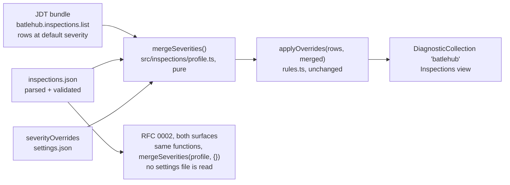
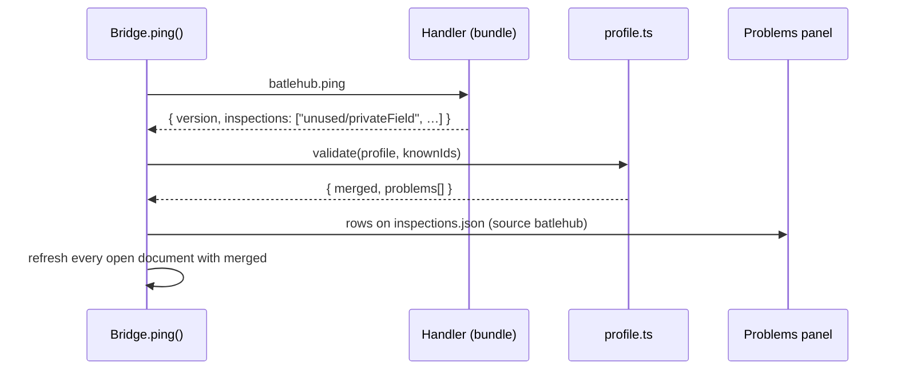

# RFC 0005 — Shared inspection profiles

| Field       | Value                                                        |
| ----------- | ------------------------------------------------------------ |
| Status      | Draft                                                         |
| Short       | Inspection profiles                                           |
| Settles     | Team inspection profiles as committed files, every disabled rule carrying its rationale, precedence with user overrides |
| Closes      | A.9, A.13 — a team inspection profile, every disabled rule with its reason |
| Author      | Max Batleforc <maxleriche.60@gmail.com>                       |
| Co-author   | —                                                             |
| Created     | 2026-09-18                                                    |
| Revised     | 2026-09-18 — revision 2, after the series was reviewed against its goal (RFC 0001 §7.1): the engine is `batlehub java inspect --profile` and never reads a settings file; a user override is marked "differs from project"; an imported `why` is accepted but marked; a `profile` manifest entry kind for programmatic writes; bridged SonarLint rules are silenced here as `sonar/<key>`; the unknown-rule and unknown-default holes closed |
| Supersedes  | —                                                             |
| Depends on  | RFC 0001 (the JDT bundle of §6.2 and the inspections bridge of §4.2, phase 6 landed; the red lines of §7.1); RFC 0006 (the committed half of `.batlehub/java/`, where the profile lives); RFC 0002 runs the profile for CI and for agents; RFC 0007 writes imported entries; RFC 0016 brings the bridged rules |
| Touches     | `extensions/java-core/src/inspections/` (`rules.ts`, `bridge.ts`, `view.ts`, new `profile.ts` — shared through `packages/java-rules`), `src/manifest.ts` (one new entry kind, `profile`), `jdt/batlehub-jdt-core` (`Handler`, `Engine`), `schema/`, `tests/heavy/java.mjs`, `docs/guide/java/` |

---

## 1. Summary

The bundle ships eleven inspections and the client applies
`batlehub.java.inspections.severityOverrides` before display (RFC 0001
§4.2). That is one developer's taste in one developer's `settings.json`.
A team has a different need: the same rules at the same severities for
everyone, a written reason next to every rule it turned off, and the same
verdict in the editor and in CI.

This RFC adds `.batlehub/java/inspections.json`, a committed profile:
per-rule severity, `off` allowed only with a `why`, unknown rules reported
rather than ignored. The profile is the team's default; the developer's
`severityOverrides` still win in their editor — comfort is the target (RFC
0001 §7.1) — and the inspections view and the panel mark every such rule
**differs from project**. Both surfaces of RFC 0002 — the command line in
CI and the live-editor tools an agent calls — use the profile alone and
never read a settings file, so CI and agents are where the team's word is
final. The bundle does not change: severity
is applied client-side today and stays there; the profile is one more
input to `applyOverrides`.

### Before / after

```text
# today — one developer, one settings.json
"batlehub.java.inspections.severityOverrides": { "style/redundantThis": "off" }

# with this RFC — the team, in the repository, reviewed
// .batlehub/java/inspections.json
{
  "$schema": "https://batlehub.dev/schema/java-inspections.schema.json",
  "version": 1,
  "rules": {
    "style/redundantThis":          { "severity": "off",     "why": "house style writes this.x in constructors, see CONTRIBUTING §3" },
    "performance/stringConcatInLoop": { "severity": "error" },
    "correctness/emptyCatch":       { "severity": "warning", "why": "legacy module, tracked in #412; back to error when it is gone" }
  }
}
$ batlehub java inspect --profile .batlehub/java/inspections.json .   # CI: the same rows, the same severities, exit 1 on error
```

---

## 2. Motivation

1. **Severity lives in the wrong place for a team.** `severityOverrides` is
   a `settings.json` key; a team that wants `stringConcatInLoop` as an
   error either commits `.vscode/settings.json` (and every unrelated
   editor key with it) or tells everyone to set it. RFC 0001 Appendix A.9
   lists "inspection profiles, per-project severity" as the IDEA feature
   VS Code lacks; phase 6 delivered the overrides and left profiles P2.
2. **A disabled rule without a reason is a rule nobody re-enables.** IDEA
   profiles let a team turn anything off silently; a year later nobody
   knows why. The profile format makes the rationale mandatory for `off`
   and for a downgrade: a reviewer reads the reason in the pull request
   that adds it.
3. **The editor and CI must agree.** The engine of RFC 0002 reads no
   `settings.json`, by decision (RFC 0002 decision 10: personal in the editor,
   attacker-written in a fresh clone). Without a file the CI run and the
   editor run different sets, and the gate is either stricter than what
   developers see (they learn from a red pipeline) or looser (the gate is
   decorative).
4. **Drift between the profile and the bundle is silent today.** A profile
   naming `style/ifReturnBool` (a typo) or a rule removed in a later
   bundle would simply not match in `applyOverrides`, and the rule would
   run at its default severity with no one told.

### 2.1 Use cases

1. **The team turns a rule off with a reason.** A repository commits
   `.batlehub/java/inspections.json` with `style/redundantThis` at `off`
   and a `why`. A developer opens `Greeter.java` of the `maven-multi`
   fixture (which has one `redundantThis` finding at line 11 in RFC
   0001's run 15). Proof: the Problems panel shows the other three
   `batlehub` rows (`unused/privateField`, `performance/stringConcatInLoop`,
   `collections/sizeIsZero`) and no `style/redundantThis`; the Inspections
   view's rule list shows `style/redundantThis — off (profile: house style
   writes this.x …)`; the `BatleHub Java: JDT` channel logs `profile:
   11 rules known, 1 off, 0 unknown`.
2. **`off` without a reason is refused, the rest of the profile applies.**
   The profile has `"correctness/emptyCatch": { "severity": "off" }` and no
   `why`. Proof: a Problems row on `inspections.json` at that line, source
   `batlehub`, message `correctness/emptyCatch: "off" needs a "why"`; the
   rule runs at its default severity; every other entry of the profile
   applies; the Inspections view banner says `inspections.json has 1
   error`.
3. **The developer's override wins locally and is visible.** Same profile
   as use case 1; the developer sets
   `"batlehub.java.inspections.severityOverrides": { "style/redundantThis": "warning" }`
   in their user settings. Proof: the `redundantThis` row is back in the
   Problems panel as a warning; the Inspections view shows it with
   `warning (you) — differs from project: off`, and the Java panel's
   inspections line counts `1 rule differs from project`; the profile file
   is unchanged; an agent's `java_inspect` in the same editor (RFC 0002)
   does **not** return the row — it reports under the profile.
4. **A rule the bundle does not have is named, not ignored.** The profile
   lists `style/ifReturnBool` (the id is `style/ifReturnBoolean`). Proof: a
   Problems row on the profile line `unknown rule style/ifReturnBool — the
   loaded bundle (0.1.0) has: style/ifReturnBoolean, …` with the closest
   id first; the channel line reads `profile: 11 rules known, 0 off, 1
   unknown`; the Inspections view banner lists it. Between activation and
   the bundle's first answer the banner reads `inspections.json: not yet
   checked against the bundle`, and the row appears as soon as the bundle
   answers — never after a reload, never silently absent.
5. **Severity flows into the gate.** The profile raises
   `performance/stringConcatInLoop` to `error`. Proof: the Problems row
   for `Greeter.java:17` is an error (red), `Fix all in file` still
   rewrites `size() == 0` (a different rule, the fix is unaffected by
   severity), and — once RFC 0002 lands — `batlehub java inspect
   --profile .batlehub/java/inspections.json .` on the fixture exits 1
   naming `Greeter.java:17`.
6. **The panel writes a profile the team can review.** With no profile
   file and two user overrides set, the developer clicks `Save as project
   profile` in the Inspections view. Proof: `inspections.json` is created
   with `$schema`, `version`, the two rules, and an empty `why` on the
   `off` one, and the view shows the same Problems row as use case 2 until
   the developer fills it: the file is never valid by accident.
7. **An imported reason is accepted and marked.** RFC 0007's import writes
   `collections/sizeIsZero` at `off` with the `why` `imported from IntelliJ
   profile "Project Default" (disabled there)` and `"imported":
   "intellij"`. Proof: no Problems row (the `why` is present); the
   Inspections view shows the rule `off — imported, nobody argued this:
   imported from IntelliJ profile …`; after a person rewrites the reason
   and deletes the `imported` field the mark is gone; `Java: Remove
   BatleHub settings` on the untouched import removes exactly the entries
   the import wrote and leaves a hand-written one in place.
8. **A noisy bridged rule is silenced the same way.** With RFC 0016's
   SonarLint bridge present, the profile has `"sonar/java:S1135": {
   "severity": "off", "why": "TODO comments are tracked in the forge" }`.
   Proof: the `java:S1135` rows leave the Problems panel; the view lists
   the rule under `sonar` with its reason; the same entry without `why` is
   use case 2's row.

---

## 3. Goals / non-goals

**Goals**

- A committed, schema-validated profile that the editor and both surfaces
  of RFC 0002's engine read through the same pure code
  (`packages/java-rules`).
- `off` and downgrades carry a reason; the reason is shown where the rule
  is shown.
- Every mismatch between the profile and the loaded bundle is a Problems
  row on the profile.
- The developer's own overrides keep working and are visibly marked
  "differs from project"; nothing an agent or CI reports depends on them.
- A reason nobody wrote (an import's) is accepted and marked as such.
- One file silences a noisy rule whatever its source: the bundle's or a
  bridged SonarLint one (RFC 0016), with the same required reason.

**Non-goals**

- Rule *options* (a threshold, a name pattern): none of the eleven rules
  has one. The schema reserves an `options` object per rule so adding the
  first one is not a format change.
- Configuring tools outside the bundle (Checkstyle, PMD, SonarLint's own
  rule parameters and quality profiles): RFC 0001 A.9 says those stay
  external and bridged; their configuration files are theirs. The one
  thing this profile does for a bridged rule is silence or re-grade it,
  with a reason (§4.1); how the bridge enforces that is RFC 0016's.
- A profile inheritance chain (`extends`): one file per repository; a
  monorepo with two teams commits two workspace folders, each with its
  own.
- Enforcing the profile in the editor (refusing user overrides): the
  editor is personal and comfort is the target; CI is the gate (RFC 0006
  decision 2). The editor and CI can therefore differ, by design; the
  marker and the project-valued agent and CI surfaces are the mitigation.
- Changing where severity is applied: it stays client-side in
  `applyOverrides`, and the engine applies it in the same function. The
  bundle keeps reporting its default severity.

---

## 4. User-facing design

### 4.1 Configuration

`.batlehub/java/inspections.json`:

```jsonc
{
  "$schema": "https://batlehub.dev/schema/java-inspections.schema.json",
  "version": 1,
  "rules": {
    "<area>/<ruleId>": {
      "severity": "error | warning | info | hint | off",
      "why": "required when severity is off or lower than the rule's default",
      "imported": "intellij",       // optional; set only by a program (RFC 0007), marks the why as nobody's argument
      "options": {}                 // reserved; no rule reads it yet
    }
  }
}
```

- Keys are `area/ruleId`, the `code` the bridge already puts on every
  diagnostic (`unused/privateField`), never the bare `ruleId`: bare ids
  are accepted in `severityOverrides` for convenience, but a committed
  file is read by people and by CI and should be unambiguous.
- **Bridged rules share the key space.** A bundle rule stays
  `area/ruleId`. A rule of a bridged analyser is written `<bridge>/<the
  analyser's own rule key>`, the bridge's name taking the place of the
  area: `sonar/java:S1135` for SonarLint (proposed here, to be kept
  consistent with RFC 0016, which owns the bridge). The part after the
  first `/` is opaque to this RFC; `sonar` is reserved and no bundle area
  may take it. The `why` rule applies unchanged: a noisy bridged rule is
  silenced here, with a reason, not in a personal setting.
- A rule absent from the file runs at its default severity (the bundle's,
  or the bridge's).
- `why` is a free string, shown verbatim in the Inspections view and in
  the engine's output. Its presence, not its content, is validated.
- **`imported`** is written only by a program. A generated `why`
  (RFC 0007: `imported from IntelliJ profile "<name>" (disabled there)`)
  satisfies the `why` rule — refusing it would make every import start
  invalid — but the view marks the row **imported**, so a reviewer knows
  nobody argued it. The mark goes when a person rewrites the reason and
  removes the field.

The existing `batlehub.java.inspections.severityOverrides` setting is
unchanged and keeps its meaning: the developer's own layer.

### 4.2 Behaviour rules

- **Precedence per rule in the editor**, highest first:
  `severityOverrides` (user or workspace `settings.json`), the profile,
  the bundle's default. The merged result is what `applyOverrides`
  receives; the profile never reaches the bundle. The user wins because
  comfort is the target (RFC 0001 §7.1).
- **Every override that changes a profile entry is marked "differs from
  project"** — on the rule's row in the Inspections view (`warning (you) —
  differs from project: off`) and as a count on the Java panel — so a
  developer who forgot an override finds out from the view, not from a
  red pipeline.
- **Agents and CI use the profile alone.** Both surfaces of RFC 0002 call
  `mergeSeverities(profile, {})`: the live-editor tools report under the
  project values even in an editor whose override differs.
- **Downgrade needs a reason** — `off`, or any severity lower than the
  rule's default in the order `error > warning > info > hint`. An upgrade
  does not: making a rule stricter is not a decision anyone will wonder
  about later.
- **Known rules come from the ping.** `batlehub.ping` already returns the
  loaded bundle's `area/id` list (`Handler`, RFC 0001 §6.2); the profile
  is checked against it after every ping, so a bundle update re-validates
  the file without a reload of anything else. Before the first successful
  ping the profile is applied and the view banner says `not yet checked
  against the bundle` — the state is visible, not silent; the
  unknown-rule rows appear as soon as the bundle answers, with no action
  from anyone. `sonar/*` keys are checked against the bridge's rule list
  when RFC 0016's bridge answers, and carry one info row (`not checked:
  no SonarLint bridge`) when it is absent.
- **An unknown default is the strict one.** When the bundle does not say
  a rule's default (an older bundle without `defaults`, §6.3, or a bridged
  rule whose default the bridge does not give), the default is taken as
  `error`: every lower severity requires a `why`. The safe side is an
  unnecessary reason, never a silent downgrade.
- **Where the reason shows**: the Inspections view's rule row (`off —
  profile: <why>`, or `off — imported, nobody argued this: <why>`), the
  diagnostic's related-information entry for a downgraded rule that still
  shows, and RFC 0002's `inspect --print-profile`.
- **`Save as project profile`** in the Inspections view writes the current
  merged severities (overrides over defaults) as a profile, through the
  `saveToProject` path of RFC 0006 §6.1, with an empty `why` on every
  entry that needs one. The file starts invalid on purpose (use case 6).
- **A program that writes the profile records it.** RFC 0007's import and
  `Save as project profile` write through one function that records a
  `profile` entry in the core's manifest (§6.6): the file, whether it was
  created, each rule key written and the entry it replaced. `Java: Remove
  BatleHub settings` removes the entries still as written, restores what
  they replaced, deletes a file it created and left with no rule, and
  leaves alone any entry a person has since edited.
- **CI and agents**: RFC 0002's `batlehub java inspect --profile <file>`
  reads the file and exits non-zero when any row is at `error`. The engine
  **never reads a settings file** — there is no `settings.json` for it to
  ignore (RFC 0002 §4.1) — and `sonar/*` entries are checked for shape and
  `why` but not for existence, since the engine runs the bundle alone. The
  details are that RFC's; this one fixes only that the input is the
  profile and nothing else.

### 4.3 Validation

Hard errors (a Problems row on the file, the file treated as absent):

| Condition | Rationale |
| --- | --- |
| the file does not parse | no partial reading of a file that is not JSON |
| `version` missing or not `1` | the shape is unknown; guessing would apply someone's intent wrongly |

Warnings (a Problems row per entry, that entry ignored, the rest applied; the Inspections view banner counts them):

| Condition | Behaviour |
| --- | --- |
| `off` or a downgrade without `why` | the rule keeps its default severity |
| unknown `severity` value | entry ignored |
| a key without `/` (a bare `ruleId`) | entry ignored; message suggests the `area/ruleId` form from the known list |
| unknown rule, as soon as the bundle (or, for `sonar/*`, the bridge) has answered | entry ignored; message lists the closest known id first (Levenshtein over the eleven, small enough to be a loop) |
| `options` set on a rule that reads none | entry applied without the options; one info row |
| `imported` with a value other than a known importer (`intellij`) | entry applied, the row marked imported all the same; one info row |
| a bundle area named `sonar` (a build-time check, not a file error) | the bundle build fails: the prefix is the bridge's |

---

## 5. Architecture

### 5.1 One more input to `applyOverrides`



The invariant: **the bundle never learns about profiles**. It reports what
it finds at the severity the rule declares; every policy sits in one pure
TypeScript function (in `packages/java-rules`, RFC 0002 decision 7) that
both the editor and the engine call. A rule's
default changing in the bundle is therefore visible in both at once.

### 5.2 Validation against the loaded bundle



---

## 6. Detailed design

### 6.1 `extensions/java-core/src/inspections/profile.ts` (new, pure)

- `parseProfile(text)` → `{ profile, problems }` with line positions from
  `jsonc-parser`'s tree, the hard errors of §4.3.
- `validate(profile, knownIds, defaults)` → `{ merged: Record<code,
  Override>, reasons: Record<code, string>, problems }` — the warnings of
  §4.3, the `why` rule against `defaults` (the bundle's declared severity
  per id, also returned by the ping in this RFC, see 6.3).
- `mergeSeverities(profile, overrides)` → the `Record<string, string>` that
  `applyOverrides` already takes. `differing(profile, overrides)` → the
  codes whose override changes a profile entry, for the marker. Four
  functions, no `vscode`; the module lives in `packages/java-rules` once
  RFC 0002 phase 1 creates it, so the engine imports it rather than
  copying it.
- An unknown default resolves to `error` inside `validate()` (§4.2), one
  line, with its own test.

### 6.2 `src/inspections/bridge.ts`, `view.ts`

- `ping()` passes the returned id list and defaults to `validate()`,
  publishes the profile's Problems rows in the existing `DiagnosticCollection`
  under the profile file's URI, and stores `merged` for `refresh()`, which
  calls `applyOverrides(raw, merged)` instead of
  `applyOverrides(raw, s.severityOverrides)`. One line changes in
  `refresh()`.
- A file watcher on `.batlehub/java/inspections.json` re-runs
  `validate()` and refreshes open documents (the RFC 0006 §4.2 rule).
- `view.ts`: the rule row gains the effective severity, its origin
  (`profile` / `you` / `imported`), the "differs from project" marker and
  the reason; the banner, including its `not yet checked` state; the `Save
  as project profile` action. The Java panel gains the differing count.

### 6.3 `jdt/batlehub-jdt-core` — `Handler`, `Engine`

- `batlehub.ping` gains `defaults: { "<area>/<id>": "<severity>" }` beside
  `inspections`, from `Inspection.severity()`. That is the only bundle
  change, additive. A newer client on an older bundle has no `defaults`
  and takes every default as `error` (§4.2): it asks for a `why` it might
  not have needed, and says so in the channel, rather than letting a
  downgrade through unargued.

### 6.4 `schema/java-inspections.schema.json`, `package.json`

- The schema of §4.1; `contributes.jsonValidation` with
  `fileMatch: [".batlehub/java/inspections.json"]`. The `rules` keys'
  `enum` is generated at build time from the bundle's `META-INF/services`
  list (`scripts/inspections-schema.mjs`), so completion offers real ids.

### 6.5 `tests/heavy/java.mjs`

- Use cases 1–4 and 6 as `PROFILE-OK`, `PROFILE-WHY-OK`,
  `PROFILE-OVERRIDE-OK`, `PROFILE-UNKNOWN-OK`, `PROFILE-SAVE-OK`, placed
  after `INSPECTIONS-OK`; each writes the profile into the fixture through
  the driver's `--after-*` hook the way spike (a)'s preference is written.

- Use cases 7 and 8 as `PROFILE-IMPORTED-OK` (with RFC 0007) and
  `PROFILE-BRIDGED-OK` (with RFC 0016).

### 6.6 `src/manifest.ts` — the `profile` entry kind

- `{ kind: "profile", file, created, entries: { "<key>": { written,
  previous | null } } }`. Written by `writeProfileEntries()`, the one
  function RFC 0007's import and `Save as project profile` both call; RFC
  0007 defines no kind of its own and expects this one.
- Replay (`Remove BatleHub settings`): for each key, if the file's entry
  still equals `written`, put `previous` back or delete the key; otherwise
  leave it and list it as "edited since, kept". Delete the file only when
  `created` and no rule is left.

**Deliberately untouched**, so reviewers do not go looking:

- `rules.ts` — `applyOverrides` keeps its signature; the profile is merged
  before it is called.
- `Engine.findings()` and the eleven inspections — severity stays declared
  in Java and applied in TypeScript.
- `src/report/` — the profile is a committed file with no secret; `Report a
  problem` includes it as-is, no redaction rule needed.

---

## 7. Security considerations

- **The profile is attacker-controlled** (it comes with the clone) and it
  controls nothing but severities: a malicious profile can hide findings
  (`off`) or make CI red. Hiding is limited to the bundle's own rules —
  JDT's compiler diagnostics are not routed through `applyOverrides` and
  cannot be silenced from this file. Making CI red is a pull-request
  diff a reviewer sees.
- **No code path executes anything from the file.** Keys are matched
  against a fixed list; `why` is displayed as text (the webview escapes it,
  the `tabHtml` rule of every satellite; the Problems panel is plain
  text).
- **`options` is reserved and ignored**, so a future option cannot be
  smuggled in before its rule validates it.
- **The `.gitignore`-first rule of RFC 0006 does not apply**: the profile is
  meant to be committed and carries nothing sensitive.
- **The gate has one input.** The engine reads this file and no settings
  file (RFC 0002 §7), so a committed `.vscode/settings.json` cannot turn a
  rule off for CI; only this file can, and only with a `why` a reviewer
  reads. An imported `why` is marked precisely because it passes that
  check without anyone having argued it.
- **A typo cannot hide.** An unknown rule is a row as soon as the bundle
  answers, and an unknown default is treated as `error`; neither hole
  lets an entry do nothing, or a downgrade pass, without a line saying
  so.

### Red lines

- **Every write is in the manifest.** The profile is written by a program
  in two places — RFC 0007's import and `Save as project profile` — and
  both record a `profile` entry in the core's one manifest (§6.6), so
  `Java: Remove BatleHub settings` removes imported entries and restores
  what they replaced. A profile a person writes by hand is source under
  git, not a write of ours.
- **The token is the core's.** Does not apply: no registry credential is
  read, written or displayed; the file holds severities and prose.
- **Memory.** None: no process is started; the merge is a pure function in
  the extension host.
- **Defaults crossed.** None. No setting of another extension is written
  by this RFC — how a `sonar/*` entry reaches SonarLint is RFC 0016's, and
  is bound by the foreign-setting default there. Nothing is downloaded;
  `why` text stays in the repository and the editor.

---

## 8. Alternatives considered

| Alternative | Why rejected |
| --- | --- |
| Apply the profile inside the bundle (`Engine` reads the file) | The bundle would read the workspace, which layer 1b deliberately avoids; the engine of RFC 0002 would still need the TypeScript merge for its profile-only runs — two implementations of one precedence. |
| Refuse a generated `why` from the import | Every imported profile would start invalid and the import's first impression would be a column of errors. Accepted and marked instead: the reviewer sees which reasons nobody argued. |
| A separate file for bridged rules (`sonar.json`) | Two places to look for "why is this rule off", two `why` rules to keep aligned. One key space, the bridge's name as the area. |
| A profile that wins over user overrides | The editor is the developer's; a team lock belongs in CI (RFC 0006 decision 2). A developer who wants to see a rule the team turned off should be able to, and the view says the profile disagrees. |
| Encode the profile as `severityOverrides` in a committed `.vscode/settings.json` | No place for `why`, no validation against the bundle, one-line diffs in review, and every unrelated editor key committed with it. |
| `why` optional | The rationale is the whole reason the file exists as a file; an optional field is an empty field. |
| IDEA's `.idea/inspectionProfiles/*.xml` as the format | Hundreds of IDEA rule ids that the bundle does not have, XML the editor does not validate, and a migration path RFC 0007 already owns for import. |

---

## 9. Rollout and compatibility

- **Default behaviour** without the file: exactly today.
- **Config migration**: none; `severityOverrides` keeps its meaning.
  `Save as project profile` is the way to turn one developer's overrides
  into the team's file.
- **Operator prerequisites**: none.
- **Rollback**: delete the file; no state is written elsewhere. A newer
  profile `version` on an older `java-core` is a hard error with the
  file treated as absent (§4.3), never a misread.

---

## 10. Test plan

- **Unit** (`extensions/java-core/test/profile.test.ts`): parse of the
  §1 example; each warning of §4.3 with its line; the precedence table
  (override over profile over default, per rule); the `why` rule for
  every severity pair; `mergeSeverities` output fed to the existing
  `applyOverrides` tests' rows; closest-id suggestion; `differing()`; an
  unknown default taken as `error`; an `imported` entry valid and
  flagged; `sonar/java:S1135` parsed as bridge `sonar`, key `java:S1135`.
- **Unit** (`test/written.test.ts`): the `profile` entry's replay —
  unchanged entries removed, an edited one kept, a created file deleted
  only when empty.
- **Layer 1b** (`jdt/batlehub-jdt-core`, `HandlerTest`): `ping` carries
  `defaults` for all eleven ids.
- **Heavy** (`tests/heavy/java.mjs`): §6.5.
- **Existing suites** that must pass unchanged: `inspections.test.ts`
  (`applyOverrides`, `group`, `pingDecision`); the `java` heavy half's
  `INSPECTIONS-OK` and `GENERATE-OK`.

---

## 11. Decisions and open questions

### Resolved

| # | Question | Decision |
| --- | --- | --- |
| 1 | Where is severity applied? | **Client-side, unchanged.** The bundle reports defaults; `profile.ts` merges; `applyOverrides` applies. One function for the editor and the engine. |
| 2 | Profile vs user overrides | **User overrides win in the editor** (comfort is the target), each marked "differs from project" in the inspections view and counted on the panel; **the profile alone on the CI and agent surfaces** of RFC 0002, which never read a settings file. |
| 3 | When is `why` required? | **On `off` and on any downgrade.** Upgrades need no justification. |
| 4 | Key form | **`area/ruleId` only** for bundle rules, the diagnostic's `code`; a bridged rule is `<bridge>/<its own key>` — `sonar/java:S1135` — proposed here, RFC 0016 owns the bridge. |
| 5 | Unknown rule | **A Problems row, entry ignored**, with the closest known id. Never silently matched, never fatal. Revision 2: the row appears as soon as the bundle answers, and the view says `not yet checked` until then. |
| 6 | Is a generated `why` a reason? (revision 2) | **Accepted, and marked imported** in the view through the entry's `imported` field, so a reviewer knows nobody argued it. |
| 7 | How is a programmatic write undone? (revision 2) | **A `profile` manifest entry kind**, recorded by the core for the import (RFC 0007) and for `Save as project profile`; removal takes back unchanged entries only. |
| 8 | Where is a noisy bridged rule silenced? (revision 2) | **Here**, same file, same required reason (RFC 0016). |
| 9 | An unknown default (revision 2) | **Taken as `error`**: every lower severity needs a `why`. Replaces revision 1's fallback to `warning`, which let a downgrade from `error` through on an older bundle. |
| 10 | The engine's name and input (revision 2) | **`batlehub java inspect --profile <file>`**; the file is `.batlehub/java/inspections.json`, JSON everywhere; the engine never reads a settings file. |

### Still open

1. Whether `Fix all in file` should skip rules the profile turned `off`
   (it fixes what the bundle finds, regardless of severity today).
   Recommendation: skip `off` rules — a team that turned a rule off does
   not want its fix applied in bulk either; keep them on explicit
   single-rule fix-all.
2. Whether a downgrade's `why` should surface in the diagnostic itself
   (related information) or only in the view. Recommendation: both; the
   related-information entry is one line and is what a developer hovering
   the squiggle reads.
3. Whether the `sonar/<key>` form survives RFC 0016's design of the
   bridge (it may prefer SonarLint's own `java:S1135` with no prefix).
   Recommendation: keep the prefix — a key with no `/` is already a
   warning here, and the prefix names the analyser in a review diff.

---

## 12. Implementation phases

| Phase | Content |
| --- | --- |
| 1 | `profile.ts` pure with its tests; the schema and its `jsonValidation` contribution; `ping` returns `defaults`; the `imported` field and the `profile` manifest entry kind with `writeProfileEntries()` — RFC 0007 phase 4 waits on this phase for both. Useful alone: completion and validation of a file nothing reads yet. |
| 2 | Bridge and view: merged severities, Problems rows on the file, the watcher, origins and reasons in the view. |
| 3 | `Save as project profile`; the heavy steps of §6.5; `docs/guide/java/inspections.md` gains the profile section. |
| 4 | With RFC 0002: `profile.ts` moved into `packages/java-rules`, `inspect --profile` on the command line and the project-valued report of the live-editor tools, the CI job of the docs example. With RFC 0016: `sonar/*` keys checked against the bridge. |
