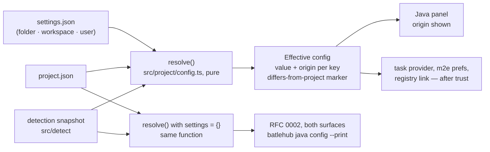
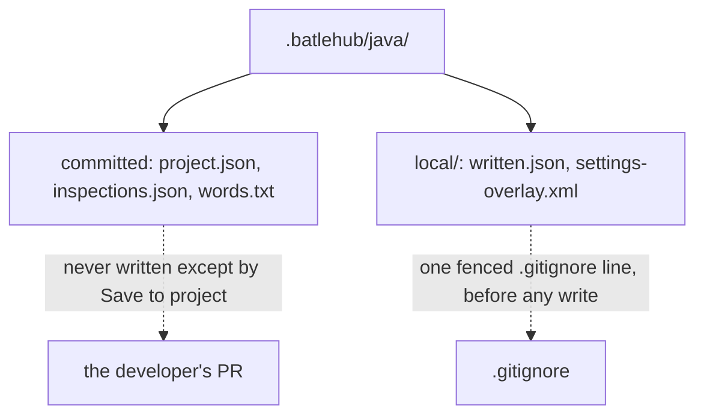
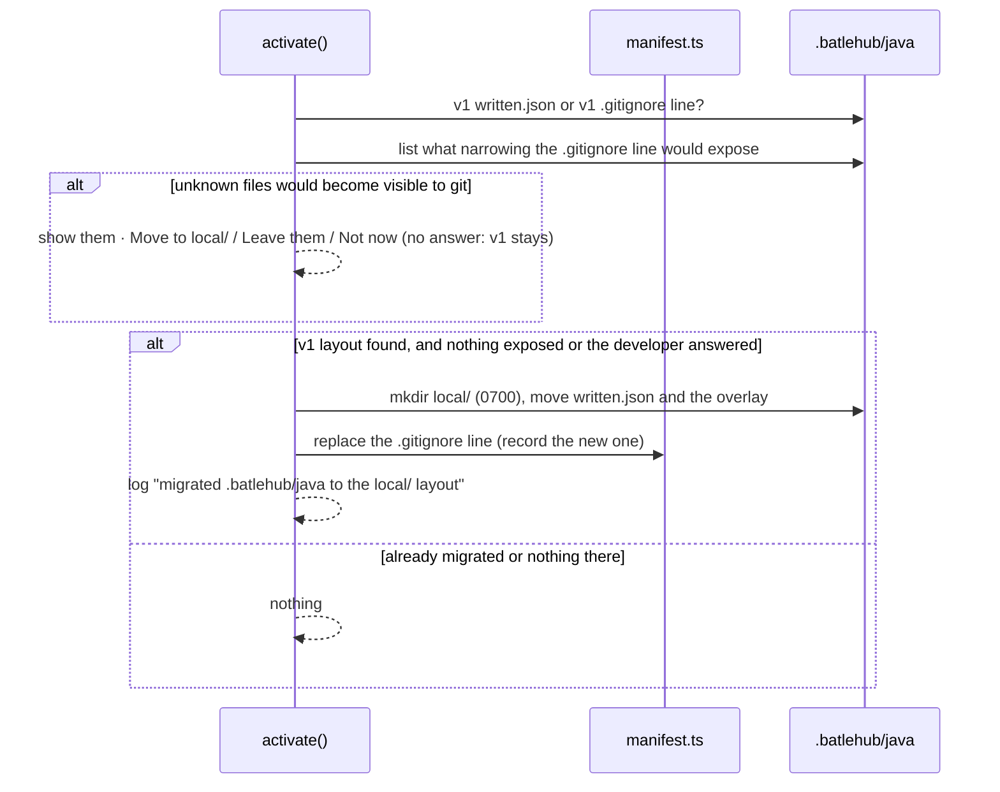

# RFC 0006 — Shared project configuration under .batlehub/java

| Field       | Value                                                        |
| ----------- | ------------------------------------------------------------ |
| Status      | Draft                                                         |
| Short       | Project config                                                |
| Settles     | Everything under .batlehub/java/: schema, precedence with settings.json, what is committed and what is not (the overlay never is) |
| Closes      | A.12 — project-wide settings shared in the repository, the `.idea` equivalent |
| Author      | Max Batleforc <maxleriche.60@gmail.com>                       |
| Co-author   | —                                                             |
| Created     | 2026-09-18                                                    |
| Revised     | 2026-09-18 — revision 2, after the series was reviewed against its goal (RFC 0001 §7.1): the engine reads only the committed half, through a `resolve()` shared in `packages/java-rules`; editor and CI may differ by design and the RFC says so; the migration lists what narrowing `.gitignore` would expose and asks; a repo-supplied `settingsFile` warns once; m2e prefs are applied only after trust; one validator, checked against the schema in `lint` |
| Supersedes  | —                                                             |
| Depends on  | RFC 0001 (the core, its settings of §4.1, the manifest and the overlay of §4.2); consumed by RFC 0005 (inspection profiles), RFC 0013 (spell checking) and RFC 0002 (the headless engine reads the same files) |
| Touches     | `packages/java-rules` (the pure `project-config.ts`, shared with RFC 0002's engine), `extensions/java-core/src/project/` (new `config.ts`), `src/written.ts` (the `.gitignore` line), `src/manifest.ts`, `src/build/maven/overlay.ts`, `src/panel/`, `schema/`, `tests/heavy/java.mjs`, `docs/guide/java/` |

---

## 1. Summary

RFC 0001 revision 3 dropped the `.batlehub/java/*.toml` files: nothing in v1
needed a file that `settings.json` did not already give. Two things now do.
The engine of RFC 0002 — the command line in CI and the tools an agent calls
in the live editor — reads no `settings.json`, by decision (RFC 0002 decision
10: personal in the editor, attacker-written in a fresh clone), and it must
report under the same Maven profiles, the same Maven configuration and the
same inspection profile the team agreed on. **The trigger holds**: agents
driving the IDE are in the series' goal (RFC 0001 §7.1, Appendix A.13), RFC
0002 is step 10 of the order of work and this RFC is step 11, the file RFC
0002 reads. And the inspection profile of RFC 0005 and the dictionary of RFC
0013 are not settings at all: they are files a team commits and reviews.

This RFC defines the directory once: `.batlehub/java/` is the committed,
team-owned configuration of a Java workspace, read by the editor and by the
engine from the same JSON files under one JSON Schema; `.batlehub/java/local/`
is the machine-owned half — the manifest and the Maven overlay — and is the
only part the family gitignores. Workspace `settings.json` keeps winning over
the committed files **in the editor**, because the editor is the
developer's, and detection keeps filling whatever neither names. The engine
reads only the committed half. The editor and CI can therefore differ, **by
design**; §4.2 says what makes that visible.

### Before / after

```text
# today
.batlehub/java/                 gitignored entirely (the overlay may carry credentials)
  written.json                  the manifest
  settings-overlay.xml          the Maven overlay, 0600
.vscode/settings.json           "batlehub.java.maven.activeProfiles": ["dev"]   ← the only shared place, editor-only

# with this RFC
.batlehub/java/                 committed
  project.json                  { "$schema": …, "maven": { "activeProfiles": ["dev"], "configuration": "corp" } }
  inspections.json              RFC 0005
  local/                        gitignored (one fenced line the core owns)
    written.json
    settings-overlay.xml
$ batlehub java config --print          # RFC 0002 reads the committed files and nothing else, no editor
```

---

## 2. Motivation

1. **CI cannot read `settings.json`, and must not.** The engine of RFC 0002 is
   the point of the bundle's delegates outside the developer's hands; on the
   command line it has no `vscode.workspace.getConfiguration`, and a committed
   `.vscode/settings.json` is whatever the repository's author wrote. Today
   the active Maven profiles and the severity overrides live only in
   `batlehub.java.*` keys, so the engine would either re-implement VS Code's
   settings resolution (user, workspace, folder, language scopes) or run
   something different from what the developer sees. Neither is acceptable for
   a gate.
2. **Some configuration is a file, not a key.** An inspection profile with a
   rationale per disabled rule (RFC 0005) and a project dictionary (RFC 0013)
   are reviewed in pull requests line by line. Encoding them as a JSON object
   inside `settings.json` makes every review a diff of one long line and
   mixes them with `editor.fontSize`.
3. **The directory already exists and already has a rule that forbids
   committing it.** `src/written.ts` adds `/.batlehub/java/` to the
   workspace's `.gitignore` before the overlay is written, because the
   overlay carries credentials (RFC 0001 §4.2, §7). A committed file under
   that directory is impossible until the secret-bearing files move. This
   RFC has to move them, and has to do it without breaking `Java: Remove
   BatleHub settings` on a workspace that has the old line.
4. **Satellites will want their own keys.** `java-groovy` has none yet;
   Kotlin (RFC 0008) and Spring Boot (RFC 0010) will. Without a schema each
   satellite invents a file; with one, they contribute a section.

### 2.1 Use cases

1. **A team pins the profile.** A repository has `.batlehub/java/project.json`
   with `"maven": { "activeProfiles": ["dev"] }` committed and no
   `batlehub.java.*` key in `.vscode/settings.json`. A developer clones it and
   opens it in a workspace with `mise` JDKs. Proof: the `BatleHub Java`
   channel logs `project.json: maven.activeProfiles=["dev"] (committed)`; the
   Profiles tab shows `dev` with origin `project.json`; the `maven-multi`
   fixture's `core` module gets `activeProfiles=dev` in
   `.settings/org.eclipse.m2e.core.prefs` without anyone running a command
   — **once the workspace is trusted**: before trust the tab shows `dev`
   with origin `project.json (untrusted, not applied)` and the prefs file
   does not exist;
   `getClasspaths` returns `commons-lang3` (the spike (a) assertion of RFC
   0001, reached from the file instead of the driver's write).
2. **A developer overrides locally and sees who wins.** Same repository; the
   developer writes `"batlehub.java.maven.activeProfiles": ["dev", "fast"]`
   into `.vscode/settings.json`. Proof: the Profiles tab shows `dev, fast`
   with origin `set by you (settings.json) — differs from project: dev`;
   the task provider's `-P` argument is `dev,fast`; nothing under
   `.batlehub/java/` is modified (its git status stays clean); `batlehub
   java config --print` still says `["dev"]` — the difference is by design,
   and the marker is how the developer knows.
3. **A malformed file degrades one key, not the workspace.** `project.json`
   has `"maven": { "activeProfiles": "dev" }` (a string where the schema
   says an array). Proof: a Problems-panel row on `project.json` at that
   line, source `batlehub`, message `maven.activeProfiles: expected an array
   of profile ids`; the Build tab shows a warning banner `project.json has 1
   error`; detection still runs and the JDK, the Maven configuration and
   every other key behave as if the file did not name them.
4. **The overlay never lands in the committed half.** A developer runs
   `Java: Maven: apply the profiles through a settings overlay` in a
   repository whose `.gitignore` is read-only (`chmod 444`). Proof: the
   command refuses with `cannot add the .batlehub/java/local/ line to
   .gitignore: EACCES — the overlay carries credentials and is not written`;
   `.batlehub/java/local/` does not exist; `.batlehub/java/project.json` is
   untouched. With a writable `.gitignore`: the line
   `/.batlehub/java/local/  # batlehub-java: …` is present, the overlay is
   `0600` under `local/`, and `git status --ignored` lists only `local/`.
5. **An old workspace migrates on first activation.** A workspace has the
   v1 line `/.batlehub/java/` in `.gitignore` and `written.json` at
   `.batlehub/java/written.json`. Proof: after activation, the manifest is
   at `.batlehub/java/local/written.json` with its entries intact, the
   `.gitignore` carries the `local/` line and no longer the old one, and
   `Java: Remove BatleHub settings` lists the same restorations it listed
   before the migration and ends with a clean workspace.
6. **The engine reads the same answer.** With use case 1's repository,
   `batlehub java config --print` (RFC 0002) outputs the configuration
   with `"maven": { "activeProfiles": ["dev"] }` and `"origin":
   "project.json"`, byte-identical to the `project` view that the editor's
   `Java: Show effective configuration` command writes to the channel. In
   use case 2's repository the two differ on that key, and the editor's
   output says so (`"differsFromProject": true`).
7. **The migration exposes nothing silently.** Same as use case 5, but
   `.batlehub/java/` also holds `settings-corp.xml`, a file the developer
   copied there because the whole directory was ignored. Proof: nothing is
   moved and no line is replaced at activation; a notification lists
   `settings-corp.xml` as "would become visible to git" with `Move to
   local/ and continue`, `Leave it and continue`, `Not now`; `Not now`
   leaves the v1 layout working; `Move…` ends as use case 5 with the file
   under `local/` and `git status` showing nothing new.
8. **A repository steers the credentials, the developer is told.**
   `project.json` commits `"maven": { "configurations": [{ "name": "corp",
   "settingsFile": "~/.m2/settings-other.xml" }], "configuration": "corp"
   }`; the developer's own configuration uses `~/.m2/settings.xml`.
   Proof: in a trusted workspace, one warning the first time — `this
   repository selects ~/.m2/settings-other.xml for Maven (yours:
   ~/.m2/settings.xml): the credentials in that file will be used` — with
   `Use it` and `Keep mine`; the answer is remembered per workspace and
   value; before trust nothing is shown and nothing is applied.

---

## 3. Goals / non-goals

**Goals**

- One directory, one schema, two halves: committed `.batlehub/java/*.json`,
  machine-local `.batlehub/java/local/`.
- The editor and the engine resolve configuration through the same pure
  function (`packages/java-rules`, one description, not two) and can print
  it; the engine feeds it the committed half and no settings layer.
- Where the editor and the project differ, the developer sees it, and
  agents and CI report under the project's values.
- Every key in `project.json` has an origin the panel shows, exactly as
  detected and overridden keys do today.
- A broken file is one Problems row per error, never a silent fallback and
  never a disabled extension.
- The migration from the v1 layout is automatic when it exposes nothing,
  asks when it would, and is idempotent and recorded in the manifest.

**Non-goals**

- Moving taste keys (`generate.*`, `log.level`, `statusBar.items`) into the
  file: they are per developer, `settings.json` is where VS Code users
  expect them, and the engine does not need them.
- A TOML or YAML variant. JSON with comments is what the editor validates
  natively through `contributes.jsonValidation`; revision 3 of RFC 0001
  already dropped the TOML files, and this RFC does not bring them back.
- Reading `.idea/` or any IntelliJ file: RFC 0007.
- Hot-reload semantics beyond "a change to a file under `.batlehub/java/`
  triggers a re-detection of that domain": the same rule the Detect
  buttons follow.
- Encrypting anything under `local/`: it is gitignored and `0600`; a
  secret store is BatleHub RFC 0011's job, not a workspace file's.

---

## 4. User-facing design

### 4.1 Configuration

The directory, with its owner and its git status:

| Path | Owner | Committed | Written by |
| --- | --- | --- | --- |
| `.batlehub/java/project.json` | the team | yes | the developer, or the panel's `Save to project` |
| `.batlehub/java/inspections.json` | the team | yes | RFC 0005 |
| `.batlehub/java/words.txt` | the team | yes | RFC 0013, if that RFC chooses a file |
| `.batlehub/java/local/written.json` | the core | never | `src/manifest.ts` |
| `.batlehub/java/local/settings-overlay.xml` | the core | never | `src/build/maven/overlay.ts` |

`project.json`, complete for this RFC:

```jsonc
{
  "$schema": "https://batlehub.dev/schema/java-project.schema.json", // shipped in the VSIX too
  "version": 1,
  "jdk": {
    "requirement": "21"            // overrides what pom.xml / build.gradle ask for; absent: the build tool decides
  },
  "maven": {
    "configuration": "corp",       // a name from batlehub.java.maven.configurations, or one declared below
    "configurations": [            // the same shape as the setting; committed ones are usually paths in ~/.m2, not secrets
      { "name": "corp", "settingsFile": "~/.m2/settings-corp.xml" }
    ],
    "activeProfiles": ["dev"]      // -P on every goal and the m2e preference
  },
  "gradle": {
    "activeProfiles": []           // reserved: Gradle has no profiles; kept so the schema does not change shape per tool
  },
  "registry": {
    "enabled": "ask"               // ask | true | false — a team can say "never" for a public repository
  },
  "satellites": {}                 // one object per satellite id, its own schema contributed through the contract
}
```

Every key is optional. Absent means "not said by the team", which is
different from a key set to its default: the panel shows `project.json`
as the origin only for keys the file names.

The schema is contributed by `java-core` (`contributes.jsonValidation` for
`.batlehub/java/project.json`), so completion, hover and red squiggles are
the editor's own. There is **one validator**: the walker of §6.1 that the
editor and RFC 0002's engine both run is generated from — or, where it
stays hand-written, checked key by key against — this JSON Schema in the
`lint` job of RFC 0001 §13, which also checks the schema matches this
section. A key the schema has and the walker lacks, or the reverse, fails
`lint`.

### 4.2 Behaviour rules

- **Precedence in the editor**, highest first: workspace-folder
  `settings.json`, workspace `settings.json`, user `settings.json`,
  `project.json`, detection. The editor is the developer's; a committed
  file is the team's default, not a lock.
- **The engine reads only the committed half.** `resolve()` is called with
  an empty settings layer on both of RFC 0002's surfaces: `project.json`,
  then detection.
- **So the editor and CI can differ, by design.** A developer with
  `activeProfiles: ["dev", "fast"]` in `settings.json` builds something CI
  does not. This RFC does not pretend otherwise. The mitigation is two
  things: every key whose settings value changes a `project.json` value
  carries a **differs from project** marker in the panel (`set by you
  (settings.json) — differs from project: dev`), so a developer who forgot
  a local override finds out from the origin, not from a build; and the
  agent and CI surfaces use the project values, so what is reported,
  gated and reviewed is the team's configuration, never one person's.
- **Applying waits for trust.** Reading and showing `project.json` needs
  no trust. *Applying* it does: handing a value to anything that runs or
  configures a tool — the task provider's `-P`/`-s`, the registry link,
  and **writing the m2e preferences** (`.settings/org.eclipse.m2e.core.prefs`),
  which steers what the language server's import resolves — happens only
  in a trusted workspace (RFC 0001 §7.1, the gate is the editor's).
- **A repo-supplied `settingsFile` is allowed, and announced.** A committed
  `maven.configurations[].settingsFile` chooses which `settings.xml`, and
  so which credentials, Maven uses. The first time a repo-supplied value
  differs from the developer's own (their setting, or the detected
  default), in a trusted workspace only, the core shows one warning naming
  both files, with `Use it` / `Keep mine`; the answer is remembered per
  workspace and value in the extension's own storage. Before trust the
  value is not applied and nothing is asked.
- **Detection still fills the gaps.** `project.json` naming
  `maven.configuration: "corp"` with no `configurations` entry of that name,
  neither in the file nor in the settings, is resolved against the detected
  `~/.m2/settings*.xml` list exactly as the setting is today.
- **Each domain re-reads on change.** A save under `.batlehub/java/` fires
  the same re-detection the domain's `Detect` button fires; nothing else is
  watched.
- **`Save to project`** on a panel tab writes the tab's current values into
  `project.json` (creating it with `$schema` and `version`), through
  `jsonc-parser` edits so comments and unknown keys survive, exactly as
  `launch.json` is edited (RFC 0001 §4.2, feedback 6). It is the only write
  the core makes into the committed half, it is explicit, and it never
  touches `local/`.
- **`local/` is created on demand** with mode `0700`, its files `0600`,
  after the `.gitignore` line — the overlay rule of RFC 0001 §4.2, moved
  one directory down. The `.gitignore` line the family owns becomes
  `/.batlehub/java/local/  # batlehub-java: the Maven overlay carries credentials`.
- **Migration.** On activation, if `.batlehub/java/written.json` exists at the
  v1 path or the v1 `.gitignore` line is present: **first list** every file
  under `.batlehub/java/` that narrowing the line from `/.batlehub/java/` to
  `/.batlehub/java/local/` would make visible to git and that is not one of
  the known committed files of §4.1. The old line hid the whole directory, and
  people put things where git does not look. If the list is empty: move the
  manifest to `local/`, move an overlay if one exists, replace the line. If it
  is not: **refuse or ask** — show the files, offer `Move to local/ and
  continue`, `Leave them and continue`, `Not now`; nothing is moved, deleted
  or exposed without that answer, and where no question can be asked
  (untrusted, no UI) the v1 layout stays. The migration is itself recorded in
  the manifest as a `gitignore` entry for the new line (the old line is
  removed rather than recorded, since the old manifest already holds its
  entry), so `Remove BatleHub settings` ends clean on both layouts.
- **`Java: Show effective configuration`** writes two objects to the
  `BatleHub Java` channel, as JSON: `effective` (the editor's merge, an
  origin per key, `differsFromProject` where it applies) and `project`
  (the same `resolve()` with no settings layer). The driver reads them;
  RFC 0002's `batlehub java config --print` emits the `project` object,
  byte for byte.

### 4.3 Validation

Hard errors (notification, feature disabled until fixed):

| Condition | Rationale |
| --- | --- |
| `.gitignore` cannot receive the `local/` line while a write into `local/` is needed | RFC 0001 §4.2's rule unchanged: a secret-bearing file with no guarantee it stays out of the repository is not written |
| `project.json` is not JSON at all (parse error) | there is no partial reading of a file that does not parse; the whole file is treated as absent, one Problems row at the parse position |

Warnings (Problems panel row on the file, source `batlehub`; a banner on the panel tab):

| Condition | Behaviour |
| --- | --- |
| a key fails the schema (wrong type, unknown enum value) | that key is treated as absent; every other key applies |
| `version` is newer than the core knows | the file is read for the keys the core knows; the banner names the versions |
| `maven.configuration` names nothing in the file, the settings or the detected list | detection's default applies; the Build tab says which name was not found |
| a `satellites.<id>` section for a satellite that is not installed | kept, ignored, one info row: the file is the team's, the satellite may be installed later |
| the v1 `.gitignore` line is present and cannot be replaced | the migration is skipped, the v1 layout keeps working, the banner asks for a writable `.gitignore` |
| narrowing the v1 line would make unknown files under `.batlehub/java/` visible to git | the migration waits for an answer (§4.2); the files are listed, nothing moves silently, the v1 layout keeps working meanwhile |
| a repo-supplied `maven.configurations[].settingsFile` differs from the developer's own (trusted workspace, first time) | one warning naming both files, `Use it` / `Keep mine`, remembered per workspace and value |
| a repo-supplied `settingsFile` names a file that does not exist on this machine | detection's default applies; the Build tab says which file was not found (CI: RFC 0002 prints the same line and uses its default) |

---

## 5. Architecture

### 5.1 One resolver, two callers



`resolve()` takes three plain objects and returns one; it imports nothing
from `vscode`, so it is unit-tested under vitest and lives in
`packages/java-rules`, the shared package of RFC 0002 decision 7 — one
description the extension and the engine both import, not a copy compiled
into each. The invariant the design protects: **there is exactly one place
that knows the precedence**, and both callers print it. The engine passes
an empty settings layer, so the two outputs differ exactly where a
developer's setting overrides the project — by design (§4.2) — and nowhere
else. Any other disagreement means one of them is not calling `resolve()`.

### 5.2 Two halves, one directory



The reason for the split rather than a second directory (`.batlehub/java-local/`)
is `Remove BatleHub settings`: everything the family created on this machine
is under one path, and deleting `local/` after the replay is the whole
clean-up.

### 5.3 Migration from the v1 layout



---

## 6. Detailed design

### 6.1 `packages/java-rules/project-config.ts` (new, pure; re-exported by `extensions/java-core/src/project/config.ts`)

- `interface ProjectFile` — the shape of §4.1, every field optional;
  `parseProjectFile(text)` → `{ file, errors: { path, line, message }[] }`
  through `jsonc-parser`'s `parseTree`, so error positions are real lines.
  Schema checking is a small walk over the known keys (types and enums),
  not a JSON Schema library at runtime: the file has under twenty keys.
  It is **the one validator** — the editor's Problems rows and the
  engine's stderr lines come from it — and it cannot drift from the
  schema: `scripts/project-schema-walker.mjs` generates its key table from
  `schema/java-project.schema.json`, and `lint` fails when the generated
  table and the committed one differ.
- `resolve(settings, file, detected)` → `Effective`, a map of key →
  `{ value, origin: "settings" | "project.json" | "detected" | "default",
  project?, differsFromProject? }`. The precedence of §4.2 is the only
  logic here; the engine calls it with `settings = {}`.
- `saveToProject(text, patch)` → new text, via `jsonc-parser`'s
  `modify`/`applyEdits`, the `launch.json` path of `src/run/configs.ts`
  reused.

### 6.2 `src/config.ts` and the callers

- `readSettings()` is unchanged. A new `effective(folder)` in
  `src/project/config.ts`'s editor-side sibling reads `project.json`, calls
  `resolve()` with `readSettings()` and the detection snapshot, and caches
  until a change event. It also carries the trust bit: before trust, the
  readers below that *apply* a value (`tasks.ts`, `m2e.ts`, `link.ts`) get the
  effective value without the `project.json` layer, and the panel still shows
  it as `untrusted, not applied`. The Profiles tab, `src/build/tasks.ts`
  (`-P`, `-s`), `src/build/maven/m2e.ts` and `src/registry/link.ts` switch
  from `readSettings().mavenActiveProfiles` (and the like) to the effective
  value. That is the whole call-site change: four readers.

### 6.3 `src/written.ts`, `src/manifest.ts`, `src/build/maven/overlay.ts`

- `GITIGNORE_LINE` becomes the `local/` line; `V1_GITIGNORE_LINE` is kept
  for the migration and for `removeGitignoreLine` on old workspaces.
- `manifestPath()` returns `<root>/.batlehub/java/local/written.json`;
  `migrateV1Layout()` runs once at activation (§5.3). Its first step,
  `wouldExpose(root)`, is pure over a directory listing: every path under
  `.batlehub/java/` minus the known committed files, the known local files
  and `local/` itself. A non-empty result stops the migration until the
  developer answers; a file moved on `Move to local/` is recorded in the
  manifest with its previous path.
- `src/build/maven/m2e.ts` writes the prefs only when the workspace is
  trusted; the write stays in the manifest as today.
- `src/build/maven/configs.ts` (the named configurations): the
  repo-supplied-`settingsFile` warning, once per workspace and value.
- The overlay path moves under `local/`; `overlayOf()` is untouched.

### 6.4 `src/panel/`

- Every tab that shows an origin gains the `project.json` origin string and
  the `set by you (settings.json), project.json says …` form.
- `Save to project` button on the JDK, Build and Profiles tabs.
- A banner per tab when `parseProjectFile` returned errors for that tab's
  keys.

### 6.5 `schema/java-project.schema.json`, `package.json`

- The JSON Schema, contributed through `contributes.jsonValidation` with
  `fileMatch: [".batlehub/java/project.json"]`; copied into the docs site
  so the `$schema` URL resolves.
- `scripts/check-settings-doc.mjs` gains the schema ↔ §4.1 comparison, and
  `scripts/project-schema-walker.mjs` the schema ↔ walker one (§6.1); both
  run in `lint`.

### 6.6 `tests/heavy/java.mjs`

- The six use cases of §2.1 as steps after `SPIKE-A-OK`: `PROJECT-FILE-OK`,
  `PROJECT-OVERRIDE-OK`, `PROJECT-INVALID-OK`, `LOCAL-GUARD-OK`,
  `MIGRATE-OK`, then `MIGRATE-ASK-OK` (use case 7) and
  `SETTINGSFILE-WARN-OK` (use case 8); `PROJECT-FILE-OK` asserts the
  untrusted state first. Use case 6 waits for RFC 0002's engine.

**Deliberately untouched**, so reviewers do not go looking:

- `extensions/java-core/src/inspections/*` — the profile file is RFC 0005's;
  this RFC only reserves its name and its half.
- `extensions/batlehub-vsx` — the registry credential stays where RFC 0001
  decision 38 put it; `project.json` carries `registry.enabled`, never a URL
  with a token and never a token.
- `contract.ts` / `api.d.ts` — this RFC defines no contract version. A
  satellite's `satellites.<id>` section needs member `projectConfig(id)` —
  [RFC 0001 §5.2 contract changelog](/rfc/0001-java-env#contract-changelog),
  the one place the contract's next version is written.

---

## 7. Security considerations

- **The committed half is attacker-controlled input.** A cloned repository's
  `project.json` is written by whoever wrote the repository. Every value in
  it is data the core already accepts from `settings.json`: profile ids
  (passed as one `-P` argument, never through a shell), configuration
  names (matched against a list, never used as a path), a settings-file
  path (resolved under `~` and checked to exist, as the setting is), an
  `enabled` enum. There is no key that names a command, a URL the core would
  fetch, or a JDK path the core would execute — `jdk.requirement` is a
  version string matched against detected runtimes. Anything else fails
  the schema and is treated as absent (§4.3).
- **Trust gates it like everything else.** RFC 0001 decision 40 and §7.1:
  nothing runs before the workspace is trusted, and `project.json` is read
  but not *applied* until then. Applying includes more than spawning:
  **writing the m2e preferences from `project.json` counts as applying**,
  because the prefs steer which profiles — and so which repositories and
  dependencies — the language server's import resolves. Before trust the
  panel shows the value with `untrusted, not applied` and no prefs file is
  written.
- **A committed `settingsFile` steers credentials.** It cannot name a
  secret, but it chooses which of the developer's `settings.xml` files —
  which servers and tokens — Maven uses for this repository's builds. It
  stays allowed (a team with a `settings-corp.xml` convention needs it)
  and is never silent: one warning the first time a repo-supplied value
  differs from the developer's own, in a trusted workspace only, with
  `Keep mine` as an answer. The path is still resolved under `~`, checked
  to exist, and passed as one `-s` argument.
- **The engine has one input.** It reads the committed half and no
  `settings.json` (RFC 0002 §7). The cost is stated in §4.2: the editor
  can differ from CI. The marker and the project-valued agent and CI
  surfaces are the mitigation; a lock in the editor was rejected (§8).
- **The secret-bearing files move, the rule does not.** The overlay and
  the manifest are under `local/`, `0600`, behind the `.gitignore` line
  written first or the write refused. The migration cannot expose an
  overlay: it moves a file that was already ignored under a line that
  ignored more, and replaces the line in the same activation, before any
  other write.
- **Narrowing an ignore line can expose what it hid.** `/.batlehub/java/`
  ignored the whole directory, so a developer may have parked a
  `settings.xml` copy or a note with a token there. Before narrowing, the
  core lists every file that would become visible to git and is not a
  known committed file, shows them, and moves nothing silently: it asks,
  or where it cannot ask it refuses and the v1 layout stays. The core
  never reads those files' content.
- **`Save to project` writes only what the tab shows**, never a credential
  (the registry link's token is not a panel value) and never `local/`.

### Red lines

- **Every write is in the manifest.** This RFC writes: the `.gitignore`
  line (a `gitignore` entry, the old line removed through the old entry),
  `local/` and its modes (`0700`, files `0600`), any file the migration
  moves on the developer's answer (with its previous path), the m2e
  preferences (as today, now only after trust), and `Save to project`'s
  patch to `project.json` (the keys written and what they replaced;
  removal puts back what is still as written). All in the core's one
  manifest, which itself lives under `local/`; `Java: Remove BatleHub
  settings` replays it and deletes `local/`. A `project.json` a person
  edits is source under git.
- **The token is the core's.** `project.json` has no key able to hold a
  credential, and the schema refuses one. The overlay, which carries
  credentials, stays written by the core alone, `0600`, under `local/`,
  behind the `.gitignore` line or not at all. A committed `settingsFile`
  selects among the developer's own credential files and is announced
  (above); a satellite reads its section through `projectConfig(id)` and
  never sees a credential there.
- **Memory.** None: no process is started by this RFC.
- **Defaults crossed.** None. The m2e preference is a workspace-scope file
  of another tool, written through the manifest after trust, as RFC 0001
  decision 14 already has it; nothing is downloaded; nothing leaves the
  machine.

---

## 8. Alternatives considered

| Alternative | Why rejected |
| --- | --- |
| Keep everything in `.vscode/settings.json` and teach the engine to read it | The engine would carry a partial reimplementation of VS Code's scope resolution and still miss user-level settings; the profile of RFC 0005 would be a one-line diff in reviews. |
| TOML files (RFC 0001 revision 1's `.batlehub/java/*.toml`) | No native validation in the editor (a TOML extension would be a dependency), no `jsonc-parser` round trip; JSON with comments gets schema completion for free through `jsonValidation`. |
| A second directory for the machine-local files (`.batlehub/java-local/`) | `Remove BatleHub settings` and the `.gitignore` rule become two paths to reason about; `local/` under the same root keeps "everything the family created here" one deletion. |
| Committed files win over `settings.json` | The editor is the developer's, and comfort is the series' target (RFC 0001 §7.1). A team lock is a CI gate (RFC 0002 runs the committed configuration), not a refusal in the editor. The price — editor and CI can differ — is accepted and made visible (§4.2) rather than hidden. |
| The engine reads `settings.json` too, so editor and CI always agree | They would agree on one developer's machine and on none other; and a committed `.vscode/settings.json` is attacker-written in a fresh clone (RFC 0002 decision 10). |
| Migrate the `.gitignore` line unconditionally | The v1 line hid the whole directory; narrowing it can put a parked `settings.xml` copy one `git add .` away from a push. List, show, ask. |
| Forbid `settingsFile` in the committed file | Teams with a per-company `settings-corp.xml` convention need exactly this key; a warning on first difference costs one click and hides nothing. |
| One file per domain (`maven.json`, `jdk.json`) | Six small files for twenty keys; one file with sections is what a reviewer reads in one screen. RFC 0005's profile stays separate because it is long and reviewed on its own. |

---

## 9. Rollout and compatibility

- **Default behaviour** with no `.batlehub/java/project.json`: identical to
  today. The only visible change on an existing workspace is the migration
  of `written.json` and the `.gitignore` line, logged once.
- **Config migration**: §5.3, idempotent, reversible by `Remove BatleHub
  settings`. Automatic when narrowing the `.gitignore` line exposes
  nothing; otherwise the core lists the files that would become visible
  to git and waits for the developer's answer — nothing is moved
  silently, and until then (or on `Not now`, or with no UI to ask in) the
  v1 layout keeps working unchanged.
- **Behaviour a team should know**: `settings.json` wins in the editor and
  is not read in CI, so the two can differ by design; the "differs from
  project" marker is where to look.
- **Operator prerequisites**: none.
- **Rollback**: delete `project.json`; `local/` is handled by the removal
  command. An older `java-core` reading a workspace migrated by a newer one
  finds no manifest at the v1 path and behaves as on a fresh workspace —
  acceptable, since the newer one's removal command is the way back.

---

## 10. Test plan

- **Unit** (`extensions/java-core/test/project-config.test.ts`):
  `parseProjectFile` on the example of §4.1, on each warning of §4.3 with
  the expected line; `resolve()` precedence table (settings over file over
  detection, per key); `saveToProject` preserving comments and unknown keys
  byte-for-byte outside the patch; `migrateV1Layout` on a fixture with the
  v1 line and manifest; `wouldExpose` on a directory with a stray file
  (listed), with only known files (empty); `resolve()` with `settings =
  {}` equals the `project` view; `differsFromProject` per key; the
  generated walker table equals the committed one (the `lint` check, run
  as a test too).
- **Layer 2** (`test-host/`): untrusted workspace — `project.json` shown,
  no m2e prefs file written, no `settingsFile` warning; trusted — both.
- **Layer 2** (`test-host/`): `Remove BatleHub settings` on a migrated
  workspace ends identical to the pristine copy — the existing assertion,
  now covering `local/`.
- **Heavy** (`tests/heavy/java.mjs`): §6.6.
- **Existing suites** that must pass unchanged: `maven.test.ts` (the overlay
  content), `written.test.ts` (replay), the `java` heavy half's
  `REMOVE-OK`.

---

## 11. Decisions and open questions

### Resolved

| # | Question | Decision |
| --- | --- | --- |
| 1 | Format | **JSON with comments, one schema.** Native validation and completion in the editor; `jsonc-parser` is already a dependency for `launch.json`. |
| 2 | Who wins, the file or `settings.json`? | **`settings.json`, in the editor.** The editor is personal; the team's lock is CI. Revision 2 says the consequence honestly: editor and CI can differ **by design**; the "differs from project" marker, and agent and CI surfaces that use the project values, are the mitigation. |
| 3 | Where do the secret-bearing files go? | **`.batlehub/java/local/`**, the only ignored path, same `.gitignore`-first rule as RFC 0001 §4.2. |
| 4 | Does the core ever write the committed half? | **Only through `Save to project`**, explicit, comment-preserving. Detection never writes it. |
| 5 | Is a broken file fatal? | **No.** A parse error makes the file absent with one Problems row; a schema error makes one key absent. |
| 6 | What does the engine read? (revision 2) | **Only the committed half.** `resolve()` lives in `packages/java-rules` (RFC 0002 decision 7), one description, called with an empty settings layer; the verb is `batlehub java config --print`. |
| 7 | Does this RFC's trigger hold? (revision 2) | **Yes.** RFC 0002 is in the goal — the IDE is driven by the developer and by their agents (RFC 0001 §7.1, A.13) — and is step 10 of the order of work; this RFC is step 11. |
| 8 | Do `maven.configurations` entries belong in a committed file? (was open question 1) | **Allowed, with a warning.** A repo-supplied `settingsFile` steers which credentials Maven uses, so the first time it differs from the developer's own the core says so — in a trusted workspace only — with `Use it` / `Keep mine`. A named file missing on this machine falls back to detection's default, in the editor and in CI alike. |
| 9 | When is `project.json` applied? (revision 2) | **After trust.** Writing the m2e preferences counts as applying, like `-P`, `-s` and the registry link. |
| 10 | How does the migration narrow `.gitignore`? (revision 2) | **List, show, ask.** Files that would become visible to git and are not known committed files are shown; nothing moves silently; no answer means the v1 layout stays. |
| 11 | One validator or two? (revision 2) | **One**: the walker, generated from or checked against the JSON Schema in `lint`. |

### Still open

1. The `satellites.<id>` contract surface: a `projectConfig(id)` accessor
   returning the raw object, or a typed registration of a sub-schema so the
   editor validates satellite sections too. Recommendation: raw object in the
   first phase, sub-schema registration when a second satellite needs it.
   Either way the member is entered in the [RFC 0001 §5.2 contract
   changelog](/rfc/0001-java-env#contract-changelog); it has no row there yet.
2. Whether `Keep mine` on the `settingsFile` warning should also write the
   developer's choice as a workspace setting (visible, reversible, in the
   manifest) rather than into the extension's storage. Recommendation:
   storage first — a setting would itself show as "differs from project".

---

## 12. Implementation phases

| Phase | Content |
| --- | --- |
| 1 | `project-config.ts` pure (in `packages/java-rules` once RFC 0002 phase 1 creates it, in `src/project/` until then): parse, resolve, save; unit tests; the schema file, its `jsonValidation` contribution and the schema ↔ walker check in `lint`. Useful alone: the schema gives completion even before any reader changes. |
| 2 | The `local/` split: `written.ts`, `manifest.ts`, the overlay path, the migration with `wouldExpose` and its question; layer 2's removal assertion extended. |
| 3 | Readers switch to the effective value (tasks, m2e prefs, registry link, Profiles tab), applied only after trust; origins, the "differs from project" marker and `Save to project` in the panel; the repo-supplied `settingsFile` warning; `Java: Show effective configuration` with its `project` view. |
| 4 | Heavy steps of §6.6; docs page `docs/guide/java/project-config.md`, which says in its first screen that the editor and CI can differ and where the marker is. With RFC 0002: `batlehub java config --print` and use case 6. |
