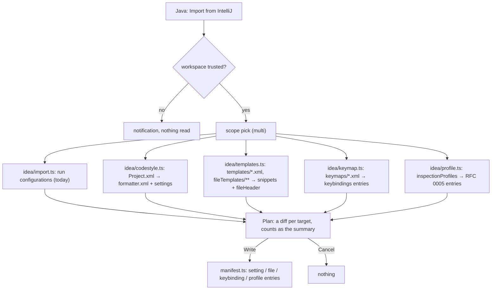
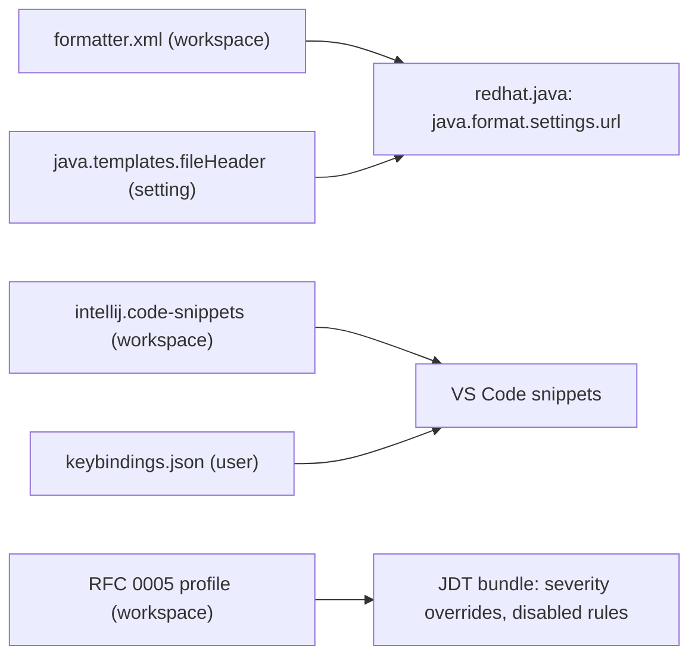

# RFC 0007 — IntelliJ import beyond run configurations

| Field       | Value                                                        |
| ----------- | ------------------------------------------------------------ |
| Status      | Draft                                                         |
| Short       | IntelliJ import                                               |
| Settles     | Beyond phase 4's run configurations: code style, live templates, file templates, keymap customisations, inspection profiles |
| Closes      | A.4, A.12 — the switch itself: what a developer configured in IntelliJ arrives with them |
| Author      | Max Batleforc <maxleriche.60@gmail.com>                       |
| Co-author   | —                                                             |
| Created     | 2026-09-18                                                    |
| Revised     | 2026-09-18 — revision 3, phase 1 built and proven in the real editor (`IMPORT-TRUST-OK`, `IMPORT-PLAN-OK`, `IMPORT-OK`): the trust gate runs before the experimental-flag prompt (that prompt is a write), `[java].editor.detectIndentation` has to be turned off or the indent never moves, and the fixture carries a style that actually changes the file. Revision 2, after the series was reviewed against its goal (RFC 0001 §7.1): the import waits for workspace trust, the plan is a diff of what will be written, keymaps never come from the workspace, the profile target is `inspections.json` |
| Supersedes  | —                                                             |
| Depends on  | RFC 0001 (`src/idea/import.ts`, the `written.json` manifest, the `experimental.intellijImport` flag, the JDT bundle's rule ids); RFC 0005 (the shared inspection profile the imported profile is written as, and — revision 2 — the manifest entry kind of a profile written by a program); `redhat.java` ≥ 1.56.0 (`java.format.settings.url`, `java.templates.fileHeader`, `java.completion.importOrder`) |
| Touches     | `extensions/java-core/src/idea/` (`import.ts` grows a scope picker; new `codestyle.ts`, `templates.ts`, `keymap.ts`, `profile.ts`), `src/manifest.ts` (one new entry kind, `keybinding`; the `profile` kind is RFC 0005's), `package.json` (the command's title, no new setting), `tests/heavy/fixtures/` (an `.idea/` with all five kinds, IDEA golden output), `docs/guide/java/intellij.md` |

---

## 1. Summary

RFC 0001 decision 33 imported run configurations from `.idea/` and nothing
else, because the rest mapped onto settings the core did not yet have. It
has them now: the formatter behind `redhat.java`, a file-header template
setting, workspace snippets, the editor's `keybindings.json`, and — with
RFC 0005 — a shared inspection profile. This RFC extends `Java: Import
from IntelliJ` to five more kinds, each a pure converter from IDEA's XML to
what the editor reads, behind the same `experimental.intellijImport` flag,
with the same rules: **the plan is shown first — as a diff of what will be
written — every write goes through the manifest, `.idea/` is never
modified**, nothing happens before the workspace is trusted, and what cannot
be mapped is listed with the reason rather than approximated silently.

This RFC is third in RFC 0001 §14's order of work, straight after the
Kotlin gate is measured, because it is **the switching aid itself**: the
series is measured by a named developer working a week without opening IDEA
(RFC 0001 §7.1), and the first day of that week is this command.

The mapping is deliberately lossy where the two editors differ, and the
report says exactly where. A team moving from IDEA keeps its formatting,
its `sout`, its license header, its `Alt+Insert` and its disabled
inspections — the five things people say they miss the first week.

### Before / after

```text
# today — Java: Import IntelliJ run configurations
+ Run Main (launch com.acme.app.Main)
- JUnit all [JUnit]: package scope, run it from the Test view

# with this RFC — Java: Import from IntelliJ  (scope: everything, or a pick)
run configurations   + Run Main
code style           → .vscode/batlehub-java/formatter.xml (31 of 38 options), java.format.settings.url,
                       [java] tabSize=4, java.completion.importOrder=[java, javax, org, com, "", "#"]
                       - WRAP_LONG_LINES: no Eclipse equivalent (kept: lineSplit=120)
live templates       → .vscode/intellij.code-snippets: sout, psvm, fori (+9)   - iter: expression iterableVariable()
file templates       → java.templates.fileHeader (File Header.java)           - Class.java: body templates are snippets, prefix file:Class
keymap               → keybindings.json (user): 6 customisations of "Max (IDEA)"   - CompareTwoFiles: no command
inspection profile   → .batlehub/java/inspections.json: 4 rules mapped, 2 disabled with an imported reason   - 212 IDEA inspections without a bundle rule (listed)
Nothing in .idea/ is modified.                  [Show diff]  [Write]  [Cancel]
# [Show diff] — one diff editor per target: current content ↔ what Write would leave
```

---

## 2. Motivation

1. **Formatting is the first conflict of a mixed team.** IDEA's
   `.idea/codeStyles/Project.xml` is committed by most teams; a VS Code
   member formats with JDT.LS's defaults and every save reflows a file.
   `java.format.settings.url` accepts an Eclipse formatter profile, and
   most of IDEA's Java options have an Eclipse counterpart — the file just
   has to be produced.
2. **Live templates are muscle memory.** `sout`, `psvm`, `fori`, `iter` —
   and the team's own — are user-level in IDEA
   (`~/.config/JetBrains/<product>/templates/*.xml`). VS Code snippets
   express the same, minus IDEA's expression functions.
3. **The license header** lives in `.idea/fileTemplates/includes/File
   Header.java` (project-level, committed); `redhat.java` reads exactly
   that from `java.templates.fileHeader`.
4. **Keymap customisations, not the keymap.** The pack recommends
   `k--kato.intellij-idea-keybindings` for the base; what a developer loses
   is the six shortcuts they changed on top of it, stored in
   `keymaps/<name>.xml` as a diff from the parent.
5. **Inspection profiles are the team's quality contract**, committed in
   `.idea/inspectionProfiles/Project_Default.xml`. RFC 0005 gives the bundle
   a shared profile format with a rationale per disabled rule; the IDEA
   profile is the obvious first source of both.

### 2.1 Use cases

Each is an acceptance case for the `java` heavy half (RFC 0001 §10 layer
4) or the host layer; the proof is what the driver asserts. The fixture is
`maven-multi` with an `.idea/` directory carrying all five kinds, and
`Greeter.formatted.java`: the fixture's `Greeter.java` as IDEA 2026.1
formats it with that code style (a golden file produced once in IDEA and
committed).

1. **Code style.** Starting state: `.idea/codeStyles/Project.xml`
   (4 spaces, right margin 120, braces end of line, blank lines after
   package 1, import layout `java, javax, org, com, all other, static`),
   `codeStyleConfig.xml` with `USE_PER_PROJECT_SETTINGS`. Action: `Java:
   Import from IntelliJ` → scope "Code style" → Write. Proof: the plan's
   summary line reads `29 of 30 options mapped` and its diff shows
   `formatter.xml` (empty ↔ the generated profile) and `settings.json`
   (current ↔ with the six keys) before anything is written;
   `settings.json` gains
   `java.format.settings.url` pointing at `.vscode/batlehub-java/formatter.xml`,
   `java.format.settings.profile: "IntelliJ (imported)"`, `[java]` `editor.tabSize`,
   `java.completion.importOrder`; `Format Document` on `Greeter.java`
   yields a buffer equal to `Greeter.formatted.java`; `written.json` has
   one `file` and the `setting` entries.

   **The fixture's committed style is not the one this paragraph opens
   with** (phase 1). A style the fixture's sources are already in — four
   spaces, braces at end of line — leaves `Greeter.java` untouched, so the
   acceptance case would pass just as well against an import that did
   nothing. `tests/heavy/fixtures/maven-multi/.idea/codeStyles/Project.xml`
   therefore carries a two-space, braces-on-the-next-line, 120-column style
   that moves every line of the file. `Greeter.formatted.java` is that file
   as **IDEA 2026.1.3's own headless formatter** (`idea/bin/format.sh`)
   writes it, committed under `.idea/golden/` — not beside `Greeter.java`,
   where `javac` would refuse a public class whose file is not
   `<class>.java` and break the fixture's Maven build.
2. **Live templates.** Starting state: the suite's `HOME` carries
   `.config/JetBrains/IntelliJIdea2026.1/templates/user.xml` with `sout`,
   `psvm`, `fori` (with `$INDEX$`, `$LIMIT$`, `$END$`) and `iter` (an
   `iterableVariable()` expression). Action: scope "Live templates". Proof:
   `.vscode/intellij.code-snippets` exists with three snippets; in
   `Main.java`, typing `sout` then Tab yields `System.out.println();` with
   the cursor inside the parentheses; the plan listed `- iter: expression
   iterableVariable() has no snippet equivalent (placeholder kept)`.
3. **File header.** Starting state: `.idea/fileTemplates/includes/File
   Header.java` with `/* Copyright ${YEAR} Acme */`. Action: scope "File
   templates". Proof: `java.templates.fileHeader` in workspace settings
   equals `["/* Copyright ${year} Acme */"]` (IDEA's `${YEAR}` mapped to
   JDT's `${year}`); `Java: New Java Class` (redhat.java's own) in `app`
   produces a file starting with that comment.
4. **Keymap customisations.** Starting state: `HOME/.config/JetBrains/…/keymaps/Max.xml`
   with `parent="$default"` and `<action id="Generate"><keyboard-shortcut first-keystroke="alt insert"/></action>`, `<action id="RenameElement">…"shift F6"…`.
   Action: scope "Keymap". Proof: the plan lists `keybindings.json (user
   level — removed by Java: Remove BatleHub settings only on its second
   confirmation)` and its diff shows the user file with the entries added;
   with a `keymaps/Evil.xml` committed under the fixture's `.idea/`, no
   entry of it appears in the plan (keymaps are never read from the
   workspace); the user
   `keybindings.json` gains `{ "key": "alt+insert", "command":
   "batlehub.java.generateMenu", "when": "editorLangId == java" }` with a
   marker comment; pressing Alt+Insert in `Person.java` opens the Generate
   quick pick (`GENERATE-KEY-OK`).
5. **Inspection profile.** Starting state: `.idea/inspectionProfiles/Project_Default.xml`
   with `SizeReplaceableByIsEmpty` `enabled="false"`,
   `StringConcatenationInLoop` at `level="ERROR"`. Action: scope
   "Inspections". Proof: `.batlehub/java/inspections.json` gains
   `collections/sizeIsZero` at `off` with the `why` `imported from IntelliJ
   profile "Project Default" (disabled there)` and
   `performance/stringConcatInLoop` at `error`; the Inspections view marks
   the first row **imported** (RFC 0005 revision 2) until a person rewrites
   its reason; the
   Problems panel for `Greeter.java` shows three `batlehub` diagnostics
   instead of RFC 0001's four, `stringConcatInLoop` now an error; the plan
   listed `212 IDEA inspections have no bundle rule` with the ids in the
   channel.
6. **Untouched and reversible.** Proof at the end: sha256 of every file
   under `.idea/` and of the user `templates/` and `keymaps/` equals its
   value before; `Java: Remove BatleHub settings` removes the formatter
   file, the snippets file, the profile entries and the five settings
   (`REMOVE-OK` extended); the keybindings stay until the command's second
   question is answered yes, and then the user file equals its recorded
   previous content.
7. **Blocked before trust.** Starting state: the fixture opened in an
   untrusted window (restricted mode). Action: `Java: Import from
   IntelliJ`. Proof: one notification naming workspace trust with the
   editor's own `Manage Workspace Trust` action; no scope pick, no plan, no
   file read under `.idea/` (the channel has no `import:` line), nothing
   written.

---

## 3. Goals / non-goals

**Goals**

- Five kinds imported from `.idea/` and the user's IDEA config directory
  into what the editor and `redhat.java` read, each through a pure
  converter with a listed loss.
- One command, one plan — reviewable as a diff — one confirmation; the
  flag and the manifest of RFC 0001 unchanged in spirit.
- Formatting fidelity measured against IDEA's own output, not asserted.

**Non-goals**

- **A round trip.** Nothing is written to `.idea/` or to IDEA's config;
  a team keeps IDEA as the source and re-imports.
- **`compiler.xml`, `misc.xml` (project SDK), `modules.xml`, `vcs.xml`.**
  The SDK is RFC 0001's JDK resolution from the build file, which is
  better than `.idea`'s copy of it; modules come from Maven/Gradle.
- **Live template expression functions** (`iterableVariable()`,
  `suggestVariableName()`, `className()` beyond `$TM_FILENAME_BASE`,
  `date()` beyond the `CURRENT_*` variables): placeholders, reported.
- **IDEA inspections without a bundle rule.** RFC 0005's profile lists
  the bundle's rules; an IDEA id with no counterpart is reported, not
  invented. The mapping table grows with the bundle.
- **Keymap import of the whole keymap.** The pack's recommended extension
  is the base; only the diff (`keymaps/<name>.xml`) is imported.
- **A keymap or live template read from the workspace.** Both are
  user-level in IDEA and are read from the user's own config directory, or
  from a directory the user picks *outside* the workspace; a repository
  never reaches user keybindings.
- **Code style for languages other than Java** (`XML`, `Kotlin` sections
  of `Project.xml`): Kotlin is RFC 0008's, the rest is not ours.

---

## 4. User-facing design

### 4.1 Configuration

No new setting. The existing flag gates the command:

```jsonc
"batlehub.java.experimental": { "intellijImport": true }
```

What the import writes, all through the manifest (RFC 0001 §4.2
`written.json`), all at workspace scope unless stated:

| Kind | Writes |
| --- | --- |
| Run configurations | `launch.json` entries (RFC 0001 phase 4, unchanged) |
| Code style | `.vscode/batlehub-java/formatter.xml` (an Eclipse formatter profile, `file` entry); settings `java.format.settings.url`, `java.format.settings.profile`, `java.completion.importOrder`, `java.sources.organizeImports.starThreshold` / `staticStarThreshold`, `[java].editor.tabSize` / `editor.insertSpaces` / **`editor.detectIndentation: false`** |
| Live templates | `.vscode/intellij.code-snippets` (`file` entry) |
| File templates | `java.templates.fileHeader`, `java.templates.typeComment` (settings); other templates → the same snippets file with prefix `file:<name>` |
| Keymap | the **user** `keybindings.json` (`keybinding` entry, a new manifest kind carrying the file's previous content; removed by the remove command on a second confirmation, the plan says so) |
| Inspection profile | `.batlehub/java/inspections.json`, RFC 0005's shared profile (entries with a generated `why`, marked imported; recorded under the manifest entry kind RFC 0005 revision 2 defines for a profile written by a program) |

### 4.2 Behaviour rules

- **Sources.** Project-level: `.idea/codeStyles/{Project.xml,codeStyleConfig.xml}`,
  `.idea/fileTemplates/**`, `.idea/inspectionProfiles/*.xml` (+
  `profiles_settings.xml` for the active one), `.idea/runConfigurations/`
  as today. User-level, only when the scope asks, and **only from outside
  the workspace**: the newest
  `~/.config/JetBrains/<Product><Version>/` (Linux), `~/Library/Application
  Support/JetBrains/…` (macOS), `%APPDATA%\JetBrains\…` (Windows) — its
  `templates/*.xml` and `keymaps/*.xml`. Several products (IDEA, Android
  Studio): the plan lists which was read; a pick if more than one. With no
  such directory (a Che pod has no IDEA), the command offers a directory
  pick; a pick that resolves — symlinks followed — inside any workspace
  folder is refused with the reason. A `keymaps/` or `templates/`
  directory under `.idea/` is never read.
- **Trust is the gate.** In an untrusted workspace the command does one
  thing: a notification naming workspace trust, with the editor's `Manage
  Workspace Trust` action. Nothing under `.idea/` is read and nothing is
  written (RFC 0001 §7.1: the gate is the editor's).
- **Plan first, always, and the plan is a diff.** The modal of RFC 0001's
  import grows sections per kind; each section's summary line keeps the
  mapped/unmapped count, and `Show diff` opens the editor's diff view per
  target — the file's current content (empty when absent) against what
  `Write` would leave, `settings.json` and the user `keybindings.json`
  included. The right-hand side is a virtual document; nothing is on disk
  before `Write`. "Write" applies exactly what the diffs showed, "Cancel"
  writes nothing. A scope quick pick precedes it (multi-select: the five
  kinds plus run configurations, all on by default).
- **Code style mapping** (the table lives in `codestyle.ts`, one row per
  option, tested row by row):

  | IDEA (`Project.xml`) | Eclipse profile / setting |
  | --- | --- |
  | `<indentOptions>` `INDENT_SIZE`, `USE_TAB_CHARACTER`, `CONTINUATION_INDENT_SIZE` | `tabulation.size`, `tabulation.char`, `continuation_indentation`; `[java]` `editor.tabSize`, `editor.insertSpaces` |
  | `RIGHT_MARGIN` | `lineSplit` |
  | `BRACE_STYLE`, `CLASS_BRACE_STYLE`, `METHOD_BRACE_STYLE` (`1` end of line, `2` next line) | `brace_position_for_block/_type_declaration/_method_declaration` |
  | `BLANK_LINES_*` (after package, imports, around class/method/field) | `blank_lines_*` |
  | `SPACE_*` (before parentheses, around operators, after comma) | `insert_space_*`, the thirty that correspond |
  | `KEEP_LINE_BREAKS`, `KEEP_BLANK_LINES_IN_CODE` | `join_wrapped_lines` (inverse), `number_of_empty_lines_to_preserve` |
  | `IMPORT_LAYOUT_TABLE` (`<package name="java" …/>`, `<emptyLine/>`, `<package name="" static="true"/>`) | `java.completion.importOrder` (`#` for static) |
  | `CLASS_COUNT_TO_USE_IMPORT_ON_DEMAND`, `NAMES_COUNT_TO_USE_IMPORT_ON_DEMAND` | `java.sources.organizeImports.starThreshold`, `staticStarThreshold` |
  | `WRAP_LONG_LINES`, `ALIGN_MULTILINE_*`, `METHOD_PARAMETERS_WRAP` | partial: `alignment_for_*` where Eclipse has the same axis; the rest **unmapped, listed** |

  Unmapped options are listed by IDEA name; the Eclipse profile's other
  options keep JDT's defaults (the profile is written complete, so a
  future `redhat.java` default change does not move the team's format).

  **`[java].editor.detectIndentation` must be turned off, or the indent
  half of the import does nothing** (found in phase 1, in the real editor,
  and by nothing else). `editor.detectIndentation` is on by default: the
  editor guesses the width from the file it is about to format and sends
  that in the formatting request, and JDT.LS honours the request over the
  profile's `tabulation.size`. A file already in the team's old style
  therefore keeps it forever, and the import looks like it worked — the
  brace positions and everything else in the profile *do* apply, so only a
  byte-for-byte comparison against IDEA's own output shows the gap. An
  imported style is explicit by definition, so the guessing goes off.
- **Live templates**: `<template name value description>` →
  `{ prefix: name, body: [...], description }`; `$VAR$` → `${n:VAR}` in
  order of first appearance, `$END$` → `$0`, `$SELECTION$` → `$TM_SELECTED_TEXT`;
  `<variable expression="…">` with a default → `${n:default}`;
  `className()` → `$TM_FILENAME_BASE`, `date()` → `$CURRENT_YEAR-$CURRENT_MONTH-$CURRENT_DATE`,
  `user()` → placeholder; anything else → placeholder with the variable
  name, and one report line. `<context>` `JAVA_*` → the snippet file's
  `scope: java`; templates of other contexts are skipped, listed.
- **File templates**: `includes/File Header.java` → `java.templates.fileHeader`
  (lines), `${YEAR}`/`${USER}`/`${NAME}` → `${year}`/`${user}`/`${type_name}`
  (JDT's variables); `Class.java`, `Interface.java`, … → snippets
  `file:Class` etc. with the header include expanded; `${PACKAGE_NAME}` →
  `${TM_DIRECTORY}` is wrong (it is a path), so it becomes a placeholder,
  listed.
- **Keymap**: `<keymap name parent>` — only `<action>` children (the
  diff). `first-keystroke` `"alt insert"` → `"alt+insert"` (IDEA's
  keystroke grammar: modifiers `shift control alt meta`, keys upper-case,
  `second-keystroke` → a chord). Action id → command through a table of
  the sixty IDEA actions that have a VS Code or BatleHub command
  (`Generate` → `batlehub.java.generateMenu`, `RenameElement` →
  `editor.action.rename`, `GotoDeclaration` → `editor.action.revealDefinition`,
  `FindUsages` → `editor.action.goToReferences`, `RunClass` →
  `workbench.action.debug.run`, …); an id outside the table is listed.
  The entry is written to the **user** `keybindings.json` with a
  `// batlehub: imported from IntelliJ keymap "<name>"` comment (jsonc
  edits, the `launch.json` mechanism), `when: "editorLangId == java"` for
  Java-only actions. Conflicts with an existing user binding of the same
  key are listed and **not** written (the user's own wins). A key an
  installed extension binds by default (`contributes.keybindings` of every
  extension, the recommended keymap included) is checked too: the entry is
  written — the user asked for it — and the plan names the default it
  shadows.
- **Inspection profile**: `<inspection_tool class enabled level>` → RFC
  0005 entries through a table `IDEA id → bundle rule id` (§6.5); `level`
  `ERROR`/`WARNING`/`WEAK WARNING`/`INFORMATION` → `error`/`warning`/
  `info`/`hint`; `enabled="false"` → `off` with the `why` RFC 0005
  requires, generated: `imported from IntelliJ profile "<name>" (disabled there)`. RFC 0005 accepts the generated reason and **marks the row as
  imported** in the Inspections view — a reason nobody wrote is shown as
  one. The target is `.batlehub/java/inspections.json`.
  `profiles_settings.xml` picks the active profile; several profiles → a
  pick. Ids without a rule: counted in the plan, listed in the channel.
- **Re-import** replaces what the previous import wrote (by manifest
  entry) and leaves the user's own edits to the same files where they do
  not collide; a collision (the user edited the formatter file) is a
  question in the plan: overwrite or keep.

### 4.3 Validation

Hard errors (notification, that kind skipped, the others proceed):

| Condition | Rationale |
| --- | --- |
| `Project.xml` present but `codeStyleConfig.xml` says `USE_PER_PROJECT_SETTINGS=false` | IDEA itself ignores the project style; importing it would enforce a style the IDEA users do not see |
| an XML that does not parse | half a profile is wrong in ways the report cannot describe |
| `redhat.java` below 1.56.0 (already RFC 0001 §4.3's hard error) | the settings targeted do not exist |
| the workspace is not trusted | the whole command stops, not one kind: `.idea/` is workspace-controlled input and every target changes behaviour (RFC 0001 §7.1) |
| the picked IDEA config directory resolves inside a workspace folder | a repository must not supply keybindings or user templates |

Warnings (in the plan and the channel `BatleHub Java`):

| Condition | Behaviour |
| --- | --- |
| an option, template, action or inspection without a mapping | listed with its IDEA name and the reason; the rest of the kind proceeds |
| several IDEA products / versions in the config directory | the newest by directory mtime is read; the plan names it; a pick when the scope is chosen by hand |
| a keymap whose `parent` is not `$default` or a known base (`Eclipse`, `NetBeans`) | imported as a diff anyway; the plan notes that the base differs from the recommended extension's |
| a user binding already on the imported key | the import entry is skipped and listed |
| an extension's default binding on the imported key | written; the plan names the shadowed command and its extension |

---

## 5. Architecture

### 5.1 One command, five converters



The invariant: **every converter is `(xml: string) → { out, skipped[] }`,
pure, and writes nothing.** `import.ts` is the only module that touches
the file system, and it does so through the manifest. `.idea/` and the
IDEA config directory are opened read-only; there is no code path that
writes under either.

### 5.2 Where the outputs land



---

## 6. Detailed design

### 6.1 `src/idea/import.ts`

- `importIdea()` gains the scope pick; `plan()` returns
  `{ runs: ImportPlan, codestyle?, templates?, keymap?, profile? }`; the
  modal text is built per kind (`+`/`-` lines as today, a header line per
  kind with counts). `importIdea()` returns at once when
  `workspace.isTrusted` is false. **The gate is `requireTrust()`, and the
  command calls it before the `experimental.intellijImport` prompt**, not
  after: that prompt offers to turn the flag on, and turning it on writes a
  workspace setting. A gate that lets a write happen ahead of it is not a
  gate — found in phase 1, where the flag check stood first because the
  command predates this RFC. `planDiffs(plan): { target, before,
  after }[]` is pure; the command serves `after` through a
  `TextDocumentContentProvider` and opens `vscode.diff` per target.
  `writePlan()` writes those same `after` strings through `Manifest` with one
  `at` timestamp for the whole import, so `Remove BatleHub settings`
  undoes it as one.
- `readIdeaConfigDir(home, platform): string | undefined` — the newest
  product directory (§4.2); pure over a directory listing.
  `outsideWorkspace(realPath, folders): boolean` — the check a picked
  directory passes, pure.

### 6.2 `src/idea/codestyle.ts` — pure

- `parseProjectXml(xml): Record<string, string>` (the `<option name value>` and `<indentOptions>` of the `JavaCodeStyleSettings` /
  `codeStyleSettings` components).
- `MAPPING: { idea: string; eclipse?: string; setting?: string; convert(v): string }[]`
  — the table of §4.2, one row per option.
- `toEclipseProfile(opts, defaults): string` — a complete Eclipse
  `<profiles><profile kind="CodeFormatterProfile" name="IntelliJ (imported)">…`
  document: JDT's defaults (a committed `eclipse-defaults.json`, 300
  keys, extracted from `org.eclipse.jdt.core` of the pinned VSIX — the
  jars `jdt/deps.sh` installs — and regenerated with every bump of the
  `redhat.java` minimum, §9) overlaid with the mapped values.
- `importOrder(layoutTable): string[]`, `settings(opts): Record<string, unknown>`.

### 6.3 `src/idea/templates.ts` — pure

- `parseLiveTemplates(xml): Template[]`, `toSnippet(t): { prefix, body, description, scope } | { skipped }`
  with the variable rules of §4.2; `parseFileTemplate(name, text)` →
  `fileHeader` lines or a `file:<name>` snippet.

### 6.4 `src/idea/keymap.ts` — pure

- `parseKeymap(xml): { name, parent, actions: { id, strokes: string[] }[] }`;
  `toKeybinding(action): { key, command, when } | { skipped }` with the
  keystroke grammar and the `ACTIONS` table (sixty rows, each a test
  row); `merge(existing: string, entries): string` — jsonc edits on the
  user file with the marker comment, skipping keys already bound;
  `shadowed(entries, defaults): Shadow[]` — the entries whose key an
  extension's `contributes.keybindings` already binds (read from
  `extensions.all[].packageJSON`), for the plan.

### 6.5 `src/idea/profile.ts` — pure

- `parseProfile(xml): { name, tools: { id, enabled, level }[] }`,
  `activeProfile(profilesSettingsXml)`.
- `RULES: Record<string, string[]>` — IDEA id → bundle rule ids, today:
  `UnusedDeclaration` → `unused/privateField`, `unused/privateMethod`;
  `SizeReplaceableByIsEmpty` → `collections/sizeIsZero`;
  `StringConcatenationInLoop` → `performance/stringConcatInLoop`;
  `MissingOverrideAnnotation` → `correctness/missingOverride`;
  `EmptyCatchBlock` → `correctness/emptyCatch`;
  `PointlessBooleanExpression` → `style/booleanLiteralComparison`;
  `RedundantIfStatement` → `style/ifReturnBoolean`;
  `UnnecessaryBoxing` → `performance/boxingConstructor`;
  `ObjectEqualsNull` → `correctness/objectsEqualsLiteral`;
  `UnnecessaryThis` → `style/redundantThis`. The table is checked at
  build time against the bundle's `META-INF/services` list (a unit test
  fails on a rule id the bundle does not ship), and grows with RFC 0001
  §6.2's inspections.
- `toProfileEntries(profile): RFC0005.Entry[]` with the generated `why`
  and the imported mark RFC 0005 (revision 2) defines.

### 6.6 `src/manifest.ts`

- `Entry` gains `{ kind: "keybinding"; key: string; command: string; previous: string; at: string }`
  — `previous` is the user file's content before the import, as red line
  1 asks of every write; the replayer's `keybinding` removes the marked
  entry from the user file when the user runs the remove command **and**
  confirms the user-level step (a second question, because the file is
  outside the workspace), and offers `previous` when the file changed in
  between and the marked entry cannot be found. The entry kind for a
  profile written by a program is RFC 0005's (revision 2); this RFC
  defines none.

**Deliberately untouched**, so reviewers do not go looking:

- `src/run/configs.ts`, `editor.ts` — run configurations import as today.
- `redhat.java`'s formatter — it is used, not replaced; fidelity is
  measured against IDEA's output, and the gap is the unmapped list, not a
  formatter of ours.
- `k--kato.intellij-idea-keybindings` — the base keymap stays the pack's
  recommendation; this RFC writes only the diff.
- `.idea/` — read-only, tested by checksum (case 6).

---

## 7. Security considerations

- **What is attacker-controlled: `.idea/` of a cloned repository, and the
  user's own IDEA config directory.** The converters are pure string
  functions that produce settings, a formatter XML, snippets, keybindings
  and profile entries; none produces a command line or a path outside
  `.vscode/`, `.batlehub/java/inspections.json` and the user
  `keybindings.json`. `.idea/` is not read before the workspace is trusted.
- **Keybindings are the one write that can change behaviour**: a repository
  cannot reach them — keymaps are read from the *user's* config directory,
  or from a directory picked outside the workspace (the pick is refused
  when it resolves inside one), never from `.idea/`. Revision 1 floated
  placing an exported keymap under `.idea/` by hand on a pod with no IDEA;
  it is dropped, because it is exactly the path by which a repository
  would bind a key. A malicious `.idea/` can at most make the
  formatter reflow files, disable a bundle inspection (listed in the plan
  with a rationale naming the profile) or add a snippet, each shown before
  writing and each undone by the remove command.
- **XML is parsed, not evaluated**: the regex-and-string parser of
  `import.ts` (no DTD, no entities beyond the five predefined) is kept for
  the new kinds; no XML library with external-entity resolution enters
  the tree.
- **The plan is the consent, and the consent is informed**: nothing is
  written before "Write", and the plan shows every file and setting
  touched as a diff, including the one outside the workspace. A count
  ("31 of 38") cannot be reviewed; a diff can.
- **What an attacker gains from a bypassed check: nothing they could not
  get by committing `.vscode/settings.json`**, which the editor already
  reads from any repository behind workspace trust — the same gate this
  command now waits for.

### Red lines

- **Every write is in the manifest.** `formatter.xml`, the snippets file,
  the `redhat.java` and `[java]` settings, the `inspections.json` entries
  (under the entry kind RFC 0005 revision 2 defines) and the user-level
  `keybindings.json` are each recorded with what was there before — for
  the keybindings, the file's previous content. `Java: Remove BatleHub
  settings` undoes all of it; the user-level step keeps its second
  confirmation, because the file is outside the workspace. The import
  edits no source.
- **The token is the core's.** Does not apply: no registry credential is
  read, written or logged by any converter.
- **Memory.** None — the converters are pure functions in the extension
  host; no process is started.
- **Defaults crossed.** None. The `redhat.java` settings are foreign but
  not written *by default*: each is in a plan the user confirmed, at
  workspace scope, through the manifest. Nothing is downloaded; no source
  or comment text leaves the machine.

---

## 8. Alternatives considered

| Alternative | Why rejected |
| --- | --- |
| A formatter of our own that reads IDEA's options directly | `redhat.java` formats through JDT; a second formatter fights it on every save. Mapping to JDT's profile loses seven options and keeps one formatter. |
| Importing user-level live templates into user snippets (`~/.config/Code/User/snippets`) | Workspace snippets travel with the repository and the team, which is what a *team's* templates want; a user's own can be re-imported per workspace at no cost. |
| Whole-keymap import | The pack already recommends the IDEA keymap extension, maintained by people who track IDEA's changes; re-deriving it from `$default` is thousands of rows to keep current for nothing. |
| A generic IDEA-inspection-to-bundle mapping through inspection *names* (fuzzy) | Wrong mappings disable the wrong rule silently; an explicit table checked against the bundle's service list is the only mapping that can be trusted, and it grows with the bundle. |
| An `.editorconfig` as the code-style target | JDT reads none of the Java-specific keys; the formatter profile is the only complete target. `.editorconfig`'s indent keys are written too when the file exists (cheap, and other tools read them). |
| Reading `.idea/inspectionProfiles` only when RFC 0005 is implemented | Correct — this RFC's inspection kind is phase 4, after RFC 0005 phase 1; the other four kinds do not wait for it. |

---

## 9. Rollout and compatibility

- **Default behaviour**: nothing; the command exists behind the flag as
  today and shows the scope pick when run.
- **Config migration**: none; the run-configuration import's manifest
  entries are unchanged.
- **Prerequisites**: `redhat.java` ≥ 1.56.0 (already the minimum); RFC
  0005 for the inspection kind; a trusted workspace.
- **`eclipse-defaults.json` follows the minimum.** The file is regenerated
  whenever the `redhat.java` minimum version is bumped — the Renovate PR
  that moves the pin runs the extraction (`task jdt:deps`, then the
  extract script) and carries the regenerated file in the same diff, so a
  changed JDT default is reviewed, not discovered. A unit test fails when
  the file's recorded JDT version differs from the pin.
- **Rollback**: `Java: Remove BatleHub settings` (workspace scope) plus the
  confirmed user-level step for keybindings; `.idea/` was never changed.
- **Flag graduation**: when the heavy cases are green for one release, the
  flag is dropped and the command moves to the Java panel's JDK tab
  ("Import from IntelliJ…").

---

## 10. Test plan

- **Unit** (`extensions/java-core/test/idea-*.test.ts`): every `MAPPING`
  row of `codestyle.ts` (IDEA value → Eclipse value, both directions of
  brace style); `toEclipseProfile` against a golden XML; `importOrder` with
  static and empty-line entries; live-template variables (`$END$`,
  repeated `$VAR$`, expressions with and without defaults); the keystroke
  grammar (`"shift F6"`, `"control alt L"`, chords); the sixty `ACTIONS`
  rows exist as commands (`package.json` for `batlehub.*`, a list for the
  editor's); `shadowed` against a recorded `contributes.keybindings`;
  `outsideWorkspace` with a symlink into the workspace; `planDiffs`
  (`after` equals what `writePlan` writes, byte for byte); the
  `eclipse-defaults.json` version against the pin; the `RULES` table against the bundle's service list (fails on
  a rule the bundle does not ship); the rationale string.
- **Host** (`test-host/`): untrusted → the notification and nothing else
  (case 7); the plan is shown, its diff documents open, and Cancel writes
  nothing; a user binding *and* an extension-default binding on an imported
  key (skipped and listed; written and named);
  Write produces the manifest entries; the removal restores; `.idea/`
  checksums.
- **Heavy** (`tests/heavy/java.mjs`): cases 1, 2, 4, 5 of §2.1
  (`IDEA-FORMAT-OK` with the golden file, `IDEA-SNIPPET-OK`,
  `GENERATE-KEY-OK`, `IDEA-PROFILE-OK`), case 6's checksums.
- **Existing suites** unchanged: the run-configuration import tests of
  RFC 0001 phase 4 (`import.test.ts`) prove the shared parser still
  behaves.

---

## 11. Decisions and open questions

### Resolved

| # | Question | Decision |
| --- | --- | --- |
| 1 | One command or five? | **One, with a scope pick** — one plan, one confirmation, one manifest timestamp to undo. |
| 2 | Code-style target | **An Eclipse formatter profile, written complete** over JDT's defaults, plus the four settings; unmapped options listed by name. |
| 3 | Where do snippets go? | **Workspace** (`.vscode/intellij.code-snippets`); they are the team's. |
| 4 | Keymap: whole or diff? | **The diff only**, to the user file, with a marker; the base is the recommended extension. |
| 5 | Inspection mapping | **An explicit id table**, build-checked against the bundle; no fuzzy matching. |
| 6 | Is a user-level write allowed? | **Yes, for keybindings only**, named in the plan as outside the workspace, recorded in the manifest with the file's previous content (red line 1) and removed only on a second confirmation. |
| 7 | IDEA's project SDK (`misc.xml`) | **Not imported.** RFC 0001's resolution from the build file is the source of truth. |
| 8 | Is the import allowed in an untrusted workspace? (revision 2; revision 1 said yes) | **No — blocked until the workspace is trusted.** VS Code's trust is the gate (RFC 0001 §7.1) and `.idea/` is workspace-controlled input; nothing is read or written before it. |
| 9 | What does the user confirm? (revision 2) | **A diff of what will be written**, per target, in the editor's diff view; the mapped/unmapped counts stay as each section's summary line. |
| 10 | The IDEA config directory on a Che workspace (was open question 3) | **The user's own directory, else a directory pick outside the workspace.** A pick resolving inside a workspace folder is refused; placing the keymap under `.idea/` by hand is dropped, because it would let a repository reach user keybindings. |
| 11 | The profile target and its generated reason (revision 2) | **`.batlehub/java/inspections.json`.** RFC 0005 accepts the generated `why` and marks the row as imported in the view; the manifest entry kind for a profile written by a program is RFC 0005's (revision 2). |
| 12 | What is the `ACTIONS` keystroke checked against? (revision 2) | **The user's bindings and every extension's default bindings.** The user's own wins and the entry is skipped; an extension default is shadowed and named in the plan. |
| 13 | When is `eclipse-defaults.json` regenerated? (revision 2) | **With every bump of the `redhat.java` minimum**, in the Renovate PR that moves the pin (§9). |

### Still open

1. **Fidelity threshold for the code style.** The golden comparison
   (case 1) will differ on options with no Eclipse counterpart
   (`WRAP_LONG_LINES` and the alignment family). Whether the case asserts
   byte equality on a fixture that avoids those constructs, or a
   documented diff, is a choice to make once the first golden file exists.
   Recommendation: a fixture that avoids them, and the unmapped list as
   the honest boundary.
2. **`${PACKAGE_NAME}` in file templates**: a snippet cannot know the
   package; `redhat.java`'s new-class command does. Recommendation: file
   templates other than the header become snippets without the package
   line, listed; if a team's `Class.java` matters, a `Java: New file from
   template` command is its own small RFC.

---

## 12. Implementation phases

| Phase | Content |
| --- | --- |
| 1 | ~~The trust gate and the diff plan (`planDiffs`, host case 7); `codestyle.ts` with the mapping table, `eclipse-defaults.json` extracted from the pinned JDT, the settings; the fixture's `Project.xml` and IDEA golden file; heavy case 1.~~ **Done** (revision 3). 402 JDT defaults from the pinned redhat.java 1.56.0 (`task jdt:formatter-defaults`); 29 of 30 fixture options mapped, `WRAP_LONG_LINES` listed; `Format Document` byte-for-byte equal to IDEA 2026.1.3's own headless formatter. Host case 7 is covered by the heavy half instead: the diff editors and the untrusted gate are both driven there. |
| 2 | `templates.ts`: live templates and file templates; the snippets file, `fileHeader`; heavy cases 2, 3. |
| 3 | `keymap.ts` with the `ACTIONS` table and the extension-default check, the directory pick outside the workspace, the `keybinding` manifest kind (previous content) and its confirmed removal; heavy case 4. |
| 4 | With RFC 0005 phase 1 (revision 2: the imported mark and the entry kind): `profile.ts` writing `inspections.json`, the `RULES` table build check; heavy case 5. |
| 5 | Flag graduation: the command in the Java panel; the guide page `docs/guide/java/intellij.md`. |
