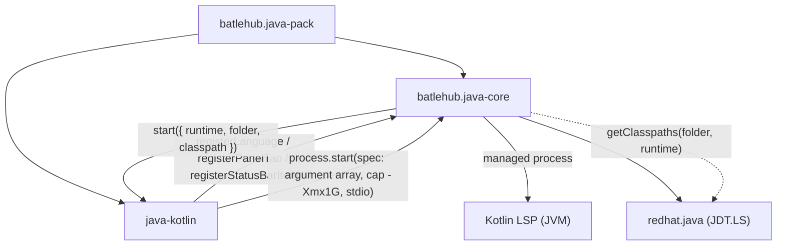

# RFC 0008 — Kotlin satellite

| Field       | Value                                                        |
| ----------- | ------------------------------------------------------------ |
| Status      | Draft                                                         |
| Short       | Kotlin                                                        |
| Settles     | A Kotlin language server (JetBrains' official LSP vs fwcd), Gradle Kotlin DSL, mixed Java + Kotlin modules on the core's project model |
| Closes      | A.10 — Kotlin and mixed Java + Kotlin modules (Team B) |
| Author      | Max Batleforc <maxleriche.60@gmail.com>                       |
| Co-author   | —                                                             |
| Created     | 2026-09-18                                                    |
| Revised     | 2026-09-18 — revision 2, after the series was reviewed against its goal (RFC 0001 §7.1): phase 0 jumps the queue as a measurement, a failed gate falls back to a thin bridge to JetBrains' extension instead of nothing, the server starts through the core's managed process, the coexistence write goes through `manifest.writeSetting`, the size budget is raised for this VSIX and the runtime download dropped |
| Supersedes  | —                                                             |
| Depends on  | RFC 0001 (the contract of §5.2, `java-groovy` as the model satellite, decision 7's usability gate, decision 31, the red lines of §7.1); the core's Gradle provider (RFC 0001 phase 7) for the Kotlin DSL and the mixed modules; RFC 0003 revision 2 (the managed process); needs members `manifest.writeSetting` and `process.start` — RFC 0001 §5.2 contract changelog |
| Touches     | `extensions/java-kotlin` (new), `extensions/java-core/src/build/gradle/provider.ts` (source roots), `extensions/java-core/src/build/maven/provider.ts` (`kotlin-maven-plugin` roots), `extensions/java-pack`, `.tasks/kotlin.yaml`, `tests/heavy/fixtures/kotlin-project`, `tests/heavy/java.mjs`, `tests/contract/run.sh`, `docs/guide/java/kotlin.md` |

---

## 1. Summary

A third satellite, `batlehub.java-kotlin`, built exactly like `java-groovy`:
it registers one language with the core through `registerLanguage`, receives
the JDK the core resolved and the classpath JDT.LS reported, starts a Kotlin
language server through the core's managed process
([RFC 0003](/rfc/0003-server-run-step-kinds)) with a declared cap, and adds a
`Kotlin` tab to the Java panel and a hidden-by-default status bar item. The
server is **JetBrains' official Kotlin LSP** (`Kotlin/kotlin-lsp`), pinned by
version and sha256 and fetched by `task kotlin:fetch` into the VSIX — chosen
over `fwcd/kotlin-language-server` behind the same measured gate as decision
7 of RFC 0001. The gate is measured first (phase 0, second in RFC 0001 §14's
order of work); if it fails, the satellite ships as a thin bridge to
JetBrains' own Kotlin extension instead of a bundled server (§11 decision 1).
The core learns two things it
does not know today: that `src/main/kotlin` in a Maven module is a source
root when `kotlin-maven-plugin` is declared, and that a Gradle build file can
be `build.gradle.kts`. Nothing about the registry link, the JDK story or the
run editor changes: a Kotlin module on the JVM is a Gradle or Maven module,
and the core already handles those.

### Before / after

```text
# today: a Gradle Kotlin project in a Che workspace with the Java pack
build.gradle.kts    colours only (no language server owns *.kts)
src/main/kotlin     invisible to the explorer's "sources" row on Maven modules
Hello.kt            colours only; fwcd.kotlin if the user found it, on a JDK it found itself

# with this RFC
Hello.kt            hover, completion, definition, diagnostics from the JetBrains LSP,
                    started on the JDK the core resolved, capped at -Xmx1G
build.gradle.kts    the same server, the same classpath
BatleHub Java: Kotlin   its own channel; "Kotlin" tab in the panel; status item off by default
explorer            app › sources › src/main/kotlin beside src/main/java
```

---

## 2. Motivation

1. **Kotlin is the second language of every JVM shop and the first of
   Gradle's own DSL, and VS Code has no maintained server for it.**
   `fwcd.kotlin` (Appendix A.10 of RFC 0001) last released in 2023 and
   pins a Kotlin compiler two majors behind; JetBrains shipped an official
   LSP in 2025 as pre-alpha. A Che image that recommends the Java pack today
   gives a Kotlin developer syntax colouring and nothing else.
2. **The JDK story of RFC 0001 §2 point 1 repeats for every JVM language
   server.** Both Kotlin servers are JVMs; both find a JDK the way
   `redhat.java` does (`JAVA_HOME`, `PATH`), which in a `mise` workspace is
   nothing. The core already resolves the JDK once and hands it to
   `java-groovy` through `LanguageProvider.start`; a Kotlin server that does
   not go through the same call is a second copy of feedback 5.
3. **A mixed module is one module.** A Gradle module with `src/main/java`
   and `src/main/kotlin` is one classpath and one JDK; the core's explorer
   (`project/explorer.ts`) shows the Java roots the Gradle provider lists,
   and the Gradle provider (`build/gradle/provider.ts`) already names
   `src/main/kotlin` as a candidate root. The Maven provider does not, so
   the same module under Maven hides half its sources.
4. **Memory.** RFC 0001 §15.3 measured what an uncapped JVM does to a
   16 GiB container; JetBrains' server is an IntelliJ platform in a JVM and
   defaults higher than the Groovy server. A satellite that starts it
   without `-Xmx` is the run that gets killed.

### 2.1 Use cases

Each is an acceptance case for the heavy suite (`HEAVY_ONLY=java`, a
`kotlin` phase in `tests/heavy/java.mjs`) over a new fixture
`tests/heavy/fixtures/kotlin-project` (Gradle, Kotlin DSL, `app` and `lib`
subprojects, `lib` in Kotlin, `app` mixed Java + Kotlin, one JUnit 5 test).

1. **A newcomer opens a Kotlin Gradle project.** Starting state: the pack
   installed, no `JAVA_HOME`, no `java` on `PATH`, `mise` holds a JDK 21;
   the fixture open. Action: open `lib/src/main/kotlin/com/acme/Greeter.kt`.
   Proof: the core's channel has `language kotlin registered (kotlin), JDK
   JavaSE-21, N classpath entries`; the `BatleHub Java: Kotlin` channel has
   `starting: …/bin/java -Xmx1G …` naming the mise JDK and then `initialize
   succeeded`; hover on `greet` shows `fun greet(name: String): String`.
2. **A diagnostic from the server, beside JDT's.** Starting state: case 1
   running. Action: type `val x: Int = "no"` into `Greeter.kt`. Proof: the
   Problems panel lists one entry from source `kotlin` with the type
   mismatch, on the right line; JDT's entries for the Java sources of `app`
   are untouched.
3. **Gradle Kotlin DSL is the same language, the same server.** Action:
   open `app/build.gradle.kts`. Proof: the language mode in the status bar
   reads `Kotlin`; hover on `implementation` answers with a signature; no
   second server process appears in the Kotlin channel.
4. **A mixed module in the explorer.** Action: expand
   `kotlin-project › app › sources` in the Java explorer. Proof: rows
   `src/main/java` and `src/main/kotlin` are both present; `lib › sources`
   has `src/main/kotlin` only. The same rows under a Maven twin of the
   fixture (`kotlin-maven-plugin` declared) — a unit test over
   `build/maven/provider.ts`, not a heavy step.
5. **Untrusted means not started.** Starting state: the fixture opened
   with workspace trust pending. Action: open `Greeter.kt`, do not trust.
   Proof: the Kotlin channel has `untrusted workspace: the server is not
   started`; the status item (once toggled on) reads `$(circle-slash)
   Kotlin`; colouring is present.
6. **Coexistence with `fwcd.kotlin`.** Starting state: `fwcd.kotlin`
   installed beside the pack. Action: open `Greeter.kt`. Proof: one warning,
   once, naming the other extension and the setting that quiets it
   (`kotlin.languageServer.enabled: false`, written to workspace settings
   through the core's `manifest.writeSetting` so `Java: Remove BatleHub
   settings` undoes it);
   exactly one `kotlin` diagnostic source in the Problems panel.
7. **A panel tab and a status item, off by default.** Action: open the
   Java panel. Proof: a `Kotlin` tab with state, JDK, classpath count and
   server version; no Kotlin status bar item until
   `batlehub.java.statusBar.items` has `"kotlin.server": true`, then
   `$(check) Kotlin`.

---

## 3. Goals / non-goals

**Goals**

- Kotlin sources and Gradle Kotlin DSL files get a language server that
  runs on the JDK the core resolved, with the classpath the core knows,
  inside a heap cap, and degrades to colouring with one warning.
- A mixed Java + Kotlin module is one module in the explorer and one
  classpath for both servers.
- The satellite is the second consumer of the contract and is held to it by
  `tests/contract/run.sh` like the first.
- The server choice is measured, not assumed: decision 7's gate, run in
  `task kotlin:smoke`, and the number written into §11 before the RFC is
  accepted.

**Non-goals**

- Kotlin Multiplatform, Android, Kotlin/Native, Kotlin/JS: the core's
  project model is the JVM classpath JDT.LS reports; a target that has none
  has no model here. Own RFC if asked for.
- Kotlin scripting outside Gradle (`*.main.kts`): no classpath to hand.
- Refactoring, code generation and inspections *in Kotlin*: whatever the
  server offers over LSP is exposed as-is; the JDT bundle of RFC 0001
  phase 6 is Java-only and stays so.
- Building the server from source, or a second bundled server: decision 7's
  rule — one bundled implementation. A failed gate falls back to a thin
  bridge to JetBrains' own extension (§11 decision 1), never to another
  server in the VSIX.
- Writing `settings.gradle.kts` / `build.gradle.kts`: the core's Gradle
  provider reads them (this RFC adds the extension), it never writes a
  build file.

---

## 4. User-facing design

### 4.1 Configuration

Everything under `batlehub.java.kotlin.*`, read by the satellite; every
key absent by default.

```jsonc
"batlehub.java.kotlin.enabled": true,          // false: register nothing, colours only
"batlehub.java.kotlin.server.xmx": "1G",       // the -Xmx of the server JVM
"batlehub.java.kotlin.server.args": [],        // extra JVM arguments, appended (argument array)
"batlehub.java.statusBar.items": { "kotlin.server": false }   // the core's toggle (RFC 0001 §4.2)
```

- `enabled` absent means `true`. `false` is the coexistence answer for a
  user who keeps `fwcd.kotlin` or JetBrains' own extension.
- `server.xmx` absent means `1G`: measured in §11, the smallest heap under
  which `task kotlin:smoke` answers hover and completion on the fixture in
  the usability budget.
- No `javaHome` key: the JDK is the core's resolution for the folder, as
  for Groovy. A user who wants another JDK for Kotlin changes the folder's
  JDK in the panel; the server follows on restart.

### 4.2 Behaviour rules

- **One language id, two file kinds.** `kotlin` (the builtin id) is
  extended with `.kts`; `build.gradle.kts` and `settings.gradle.kts` open
  as Kotlin and the same server serves them, as `.gradle` files are Groovy
  in `java-groovy` (RFC 0001 feedback 11). The server is told the workspace
  root and derives the Gradle model itself; the core's classpath is passed
  as the fallback for files outside any Gradle module.
- **Gradle is the core's, like the JDK.** The server's import runs the
  wrapper when the project has one; otherwise the Gradle the core resolved
  through the manager (RFC 0001 §4.1, revision 5: `GRADLE_HOME`, then `mise
  ls gradle --json`), whose `bin` is put first on the server's `PATH`. In a
  `mise` workspace a bare `gradle` on `PATH` is a shim that fails with "No
  version is set"; the satellite never relies on it.
- **Start is lazy and per folder**: the core calls
  `LanguageProvider.start` on the first `onLanguage:kotlin` /
  `workspaceContains:**/*.kt` activation; the satellite answers with
  `process.start(spec)` — the core's managed process, cap `-Xmx1G`
  declared, readiness on `initialize`, clean stop, peak RSS recorded. The
  server is one process per workspace folder, restarted by `Java: Kotlin:
  Restart the server` and by a change of the folder's JDK
  (`jdk.onDidChange`). It is not in the pack's default set (RFC 0001 §7.1):
  the resource diagnostic sums its cap with JDT.LS's before it starts and
  offers to skip it when the two do not fit the pod's 8 GiB request.
- **Untrusted → not started**, the RFC 0001 decision 40 rule: the language
  is registered (so colouring and the panel tab exist) and `start` returns
  an empty disposable with the channel line of use case 5.
- **Failure → one warning per session**, colouring stays, the tab and the
  status item say `failed` with a `Show the log` button; the same
  `warnedOnce` as `java-groovy/src/extension.ts`.
- **Coexistence**: at activation, if `fwcd.kotlin` or JetBrains'
  `kotlin` extension is active, one prompt offers to disable the other's
  server through its own setting, written by the core's
  `manifest.writeSetting` (workspace scope, never over a value the user
  set), or to set
  `batlehub.java.kotlin.enabled: false`. Never both servers silently.
- **Source roots**: the Maven provider lists `src/main/kotlin` and
  `src/test/kotlin` when the module's POM declares `kotlin-maven-plugin`
  (or the root exists — `roots()` already filters on existence); the Gradle
  provider recognises `build.gradle.kts` as the module's build file. The
  explorer needs no change: it renders `Module.sourceRoots`.

### 4.3 Validation

Hard errors (notification, the satellite registers nothing):

| Condition | Rationale |
| --- | --- |
| Contract major mismatch (`assertContract(1)` throws) | RFC 0001 §4.3; the core names both versions |
| `batlehub.java-core` absent | the satellite has no JDK, no classpath and no panel without it |

Warnings (once per session, in the `BatleHub Java: Kotlin` channel and as a notification):

| Condition | Behaviour |
| --- | --- |
| No JDK resolved by the core | not started; `Java: Install a JDK…` named |
| JDK below the server's minimum (17 for JetBrains' LSP) | not started; the panel tab says which version the server needs and which the folder has |
| Server exits or `initialize` fails | `failed`; colouring stays; restart offered in the tab |
| Another Kotlin extension active | the coexistence prompt of §4.2 |

---

## 5. Architecture

### 5.1 The same seam as Groovy



The invariant of RFC 0001 §5.1 holds: the satellite never talks to JDT.LS.
What it knows about the classpath, it got from the core, which got it from
`getClasspaths`. The server derives its own project model from Gradle on
top of that; if the two disagree the server's wins for Kotlin files, and the
core's wins for the explorer — they are different questions (what compiles
vs what the developer sees). What the user sees when they disagree: a
Kotlin file with an unresolved-reference diagnostic on a dependency the
explorer lists (or the reverse), and in the `Kotlin` tab two counts that
differ — `core: N entries · server: M entries` — with a `Show the log`
button. That is all this RFC does about it. The trigger to do more (a diff
of the two classpaths, a re-import command) is an entry in
[`docs/diary/team-b.md`](/diary/team-b) naming a project where it happened.

### 5.2 Start, end to end

```mermaid
sequenceDiagram
    participant E as editor
    participant K as java-kotlin
    participant C as java-core
    participant S as Kotlin LSP
    E->>K: activate (onLanguage:kotlin)
    K->>C: assertContract(1); registerLanguage({ id: "kotlin", languages: ["kotlin"] })
    C->>C: jdk.resolve(folder) → JavaSE-21@mise; getClasspaths(folder)
    C->>K: start({ runtime, folder, classpath })
    K->>K: trusted? runtime ≥ 17? else stop with the channel line
    K->>C: process.start({ argv: <jdk>/bin/java -Xmx1G -cp <lib/*> KotlinLspServerKt --stdio, cap: 1G, cwd: folder })
    C->>C: resource diagnostic: declared caps vs the container
    C->>S: spawn (argument array)
    S-->>K: initialize result (capabilities) — the readiness probe
    K->>C: registerStatusBarItem re-registered with state "running"
```

---

## 6. Detailed design

### 6.1 `extensions/java-kotlin` (new, cloned from `java-groovy`)

- `src/server.ts` — the pure parts, tested as plain Node like
  `java-groovy/src/server.ts`: `launch(jdkPath, libDir, xmx, extra)` returns
  `{ command, args, cap }` with `-Xmx`, `-cp`, the main class and `--stdio`,
  never a shell string — the spec handed to the core's `process.start`, the
  satellite never calls `child_process` itself; `statusText(state)`; `tabHtml(...)`; `CONTRACT_MAJOR = 1`;
  `minimumJdk = 17`; `coexistenceSetting(extensionId)` → the other
  extension's setting to write, or `undefined`.
- `src/extension.ts` — the glue: `getExtension("batlehub.java-core")`,
  `assertContract`, `registerLanguage`, `registerPanelTab({ id: "kotlin" })`,
  `registerStatusBarItem({ id: "kotlin.server", defaultShown: false })`, the
  `vscode-languageclient` over stdio with `documentSelector: [{ language:
  "kotlin" }]`, the channel `BatleHub Java: Kotlin`, commands
  `batlehub.java.kotlin.restart` / `showLog`.
- `package.json` — `extensionDependencies: ["batlehub.java-core"]`
  (a satellite is dead without the core, unlike the core without
  `redhat.java` — RFC 0001 decision 41 does not apply here);
  `contributes.languages`: `{ id: "kotlin", extensions: [".kt", ".kts"] }`;
  `activationEvents`: `onLanguage:kotlin`, `workspaceContains:**/*.kt`,
  `workspaceContains:**/*.gradle.kts`; `untrustedWorkspaces: limited`.
- `server/NOTICE.md` — the server's licence (Apache-2.0), the exact release
  tag, the sha256, and the note that nothing is downloaded at runtime.
- `l10n/` — every string through `vscode.l10n.t`, checked by
  `scripts/check-l10n.mjs` like the others.

### 6.2 `.tasks/kotlin.yaml`

- `kotlin:fetch` — downloads the pinned release archive of `Kotlin/kotlin-lsp`
  (a zip with `lib/*.jar` and a launcher script) into
  `~/.cache/batlehub-heavy/`, checks the sha256, extracts `lib/` into
  `extensions/java-kotlin/server/lib/` (gitignored, in the VSIX). The
  launcher script is read once to pin the main class and JVM flags into
  `launch()`; it is not executed (a shell script from an archive is not an
  argument array).
- `kotlin:smoke` — `test/smoke.mjs` over stdio, the decision 7 gate:
  `initialize` under 10 s on the mise JDK 21, hover on `greet`, completion
  on `Greeter().gr|` offering `greet`, one diagnostic for the type
  mismatch, all on the `kotlin-project` fixture, the heap at the configured
  `-Xmx`. Prints the numbers §11 records.
- `kotlin:contract` — `tests/contract/run.sh` gains the satellite: (a)
  `tsc --noEmit` against the current `api.d.ts`, (b) the tagged-pair install
  once a release exists.

### 6.3 `extensions/java-core`

- `build/maven/provider.ts` — `sourceRoots` gains `src/main/kotlin`,
  `testRoots` gains `src/test/kotlin`; `roots()` already drops the absent
  ones, so a pure-Java module is unchanged. One vitest case in
  `test/maven.test.ts` over a POM declaring `kotlin-maven-plugin`.
- `build/gradle/provider.ts` — `readModules` accepts `build.gradle.kts`
  and `settings.gradle.kts` as the build file (the `include(...)` syntax of
  the Kotlin DSL parsed by the same regex family, one vitest case in
  `test/gradle.test.ts`). The tasks and dependency parsers are unchanged:
  Gradle's output is the same in both DSLs.
- `src/coexistence.ts` — no change; the satellite's coexistence prompt
  writes through `manifest.writeSetting(key, value)` from the start (needs
  that member — [RFC 0001 §5.2 contract changelog](/rfc/0001-java-env#contract-changelog)).
  The satellite has no `written.json` and no `Remove settings` command of
  its own (§11 decision 8).

### 6.4 `extensions/java-pack`

- `extensionPack` is unchanged. The pack's default set is JDT.LS plus one
  framework server (RFC 0001 §7.1); a language satellite is installed by the
  workspace that needs it — Team B's devfile or `.vscode/extensions.json`
  recommendation — and the guide says so. A `java-pack-kotlin` is not worth a
  VSIX for one entry.

### 6.5 Tests and docs

- `tests/heavy/fixtures/kotlin-project/` — Gradle 8 wrapper, Kotlin DSL,
  `lib` (Kotlin) and `app` (Java + Kotlin), one JUnit 5 test; built once
  with the mise Gradle like `gradle-multi` (RFC 0001 §7 of `todo.md`).
- `tests/heavy/java.mjs` — a `kotlin` phase after `groovy`, the seven use
  cases of §2.1 as assertions; `view.sh` gates `KOTLIN-OK`.
- `docs/guide/java/kotlin.md` — what is served, the settings, the
  coexistence answer, the memory number.

**Deliberately untouched**, so reviewers do not go looking:

- `extensions/java-core/src/registry/` — the Gradle init script and the
  Maven block already route a Kotlin module's dependencies; there is no
  Kotlin-specific repository.
- `extensions/java-core/src/run/` — a Kotlin `main` is a JVM class
  (`GreeterKt`); the `java` debug type of `vscode-java-debug` launches it
  as it is. A run template that guesses the `Kt` suffix is §11 open
  question 2, not this RFC's scope.
- `jdt/batlehub-jdt-core/` — Java-only; Kotlin sources are invisible to
  its inspections, by design.

---

## 7. Security considerations

- **The server is a JVM the satellite spawns with an argument array**, on
  the JDK the core resolved, with `cwd` inside the workspace folder; no
  shell, and nothing from a build file reaches the command line. Extra
  arguments come only from the user's own settings (`server.args`), which
  is the same trust as `java.jdt.ls.vmargs`.
- **The archive is fetched at build time, never at runtime** (the bundled
  server; the bridge fallback is the crossed default below), pinned by
  release tag and sha256 in `.tasks/kotlin.yaml` and named in
  `server/NOTICE.md`; the VSIX carries the jars. The launcher script inside
  the archive is documentation to the build, not something the extension
  executes.
- **The server executes project code.** JetBrains' LSP imports a Gradle
  project by running Gradle, which runs `build.gradle.kts`: repository code
  with the user's privileges. This is what `vscode-gradle`, `redhat.java`
  (Buildship) and Metals do too, and why the trust rule is absolute here:
  in an untrusted workspace the server is not started, not started in a
  degraded mode.
- **Attacker-controlled inputs** are the workspace's files (build scripts,
  sources); what an attacker gains by a malicious `build.gradle.kts` is
  what they gain the moment the user runs `gradle` themselves, and no more:
  the satellite adds no credential the build did not already have.
- **Coexistence writes one setting of another extension**, recorded and
  reversible; the prompt names the setting and the extension before writing.

### Red lines

- **Every write is in the manifest.** Two possible writes, both workspace
  settings of another extension, both through `manifest.writeSetting`: the
  coexistence key (after a prompt) and, on the bridge fallback only, the one
  key pointing JetBrains' extension at the core's JDK. No file, no mode, no
  `written.json` of the satellite's; `Java: Remove BatleHub settings` undoes
  both.
- **The token is the core's.** The satellite never holds it and never asks
  for it: the registry token reaches Gradle — the server's import included —
  through the init script the core already wrote (`gradle-init`, a
  `writeCredential` target of the core). Kotlin adds no target.
- **Memory.** One long-lived process, the Kotlin LSP, started through the
  core's managed process (RFC 0003) with a declared cap of `-Xmx1G`. The
  Gradle daemon its import starts is Gradle's and is already counted by the
  core's resource diagnostic (RFC 0001 §4.2). Outside the pack's default
  set: opt-in by installing the satellite, summed against the pod's 8 GiB
  request before it starts. On the bridge fallback the server is JetBrains'
  child, not ours: the diagnostic counts it as an estimate and says so.
- **Defaults crossed.** None while the gate passes: the server is bundled,
  nothing is downloaded at runtime, the coexistence write is prompted. If
  the gate fails, two are touched, for the reason of §11 decision 1: the
  bridge key is written by default under the default-on rule (workspace
  scope, manifest, shown once in the panel with its undo, never over a user
  value), and JetBrains' extension downloads its own server at runtime —
  which is that extension's trust, not ours (RFC 0001 §7.1: the default is
  about what *our* extension downloads). No source or comment text goes to a
  third party in either shape.

---

## 8. Alternatives considered

| Alternative | Why rejected |
| --- | --- |
| `fwcd/kotlin-language-server` (MIT, the server `fwcd.kotlin` uses) | Last release 2023, Kotlin compiler pinned below current language versions, the classpath resolved by its own Gradle scripts that fail on current Gradle; decision 7's gate would measure a server whose ceiling is known. Kept as the fallback name only if JetBrains' LSP fails the gate *and* the gap is judged worth a dated server — then this RFC is revised, not silently switched. |
| Bridge to JetBrains' own `kotlin` VS Code extension instead of bundling the server | **Not the first choice, and the fallback if the gate fails** (§11 decision 1). Their extension downloads the server at runtime and picks its own JDK; a bundled server on the core's JDK with a declared cap is the better fit for a Che workspace when it passes the gate. When it does not, a bridge beats nothing: one manifest-recorded setting points their extension at the core's JDK, the explorer and the run configs stay the core's — the pattern of RFCs 0010 and 0011. What their extension downloads is its trust, not ours (RFC 0001 §7.1). |
| One satellite for all JVM languages (`java-languages`) | The Groovy server's failure would then be shipped with Kotlin's and vice versa — RFC 0001 §8's argument for keeping `java-groovy` separate applies unchanged. |
| Kotlin inside the core | The core would carry a 100+ MB server for every Java user; the satellite seam exists for exactly this. |
| Download the server on first use, through the BatleHub registry link when enabled | A runtime download with a checksum, a mirror and an air-gapped story — the surface RFC 0001 §7 removed. Not revisited: the size budget is raised for this VSIX instead (§11 decision 7). |

---

## 9. Rollout and compatibility

- **Default behaviour**: installed by the workspace that needs it (§6.4),
  not by the pack; registers on the first Kotlin file, does nothing in a workspace without one. A workspace without
  a JDK gets the core's newcomer story first (the JDK quick pick), then the
  server on restart.
- **Config migration**: none; every key is new and absent by default.
- **Prerequisites**: a JDK ≥ 17 resolved by the core; Gradle for the
  server's own import of a Gradle project — the wrapper, or the Gradle the
  core resolved through the manager (§4.2); the core's managed process
  (RFC 0003 revision 2) and `manifest.writeSetting` on the contract; nothing
  else. Maven Kotlin projects are served with the core's classpath only
  (the server's Maven import is §11 question 1).
- **Rollback**: `Java: Remove BatleHub settings` removes the one setting it
  may have written (it is in the core's manifest), then uninstall the
  satellite. Nothing persists outside workspace settings and the satellite's
  own storage.
- **Versioning**: `java-kotlin` releases on its own tag like `java-groovy`;
  the contract test holds it to the core's current major.

---

## 10. Test plan

- **Unit** (`extensions/java-kotlin/test/server.test.ts`): `launch()` is an
  argument array with the configured `-Xmx` and the JDK's `bin/java`;
  `statusText` names every state; `tabHtml` escapes; `coexistenceSetting`
  maps both known extensions and nothing else; `minimumJdk` refuses 11.
- **Unit, core** (`extensions/java-core/test/maven.test.ts`,
  `gradle.test.ts`): Kotlin roots on a `kotlin-maven-plugin` POM; a
  `settings.gradle.kts` `include("app", "lib")` yields two modules with
  `build.gradle.kts` as the build file.
- **Smoke** (`task kotlin:smoke`, `test/smoke.mjs`): the decision 7 gate
  over stdio on the fixture — `initialize` time, hover, completion,
  diagnostic, heap. Its numbers go into §11.
- **Contract** (`tests/contract/run.sh`): type-check against the current
  `api.d.ts`; the tagged pair once releases exist.
- **Heavy** (`tests/heavy/java.mjs`, `kotlin` phase): the seven use cases
  of §2.1, `KOTLIN-OK` gated in `view.sh`; the suite's memory budget of
  RFC 0001 §15.3 revised with the server's `-Xmx` counted in.
- **Existing suites** that must pass unchanged: `task ext:test` (the Maven
  and Gradle providers' existing cases — a pure-Java module lists the same
  roots), the `java` heavy half (`GROOVY-OK` proves the satellite host is
  not disturbed by a second registration), `task groovy:contract`.

---

## 11. Decisions and open questions

### Resolved

| # | Question | Decision |
| --- | --- | --- |
| 1 | Which server? | **JetBrains' `Kotlin/kotlin-lsp`, behind decision 7's gate.** It is the only Kotlin server whose compiler front end is the current one and whose maintainer is the language's; "pre-alpha" is a label to measure, not a reason. `task kotlin:smoke` measures, as phase 0, ahead of everything else in this RFC. **If the gate fails the fallback is a thin bridge, not nothing** (revision 2): `java-kotlin` ships without a server, recommends JetBrains' own Kotlin extension, writes the one setting that points it at the core's JDK (through `manifest.writeSetting`, under the default-on rule of RFC 0001 §7.1), and keeps the explorer's Kotlin roots and the run configs from the core — the pattern of RFCs 0010 and 0011. Team B gets a working editor either way; the numbers in this table say which shape. |
| 2 | Bundled in the VSIX or downloaded? | **Bundled**, as the Groovy jar is; "nothing is downloaded at runtime" is a default of the series about *our* extension (RFC 0001 §7.1). On the bridge fallback of decision 1, what JetBrains' extension downloads is its trust, not ours. The size is decision 7. |
| 3 | One server for `.kt` and `.kts`? | **Yes**, one language id, one process — the same shape as feedback 11 for Groovy; the server handles Gradle scripts itself. |
| 4 | JDK for the server? | **The core's resolution for the folder**, no `javaHome` key. Feedback 5 of RFC 0001 was found once; a per-satellite JDK setting would let it be found again. |
| 5 | Heap? | **Capped, `-Xmx1G` default**, the value measured by the smoke; RFC 0001 §15.3 is not optional for a JVM that embeds an IDE platform. |
| 6 | Kotlin in the core's project model? | **Source roots only** (`src/main/kotlin`, `src/test/kotlin`, `build.gradle.kts`). The module, JDK and classpath are the build tool's; Kotlin changes none of them. |
| 7 | VSIX size (was open question 1) | **The 60 MB budget is raised for this VSIX alone**, to the measured size of the pinned release plus headroom, written into CI's per-extension table (RFC 0001 §13 already checks the budget per extension). A satellite is installed only by who needs it, so its size is paid only by them. The runtime-download fallback is dropped, not kept in reserve. |
| 8 | Manifest sharing (was open question 3) | **`manifest.writeSetting` from the start**; the satellite never has a `written.json` or a `Remove settings` command of its own (RFC 0001 §7.1 red line 1). Needs that member — [RFC 0001 §5.2 contract changelog](/rfc/0001-java-env#contract-changelog); `java-groovy` uses it too. Phase 1 waits for it rather than shipping an interim. |
| 9 | How the server is started | **Through the core's managed process** (RFC 0003 revision 2; needs `process.start(spec)` — same changelog), cap `-Xmx1G` declared, outside the pack's default set. The satellite never spawns. |
| 10 | Where in the order of work | **Phase 0 second, the rest last but one** (RFC 0001 §14): Team B is waiting but Team A switches first; a failed gate is cheaper known now than after Team A's track. Phases 1–3 come after that track, before RFC 0009. |

### Still open

1. **Maven Kotlin projects.** Whether the pinned server imports a Maven
   project itself or only serves what the core's classpath gives it;
   `kotlin:smoke` runs a Maven twin of the fixture to find out. If the
   latter, use case 4's Maven half is explorer-only and the guide says so.
2. **A run template for a Kotlin `main`.** `mainClass` is `<File>Kt` unless
   `@file:JvmName` says otherwise; guessing wrong is worse than the user
   typing it. Recommendation: no template in v0.1; the run editor's
   Application template with the class typed works today.
3. **Server version drift.** JetBrains releases often and pre-alpha
   promises no compatibility; the nightly matrix (RFC 0001 §4.2) gains a
   `kotlin-lsp` pre-release row so a breaking release is a drift issue, not
   a user report.

---

## 12. Implementation phases

| Phase | Content |
| --- | --- |
| 0 | **The gate, measured — second in RFC 0001 §14's order of work, as a measurement only**: `task kotlin:fetch` + `kotlin:smoke` on the pinned release with the mise JDK 21 and the `kotlin-project` fixture; the numbers of RFC 0001 decision 7's gate and the measured size (§11 decision 7 here) written into §11. Ships nothing. A failed gate does not stop the RFC: it turns phase 1 into the thin bridge of decision 1. |
| — | *Team A's track (RFC 0001 §14 steps 3–11) comes here; it brings the managed process (RFC 0003) and `manifest.writeSetting` that phase 1 needs.* |
| 1 | **The satellite**: `extensions/java-kotlin` cloned from `java-groovy` — server through `process.start`, channel, panel tab, status item, trust rule, coexistence prompt through `manifest.writeSetting`; `.tasks/kotlin.yaml`; the raised size budget in CI; the contract test extended; `docs/guide/java/kotlin.md`. Useful on its own. *Gate failed*: the same extension without `server/` — the bridge key, the tab, the recommendation of JetBrains' extension. |
| 2 | **The core's roots**: Maven and Gradle providers learn `src/main/kotlin` and `build.gradle.kts`; unit tests. Independent of phase 1 and useful without it (the explorer). |
| 3 | **Proof**: the `kotlin` phase of the `java` heavy half, `KOTLIN-OK` gated, the memory budget of the suite revised; the nightly matrix row of question 3. |
