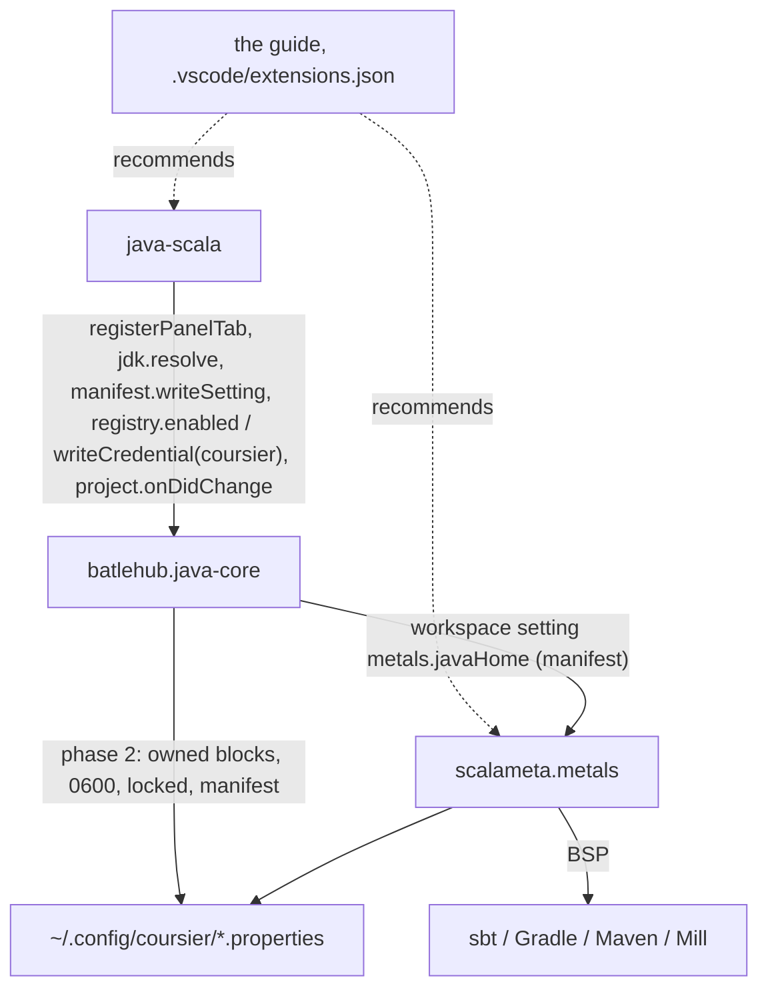

# RFC 0009 — Scala satellite

| Field       | Value                                                        |
| ----------- | ------------------------------------------------------------ |
| Status      | Draft                                                         |
| Short       | Scala                                                         |
| Settles     | Metals integration with the core's JDK, explorer and run configurations |
| Closes      | A.10 — Scala through Metals on the core's JDK (Team B) |
| Author      | Max Batleforc <maxleriche.60@gmail.com>                       |
| Co-author   | —                                                             |
| Created     | 2026-09-18                                                    |
| Revised     | 2026-09-18 — revision 2, after the series was reviewed against its goal (RFC 0001 §7.1): last in the order of work, ships without the registry link until BatleHub accepts HTTP Basic, `coursier` a `writeCredential` target of the core instead of files the satellite writes, no contract version defined here, a repository-shipped `metals.javaHome` shown for what it is |
| Supersedes  | —                                                             |
| Depends on  | RFC 0001 (the contract of §5.2, decision 31, the registry link of §4.2, the run editor of phase 4, the red lines of §7.1); RFC 0008, which it follows in RFC 0001 §14's order of work (last); needs members `manifest.writeSetting`, `registerRunTemplate`, `BuildTool` `"sbt"` and — phase 2 only — the `coursier` target of `registry.writeCredential` (RFC 0001 §5.2 contract changelog); phase 2 is blocked on BatleHub accepting HTTP Basic with the token as the password (BatleHub's own RFC series) |
| Touches     | `extensions/java-scala` (new, small), `extensions/java-core/src/build/maven/provider.ts` and `build/gradle/provider.ts` (Scala roots), `extensions/java-core/src/run/configs.ts` (the `scala` launch type in the editor's templates), `extensions/java-core/src/registry/` (the `coursier` credential target, phase 2), `tests/heavy/fixtures/scala-project`, `tests/heavy/java.mjs`, `docs/guide/java/scala.md` |

---

## 1. Summary

Scala in VS Code is already good: Metals (`scalameta.metals` on Open VSX,
Apache-2.0) is the language server the Scala community maintains, with
completion, navigation, diagnostics, a debug adapter and its own build
import through BSP for sbt, Gradle, Maven and Mill. What it lacks in a Che
workspace is exactly what the core of RFC 0001 owns: a JDK when there is
none on `PATH`, a registry to resolve through, a project explorer, and run
configurations edited in one place. This RFC therefore does **not** bundle a
server. `batlehub.java-scala` is a thin satellite that configures Metals
with the JDK the core resolved, lists Scala source roots in the explorer,
and adds the `scala` debug type to the run editor's templates. The registry
link for Coursier is the core's to write (a `writeCredential` target, RFC
0001 §7.1 red line 2) and **ships later**: Coursier only sends HTTP Basic
and BatleHub accepts none, so the satellite ships without it until BatleHub
does (§11 decision 6). It ships with the honest size that implies: a few
hundred lines, one panel tab, no JVM of its own. If Metals is not installed
the satellite says so once and does nothing else.

### Before / after

```text
# today: a Scala project in a Che workspace with the Java pack and Metals
Metals              starts on the JDK it finds itself: none in a mise workspace → "Java not found"
~/.m2, Coursier     resolve from Maven Central directly, the BatleHub mirror unknown to Coursier
Java explorer       app › sources › src/main/java only; src/main/scala absent
Run                 Metals' code lenses; nothing in the Java run editor

# with this RFC
metals.javaHome     = the core's JavaSE-21@mise, written at workspace scope through the manifest
Coursier            unchanged until BatleHub accepts Basic; then the core's `coursier` target (phase 2)
explorer            app › sources › src/main/scala beside src/main/java
run editor          "Scala application" and "Scala test" templates (type: scala)
Java panel          a "Scala" tab: Metals present/absent, its JDK, the repository block
```

---

## 2. Motivation

1. **Metals cannot start where the core's newcomer story starts.** Metals
   looks for Java in `metals.javaHome`, `JAVA_HOME`, then `PATH`; in a Che
   workspace with `mise` and no global version all three are empty (RFC
   0001 feedback 5 and 23). The user sees "Java not found" and a link to
   install a JDK by hand, in a workspace where a JDK is one `mise use`
   away and the core already knows that.
2. **The registry link stops at Maven and Gradle.** RFC 0001 §4.2 routes
   `~/.m2/settings.xml` and `~/.gradle/init.d` through BatleHub with the
   bearer token. Metals resolves its own server and every project
   dependency of an sbt or Mill build through Coursier, which reads
   neither file. A Scala build in a workspace that must go through the hub
   goes around it.
3. **Two explorers for one module.** A Maven or Gradle module with
   `src/main/scala` is a JVM module the core lists; the Java explorer shows
   its Java roots and hides the Scala ones, so the developer opens Metals'
   own tree for half the tree.
4. **Run configurations in two places.** Metals contributes the `scala`
   debug type (`vscode-scala-debug-adapter` inside Metals); the core's run
   editor (`src/run/editor.ts`) knows `java` only, so a Scala main is a
   `launch.json` entry typed by hand or a Metals code lens with no saved
   configuration.

### 2.1 Use cases

Acceptance cases for a `scala` phase of the `java` heavy half over a new
fixture `tests/heavy/fixtures/scala-project` (sbt 1.x, two subprojects
`core` and `app`, `app` depending on `core`, one MUnit test; a Maven twin
with `scala-maven-plugin` for the explorer case). The heavy run installs
`scalameta.metals` from Open VSX beside the pack, pinned like
`redhat.java`.

1. **Metals starts on the core's JDK in a newcomer's workspace.** Starting
   state: no `JAVA_HOME`, no `java` on `PATH`, `mise` holds JDK 21; Metals
   and the pack installed; the fixture open. Action: open
   `core/src/main/scala/com/acme/Greeter.scala`. Proof: the core's channel
   has `wrote metals.javaHome` (a manifest entry, workspace scope) naming
   the mise JDK; the `Metals` output channel has its `Java home:` line with
   the same path; hover on `greet` shows `def greet(name: String): String`.
2. **Metals absent.** Starting state: the pack without Metals. Action: open
   `Greeter.scala`. Proof: one information message naming
   `scalameta.metals` with an Install button; the `Scala` panel tab says
   `Metals: not installed`; no setting is written (the manifest has no
   `metals.*` entry).
3. **The registry link reaches Coursier** *(phase 2 — blocked until
   BatleHub accepts HTTP Basic with the token as the password; not part of
   `SCALA-OK` before that)*. Starting state: case 1 plus
   `batlehub-vsx` signed in and `registry.enabled` answered `true`. Action:
   `Java: Detect environment`. Proof: the core's channel has `registry link
   enabled → …/proxy/maven/maven2` and `wrote credential target coursier`
   — the core's line, the satellite writes neither file;
   `~/.config/coursier/mirror.properties` (0600) carries the
   owned block (the Maven fenced block's twin) mapping `central` to the hub
   URL, and `credentials.properties` (0600) the bearer for its host; a
   `sbt update` in the terminal resolves `munit` with the hub as the only
   remote in the Coursier cache's `.checked` metadata. Disabling the link
   (or `Java: Remove BatleHub settings`) removes both blocks and leaves the
   files byte-identical, mode included.
4. **Scala roots in the explorer.** Action: expand
   `scala-project › app › sources`. Proof: rows `src/main/scala` and
   `src/main/java` (the fixture has both). For the sbt build the module
   rows come from `build.sbt`'s `lazy val app = project` declarations (a
   names-only read, §4.2); for the Maven twin from the provider.
5. **A Scala run configuration from the editor.** Action: `Java: Edit run
   configurations…` → New → `Scala application`, main class
   `com.acme.app.Main`, module `app`. Proof: `launch.json` gains `{ "type":
   "scala", "request": "launch", "name": "Main", "mainClass":
   "com.acme.app.Main", "buildTarget": "app" }`, with the comments and
   unknown keys the file had preserved (`jsonc-parser`, RFC 0001 feedback
   6); `Run` on it prints `Hello from app` in the debug console through
   Metals' adapter.
6. **Untrusted workspace.** Starting state: the fixture open, trust pending.
   Action: open `Greeter.scala`. Proof: no `metals.javaHome` write, no
   Coursier write; the `Scala` tab says `waiting for workspace trust`; a
   `metals.javaHome` the cloned repository ships in `.vscode/settings.json`
   is neither touched nor endorsed (§7); once
   trusted, case 1's proof follows without a reload (the write and Metals'
   own restart on a `metals.javaHome` change).

---

## 3. Goals / non-goals

**Goals**

- Metals starts on the JDK the core resolved, in a workspace where it would
  otherwise find none, without the user typing a path.
- A workspace routed through BatleHub routes Coursier too, written by the
  core with the same owned-block, `0600`, set·set·unset-byte-identical rules
  as the Maven and Gradle files — once BatleHub accepts what Coursier sends
  (phase 2). Everything else in this list ships without it.
- Scala source roots appear in the Java explorer for Maven and Gradle
  modules, and sbt subprojects appear as module rows.
- The run editor offers Scala templates on Metals' debug type.
- The satellite is small enough that its absence costs nothing: without
  Metals it registers a tab that says so.

**Non-goals**

- Bundling or pinning Metals or its server: Metals downloads its server
  through Coursier at first start and manages its own version
  (`metals.serverVersion`). Shipping a second copy would be a second
  update channel for the same binary; the registry link (phase 2) is how
  that download goes through the hub in a controlled workspace. "Nothing is
  downloaded at runtime" is a default about *our* extension; what Metals
  downloads is Metals' trust, not ours (RFC 0001 §7.1) — the user's choice,
  like `redhat.java`.
- Scala.js, Scala Native, Mill-specific features: Metals serves them;
  the core's model does not need to know.
- An sbt build-tool provider in the core (tasks, dependency tree,
  `-P`-style profiles): sbt has no lifecycle the Task API maps cleanly onto
  and Metals runs sbt itself through BSP. Module *names* from `build.sbt`
  are read for the explorer; nothing is run. A provider is its own RFC if
  sbt users ask for goals in the task picker.
- Inspections, generation, rename in Scala: Metals' own, as-is.
- Scala 2 vs 3 handling: Metals' concern.

---

## 4. User-facing design

### 4.1 Configuration

```jsonc
"batlehub.java.scala.enabled": true,            // false: the satellite registers nothing
"batlehub.java.scala.writeJavaHome": true,      // false: never touch metals.javaHome
"batlehub.java.scala.coursier": "follow",       // follow | never — follow the core's registry link
```

- Everything absent means enabled, write the JDK, follow the registry
  link. `coursier` has no effect before phase 2. From then, `follow` asks
  the core for `registry.writeCredential("coursier")` only when the core's
  `registry.enabled()` is `true`; the satellite never asks its own
  question — RFC 0001 §4.2's one prompt per workspace is the prompt.
- No JDK path setting: the value written to `metals.javaHome` is the
  core's resolution for the folder; a user override is an override *in the
  core* (the JDK tab), and Metals follows.

### 4.2 Behaviour rules

- **`metals.javaHome` is a foreign write made by default**, so it follows
  the default-on rule of RFC 0001 §7.1: workspace scope, through
  `manifest.writeSetting`, shown once in the `Scala` tab with its undo,
  never over a value already there; removed by `Java: Remove BatleHub
  settings`, rewritten when the folder's JDK changes (`jdk.onDidChange`).
  A `metals.javaHome` present before the satellite saw the workspace is an
  override: left alone, shown in the tab as `not written by BatleHub` — and,
  when `.vscode/settings.json` is tracked by the repository and the value
  differs from the core's JDK, as `from the repository — differs from the
  core's JDK <path>` (§7).
- **The Coursier blocks (phase 2, blocked — §11 decision 6) are the
  core's.** The satellite calls `registry.writeCredential("coursier")` and
  never sees the token or the files. The target writes two owned blocks in
  `~/.config/coursier/mirror.properties` (`central.from=https://repo1.maven.org/maven2` /
  `central.to=<hub>/proxy/maven/maven2`, Coursier's own mirror file format)
  and `~/.config/coursier/credentials.properties` (`batlehub.host`,
  `batlehub.username`, `batlehub.password` — Coursier sends HTTP Basic and
  nothing else; BatleHub's extractor accepts no Basic today (RFC 0001
  §15.1; `todo.md` finding 20), which is why the target does not exist
  yet). Both under the core's shared-file lock (`src/lock.ts`), `0600`, in
  the manifest with the file's previous mode, fenced by `# batlehub:begin`
  / `# batlehub:end` comment lines since `.properties` has no XML comment;
  set·set·unset leaves the file byte-identical, tested in the core as
  `registry/link.test.ts` tests the Maven block.
- **Explorer roots**: Maven and Gradle providers list `src/main/scala` and
  `src/test/scala` when present; an sbt root (`build.sbt` at the folder
  root) yields modules from `lazy val <name> = project` and
  `project.in(file("<dir>"))` declarations, roots `src/main/scala`,
  `src/test/scala`, `src/main/resources` per module, tool `"sbt"` — a
  third `BuildTool` value on the *exported* type, a minor because exported
  unions are open from 1.1 (the union rule of the
  [RFC 0001 §5.2 contract changelog](/rfc/0001-java-env#contract-changelog)).
  The explorer's JDK row is the core's
  resolution as for any folder; sbt's `.java-version`/`.sbtopts` are read
  as a `JavaVersionRange` origin when present.
- **Run templates**: `Scala application` (`type: scala, request: launch,
  mainClass, buildTarget`) and `Scala test` (`testClass`) in the run
  editor's template list, shown only when Metals is installed (the type
  has no adapter otherwise); `buildTarget` offered from the module rows.
- **Metals absent**: one information message per session with Install,
  the tab, nothing written.
- **Untrusted**: nothing written, nothing run (the sbt names-only read is
  a file read, allowed; Metals itself refuses untrusted workspaces).
- **Memory**: the satellite starts no process. Metals' server is a JVM
  Metals starts; the core's resource diagnostic counts it as an estimate
  (Metals' default heap unless `metals.serverProperties` carries an `-Xmx`)
  and says it is one. Metals is outside the pack's default set of RFC 0001
  §7.1 — JDT.LS plus one framework server — and is summed against the
  pod's 8 GiB request when the workspace opts into it.

### 4.3 Validation

Hard errors (notification, the satellite registers nothing):

| Condition | Rationale |
| --- | --- |
| Contract major mismatch | RFC 0001 §4.3 |
| `batlehub.java-core` absent | no JDK, no registry link, no explorer to add to |

Warnings (once per session, `BatleHub Java: Scala` channel):

| Condition | Behaviour |
| --- | --- |
| Metals not installed | the message with Install; the tab says so |
| No JDK resolved | `metals.javaHome` not written; the tab points at `Java: Install a JDK…`; Metals shows its own error |
| Phase 2: the core reports the `coursier` target not writable or locked past 30 s | blocks not written; the tab shows the core's reason; Maven/Gradle links unaffected |
| Registry link enabled, `coursier` target absent from the core (before phase 2) | the tab says `Coursier: direct — BatleHub does not accept HTTP Basic yet`; nothing written, no workaround offered |
| `metals.javaHome` set by the user to a path that no longer exists | shown in the tab as stale; not overwritten (an override is the user's) |
| `metals.javaHome` shipped by the repository's `.vscode/settings.json` and different from the core's JDK | shown in the tab as from the repository, with the core's JDK beside it; not overwritten (§7) |

---

## 5. Architecture

### 5.1 A satellite without a server



The invariant: **the satellite never talks to Metals over LSP or BSP.**
Everything it does is a file Metals reads (`settings.json`, Coursier's
properties) — written by the core on its behalf — or a row in the core's
own views. That is why it needs no
JVM, no `vscode-languageclient`, and no version pin: a Metals release can
change everything but the two files, and those are Metals' and Coursier's
public configuration surfaces.

### 5.2 The JDK hand-off

```mermaid
sequenceDiagram
    participant C as java-core
    participant S as java-scala
    participant W as workspace settings.json
    participant M as Metals
    C->>S: activate (workspaceContains **/*.scala | build.sbt)
    S->>C: assertContract(1); jdk.resolve(folder)
    C-->>S: { runtime: JavaSE-21@mise, reason: "matches" }
    S->>S: trusted? metals installed? user override present? else stop
    S->>C: manifest.writeSetting("metals.javaHome", runtime.path)
    C->>W: metals.javaHome = runtime.path (manifest: foreign setting, previous value kept)
    M->>W: onDidChangeConfiguration → restart on the new home
    C->>S: jdk.onDidChange → rewrite when the folder's JDK changes
```

---

## 6. Detailed design

### 6.1 `extensions/java-scala` (new)

- `src/rules.ts` — pure, tested as plain Node: `javaHomeDecision(current,
  runtime, trusted, metalsInstalled, tracked)` → `write | keep-override |
  keep-repository(differs) | skip(reason)`; `sbtModules(buildSbt)` → module names and
  directories from `lazy val x = project` / `.in(file("dir"))`;
  `templates(metalsInstalled)` → the run templates; `tabHtml(...)`.
- `src/extension.ts` — the glue: the core's API, `registerPanelTab({ id:
  "scala" })`, the settings write through `manifest.writeSetting` (needs
  that member — [RFC 0001 §5.2 contract changelog](/rfc/0001-java-env#contract-changelog);
  no `written.json` of the satellite's, ever), from phase 2 the one call
  `registry.writeCredential("coursier")`, the `Install Metals` message, the
  command `batlehub.java.scala.showLog`. No `unlink` command: the core's
  registry link and `Java: Remove BatleHub settings` undo everything.
- `package.json` — `extensionDependencies: ["batlehub.java-core"]`;
  **no** dependency on `scalameta.metals` (soft, `getExtension`, the RFC
  0001 decision 41 shape: the satellite is useful for the explorer without
  Metals); `activationEvents`: `workspaceContains:**/*.scala`,
  `workspaceContains:build.sbt`; `untrustedWorkspaces: limited`;
  `contributes.languages` nothing (Metals owns `scala`); `l10n/`.

### 6.2 `extensions/java-core`

- `src/api.ts`, `api.d.ts` — needs `BuildTool` gaining `"sbt"` and
  `registerRunTemplate` — [RFC 0001 §5.2 contract changelog](/rfc/0001-java-env#contract-changelog);
  this RFC defines no version. Revision 1's `RegistryLink.mavenUrl()` is
  dropped: the satellite no longer builds a Coursier block, so it has no
  URL to derive.
- `src/registry/` (phase 2) — the `coursier` target of `writeCredential`:
  the two `#`-fenced blocks of §4.2, `setBlock`/`unsetBlock` for a
  `.properties` file with a byte-identical round trip, tested beside
  `registry/link.test.ts`. A reviewed change in the core, not satellite
  code; it lands only when BatleHub accepts Basic.
- `build/maven/provider.ts`, `build/gradle/provider.ts` — `src/main/scala`
  and `src/test/scala` in the root candidates (as RFC 0008 §6.3 adds
  Kotlin's; the two RFCs touch the same two lines and land in either order).
- `build/sbt/provider.ts` (new, small) — `detect` on `build.sbt`,
  `modules` from `sbtModules()`, `requiredJava` from `.java-version` /
  `.sbtopts -J-release`, `tasks` and `dependencyTree` **not implemented**
  (the seam's members are optional for this tool; the panel's Build tab
  says "sbt: run sbt in the terminal").
- `run/configs.ts` — `JavaLaunch.type` widens to `"java" | "scala"`; the
  editor's template list takes the satellite's templates through the
  `registerRunTemplate` member of the same changelog.

### 6.3 `extensions/java-pack`

- `extensionPack` unchanged (Metals is not ours to install);
  `.vscode/extensions.json` of the fixtures and the guide *recommend*
  `scalameta.metals` and `batlehub.java-scala` together. The pack's default
  set is JDT.LS plus one framework server (RFC 0001 §7.1); a language
  satellite is installed by the workspace that needs it, as in RFC 0008
  §6.4.

### 6.4 Tests, fixtures, docs

- `tests/heavy/fixtures/scala-project/` (sbt, MUnit) and its Maven twin.
- `tests/heavy/java.mjs` — a `scala` phase with the six use cases; the
  heavy run installs `scalameta.metals` pinned; `SCALA-OK` in `view.sh`
  covers five of them. The registry case (use case 3) is added to the
  `registry` half against the real hub with phase 2, not before.
- `docs/guide/java/scala.md`.

**Deliberately untouched**, so reviewers do not go looking:

- `extensions/java-core/src/registry/link.ts` — the Maven and Gradle blocks
  are unchanged; Coursier's files are a third target beside them (phase 2),
  same lock and rules, their own format. Nothing under `registry/` changes
  before phase 2.
- `jdt/` — JDT.LS does not see Scala; nothing to bundle.
- `extensions/java-groovy` — unaffected; the members this RFC needs are
  ones it does not use.

---

## 7. Security considerations

- **The satellite runs nothing and writes no file.** It asks the core for
  one setting write and reads `build.sbt` as text; there is no child
  process, so the trust rule costs nothing to keep: in an untrusted
  workspace it asks for nothing either.
- **The registry token goes into a third file — written by the core, and
  not yet.** `credentials.properties` is the sharpest edge of this RFC, as
  the Maven overlay was of RFC 0001 §7: a token in a dot-file under
  `$HOME`. It is therefore not the satellite's to write: `coursier` is a
  `writeCredential` target of the core, with the mitigations of the other
  two and none optional — `0600`, the shared-file lock, an owned block in
  the manifest with the file's previous mode, never logged (the core's
  redaction sink), and written only when the user answered the core's one
  registry prompt with yes. It is under `$HOME`, not in the work tree, so it
  cannot be committed by a `git add .`; the guide still says where it is.
  Until BatleHub accepts HTTP Basic with the token as the password the
  target does not exist and **no client-side trick stands in for it** — no
  `COURSIER_CREDENTIALS` in the environment, no local proxy rewriting Basic
  into Bearer, no token in a URL: each puts the token somewhere the core
  does not fence, lock or record.
- **Attacker-controlled inputs**: `build.sbt` (parsed by regex for names
  and directories; a directory value is used as a path *inside the
  workspace* for a tree row, never opened for execution, and rejected if it
  escapes the folder), and the workspace settings a repository may ship: a
  cloned `.vscode/settings.json` with `metals.javaHome` names the binary
  Metals will run. **Before trust** the satellite writes nothing and
  endorses nothing; whether Metals starts on that path is Metals' own
  workspace-trust handling (it refuses untrusted workspaces), and the series
  adds no second gate (RFC 0001 §7.1). **After trust** the value is still
  never overwritten — it may be the team's intent — but it is not passed
  off as the user's either: when `.vscode/settings.json` is tracked by the
  repository and the value differs from the core's JDK, the `Scala` tab says
  the value came from the repository, shows the core's JDK beside it, and
  offers `Use the core's JDK` (a manifest write, undoable). The satellite
  never *executes* the path.
- **Metals executes project code** (sbt, Gradle, Maven, Mill through BSP);
  that is Metals' existing boundary and its own workspace-trust handling.
  The satellite adds no privilege to it beyond the registry credentials the
  build would already have had through the Maven or Gradle link.

### Red lines

- **Every write is in the manifest.** The satellite's one write is the
  workspace setting `metals.javaHome`, through `manifest.writeSetting`. The
  Coursier blocks of phase 2 are files *the core* writes, recorded with each
  file's previous mode. No `written.json` and no `unlink` command of the
  satellite's: `Java: Remove BatleHub settings` undoes all of it.
- **The token is the core's.** A credential is involved from phase 2 only,
  and the satellite never holds it: `registry.token()` is gone from the
  contract; `coursier` is a `writeCredential` target added to the core when
  BatleHub accepts HTTP Basic with the token as the password. Before that
  the satellite ships without the link rather than with a client trick.
- **Memory.** None started by this RFC. Metals' server is Metals' child;
  the core's resource diagnostic counts it as an estimate against the pod's
  8 GiB request, outside the pack's default set, opt-in by installing
  Metals in the workspace.
- **Defaults crossed.** One: `metals.javaHome` is a foreign setting written
  by default — because without it Metals does not start in the newcomer's
  workspace (§2 point 1) — under the default-on rule: workspace scope,
  manifest, shown once in the tab with its undo, never over a value already
  there. "Nothing downloaded at runtime" is not crossed: Metals' Coursier
  download is Metals' trust, not our extension's (RFC 0001 §7.1). Bridge
  rather than rebuild is the whole RFC. No source or comment text goes
  anywhere.

---

## 8. Alternatives considered

| Alternative | Why rejected |
| --- | --- |
| Bundle the Metals server (via Coursier at build time) and drive it ourselves, like the Groovy jar | Metals' extension is the client for its own server: debug adapter, tree views, doctor, BSP switching, worksheets. Reimplementing the client to own the version pin is the "second UI" RFC 0001 feedback 8 refuses, for a much larger client. The pin the series wants is achieved differently: the registry link makes the download go through the hub, where the cache *is* the pin. |
| Only a `metals.javaHome` write in the core, no satellite | The sbt modules, the run templates and the Metals-specific rules are Scala-only code in the core for every Java user; the satellite seam exists so they are not. The Coursier target *is* in the core, because credentials are (red line 2) — a reviewed exception, not the pattern. The satellite is small; that is a feature. |
| Make Coursier authenticate today with a client trick (`COURSIER_CREDENTIALS`, a loopback proxy turning Basic into Bearer, a token in the mirror URL) | Each moves the token out of the fenced, locked, recorded path red line 2 exists to keep, to work around a server that is ours to fix. Filed on BatleHub's side; phase 2 waits. |
| An sbt `BuildToolProvider` with tasks and a dependency tree | sbt's task graph is not a lifecycle and its dependency output (`dependencyTree` plugin) is optional; Metals already runs sbt through BSP. Build it when an sbt user asks for the task picker, as its own RFC. |
| Ask the registry question again for Coursier | Two prompts for one decision; the core's answer is the answer (`follow`). `never` exists for the user who wants Coursier direct. |
| Depend on `scalameta.metals` in `extensionDependencies` | A pack that installs Metals for every Java user; and the explorer half works without it. Soft, decision 41's shape. |

---

## 9. Rollout and compatibility

- **Default behaviour**: installed by the workspace that needs it (§6.3),
  activates on a Scala file or `build.sbt`, writes `metals.javaHome` once a
  JDK is resolved and the workspace is trusted. Coursier resolves directly
  until phase 2 lands; the tab says so. Without Metals:
  the explorer rows, the tab, one message.
- **Config migration**: none. A pre-existing `metals.javaHome` is an
  override and stays.
- **Prerequisites**: `scalameta.metals` from the gallery the Che editor
  uses (Open VSX carries it); a JDK resolved by the core; for the registry
  case, a BatleHub with a Maven registry **that accepts HTTP Basic with the
  token as the password** — it does not today, and phase 2 has no fallback.
- **Order**: last in RFC 0001 §14's order of work, after RFC 0008's
  remaining phases; Team B's Kotlin comes first.
- **Rollback**: `Java: Remove BatleHub settings` removes
  `metals.javaHome` and, from phase 2, the two Coursier blocks — one
  command, one manifest; uninstalling the satellite leaves them to that
  command, as for the core's own writes.
- **Contract**: needs `manifest.writeSetting`, `registerRunTemplate`,
  `"sbt"` in `BuildTool` (a minor: unions are open from 1.1) and, for phase
  2, the `coursier` target — [RFC 0001 §5.2 contract changelog](/rfc/0001-java-env#contract-changelog);
  `java-groovy` type-checks unchanged, verified by
  `tests/contract/run.sh`.

---

## 10. Test plan

- **Unit** (`extensions/java-scala/test/rules.test.ts`): `javaHomeDecision`
  table (override kept, repository-shipped value kept and flagged,
  untrusted skipped, Metals absent skipped, JDK change rewrites);
  `sbtModules` on
  the fixture's `build.sbt` and on a one-liner `project.in(file("x"))`; a
  directory escaping the folder rejected; `templates(false)` empty.
- **Unit, core** (`test/maven.test.ts`, `gradle.test.ts`, new
  `sbt.test.ts`): Scala roots; sbt modules and `requiredJava` from
  `.java-version`; `readLaunch`/`upsertConfig` with `type: "scala"` keeps
  comments. Phase 2: `setBlock`/`unsetBlock` for the `coursier` target,
  set·set·unset byte-identical on a fixture `credentials.properties` with
  other entries, the previous mode restored.
- **Contract** (`tests/contract/run.sh`): both satellites against the
  current `api.d.ts`; a consumer switching over `BuildTool` still compiles
  with `"sbt"` added (the open-union typing).
- **Heavy** (`java.mjs` `scala` phase): five cases, `SCALA-OK`. With phase
  2, use case 3 in the `registry` half proves the hub served `munit` to
  Coursier (the cache's metadata names the mirror).
- **Existing suites** that must pass unchanged: the `java` heavy half's
  `GROOVY-OK` and `REGISTRY-LINK-OK` (the Maven and Gradle blocks are not
  touched), `task ext:test`, `task groovy:contract`.

---

## 11. Decisions and open questions

### Resolved

| # | Question | Decision |
| --- | --- | --- |
| 1 | Bundle, bridge or configure? | **Configure.** Metals is a complete client for its own server and the community's; what a Che workspace lacks is the JDK, the registry and the core's views, and those are files and rows, not a server. The satellite is deliberately small. |
| 2 | Where does the JDK come from? | **The core's resolution, written to `metals.javaHome` as a foreign setting** through the manifest, overrides respected — the RFC 0001 §4.2 rule for `java.configuration.runtimes`. |
| 3 | sbt in the core's model? | **Names only.** `build.sbt` read for module rows and a JDK requirement; no tasks, no dependency tree, nothing run. An sbt provider is its own RFC with its own trigger. |
| 4 | A second registry prompt? | **No.** The satellite follows the core's answer; `coursier: never` opts out. |
| 5 | Hard dependency on Metals? | **No**, soft; the explorer and the tab work without it, and the pack must not install Metals for every Java user. |
| 6 | Coursier's credential scheme (was open question 1) | **Ship without the registry link until BatleHub accepts HTTP Basic with the token as the password.** Coursier only sends Basic; BatleHub's extractor accepts none (RFC 0001 §15.1; `todo.md` finding 20). That is filed on BatleHub's side, in its RFC series, and is not solved with a client trick here (§8). Phase 2 is blocked on it with no fallback; phase 1 is useful without it. When it lands, `coursier` becomes a `writeCredential` target in the core — the satellite never writes `credentials.properties` (RFC 0001 §7.1 red line 2). |
| 7 | Where the run templates live (was open question 3) | **`registerRunTemplate` on the contract** — one editor, one `jsonc` writer. The member is in the [RFC 0001 §5.2 contract changelog](/rfc/0001-java-env#contract-changelog), asked by RFCs 0010 and 0011 too; this RFC defines no version. |
| 8 | Is `"sbt"` a major bump? | **No**: from 1.1 every exported union is published as open (`Known \| (string & {})`), the changelog's union rule; a consumer handles a value it does not know. |
| 9 | Where in the order of work | **Last**, after RFC 0008's remaining phases (RFC 0001 §14 step 12): Team B waits on a pre-alpha server and on BatleHub; Team A switches first. |

### Still open

1. **Metals' server download itself through the hub** (phase 2, so
   blocked with it). Metals fetches
   its server with Coursier from Maven Central; with the mirror block that
   goes through the hub, which must then proxy `org.scalameta` artefacts —
   true for a Maven registry proxying Central, to be proven in use case 3
   by checking the cache for `metals_2.13`. If the hub is configured for a
   narrower upstream, the guide says the server download stays direct.
2. **The pinned Metals version for the heavy run.** Like `redhat.java`
   1.56.0: the oldest release on Open VSX that reads `metals.javaHome` at
   workspace scope and ships the `scala` debug type — measured in phase 0.

---

## 12. Implementation phases

| Phase | Content |
| --- | --- |
| 0 | **Spike**: Metals from Open VSX in the heavy editor on the `scala-project` fixture with `metals.javaHome` written by hand to the mise JDK; the pinned version (question 2). The Coursier half of revision 1's spike is gone: there is nothing to measure until BatleHub accepts Basic. Ships nothing. Starts after RFC 0008's remaining phases. |
| 1 | **The satellite, JDK only**: `extensions/java-scala` with `rules.ts`, the `metals.javaHome` write through `manifest.writeSetting`, the tab (the repository-shipped value included), the Install message, the trust rule; `docs/guide/java/scala.md`; the contract test extended. Useful alone, and shipped without phase 2. |
| 2 | **The registry link — blocked, no fallback**: waits for BatleHub to accept HTTP Basic with the token as the password (its RFC series). Then: the `coursier` target of `writeCredential` in the core, the satellite's one call to it; the registry-half heavy case; open question 1. Phases 3–5 do not wait for it. |
| 3 | **The core's model**: `"sbt"` on `BuildTool` (open union, a minor), `build/sbt/provider.ts` names-only, Scala roots in Maven and Gradle; the explorer case. |
| 4 | **Run templates**: `registerRunTemplate`, `type: "scala"` in `configs.ts`, the two templates; the run case. |
| 5 | **Proof**: the `scala` phase of the `java` heavy half, `SCALA-OK` gated. |
