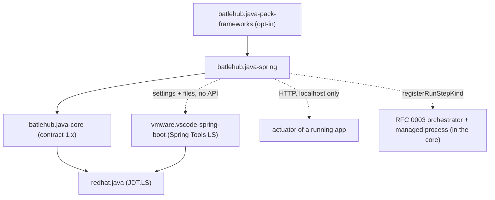
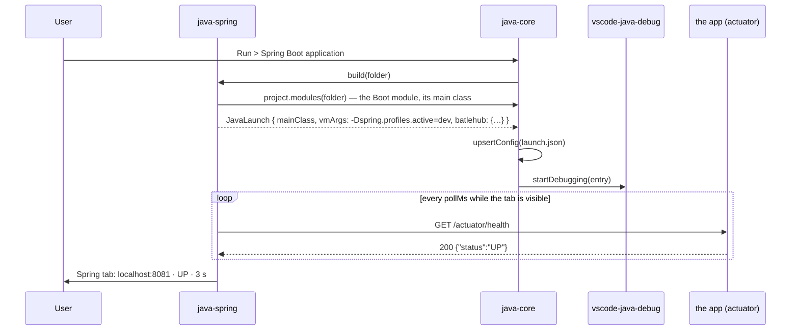

# RFC 0010 — Spring Boot satellite

| Field       | Value                                                        |
| ----------- | ------------------------------------------------------------ |
| Status      | Draft                                                         |
| Short       | Spring Boot                                                   |
| Settles     | Detection, properties completion, bean navigation, dashboard; relationship with vmware.vscode-spring-boot |
| Closes      | A.11 — Spring Boot (Team A) |
| Author      | Max Batleforc <maxleriche.60@gmail.com>                       |
| Co-author   | —                                                             |
| Created     | 2026-09-18                                                    |
| Revised     | 2026-09-18 — revision 2, after the series was reviewed against its goal (RFC 0001 §7.1): built together with RFC 0011 after RFC 0003's orchestrator, the bridge key written only when the Spring language server has no usable JDK ≥ 17, the main class from a file scan, the Boot version from POMs on disk and `~/.m2` only, the Spring Tools server counted as the workspace's one framework server, no contract version defined here, out of the default pack |
| Supersedes  | —                                                             |
| Depends on  | RFC 0001 (the core, its contract `extensions/java-core/api.d.ts`, the run editor and the `batlehub-java` task provider); RFC 0003 revision 2 (the orchestrator and the managed process only — a running application as a step with a declared cap, a readiness probe and a stop order; the server kinds moved to the parked RFC 0017), which comes before this RFC in RFC 0001 §14's order of work; RFC 0011, built together with this one (sixth in that order); RFC 0004 when it exists (devfile commands as run templates, for the Che case) — nothing here waits for it; needs members `manifest.writeSetting`, `registerRunTemplate`, `registerRunStepKind` — RFC 0001 §5.2 contract changelog |
| Touches     | `extensions/java-spring/` (new), `extensions/java-pack-frameworks/` (new, shared with RFC 0011), `extensions/java-core/api.d.ts` (the members of §5.2), `tests/heavy/fixtures/spring-boot/`, `tests/heavy/java.mjs`, `docs/guide/java/spring.md` |

---

## 1. Summary

A satellite, `batlehub.java-spring`, that makes a Spring Boot project a
first-class citizen of the Java panel without rebuilding what
`vmware.vscode-spring-boot` already does well. The satellite **bridges**
that extension: it detects Boot through the core's project model (the
starter parent or a `spring-boot-*` dependency in the POM or Gradle
script), hands the core's resolved JDK and run configurations to it, adds a
`Spring` tab to the Java panel (profiles, the actuator dashboard, dev tools),
and contributes one run template (`Spring Boot application`) whose
`launch.json` entry the stock debugger and Spring's own launcher both
understand. Properties completion, bean navigation and the live hover come
from the Spring Tools language server the VMware extension ships; the
satellite does not run a second one. Where that extension is absent, the
satellite says so once, and everything that does not need the language
server — detection, the tab, the template, the dashboard over actuator —
keeps working.

### Before / after

```text
# today
- a Boot project is "a Maven project": the explorer shows modules, the run
  editor offers Application / Remote, nothing knows what @SpringBootApplication is
- vmware.vscode-spring-boot, installed by hand, starts its language server on
  whatever JDK it finds (JAVA_HOME or PATH): in a Che workspace with mise and
  no global java, that is none — the same failure RFC 0001 §2 point 1 fixed
  for redhat.java
- spring.profiles.active lives in three places (launch.json, the terminal,
  application.yml) and none of them agrees with the Maven profile the core
  activates

# with this RFC
- the explorer marks the module "Spring Boot 3.5.4"; the Java panel gains a
  Spring tab: active Spring profiles, the running instances (port, health,
  uptime from actuator), Restart (dev tools) and Open (the mapped URL)
- Run > "Spring Boot application" template: main class detected, the
  active Spring profiles as -Dspring.profiles.active, the core's JDK
- vmware.vscode-spring-boot's server starts on the JDK the core resolved
  when it had no usable one of its own: only then does the satellite write
  spring-boot.ls.java.home, through the core's manifest
- nothing else changes: completion in application.yml, the bean hover and
  "Go to bean" are the VMware extension's, exactly as before
```

---

## 2. Motivation

1. **The VMware extension has the newcomer problem `redhat.java` had.**
   `vmware.vscode-spring-boot` starts its language server on
   `spring-boot.ls.java.home`, else `JAVA_HOME`, else `PATH`. RFC 0001
   §15.1 recorded that a fresh Che workspace with `mise` has none of the
   three, and the fix (`java.jdt.ls.java.home` written by the core) covers
   only JDT.LS. Today the second server silently never starts, and the
   user sees a Boot project with no properties completion and no idea why.
2. **Two profile systems, one project.** Maven profiles (RFC 0001 §4.2,
   `-P` on goals and m2e's preference for the import) and Spring profiles
   (`spring.profiles.active`) are different things that teams routinely
   pair (`-Pdev` ↔ `dev`). The run editor has no field for the Spring one,
   so it ends up hard-coded in `launch.json` `vmArgs`, and a copied
   configuration copies the wrong profile.
3. **The dashboard is the one Boot feature people name.** RFC 0001
   Appendix A.4 lists "run dashboard for several services" against
   `vmware.vscode-spring-boot`; that extension's dashboard was moved to a
   separate, since-archived extension (`vscode-spring-boot-dashboard`) and
   its live features depend on the app being launched *by* it, with the
   JMX agent attached. A Boot app started from a `batlehub-java` task, a
   devfile command or a plain terminal is invisible to it.
4. **Starting an application is a run step, not a debug session.** An
   acceptance run "start the app, wait for `/actuator/health`, run the
   tests, stop it" needs RFC 0003's ordered steps; Boot is the first
   concrete process kind that motivates the readiness probe, and this RFC
   is where the probe's URL and expected body come from.

### 2.1 Use cases

Each case is an acceptance scenario; the observable proof is what a step of
`tests/heavy/java.mjs` asserts when the case is driven (§10).

1. **A newcomer opens a Boot project in Che.** *Who:* a developer with
   `java-pack` and `vmware.vscode-spring-boot` installed, a workspace with
   `mise` and no global `java`. *Start:* `tests/heavy/fixtures/spring-boot`
   (parent `spring-boot-starter-parent:3.5.4`, one `@SpringBootApplication`,
   one `@RestController`, `application.yml` with a `dev` profile document,
   `spring-boot-starter-actuator`). *Action:* trust the workspace; the
   core resolves JDK 21 and writes `java.jdt.ls.java.home` (RFC 0001
   `NEWCOMER-OK`); the satellite activates on `workspaceContains:**/pom.xml`,
   detects Boot, sees that the Spring language server has no usable JDK
   ≥ 17 (§4.1) and writes `spring-boot.ls.java.home` (workspace scope,
   through `manifest.writeSetting`, shown once in the `Spring` tab with its
   undo). *Proof:* the channel `BatleHub Java: Spring`
   carries `detected Spring Boot 3.5.4 (maven, module spring-boot)` and
   `wrote spring-boot.ls.java.home`; after the reload, hovering `server.port`
   in `application.yml` shows the VMware extension's property documentation
   (`SPRING-LS-OK`).
2. **Run with the active Spring profiles.** *Start:* case 1, the panel's
   `Spring` tab shows the profiles declared in `application*.yml` and
   `application*.properties` (`default`, `dev`). *Action:* tick `dev`, then
   Run > `Spring Boot application`. *Proof:* `launch.json` gains one entry
   of `type: "java"` with `"vmArgs": "-Dspring.profiles.active=dev"` and
   `"batlehub": { "template": "spring-boot", "springProfiles": ["dev"] }`;
   the terminal shows `The following 1 profile is active: "dev"`; the
   `Spring` tab lists one instance `localhost:8081 · UP · 3 s` (the `dev`
   document sets `server.port: 8081`) (`SPRING-RUN-OK`).
3. **The dashboard sees an app it did not start.** *Start:* case 1, the
   app started from the `batlehub-java` task `spring-boot:run` (or a
   devfile command, RFC 0004). *Action:* none; the satellite polls
   `management.endpoints` on the ports the project declares. *Proof:* the
   instance row appears within 10 s with `UP` and the uptime; clicking
   `Open` opens `http://localhost:8080/` in the editor's simple browser;
   the row disappears within 10 s of `Ctrl+C` in the terminal
   (`SPRING-DASH-OK`).
4. **Dev tools restart.** *Start:* case 2 running, `spring-boot-devtools`
   on the classpath. *Action:* edit the controller's return string, save.
   *Proof:* the terminal shows `Restarting due to 1 class path change`
   within 5 s and the `Spring` tab's instance row's uptime resets; without
   devtools on the classpath the tab's `Restart` button is disabled with
   the tooltip "spring-boot-devtools is not on the classpath"
   (`SPRING-DEVTOOLS-OK`).
5. **The VMware extension is absent.** *Start:* case 1's fixture, the
   satellite installed, `vmware.vscode-spring-boot` uninstalled. *Action:*
   trust. *Proof:* one warning, once per session: "Spring Boot: properties
   completion and bean navigation need Spring Boot Tools
   (vmware.vscode-spring-boot) — Install"; the `Spring` tab, the template
   and the dashboard all work (cases 2–3 pass); `application.yml` keeps
   YAML colouring and nothing more (`SPRING-DEGRADED-OK`).
6. **An acceptance run (RFC 0003).** *Start:* case 2 plus a `launch.json`
   compound of RFC 0003's kind: step 1 `Spring Boot application` with
   readiness `GET http://localhost:8081/actuator/health` → `{"status":"UP"}`,
   step 2 the module's `mvn verify -Pit`, then reverse stop. *Action:* run
   the compound. *Proof:* the terminal order is start → `Started
   DemoApplication` → readiness `UP` in `n ms` → `BUILD SUCCESS` → the app's
   `Commencing graceful shutdown` (`SPRING-ACCEPT-OK`; the step engine's
   proof is RFC 0003's, this case is the Boot kind's).

---

## 3. Goals / non-goals

**Goals**

- A Boot project is recognised from the build model the core already has,
  not from a second scan.
- The VMware extension's language server runs on the JDK the core
  resolved, in the same workspace where `redhat.java` now does.
- Spring profiles are a run-editor field and a panel toggle, kept apart
  from Maven profiles and shown side by side.
- A dashboard that lists every running instance of the workspace's Boot
  apps, whoever started them, from actuator.
- One run template and one RFC 0003 process kind, `spring-boot`, with the
  actuator health probe as its readiness rule.
- Everything above degrades honestly without `vmware.vscode-spring-boot`.

**Non-goals**

- **A second Spring language server.** Spring Tools (`spring-boot-language-server`)
  is VMware's, Eclipse-licensed, 40 MB, and better than anything this
  repository would write; the satellite bridges it. If VMware's extension
  stops being maintained, the decision (§11 #1) is revisited, not
  pre-empted.
- **Endpoint mapping views, bean graph, request mapping CodeLens.** Spring
  Tools provides live hovers and "Go to symbol in workspace" for
  `@RequestMapping`; a tree of endpoints is a feature to earn after the
  dashboard is used.
- **Spring Initializr.** `vscjava.vscode-spring-initializr` exists; the
  pack may recommend it, this RFC does not wrap it.
- **Spring Cloud, Spring Batch, WebFlux-specific tooling.** Detection
  reports the starters; nothing is built on them here.
- **Kubernetes / Docker deployment of the app.** Che's devfile owns the
  container; RFC 0004 reads its commands.
- **Writing `application.yml`.** The satellite reads profile names; it
  never edits configuration files.

---

## 4. User-facing design

### 4.1 Configuration

```jsonc
"batlehub.java.spring.enabled": true,             // false: the satellite registers nothing (a plain Java project)
"batlehub.java.spring.activeProfiles": [],        // workspace scope; the Spring profiles the template passes
"batlehub.java.spring.dashboard.ports": [],       // absent: server.port / management.server.port read from the config files, else 8080
"batlehub.java.spring.dashboard.pollMs": 5000,    // actuator polling period while the tab is visible
"batlehub.java.spring.bridge": "auto",            // auto | never — write spring-boot.ls.java.home for the VMware extension
"batlehub.java.statusBar.items": { "spring.instances": false }  // RFC 0001's toggle; the satellite's item is hidden by default
```

- `activeProfiles` absent means the template passes no
  `-Dspring.profiles.active` and Boot's own default applies; empty means
  the same. The panel shows the profiles it found in
  `application*.{yml,yaml,properties}` (`spring.config.activate.on-profile`
  and the file suffix) as the pick list.
- `dashboard.ports` absent means detection: `server.port` and
  `management.server.port` for every profile document, with `8080` when
  nothing is set; `0` (random port) is listed as "random — start it from
  the editor to see it".
- `bridge: auto` writes `spring-boot.ls.java.home` **only when the Spring
  language server has no usable JDK ≥ 17** — the rule of the core's
  `java.jdt.ls.java.home` write as RFC 0001 §4.2 revision 7 states it
  ("only then"), through the same manifest, removed by the same command.
  The condition is not "nothing on `PATH`": a JDK 11 first on `PATH` is a
  JDK the server cannot start on, and revision 1 would have left that
  failure in place. It is read in two halves. *Off the other extension*:
  `vmware.vscode-spring-boot` is installed and its server is not running
  (its activation failed, or it is active with no language client up). *Off
  the machine*: none of the places that extension looks — the key itself,
  `JAVA_HOME`, the first `java` on `PATH` — names a JDK whose `release` file
  says ≥ 17 (a file read; nothing is executed, and a `mise` shim with no
  version set counts as none). A server that is running is never reloaded
  and the key is never written under it: the tab then shows which JDK it
  runs on, and a `Use the core's JDK` button if the two differ. A value the
  user already set is never overwritten.

### 4.2 Behaviour rules

- **Detection is a projection of the core's project model.** The satellite
  subscribes to `core.project.onDidChange` and reads each `Module`'s
  `buildFile`: a Maven module is Boot when its parent chain
  contains `org.springframework.boot:spring-boot-starter-parent` or a
  dependency's `groupId` is `org.springframework.boot`; a Gradle module
  when the script applies `org.springframework.boot` (`plugins {}` or
  `apply plugin`). The version is the parent's, the plugin's, or the
  `spring-boot-dependencies` BOM's. Detection reads files; it runs nothing
  (RFC 0001 decision 40 applies to the satellite as to the core).
- **The parent chain is walked without Maven.** Each `<parent>` is looked
  up in two places only: on disk through `<relativePath>` (default
  `../pom.xml`), then in `~/.m2/repository/<group>/<artifact>/<version>/`
  for the `.pom` — a known place outside the workspace, a fact and not an
  input (RFC 0001 §7.1). No `mvn help:effective-pom`, no network. A
  corporate parent that is not in `~/.m2` yet ends the walk: a module with
  a direct `org.springframework.boot` dependency is still detected, and the
  tab shows `Spring Boot (version unknown — parent <g:a:v> is not in
  ~/.m2; build once and press Detect)`; a module whose only link to Boot
  was through that parent is not detected until then, and the channel says
  which parent stopped the walk. A `${property}` version is resolved from
  the same chain or shown as written.
- **Registration** at activation: `assertContract(1)`, then
  `registerPanelTab("spring")` and `registerStatusBarItem("spring.instances",
  defaultShown: false)`; the run template is registered through
  `registerRunTemplate` (§5.2).
- **The template.** `Spring Boot application` produces a `launch.json`
  entry of `type: "java"`, `request: "launch"`, `mainClass` = the class
  annotated `@SpringBootApplication`, found by a **file scan** of the
  module's source roots (`project.sourceRoots`; a text match on the
  annotation, then the file's `package` and type name). Revision 1 asked
  JDT.LS's workspace symbols "via the core", a capability the contract does
  not have; a member for one lookup the scan already answers — in every
  server mode, LightWeight included — is not asked for (§11 decision 6). A
  meta-annotation the scan cannot see falls to the hand-typed field, as
  several candidates fall to the question of §4.3. `projectName` = the
  module, `vmArgs` carrying
  `-Dspring.profiles.active=<activeProfiles>` when the list is not empty,
  and `"batlehub": { "template": "spring-boot", "springProfiles": [...] }`
  — the block RFC 0001 §4.2 reserves, ignored by the debugger. Switching
  the active profiles in the panel rewrites `vmArgs` of every entry whose
  `batlehub.template` is `spring-boot` (jsonc edits, comments kept, RFC
  0001 feedback 6); an entry the user edited by hand into a different
  `-Dspring.profiles.active` is left alone and listed as "set by you".
- **Maven and Spring profiles side by side.** The `Spring` tab shows two
  rows: `Maven profiles: dev` (read-only, a link to the `Profiles` tab) and
  `Spring profiles: [ ] default [x] dev`. The satellite never pairs them
  automatically; a `Pair with the Maven profile of the same name` button
  ticks the Spring ones whose name matches an active Maven profile, once,
  on click.
- **The dashboard** polls `http://localhost:<port>/actuator/health` and
  `/actuator/info` for every port of `dashboard.ports` (detected or set),
  while the tab is visible and at most every `pollMs`; a `200` with a
  `status` field is an instance row (`port · status · uptime · profiles`
  when `/actuator/env` is exposed, else `port · status`). `Open` opens the
  root URL in the editor's simple browser; `Stop` is enabled only for an
  instance the editor started (a run configuration or a task the satellite
  can address; RFC 0003 gives it the process handle) and otherwise says
  "started outside the editor". Polling stops when the tab is hidden and
  the status bar item is off.
- **Dev tools.** `Restart` sends an empty `POST /actuator/restart` when the
  endpoint is exposed, else touches `.reloadtrigger` in the module's
  resources when `spring.devtools.restart.trigger-file` names it, else is
  disabled with the reason. Nothing is written into the user's sources.
- **The bridge.** With `vmware.vscode-spring-boot` installed the satellite
  (a) writes `spring-boot.ls.java.home` per §4.1 — a foreign setting
  written by default, so under the default-on rule of RFC 0001 §7.1:
  workspace scope, through `manifest.writeSetting`, shown once in the tab
  with its undo, never over a user value — (b) leaves its settings
  alone otherwise, and (c) calls none of its commands: the two extensions
  coexist through settings and files, not an API. The satellite's own
  channel logs the write.
- **Memory: the Spring Tools language server is a second JVM**, beside
  JDT.LS, and it is the *one framework server* of the default set (RFC 0001
  §7.1). VMware's extension starts it, not the core, so it cannot go through
  the managed process; the satellite declares it to the core's resource
  diagnostic as an **estimate** — the `-Xmx` of `spring-boot.ls.vmargs` when
  set, else VMware's default, with RFC 0003 §4.2's heap-to-resident margin —
  and the `JDK` tab's resources line labels it `spring-ls ~N MiB
  (estimate, started by vmware.vscode-spring-boot)`. How an estimate reaches
  the sum is §11 open question 4. The application itself, run as an RFC 0003
  step, declares its `memoryMiB` like any step.
- **RFC 0003 kind.** The satellite registers the process kind
  `spring-boot`: start = the template's launch; readiness = `GET
  /actuator/health` returning `status: UP` (URL from the resolved port,
  timeout 120 s, `HEAVY_PERF_FACTOR` widens it in the suite); stop =
  `POST /actuator/shutdown` when exposed, else `SIGTERM` and Boot's
  graceful shutdown; a default `memoryMiB` the step may override. The kind
  is data handed to RFC 0003's engine through `registerRunStepKind`; the
  engine owns ordering, the terminal, the cap's sum and the peak RSS.
- **Trust.** Untrusted workspace: detection reads, the tab shows what it
  read, the template is not offered, the dashboard does not poll (a
  request to a port is an action the workspace could have arranged).
- **Removal.** `Java: Remove BatleHub settings` (RFC 0001) restores
  `spring-boot.ls.java.home` and `batlehub.java.spring.*` workspace keys
  from the manifest; `launch.json` entries are asked, as always.

### 4.3 Validation

Hard errors (notification, feature disabled until fixed):

| Condition | Rationale |
| --- | --- |
| Core contract major ≠ 1 | RFC 0001 §4.3: mixing majors gives wrong trees, not errors |
| A member of §5.2 missing from the installed core | an older core: one notification naming the member and the core version that has it; the satellite registers nothing rather than half of itself |
| A Boot module and no JDK ≥ 17 resolved by the core | Boot 3 requires 17; the template would write a configuration that cannot run — the tab links `Java: Install a JDK…` |

Warnings (once per session, details in `BatleHub Java: Spring`):

| Condition | Behaviour |
| --- | --- |
| `vmware.vscode-spring-boot` absent | one notification with `Install`; tab, template and dashboard work; no completion |
| `spring-boot-starter-actuator` absent from the module | dashboard row says "no actuator: add spring-boot-starter-actuator to see health" — the template still runs |
| `management.endpoints.web.exposure.include` does not expose `env`/`restart`/`shutdown` | the affected column or button is disabled with the endpoint named |
| `server.port: 0` | listed as random; an instance is shown only when started by the editor (the log line `Tomcat started on port` is parsed) |
| Several `@SpringBootApplication` classes in one module | the template asks which; the answer goes into the entry, not into settings |

---

## 5. Architecture

### 5.1 Where the satellite sits



The invariant RFC 0001 §5.1 states holds: **the satellite never talks to
JDT.LS.** The main-class lookup is a file scan over the source roots
`core.project` lists (§4.2) — nothing is forwarded to JDT.LS on the
satellite's behalf — the JDK comes through `core.jdk`,
and the VMware extension is reached through a settings key it documents,
so no version of it is pinned.

### 5.2 Members needed from the contract

This RFC defines no contract version. It needs three members —
`registerRunTemplate`, `manifest.writeSetting`, `registerRunStepKind` — all
rows of the [RFC 0001 §5.2 contract changelog](/rfc/0001-java-env#contract-changelog),
where the version they land in is written once. The shape this RFC asks of
the first:

```ts
export interface RunTemplate {
  id: string;                       // "spring-boot"
  title: string;                    // "Spring Boot application"
  /** Only offered when it returns true for the folder (a Boot module exists). */
  applies(folder: vscode.WorkspaceFolder): Promise<boolean>;
  /** The entry to write; the core edits launch.json (jsonc, comments kept). */
  build(folder: vscode.WorkspaceFolder): Promise<JavaLaunch>;
}
export interface JavaCoreApi {
  // …
  registerRunTemplate(t: RunTemplate): vscode.Disposable;
}
```

`JavaLaunch` is `extensions/java-core/src/run/configs.ts`'s type, already
exported for the editor; the core's `TEMPLATES` table gains registered
entries beside its built-in `Application` and `Remote`. `registerRunStepKind`
is RFC 0003's, which is built before this RFC (RFC 0001 §14): the kind is
always registered, and there is no engine-absent path to design.

### 5.3 A run, end to end



---

## 6. Detailed design

### 6.1 `extensions/java-spring`

```
src/extension.ts        activation: assertContract, registerPanelTab, registerStatusBarItem, registerRunTemplate, registerRunStepKind
src/detect.ts           pure: Module[] + file contents → BootModule[] { module, version | unknown(parent), tool, mainClassCandidates, starters }
src/parents.ts          pure over a reader: the <parent> walk through relativePath and ~/.m2, nothing run
src/mainclass.ts        pure: source text → @SpringBootApplication candidates (package + type)
src/profiles.ts         pure: application*.{yml,yaml,properties} → declared profiles; server.port per profile
src/template.ts         pure: BootModule + activeProfiles → JavaLaunch; rewrite of vmArgs on profile change
src/actuator.ts         fetch over http to localhost; health/info/env → InstanceRow; the poller
src/bridge.ts           pure rule usableJdk(key, JAVA_HOME, PATH java, release files) + the write through manifest.writeSetting; the once-per-session notice
src/tab.ts              the Spring tab's HTML (tokens only) and its messages
src/kind.ts             the RFC 0003 process kind (readiness probe, stop)
test/*.test.ts          vitest over the pure modules with fixtures of real POMs, scripts and config files
```

- `package.json`: `activationEvents: ["workspaceContains:**/pom.xml",
  "workspaceContains:**/build.gradle", "workspaceContains:**/build.gradle.kts"]`
  — the core's own events; `extensionDependencies: ["batlehub.java-core"]`,
  as RFC 0008 §6.1 has it: a satellite is dead without the core, so the
  editor installs and activates the core first, a disabled core makes the
  editor refuse the satellite with its own message, and `assertContract`
  is left with the one question it answers — the version. The soft
  dependency (RFC 0001 decision 41's shape) is `vmware.vscode-spring-boot`.
  No `contributes.languages`:
  YAML and properties are the editor's.
- `detect.ts` reads the POM through the core's Maven provider output
  (`BuildDescriptor`, `Module.buildFile`) and parses only what it needs
  (`<parent>`, `<dependencies>`, `<dependencyManagement>`) with the same
  minimal XML reader `src/build/maven/pom.ts` uses — as a 40-line local
  reader; exporting the core's is a contract member for one consumer and is
  not asked for. `parents.ts` reads the chain as §4.2 says.
- `actuator.ts` uses Node's `fetch` with a 2 s timeout, `localhost` only,
  no redirects, response capped at 64 KB, JSON parsed defensively; every
  field shown is escaped by `tab.ts` (`tabHtml`'s escaping in
  `java-groovy/src/server.ts` is the model).
- `bridge.ts` writes through `manifest.writeSetting(key, value)` (needs
  that member — contract changelog, §5.2), so the satellite's write is
  removable by the core's command like the core's own. The satellite keeps
  no `written.json`.

### 6.2 `extensions/java-core`

- `api.d.ts`: `registerRunTemplate`, `manifest.writeSetting`
  (`registerRunStepKind` is RFC 0003's) — as the contract changelog
  schedules them.
- `src/run/configs.ts`: `TEMPLATES` becomes the built-ins plus the
  registered ones; `src/run/editor.ts`'s quick input lists them together.
- `src/project/explorer.ts`: a module description suffix (`Spring Boot
  3.5.4`) from an optional `decorate(module)` the satellite registers —
  or nothing, if the tab is enough (§11 open 2).

### 6.3 `extensions/java-pack-frameworks` (new, shared with RFC 0011)

- `java-pack` is unchanged: its default set is JDT.LS plus one framework
  server, and which framework is the workspace's choice, not the pack's
  (RFC 0001 §7.1; RFC 0011 §11 decision 8). `java-pack-frameworks` lists
  `batlehub.java-spring` and `batlehub.java-quarkus`; both are inert without
  their framework's module, and `vmware.vscode-spring-boot` is
  *recommended* by the workspace (`.vscode/extensions.json`, the devfile),
  so the second JVM exists only where a Boot project does.

### 6.4 Fixtures and the suite

- `tests/heavy/fixtures/spring-boot/`: Maven, parent
  `spring-boot-starter-parent:3.5.4`, `web`, `actuator`, `devtools`,
  `application.yml` with two documents (`default` on 8080, `dev` on 8081),
  `management.endpoints.web.exposure.include: health,info,env,restart`,
  built once (`task heavy:fixtures`) so `~/.m2` is warm — the lesson of
  RFC 0001 §15.5.
- `tests/heavy/java.mjs` gains a `spring` phase behind `HEAVY_ONLY=spring`
  driving §2.1's cases 1–5 (case 6 belongs to RFC 0003's half).

**Deliberately untouched**, so reviewers do not go looking:

- `extensions/java-core/src/build/maven/*` — profile handling stays Maven's;
  the Spring list is the satellite's.
- `vmware.vscode-spring-boot`'s settings other than `spring-boot.ls.java.home`
  — nothing is quieted; it contributes no duplicate view.
- `extensions/java-groovy` — unrelated; a Gradle-Groovy Boot script is
  detected through the core's Gradle provider, not the Groovy server.

---

## 7. Security considerations

- **The dashboard talks HTTP to `localhost` and nowhere else.** Ports come
  from the workspace's config files or a setting the user wrote; the URL
  is built from `http://localhost:<port>` and a fixed path list, never
  from a value the response contains. A malicious workspace can at most
  make the editor poll a local port it names — the same port it could
  bind itself. Responses are size-capped and treated as untrusted data;
  every string rendered in the tab is escaped.
- **`POST /actuator/restart` and `/actuator/shutdown` are actions**, sent
  only on a click, only to an instance the workspace's own configuration
  exposed, and only in a trusted workspace. The satellite never enables
  an endpoint: exposure is the user's `application.yml`.
- **The bridge writes one settings key** (`spring-boot.ls.java.home`) with
  a path the core already trusted as a JDK, at workspace scope, through
  the manifest; it is removed by the core's removal command.
- **"Loopback" in a Che pod is the pod's network namespace**, shared with
  its sidecars: the dashboard can reach what a terminal in the same pod
  could already reach with `curl`, and nothing more.
- **Nothing runs before trust.** Detection reads POMs and YAML; the
  template is not offered, the poller does not start.
- **No new credentials, no network beyond loopback.** The registry link
  (RFC 0001) is untouched; a Boot build resolves through it exactly as any
  Maven build.

### Red lines

- **Every write is in the manifest.** One foreign setting,
  `spring-boot.ls.java.home`, and the satellite's own
  `batlehub.java.spring.*` workspace keys, all through
  `manifest.writeSetting`; no file, no mode, no `written.json` of the
  satellite's. `Java: Remove BatleHub settings` undoes them. The
  `launch.json` entry the template writes is the run editor's, asked about
  on removal as RFC 0001 has it; `.reloadtrigger` is touched only when the
  user's own configuration names it.
- **The token is the core's.** Does not apply: no registry credential is
  read, held or written here; a Boot build resolves through the blocks the
  core wrote.
- **Memory.** The satellite starts no long-lived process of its own. The
  application as an RFC 0003 step goes through the core's managed process
  with the step's declared `memoryMiB`. The Spring Tools language server is
  the workspace's one framework server of the default set; it is VMware's
  child, so the diagnostic counts it as an estimate and says so (§4.2),
  against the pod's 8 GiB request. A second framework server in the same
  workspace (Quarkus' beside it) is opt-in, offered by the diagnostic.
- **Defaults crossed.** One: `spring-boot.ls.java.home` is a foreign
  setting written by default, because without it the newcomer's Spring
  server never starts and nothing says why (§2 point 1) — under the
  default-on rule: workspace scope, manifest, shown once in the tab with its
  undo, never over a user value, and only when that server has no usable
  JDK ≥ 17. Bridge rather than rebuild is decision 1; nothing is downloaded
  at runtime; actuator responses stay on loopback and no source or comment
  text goes to a third party.

---

## 8. Alternatives considered

| Alternative | Why rejected |
| --- | --- |
| Ship Spring Tools' language server in the satellite (as `java-groovy` ships its server) | 40 MB, EPL, a release cadence of its own, and it *is* `vmware.vscode-spring-boot` minus the UI. Bridging costs one settings key; shipping costs a fork to maintain. |
| Call the VMware extension's commands / read its exports | It exports no stable API; its commands change names between releases. Settings and files are the contract it documents. |
| Replace the VMware extension entirely (RFC 0001 "coexist or replace") | Its live hover and bean navigation come from the running app's JMX agent, which its launcher attaches; that is deep work the satellite would redo for no gain. Kept as the trigger of §11 #1 if maintenance stops. |
| Put Spring profiles into the core's `Profiles` tab beside Maven's | Two profile systems in one list is the confusion §2 point 2 describes; side by side with an explicit pairing button keeps them distinct. |
| JMX (`spring-boot-admin`-style) instead of actuator HTTP for the dashboard | Needs the app started with the agent, exactly the limitation of the archived VMware dashboard; HTTP sees any instance with actuator on. |
| A separate `spring-dashboard` view container | The Java panel's tab registry exists for this; a second container is a second place to look. |

---

## 9. Rollout and compatibility

- **Default behaviour**: the satellite is inert in a workspace with no Boot
  module (no tab, no template, no polling). With a Boot module and the
  VMware extension installed, the only write is `spring-boot.ls.java.home`
  when the bridge rule fires.
- **Config migration**: none; every key is new.
- **Prerequisites**: a `java-core` carrying the members of §5.2 and RFC
  0003's orchestrator; Boot ≥ 2.7 for
  actuator paths as used (`/actuator/*`); the VMware extension for
  completion.
- **Rollback**: uninstall the satellite; `Java: Remove BatleHub settings`
  restores the bridged key; `launch.json` entries carry
  `batlehub.template` so they can be found and removed by hand or by the
  core's command.
- **Order**: sixth in RFC 0001 §14's order of work, together with RFC
  0011, after RFC 0003's orchestrator and managed process — so the kind is
  always registered and no engine-absent variant ships.

---

## 10. Test plan

- **Unit** (`extensions/java-spring/test/*.test.ts`, vitest, no `vscode`):
  `detect.ts` on real POMs (parent, BOM-only, Gradle `plugins {}`, Gradle
  Kotlin DSL, a non-Boot project), `profiles.ts` on multi-document YAML
  and suffixed files (`application-dev.properties`), port precedence,
  `parents.ts` (a parent through `relativePath`, one in a fixture `~/.m2`,
  one in neither → `unknown` with the parent named), `mainclass.ts` (one
  candidate, several, none, the annotation in a comment ignored),
  `bridge.ts`'s table (nothing anywhere → write; **JDK 11 on `PATH` →
  write**; JDK 21 on `JAVA_HOME` → keep; a user value → keep; server
  running → never),
  `template.ts` round trip (comments and unknown keys of `launch.json`
  kept; a hand-edited `vmArgs` left alone), `actuator.ts` on canned
  responses (UP, DOWN, a 64 KB+ body cut, a non-JSON body), `kind.ts`'s
  readiness decision table.
- **Layer 2** (`extensions/java-spring/test-host/`): activation against
  the core, the tab registered, the template listed, the bridged key
  written and restored by the removal command.
- **Heavy** (`tests/heavy/java.mjs`, `HEAVY_ONLY=spring`): §2.1 cases 1–5,
  each a named step (`SPRING-LS-OK`, `SPRING-RUN-OK`, `SPRING-DASH-OK`,
  `SPRING-DEVTOOLS-OK`, `SPRING-DEGRADED-OK`), the fixture pre-built,
  the VMware extension installed from Open VSX and pinned like
  `redhat.java`; case 6 in RFC 0003's half, which exists by then.
- **Existing suites** that must pass unchanged: the core's 48 unit tests
  and the `java` heavy half (the new members must not change a
  1.0 satellite's behaviour — `java-groovy`'s `tests/contract/run.sh` is
  the guard).

---

## 11. Decisions and open questions

### Resolved

| # | Question | Decision |
| --- | --- | --- |
| 1 | Bridge, coexist or replace `vmware.vscode-spring-boot`? | **Bridge.** One settings key gives it the JDK; everything else it does, it does better than a rewrite would. Revisit only if it stops being maintained. |
| 2 | Where does the dashboard get its data? | **Actuator over loopback HTTP**, so an app started by a task, a devfile command or a terminal is visible; JMX would see only what the editor launched. |
| 3 | Spring profiles in the Maven `Profiles` tab? | **No — their own row in the `Spring` tab**, with an explicit pairing button. Two systems, two lists. |
| 4 | A second language server? | **No.** Non-goal; the satellite degrades to tab + template + dashboard without the VMware extension. |
| 5 | Contract change | **None defined here.** Needs `registerRunTemplate`, `manifest.writeSetting` and `registerRunStepKind` — [RFC 0001 §5.2 contract changelog](/rfc/0001-java-env#contract-changelog), the one place the next version is written. |
| 6 | How is the main class found? | **A file scan of the module's source roots.** The workspace-symbol lookup of revision 1 needs a core capability that is not on the contract; a member for one lookup, that would also not work in LightWeight, loses to forty lines that work everywhere. Reopened by a diary entry where the scan picked wrong. |
| 7 | The Boot version without running Maven? | **The parent chain from POM files on disk and `~/.m2` only**; when a parent is not resolvable offline the tab says `version unknown`, names the parent and what to do (§4.2). |
| 8 | When is the bridge key written? | **Only when the Spring language server has no usable JDK ≥ 17**, read off VMware's extension and the places it looks — not "nothing on `PATH`", which kept the failure when a wrong JDK was there. A running server is never reloaded (RFC 0001 §4.2 revision 7). |
| 9 | The core absent? | **`extensionDependencies: ["batlehub.java-core"]`**, consistent with RFC 0008: the editor guarantees the core, `assertContract` checks the version only. |
| 10 | In the pack? | **No — `java-pack-frameworks`**, shared with RFC 0011 (its decision 8); the Spring Tools server is the workspace's one framework server. |
| 11 | Where in the order of work | **Sixth, together with RFC 0011, after RFC 0003** (RFC 0001 §14): Team A's most used stacks. |

### Still open

1. **Explorer decoration.** Does the explorer need "Spring Boot 3.5.4" on
   the module, or is the tab enough? Recommendation: the tab, until
   someone asks; a decoration is a contract member for one consumer.
2. **Gradle detection depth.** Reading `plugins { id "org.springframework.boot" }`
   from the script is enough for the common case; a plugin applied from a
   convention plugin in `buildSrc` is invisible without running Gradle.
   Recommendation: script-only detection plus a `Detect` button that
   runs `gradle properties` when the workspace is trusted, in a later
   phase.
3. **The `Stop` button for instances started outside the editor.** `POST
   /actuator/shutdown` works when exposed but is rarely exposed;
   recommendation: disabled with the reason, no process hunting by port.
4. **How an estimate reaches the resource diagnostic.** RFC 0003 §4.2 sums
   JDT.LS (from `java.jdt.ls.vmargs`) and every managed process; a JVM
   another extension starts — the Spring Tools server here, Quarkus' in RFC
   0011, Metals in RFC 0009 — is neither. Recommendation: an `estimate`
   form of the managed-process declaration (an id, a `memoryMiB`, a label,
   nothing started), added as a row of the contract changelog by RFC 0003;
   not a Spring-specific read of `spring-boot.ls.vmargs` inside the core.
   To settle with RFC 0003 before phase 2.

---

## 12. Implementation phases

| Phase | Content |
| --- | --- |
| 1 | The members of §5.2 in the core, as the contract changelog schedules them — one change shared with RFC 0011's phase 1 and RFC 0003's phase 4, not three; `java-groovy` contract test green against it. Starts after RFC 0003's orchestrator |
| 2 | `java-spring` v0.1: detection, the bridge, the `Spring` tab with profiles, the template; fixture; cases 1, 2, 5 in the heavy suite |
| 3 | v0.2: the actuator dashboard and the status bar item; cases 3, 4 |
| 4 | v0.3: the RFC 0003 process kind and case 6 (the engine is there: RFC 0003 precedes this RFC) |
| 5 | `java-pack-frameworks` with RFC 0011; `docs/guide/java/spring.md` |
