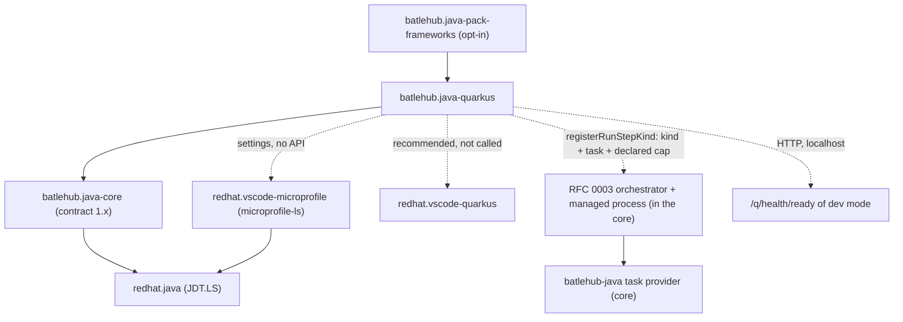
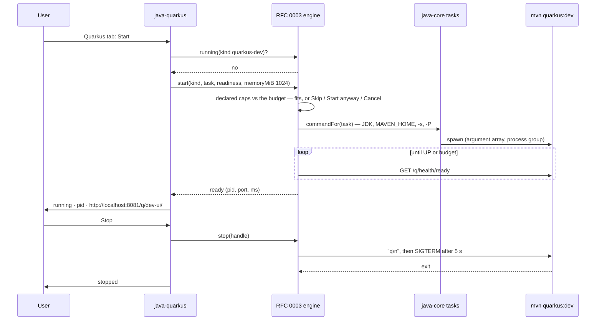
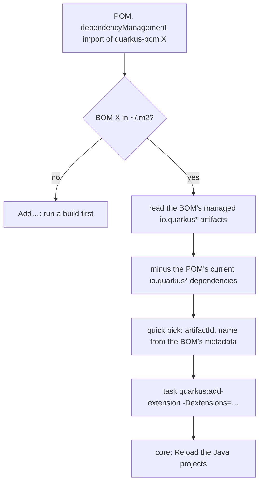

# RFC 0011 — Quarkus satellite

| Field       | Value                                                        |
| ----------- | ------------------------------------------------------------ |
| Status      | Draft                                                         |
| Short       | Quarkus                                                       |
| Settles     | Dev mode as a managed process, properties, extensions; relationship with redhat.vscode-quarkus |
| Closes      | A.11 — Quarkus (Team A) |
| Author      | Max Batleforc <maxleriche.60@gmail.com>                       |
| Co-author   | —                                                             |
| Created     | 2026-09-18                                                    |
| Revised     | 2026-09-18 — revision 2, after the series was reviewed against its goal (RFC 0001 §7.1): built together with RFC 0010 after RFC 0003's orchestrator, dev mode a managed process with a declared cap and no untracked fallback, the log-line probe and the pack question resolved, the Dev UI's "loopback" stated for a Che pod, no contract version defined here |
| Supersedes  | —                                                             |
| Depends on  | RFC 0001 (the core, its contract, the `batlehub-java` task provider, the registry link); RFC 0003 revision 2 (the orchestrator and the managed process only — dev mode is a managed process with a declared cap, a readiness probe and a stop order; the server kinds moved to the parked RFC 0017), which comes before this RFC in RFC 0001 §14's order of work; RFC 0010 (the bridge pattern), built together with this one (sixth in that order); needs members `manifest.writeSetting`, `process.start`, `registerRunStepKind`, `registerRunTemplate` — RFC 0001 §5.2 contract changelog |
| Touches     | `extensions/java-quarkus/` (new), `extensions/java-pack-frameworks/` (new, shared with RFC 0010), `tests/heavy/fixtures/quarkus/`, `tests/heavy/java.mjs`, `docs/guide/java/quarkus.md` |

---

## 1. Summary

A satellite, `batlehub.java-quarkus`, built on the same decision as RFC
0010: **bridge** the Red Hat pair (`redhat.vscode-quarkus` for the project
wizard, the extensions catalogue and the dev-mode command,
`redhat.vscode-microprofile` for `application.properties` completion,
whose MicroProfile language server runs on a JDK it finds by itself) and
add what a Che workspace needs around them. The satellite detects Quarkus
from the core's project model (the `quarkus-bom` import or the
`quarkus-maven-plugin` / `io.quarkus` Gradle plugin), gives the MicroProfile
server the JDK the core resolved, runs **dev mode as an RFC 0003 managed
process** with a declared memory cap, the readiness probe on
`/q/health/ready` and a real stop
(`quarkus:dev` does not die with its terminal), adds a `Quarkus` tab to the
Java panel (dev mode state, the Dev UI link, the installed extensions with
add / remove through the Maven plugin or the Gradle task), and one run
template, `Quarkus dev mode`, that is a task rather than a debug session,
with the debugger attached on request through Quarkus's own `5005` port.

### Before / after

```text
# today
- `Quarkus: Debug current project` in redhat.vscode-quarkus runs mvnw from
  a terminal it owns, on JAVA_HOME; in a Che workspace with mise and no
  global java that is "JAVA_HOME is not defined correctly"
- dev mode started from a terminal keeps running after the terminal is
  closed; the next start fails with "Port 8080 already in use"
- the extensions list (quarkus ext list) is a command to remember, and
  "add an extension" edits the POM behind the editor's back — the core's
  explorer does not refresh until the next import

# with this RFC
- Run > "Quarkus dev mode": the core's JDK in JAVA_HOME, the active Maven
  configuration and profiles, the registry link's settings.xml — the same
  environment as every batlehub-java task; readiness on /q/health/ready,
  stop order honoured, the process tracked so a second start is refused
  with "dev mode is running (pid, port) — Stop?"
- Quarkus tab: state · http://localhost:8080/q/dev-ui/ · the extensions
  installed with [Add…] [Remove], the POM change re-imported through the core
- application.properties completion is redhat.vscode-microprofile's, its
  server started on the JDK the core resolved (the bridged settings key)
```

---

## 2. Motivation

1. **Dev mode is a long-running child the editor loses track of.**
   `quarkus:dev` and `quarkusDev` run until killed, hold `8080` and
   `5005`, and survive a closed terminal. RFC 0001's task provider runs a
   goal to completion; a process that must be *stopped* is RFC 0003's
   engine, and Quarkus is its second concrete kind after Boot, with a
   different shape: a build-tool task, not a `java` launch.
2. **The MicroProfile language server has the newcomer problem too.**
   `redhat.vscode-microprofile` starts `microprofile-ls` on
   `microprofile.tools.server.java.home` (a documented key), else
   `JAVA_HOME`, else `PATH`; RFC 0001 §15.1's workspace has none. The
   bridge is one settings key, as in RFC 0010.
3. **The extensions catalogue is a POM edit nobody sees.** `quarkus ext
   add` (the CLI) or `mvn quarkus:add-extension` writes the POM; the
   explorer (RFC 0001 phase 4) and JDT.LS both need a re-import to notice.
   The satellite routes the edit through the core's task provider and
   asks for the re-import the same way a Maven profile switch does.
4. **The debugger attaches, it does not launch.** Quarkus dev mode opens
   `5005` for a remote debugger; a `launch` entry running the main class
   is wrong (no hot reload, no Dev UI). The template must be an attach
   entry plus a task, which the run editor's `Remote` template does not
   pair today.

### 2.1 Use cases

1. **A newcomer opens a Quarkus project in Che.** *Who:* a developer with
   `java-pack`, `redhat.vscode-quarkus` and `redhat.vscode-microprofile`
   installed; `mise` and no global `java`. *Start:*
   `tests/heavy/fixtures/quarkus` (Maven, `quarkus-bom` 3.26.x imported,
   `quarkus-rest`, `quarkus-smallrye-health`, one `@Path("/hello")`
   resource, `application.properties` with `quarkus.http.port=8080` and
   `%dev.quarkus.http.port=8081`). *Action:* trust; the core writes
   `java.jdt.ls.java.home` (RFC 0001 `NEWCOMER-OK`); the satellite detects
   Quarkus, sees that the MicroProfile server has no usable JDK ≥ 17
   (§4.1) and writes `microprofile.tools.server.java.home` through
   `manifest.writeSetting`, shown once in the tab with its undo. *Proof:*
   `BatleHub Java: Quarkus` logs `detected Quarkus 3.26.2 (maven, module
   quarkus)` and `wrote microprofile.tools.server.java.home`; after the
   reload, typing `quarkus.http.` in `application.properties` offers
   `quarkus.http.port` with its documentation (`QUARKUS-LS-OK`).
2. **Dev mode as a managed process.** *Start:* case 1. *Action:* Run >
   `Quarkus dev mode`. *Proof:* a terminal `batlehub-java: quarkus dev`
   runs `<MAVEN_HOME>/bin/mvn -s <active settings> -P<active profiles> quarkus:dev` with `JAVA_HOME` = the core's JDK; the readiness probe
   `GET http://localhost:8081/q/health/ready` returns `{"status":"UP"}`
   within the budget; the `JDK` tab's resources line lists `quarkus-dev
   1 024 MiB declared`; the `Quarkus` tab shows `dev mode · running · pid
   n · http://localhost:8081/q/dev-ui/`; the status bar item (hidden by
   default, toggled through `batlehub.java.statusBar.items`) reads
   `$(play) Quarkus` (`QUARKUS-DEV-OK`).
3. **Stop, and a refused double start.** *Start:* case 2 running.
   *Action:* Run > `Quarkus dev mode` again, then `Stop` in the tab.
   *Proof:* the second run is refused with the notification "Quarkus dev
   mode is already running (pid n, port 8081) — Stop / Open Dev UI"; on
   `Stop` the process tree receives `q` on stdin then `SIGTERM` after
   5 s, the terminal shows `Quarkus stopped`, the port is free (the driver
   binds 8081 successfully), the tab reads `dev mode · stopped`
   (`QUARKUS-STOP-OK`).
4. **Attach the debugger.** *Start:* case 2 running with `5005` open
   (dev mode's default). *Action:* the tab's `Debug` button, or the
   `launch.json` attach entry the template wrote alongside
   (`"batlehub": { "template": "quarkus-dev-attach" }`, `hostName:
   localhost`, `port: 5005`). *Proof:* a breakpoint in the resource
   method is hit when the driver requests `GET /hello`; `vscode-java-debug`
   absent → the button says "needs Language Support for Java debugger"
   (`QUARKUS-DEBUG-OK`).
5. **Add and remove an extension.** *Start:* case 1, dev mode stopped.
   *Action:* tab `Add…` → pick `quarkus-jackson` from the catalogue the
   satellite reads from the resolved `quarkus-bom` (no network). *Proof:*
   the task `mvn quarkus:add-extension -Dextensions=jackson` runs to
   `BUILD SUCCESS`; the POM gains the dependency; the core re-imports
   (`Java: Reload the Java projects` sent by the satellite through the
   core) and the explorer's dependency node lists `quarkus-jackson`;
   `Remove` runs `quarkus:remove-extension` and the node is gone
   (`QUARKUS-EXT-OK`).
6. **Red Hat's extensions are absent.** *Start:* case 1's fixture, only
   the satellite installed. *Action:* trust. *Proof:* one warning naming
   both extensions with `Install`; cases 2, 3 and 5 pass unchanged (they
   need neither); `application.properties` has no completion
   (`QUARKUS-DEGRADED-OK`).

---

## 3. Goals / non-goals

**Goals**

- Quarkus is recognised from the core's build model; no second scan.
- Dev mode is started, probed, stopped and refused-when-running by the
  editor, with the same environment as any `batlehub-java` task.
- The MicroProfile language server runs on the JDK the core resolved.
- The extensions catalogue is a panel affordance that goes through the
  build tool and the core's re-import, offline.
- Debugging dev mode is one click, as an attach.
- Honest degradation without the Red Hat pair.

**Non-goals**

- **A second MicroProfile / Quarkus language server.** `microprofile-ls`
  and the Quarkus JDT extension (`com.redhat.microprofile.jdt.quarkus`,
  a `javaExtensions` bundle like ours) are Red Hat's; the satellite
  bridges them.
- **The project wizard** (`Quarkus: Generate a Quarkus project`).
  `redhat.vscode-quarkus` has it, online; the pack recommends it.
- **Native image builds** (`-Dnative`). A goal the task provider already
  runs; nothing Quarkus-specific to add until GraalVM detection is a
  request (a JDK vendor, RFC 0001's `Runtime.vendor` carries it).
- **Continuous testing UI** (`r` in dev mode). The terminal has it; a
  view over its output is a feature to earn.
- **Kubernetes / OpenShift deployment** (`quarkus-kubernetes`,
  `quarkus-openshift`). Che's devfile and BatleHub RFC 0023 own the
  cluster side.
- **Gradle Kotlin DSL detection beyond the script text**: same ceiling
  as RFC 0010 §11 open 2.

---

## 4. User-facing design

### 4.1 Configuration

```jsonc
"batlehub.java.quarkus.enabled": true,            // false: the satellite registers nothing
"batlehub.java.quarkus.devPort": 0,               // 0: quarkus.http.port / %dev.quarkus.http.port from application.properties, else 8080
"batlehub.java.quarkus.debugPort": 5005,          // dev mode's -Ddebug=<port>; 0 disables the attach entry
"batlehub.java.quarkus.readiness": "/q/health/ready", // the probe path; "" falls back to the log line "Listening on:"
"batlehub.java.quarkus.devMemoryMiB": 1024,       // the cap declared to the managed process: mvn plus the dev-mode JVM it forks
"batlehub.java.quarkus.bridge": "auto",           // auto | never — write microprofile.tools.server.java.home
"batlehub.java.statusBar.items": { "quarkus.dev": false }
```

- `devPort: 0` means detection from `application.properties` (the
  `%dev.` profile key wins), then `8080`.
- `readiness` absent means the health path; a project without
  `quarkus-smallrye-health` returns 404 there, so the fallback is the
  log line (`Listening on: http://…`) parsed from the terminal — the
  probe is data for RFC 0003's engine, whose `http` and `log` probes are
  these two forms (§11 decision 6).
- `devMemoryMiB` absent means 1 024: the process group's expected resident
  memory (Maven's JVM plus the application JVM dev mode forks), not a heap
  — RFC 0003 §4.2's meaning of a cap. Measured on the fixture in phase 2
  and the number written into §11; a project that needs more says so here
  and the resource diagnostic sums what it says.
- `bridge: auto` is RFC 0010 §4.1's rule with the MicroProfile key: written
  **only when the MicroProfile language server has no usable JDK ≥ 17** —
  `redhat.vscode-microprofile` installed and its server not running, and
  neither the key, `JAVA_HOME` nor the first `java` on `PATH` naming a JDK
  whose `release` file says ≥ 17 (a JDK 11 on `PATH` counts as none). At
  workspace scope, through `manifest.writeSetting`, under the default-on
  rule of RFC 0001 §7.1 (shown once with its undo, never over a user
  value); a running server is never reloaded (RFC 0001 §4.2 revision 7).

### 4.2 Behaviour rules

- **Detection** reads each `Module`'s build file: Maven — a
  `<dependencyManagement>` import of `io.quarkus.platform:quarkus-bom`
  (or `io.quarkus:quarkus-bom`) or the `quarkus-maven-plugin`; Gradle —
  `id 'io.quarkus'` in `plugins {}` or `enforcedPlatform("io.quarkus.platform:quarkus-bom:…")`.
  The version is the BOM's or the plugin's. Reads only (decision 40).
- **Registration**: `assertContract(1)`, `registerPanelTab("quarkus")`,
  `registerStatusBarItem("quarkus.dev", defaultShown: false)`,
  `registerRunTemplate` (shape in RFC 0010 §5.2) and
  `registerRunStepKind` (RFC 0003) — members of the
  [RFC 0001 §5.2 contract changelog](/rfc/0001-java-env#contract-changelog);
  this RFC defines no version.
- **The template is a task plus an attach.** `Quarkus dev mode` writes
  (a) a `tasks.json` entry of type `batlehub-java` (`tool: maven`, `goal:
  quarkus:dev`, `args: ["-Ddebug=5005"]`, `"batlehub": { "template":
  "quarkus-dev" }`) and (b) a `launch.json` entry of `type: "java"`,
  `request: "attach"`, `hostName: "localhost"`, `port: 5005`,
  `preLaunchTask` unset (dev mode is started by the tab or the task
  picker, not by every debug session) and `"batlehub": { "template":
  "quarkus-dev-attach" }`. Gradle projects get the task `quarkusDev`;
  how the debug port is passed to it is not decided here — never through
  `JAVA_TOOL_OPTIONS`, which would reach every JVM of the build — and is
  §11 open question 1, pinned from the real fixture in phase 3.
- **Dev mode is an RFC 0003 process kind**, `quarkus-dev`, started only
  through the core's managed process (`process.start`, cap =
  `devMemoryMiB`, summed against the pod's 8 GiB request before the start,
  peak RSS recorded): start = the task above, in the environment `commandFor` (`src/build/tasks.ts`)
  computes — the resolved JDK in `JAVA_HOME`/`PATH`, `MAVEN_HOME` or the
  manager's Maven, `-s` the active configuration, `-P` the active
  profiles, the registry link's `settings.xml`; readiness = `GET http://localhost:<devPort><readiness>` → `status: UP`, or the log
  line; stop = `q\n` on stdin (dev mode's quit key), `SIGTERM` to the
  process group after 5 s, `SIGKILL` after 15 s; running = the engine's
  handle, checked before every start. There is no other start path: RFC
  0003 is built before this RFC, so dev mode is never run untracked.
- **The MicroProfile language server is a second JVM** beside JDT.LS: the
  workspace's *one framework server* of the default set (RFC 0001 §7.1).
  Red Hat's extension starts it, so it is counted by the resource
  diagnostic as an estimate, labelled as one — the mechanism is RFC 0010
  §11 open question 4, shared. A workspace that also runs the Spring Tools
  server has two; the second is opt-in, offered by the diagnostic.
- **The refusal** on a second start names pid and port and offers `Stop`
  and `Open Dev UI`; it never kills a process the editor did not start
  (a port in use by something else is reported as such, from the
  `Address already in use` line, and left alone).
- **The Quarkus tab** shows: state (`stopped · running · pid · port ·
  uptime`), `Start` / `Stop` / `Debug` / `Open Dev UI`
  (`http://localhost:<port>/q/dev-ui/`, the editor's simple browser),
  the extensions installed (from the POM's `io.quarkus*` dependencies)
  with `Remove`, and `Add…` opening a quick pick over the catalogue.
- **The catalogue is offline.** The resolved `quarkus-bom` POM in
  `~/.m2` (or Gradle's cache) lists every extension artifact of the
  platform; the satellite reads it through the core's dependency-tree
  machinery (`dependencyTree`, RFC 0001 phase 5) and never contacts
  `registry.quarkus.io`. A BOM not yet downloaded → "run a build first";
  the registry link makes that build go through BatleHub as any other.
- **Add / remove** run `quarkus:add-extension` / `quarkus:remove-extension`
  (Maven) or `quarkusExtensions --add`/`--remove`… (Gradle: `addExtension`
  / `removeExtension` tasks) through the task provider, then ask the
  core for a re-import (`Java: Reload the Java projects`, the command the
  core already sends after a profile switch). Dev mode running → the
  edit is applied live by dev mode itself; the satellite still
  re-imports so the explorer agrees.
- **Trust**: untrusted → detection reads, the tab shows, nothing starts,
  no probe, no catalogue read beyond the POM.
- **Removal**: the bridged key and `batlehub.java.quarkus.*` workspace
  keys through the manifest; `tasks.json` / `launch.json` entries carry
  `batlehub.template` and are asked.

### 4.3 Validation

Hard errors (notification, feature disabled until fixed):

| Condition | Rationale |
| --- | --- |
| Core contract major ≠ 1 | RFC 0001 §4.3 |
| A Quarkus module and no JDK ≥ 17 resolved | Quarkus 3 requires 17; the task would fail at `mvn` start — the tab links `Java: Install a JDK…` |
| A needed member (§4.2, §6.2) missing from the installed core | an older core: one notification naming the member and the core version that has it; the satellite registers nothing. There is no untracked `Start`: running `quarkus:dev` outside the managed process is the orphaned process of §2 point 1 |

Warnings (once per session, `BatleHub Java: Quarkus`):

| Condition | Behaviour |
| --- | --- |
| `redhat.vscode-quarkus` / `redhat.vscode-microprofile` absent | one notification with `Install`; tab, template, dev mode and catalogue work; no completion |
| `quarkus-smallrye-health` absent | readiness falls back to the `Listening on:` log line; the tab says which probe is in use |
| Dev mode's declared cap does not fit the budget | RFC 0003's modal (`Skip` / `Start anyway` / `Cancel`); `Skip` shows `not started — memory` in the tab |
| Peak RSS above `devMemoryMiB` | reported at stop with both numbers, and the setting named |
| Port in use by a process the editor did not start | refusal names the port; nothing is killed |
| `vscode-java-debug` absent | `Debug` disabled with the reason; the attach entry is still written |
| The BOM is not in the local repository | `Add…` says "run a build first"; `Remove` still works from the POM |

---

## 5. Architecture

### 5.1 Where the satellite sits



Same invariant as RFC 0010: the satellite never talks to JDT.LS or to
the Red Hat extensions' APIs. The one new edge is **the engine runs the
core's task**: a kind's `start` is a `JavaTaskDefinition`, so the
environment is computed once, in `commandFor`, for tasks and for managed
processes alike.

### 5.2 Dev mode, start to stop



### 5.3 The catalogue, offline



---

## 6. Detailed design

### 6.1 `extensions/java-quarkus`

```
src/extension.ts        activation: assertContract, registerPanelTab, registerStatusBarItem, registerRunTemplate, registerRunStepKind
src/detect.ts           pure: Module[] + build files → QuarkusModule[] { module, version, tool, bomCoordinates }
src/ports.ts            pure: application.properties (+ %dev.) → dev port, debug port, readiness path
src/template.ts         pure: QuarkusModule → { task: JavaTaskDefinition, attach: JavaLaunch }
src/kind.ts             the RFC 0003 kind: start task, declared cap, readiness (http or log probe), stop sequence
src/catalogue.ts        pure: BOM POM text + project POM text → { installed, available }
src/bridge.ts           RFC 0010's usable-JDK rule with the MicroProfile key; the write through manifest.writeSetting; the once-per-session notice
src/tab.ts              the Quarkus tab's HTML (tokens only) and its messages
test/*.test.ts          vitest over the pure modules; fixtures: real POMs, a real quarkus-bom slice, application.properties variants
```

- `package.json`: activation on the core's `workspaceContains` events;
  `extensionDependencies: ["batlehub.java-core"]` (as RFCs 0008 and 0010:
  the editor guarantees the core, `assertContract` checks the version; the
  Red Hat pair stays soft); no `contributes.languages` (`properties`
  is the editor's; the MicroProfile extension contributes its own
  language id for `application.properties`, untouched).
- `template.ts` returns data; the core writes it — `upsertConfig` for
  `launch.json` and a new `upsertTask` for `tasks.json` (same jsonc
  discipline, in the core because RFC 0004 needs it too — one function,
  two consumers). The satellite never edits either file itself, which is
  what makes `upsertTask` a contract matter and not a private helper
  (§6.2).
- `kind.ts`'s stop sequence is data (`stdin: "q\n"`, `graceMs: 5000`,
  `killMs: 15000`), as is its cap; the engine executes it, so the
  satellite never holds a process handle of its own and never imports
  `child_process` (RFC 0003 §6.5's lint rule).
- `catalogue.ts` parses the BOM with the same reader RFC 0010 §6.1
  names; the metadata (display name, guide URL) comes from the BOM's
  `quarkus-bom-quarkus-platform-descriptor` JSON when present in the
  local repository, else the artifactId is the name.

### 6.2 `extensions/java-core`

Needed from the core, stated against the
[RFC 0001 §5.2 contract changelog](/rfc/0001-java-env#contract-changelog)
rather than coupled silently to RFC 0010's and RFC 0003's phase 1:

| Needed | Changelog row | State |
| --- | --- | --- |
| `manifest.writeSetting(key, value)` | its own row | listed; this RFC is named on it |
| `process.start(spec)` with a declared cap | its own row | listed (RFC 0003) |
| `registerRunStepKind(kind)` | its own row | listed; this RFC is named on it |
| `registerRunTemplate(template)` | its own row | listed; this RFC is named on it |
| a template that yields a **task** as well as a launch entry — `RunTemplate.build` returning `{ launch?, task? }`, written by `src/run/configs.ts`'s new `upsertTask(text, def)` beside `upsertConfig` (shared with RFC 0004) | an addition to the `registerRunTemplate` row | **to be added there**; RFC 0010's shape returns a `JavaLaunch` only |
| a kind's start task carrying extra arguments — `JavaTaskDefinition.args` reaching `src/build/tasks.ts`'s `commandFor` through an `extraArgs` slot, so `-Ddebug=5005` needs no second command builder | an addition to the `registerRunStepKind` row | **to be added there** |

Nothing Quarkus-specific enters the core; the last two rows are asked of
the changelog before phase 1 starts, not defined here (§11 open 2).

### 6.3 `extensions/java-pack-frameworks` (new, shared with RFC 0010)

- `java-pack` is unchanged. Its default set is JDT.LS plus one framework
  server (RFC 0001 §7.1), and a pack that installed both framework
  satellites and their language servers would put two extra JVMs in every
  Java workspace. `java-pack-frameworks` lists `batlehub.java-quarkus` and
  `batlehub.java-spring` — both inert without their framework's module —
  and the Red Hat pair is *recommended* per workspace
  (`.vscode/extensions.json`, the devfile), so the MicroProfile server
  exists only where a Quarkus project does (§11 decision 8).

### 6.4 Fixtures and the suite

- `tests/heavy/fixtures/quarkus/`: Maven, `quarkus-bom` 3.26.x,
  `quarkus-rest`, `quarkus-smallrye-health`, `%dev.quarkus.http.port=8081`,
  pre-built in `task heavy:fixtures` so the BOM and dev-mode plugins are
  in `~/.m2` (RFC 0001 §15.5).
- `tests/heavy/java.mjs`, `HEAVY_ONLY=quarkus`: §2.1 cases 1–6; the
  port-free check binds the port from the driver; the stop check waits
  for the process group to be gone (`kill -0`).

**Deliberately untouched:**

- `redhat.vscode-quarkus`'s own `Quarkus: Debug current project` command
  and its terminal — coexist; the satellite's affordance is the tab, and
  a user who prefers Red Hat's command loses nothing but tracking.
- The core's Maven profile logic — `-P` reaches dev mode through
  `commandFor` as it reaches any goal.
- `extensions/java-groovy` — a Gradle-Groovy Quarkus script is detected
  from its text through the core's Gradle provider.

---

## 7. Security considerations

- **Dev mode runs the project's build**, which is repository code, in a
  trusted workspace only — the boundary RFC 0001 decision 40 draws for
  every `batlehub-java` task. The satellite adds no way to run it
  untrusted.
- **Stopping is scoped to what the editor started.** The engine's handle
  is the only thing `Stop` acts on; a foreign process on the port is
  reported, never signalled. No `lsof`/`fuser` by port.
- **The probe is loopback HTTP** to a port from the project's own
  configuration or a user setting, fixed paths, 2 s timeout, capped
  body, untrusted JSON; the Dev UI link is opened in the editor's simple
  browser on a click only. The Dev UI itself is Quarkus's unauthenticated
  local console. **In a Che pod "loopback" is the pod's network namespace,
  shared with every sidecar container of the workspace**: dev mode's `8080`
  and the Dev UI are reachable from those sidecars whether or not this
  satellite exists. The tab adds no exposure — it opens only what a
  terminal in the pod could already reach with `curl` — and creates no
  endpoint, route or port-forward; exposing the port outside the pod is the
  devfile's business.
- **The catalogue never leaves the machine**: the BOM in the local
  repository, downloaded by the build through the registry link's
  policy. No call to `registry.quarkus.io`, so no new egress and no
  telemetry.
- **The debug port** (`5005`, loopback by default in dev mode) is opened
  by Quarkus, not by the satellite; `debugPort: 0` writes no `-Ddebug`
  and no attach entry for workspaces that must not expose it.
- **One bridged settings key**, a JDK path the core already trusted,
  workspace scope, through the manifest.

### Red lines

- **Every write is in the manifest.** One foreign setting,
  `microprofile.tools.server.java.home`, and the satellite's own
  `batlehub.java.quarkus.*` workspace keys, through
  `manifest.writeSetting`; no `written.json` of the satellite's, and `Java:
  Remove BatleHub settings` undoes them. The `tasks.json` and `launch.json`
  entries are the run editor's, written by the core on request and asked
  about on removal. The POM edit of `quarkus:add-extension` is a source
  edit made by the build tool on a click: git and the matching `Remove`
  are its undo, not the manifest.
- **The token is the core's.** Does not apply to the satellite: it reads
  and holds no credential. Dev mode's build reaches the registry through
  the `settings.xml` block the core wrote, passed as `-s` by `commandFor`.
- **Memory.** One long-lived process, dev mode, started only through the
  core's managed process (RFC 0003) with a declared cap of 1 024 MiB
  (`devMemoryMiB`), summed against the pod's 8 GiB request before it
  starts. The MicroProfile language server is the workspace's one framework
  server of the default set; it is Red Hat's child, so the diagnostic
  counts it as an estimate and says so.
- **Defaults crossed.** One: the bridged key is a foreign setting written
  by default, because without it the newcomer's MicroProfile server never
  starts (§2 point 2) — under the default-on rule: workspace scope,
  manifest, shown once in the tab with its undo, never over a user value,
  only when that server has no usable JDK ≥ 17. Bridge rather than
  rebuild is decision 1; the extension downloads nothing at runtime (the
  catalogue is the BOM already in `~/.m2`; what a build downloads is the
  build's, through the registry link); no source or comment text goes to a
  third party.

---

## 8. Alternatives considered

| Alternative | Why rejected |
| --- | --- |
| Call `redhat.vscode-quarkus`'s `quarkusTools.debugQuarkusProject` command instead of a task | Runs in its own terminal on `JAVA_HOME`, untracked by the engine, no stop, no readiness; the newcomer failure of §2 point 2 exactly. |
| A `launch` entry running `io.quarkus.runner.GeneratedMain` | No hot reload, no Dev UI, not dev mode. The attach is what Quarkus documents. |
| Online catalogue from `registry.quarkus.io` | Egress the registry link was built to avoid; the BOM in `~/.m2` already lists the platform's extensions. Online is `redhat.vscode-quarkus`'s wizard, recommended. |
| Kill by port when a foreign dev mode holds `8080` | Killing a process the editor did not start is the kind of surprise §7 forbids; report and offer nothing. |
| Fold Quarkus into RFC 0010's satellite as a "frameworks" extension | Different servers, different process shape (task vs launch), different owners; one satellite per framework is what RFC 0001 §14 planned and what keeps a broken one from taking the other down. |

---

## 9. Rollout and compatibility

- **Default behaviour**: inert without a Quarkus module; with one, the
  only write is the bridged key when the rule fires. The template writes
  `tasks.json` and `launch.json` on request only.
- **Config migration**: none.
- **Prerequisites**: a core carrying the members of §6.2 and RFC 0003's
  orchestrator and managed process — both exist before this RFC starts
  (RFC 0001 §14), so there is no engine-absent variant; Quarkus ≥ 3
  for `/q/` paths (Quarkus 2's `/q/` exists too; 1.x is out of scope).
- **Order**: sixth in RFC 0001 §14's order of work, together with RFC
  0010 — Team A's two most used stacks — after RFC 0003.
- **Rollback**: uninstall; the removal command restores the bridged key;
  entries with `batlehub.template` are found and removed on request.

---

## 10. Test plan

- **Unit** (`extensions/java-quarkus/test/*.test.ts`): `detect.ts` on
  real POMs (platform BOM, core BOM, plugin-only, Gradle `plugins {}`,
  Kotlin DSL `enforcedPlatform`, a Boot project → not Quarkus),
  `ports.ts` on `%dev.` precedence and absent keys, `template.ts` round
  trips for both files (comments kept), `kind.ts`'s readiness table
  (UP, DOWN, 404 → log-line fallback, budget exceeded) and stop
  sequence, `catalogue.ts` on a real `quarkus-bom` slice (installed vs
  available, the descriptor present and absent).
- **Layer 2**: activation, tab registered, both templates written and
  removed, the bridged key written and restored.
- **Heavy** (`HEAVY_ONLY=quarkus`): `QUARKUS-LS-OK`, `QUARKUS-DEV-OK`,
  `QUARKUS-STOP-OK`, `QUARKUS-DEBUG-OK`, `QUARKUS-EXT-OK`,
  `QUARKUS-DEGRADED-OK`, with the Red Hat pair installed from Open VSX
  and pinned; the runner's `/usr/lib/jvm` hidden as RFC 0001 §15.5
  requires.
- **Existing suites**: the core's unit tests, the `java` heavy half,
  `java-groovy`'s contract test, and RFC 0010's suite (they share the
  same contract members).

---

## 11. Decisions and open questions

### Resolved

| # | Question | Decision |
| --- | --- | --- |
| 1 | Bridge, coexist or replace the Red Hat pair? | **Bridge** the MicroProfile server (one key), **recommend** `vscode-quarkus` for its wizard, **replace only the dev-mode launcher** with a tracked task — the one piece that fails in Che. |
| 2 | Dev mode as a debug launch or a task? | **A task plus an attach entry.** Dev mode is a build-tool process; the debugger attaches on 5005 as Quarkus documents. |
| 3 | Catalogue source | **The BOM in the local repository**, offline; online is the wizard's job. |
| 4 | Foreign process on the port | **Report, never kill.** |
| 5 | One frameworks satellite or one per framework | **One per framework** (RFC 0001 §14, and a failing server isolated). |
| 6 | Readiness without health (was open question 2) | **The log-line probe is permitted**: RFC 0003's `Probe` has a `log` form (a regex over the process's output) beside `http`, so `Listening on:` is a declared probe, not a special case; the tab says which one is in use. |
| 7 | RFC 0003's engine absent? | **No such path.** RFC 0003's orchestrator and managed process are built before this RFC (RFC 0001 §14, fifth then sixth). Revision 1's "run the task untracked on confirmation" is removed: it reintroduced the orphaned process this RFC exists to fix. |
| 8 | Pack composition (was open question 3) | **Framework satellites are not in the default pack.** The default set is JDT.LS plus one framework server, everything else opt-in per workspace (RFC 0001 §7.1): `java-pack-frameworks` carries `java-spring` and `java-quarkus`, and the Red Hat pair / VMware's extension are per-workspace recommendations. |
| 9 | Dev mode's memory | **A declared cap, 1 024 MiB by default** (`devMemoryMiB`), through the managed process; the measured peak on the fixture is written here in phase 2. |
| 10 | Contract change | **None defined here.** The needed members are rows of the [RFC 0001 §5.2 contract changelog](/rfc/0001-java-env#contract-changelog) (§6.2). |

### Still open

1. **The Gradle debug flag.** `quarkusDev` honours `-Ddebug=<port>` via
   the Quarkus Gradle plugin's `jvmArgs`/`debug` options, which changed
   between 3.x minors; the exact invocation is pinned from the fixture
   once it exists. Recommendation: Maven first, Gradle in phase 3 with
   the real output captured as in RFC 0001 phase 7.
2. **Two additions to existing changelog rows** (§6.2): a run template
   that yields a task, and extra arguments on a kind's start task. Neither
   is a new member, both change a shape another RFC defined (0010's
   `RunTemplate`, 0003's `RunStepKind`). Recommendation: add them to the
   rows in RFC 0001 §5.2 before phase 1, so the three RFCs land one change
   in the core, not three.

---

## 12. Implementation phases

| Phase | Content |
| --- | --- |
| 1 | After RFC 0003 (orchestrator, managed process, `registerRunStepKind`) and together with RFC 0010 phase 1 — the members of §6.2 as the contract changelog schedules them, one change in the core: `upsertTask` behind `registerRunTemplate`, `extraArgs` behind the kind's start task |
| 2 | `java-quarkus` v0.1: detection, the bridge, the tab with state, the templates, the `quarkus-dev` kind; fixture; cases 1, 2, 3, 6 |
| 3 | v0.2: attach (`Debug`), the offline catalogue with add / remove; cases 4, 5; Gradle dev mode with the real flag |
| 4 | `java-pack-frameworks` with RFC 0010; `docs/guide/java/quarkus.md` |
