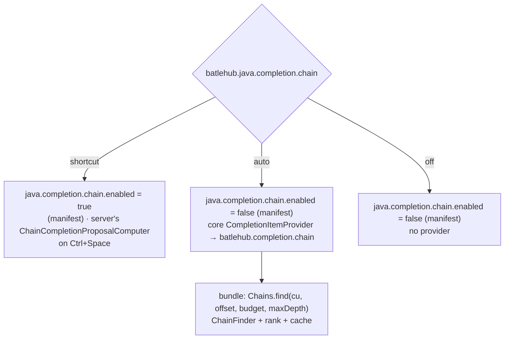
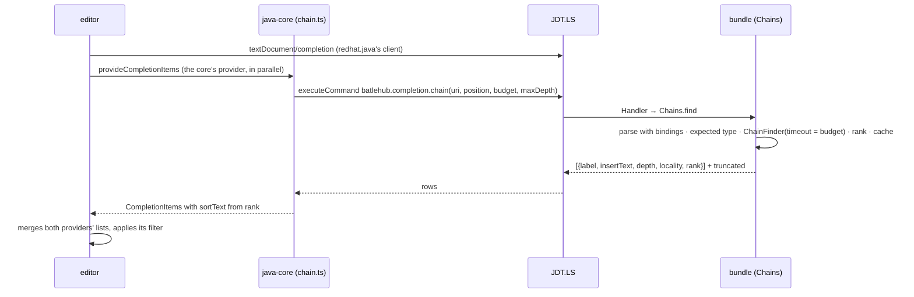

# RFC 0012 — Chained-call completion

| Field       | Value                                                        |
| ----------- | ------------------------------------------------------------ |
| Status      | Draft                                                         |
| Short       | Chain completion                                              |
| Settles     | Chained-call completion in the JDT bundle, its cost and ranking |
| Closes      | A.6 — chain completion |
| Author      | Max Batleforc <maxleriche.60@gmail.com>                       |
| Co-author   | —                                                             |
| Created     | 2026-09-18                                                    |
| Revised     | 2026-09-18 — revision 3, phase 1 built and measured (§11 Measured): JDT.LS 1.61 does ship the computer, but it answers only chains to project reference types — never a primitive or a JDK type — labels depth ≥ 2 wrongly, and sorts every chain last. Use case 2 is rewritten around a shape the server can answer. Revision 2, after the series was reviewed against its goal (RFC 0001 §7.1): the default-on write states every condition of the default-on rule, the delegate path gets its own latency gate, the ranking's interaction with the editor's filter is measured in phase 1 rather than asserted |
| Supersedes  | —                                                             |
| Depends on  | RFC 0001 (the bundle of §6.2, the `written.json` manifest of §4.2, the heavy suite's performance gate of §15.2); RFC 0002 for the headless proof of the delegate; RFC 0016 shares the bindings entry point of `Engine.parse` (§6.2) |
| Touches     | `extensions/java-core` (`src/completion/chain.ts`, one setting, one manifest write), `jdt/batlehub-jdt-core` (one delegate, the first binding-aware code path in `Engine`), `tests/heavy/java.mjs` (a `CHAIN-OK` step and its two latency lines), `docs/guide/java/editing.md` |

---

## 1. Summary

IntelliJ's chain completion proposes `getConfig().getServer().getPort()` as
one item when an `int` is expected, found by walking the type graph from
what is in scope to the expected type. RFC 0001 Appendix A.6 recorded "VS
Code today: none" and sent it to this RFC as work for the bundle. Reading
the pinned server corrects the premise: **JDT.LS 1.61 ships
`ChainCompletionProposalComputer`**, a port of JDT UI's Code Recommenders
chain finder, behind `java.completion.chain.enabled` (default `false`,
"only when completions are invoked by the completions shortcut"). So this
RFC is in two halves with a measurement between them: the core turns the
existing computer on and gates its latency in the heavy suite (phase 1, no
Java); then, and only if the measurement says the stock computer's two
limits matter — shortcut-only invocation and no ranking — a bundle delegate
built on the same `ChainFinder` from `org.eclipse.jdt.core.manipulation`
supplies chains on every completion with a budget and a rank (phase 2).

Phase 1 is fourth in RFC 0001 §14's order of work — after the IntelliJ
import, before the orchestrator: it is one settings write and one
measurement, and it closes an A.6 row a developer leaving IDEA notices in
the first hour. Phases 2 and 3 have no place in that order until the
measurement earns them.

### Before / after

```text
# today (redhat.java 1.56.0, java.completion.chain.enabled = false)
int port = |                      → port, parseInt(…), …   (no chain)

# phase 1: the core writes the setting through its manifest
int port = <Ctrl+Space>           → getConfig().getServer().getPort()   (JDT.LS's computer, on the shortcut only)

# phase 2, if earned: the bundle's delegate, ranked, on every invocation
int port = get|                   → getConfig().getServer().getPort()   ▲ ranked by depth and locality
                                    getDefaultPort()
```

---

## 2. Motivation

1. **The feature exists in the server and nobody can find it.** The setting
   is off by default, buried under thirty `java.completion.*` keys, and its
   description names a "completions shortcut" that a keyboard-first user
   would not think to press for it. A Che newcomer coming from IDEA gets
   "none" in practice, which is what Appendix A.6 measured — correctly for
   the experience, incorrectly for the mechanism.
2. **The stock computer runs on explicit invocation only, because it is
   expensive.** `ChainFinder` walks members of every type in scope to a
   depth (`recommenders.chain.max_chain_length`, default 4) with a timeout
   (`recommenders.chain.timeout`, default 3 s); JDT UI runs it on the
   shortcut for that reason. Whether that cost is acceptable on typing in a
   Che container with a 1 GiB JDT.LS is a number, not an opinion — and RFC
   0001's suite already prints numbers.
3. **The stock computer does not rank.** Chains arrive as proposals with a
   fixed relevance; a four-call chain and a local variable of the right type
   sort by JDT's generic rules. IDEA ranks by length and by how "close" the
   receiver is (a local, a field, a static of the current type). That
   ranking is the whole difference between a feature and noise.
4. **The bundle has never resolved a binding.** Every inspection is
   syntactic (RFC 0001 revision 4), and the first rule that needs types was
   named as the trigger to turn on `setResolveBindings`. A chain delegate is
   that first rule, in a place where the type system is the feature and
   there is no syntactic fallback to be tempted by.

### 2.1 Use cases

Each is an acceptance case for the `java` heavy half (a `CHAIN-OK` step)
or, where marked, for the bundle's JUnit layer.

1. **Turned on by the core, off by hand.** *Who:* a developer on
   `maven-multi`. *Start:* `java.completion.chain.enabled` absent from
   every settings scope. *Action:* activation (trusted). *Proof:* the
   `BatleHub Java` channel logs `wrote java.completion.chain.enabled`, the
   workspace `settings.json` has it `true`, `.batlehub/java/written.json`
   lists it as a `setting` entry, the Java panel shows once `Chain
   completion turned on (java.completion.chain.enabled) — Undo`, and both
   `Undo` and `Java: Remove BatleHub settings` delete it. With the key
   already set by the user — `false` **or `true`**, at user, workspace or
   folder scope — nothing is written, nothing is recorded and the panel
   shows nothing: a value the core did not write is not the core's to
   manage.
2. **A chain on the shortcut (phase 1).** *Who:* the driver. *Start:*
   `Main.java` of the `app` module with `Config config = new Config();` in
   scope and a `Server srv = ` on the next line, cursor after `= `.
   *Action:* Ctrl+Space. *Proof:* the completion list contains one item
   whose label is `config.getServer() : Server` (a chain of depth 1 from a
   local to the expected type `Server`); the item is absent when the
   setting is `false`. **Revision 3**: this used to say `String s = ` →
   `g.greet()`, which the server cannot answer — see §11 Measured,
   finding 1.
3. **The latency gate.** *Who:* the driver, same position. *Action:*
   Ctrl+Space, ten times, dismissing in between. *Proof:* the `PERF` line
   gains `chainMs` (median of ten round trips — the driver's wall clock
   from the shortcut to the list being on screen, because `onDidRequestEnd`
   never fires for completion in this build, see §11 Measured finding 5);
   the gate is `chainMs < 800 ms` (`HEAVY_PERF_FACTOR` widens it) and
   `chainOffMs`, the same measurement with the setting off, is printed
   beside it, so the cost is a delta in the log, not a feeling. The same
   step types `config.getS` after the shortcut and records where the chain
   item sits in the filtered list (`chainRank`, printed, not gated).
4. **A ranked chain while typing (phase 2).** *Who:* the driver.
   *Start:* `Main.java` with a field `Config config` whose type has
   `Server getServer()` and `Server` has `int getPort()`, plus a local
   `int fallback`. *Action:* type `int port = get` (no shortcut).
   *Proof:* the first two items are `getPort()`-terminated chains in this
   order: `config.getServer().getPort()` (a field, depth 2) before any
   static or parameter-fed chain, and `fallback` (a local of the expected
   type) is above both — the ranking rule of §4.2 in one list. The `PERF`
   line gains `chainDelegateMs` (median of ten provider round trips while
   typing, cache cold each time); the gate is `chainDelegateMs < 150 ms`,
   the budget of §4.1, widened by `HEAVY_PERF_FACTOR` like every other.
5. **The budget holds.** *Who:* layer 1b (JUnit). *Start:* a synthetic
   unit with a type graph of 200 members per type and depth 6.
   *Action:* `Chains.find(cu, offset, budget = 150 ms)`. *Proof:* returns
   within `budget + 50 ms` with a `truncated: true` flag and at least the
   depth-1 chains; the same call with `budget = 5 s` returns the full set.
   The heavy half asserts the flag never shows on `maven-multi` (the
   fixture is small; a truncated flag there is a regression).
6. **Headless, for RFC 0002.** *Who:* `task jdt:smoke`. *Action:*
   `batlehub.completion.chain(uri, position)` on `Main.java` at the
   position of use case 4. *Proof:* the smoke prints the chains with
   their `rank` and `depth`, the first one is
   `config.getServer().getPort()`, and `SMOKE-OK` stays green.

---

## 3. Goals / non-goals

**Goals**

- Chain completion on for every BatleHub Java user who has not already
  decided, through the setting the server already reads, under RFC 0001
  §7.1's default-on rule (§4.2).
- A measured latency, gated in the heavy suite, for the stock computer
  first (800 ms, on the shortcut) and the delegate second (150 ms, on
  typing).
- If phase 2 is earned: chains on every completion invocation, under a
  time budget, ranked by depth and receiver locality, from a delegate the
  headless engine can call.

**Non-goals**

- **Reimplementing `ChainFinder`.** The delegate calls the class the server
  ships (`org.eclipse.jdt.internal.ui.text.ChainFinder`, in
  `org.eclipse.jdt.core.manipulation`, already a `provided` dependency of
  the bundle); the RFC adds a budget and a rank around it.
- **Argument guessing inside chains** (`getById(id)` with `id` filled): the
  chain is inserted with `()` for zero-argument members only, as IDEA does;
  members with parameters end a chain.
- **A machine-learned ranking.** Three rules (§4.2) and a tie-break. If a
  model is ever wanted, JDT.LS has no ranking extension point today (the
  pinned `plugin.xml` declares four: delegate handlers, importers, content
  providers, build support), so it would be client-side either way.
- **Kotlin, Groovy.** The Groovy server has no chain notion; the Kotlin
  satellite (RFC 0008) brings its own server.

---

## 4. User-facing design

### 4.1 Configuration

```jsonc
// written by the core at workspace scope, through the manifest (phase 1)
"java.completion.chain.enabled": true,

// the core's own (phase 2)
"batlehub.java.completion.chain": "auto",      // auto | shortcut | off
"batlehub.java.completion.chainBudgetMs": 150, // per invocation; 0 = the server's default
"batlehub.java.completion.chainMaxDepth": 3    // IDEA's default; the server's is 4
```

- `chain: "auto"` (default once phase 2 lands) means the delegate runs on
  every invocation with the budget; `"shortcut"` means phase 1 behaviour
  only (the server's computer on Ctrl+Space, the delegate never called);
  `"off"` writes `java.completion.chain.enabled: false` through the manifest
  and registers no provider.
- Absent `chainBudgetMs` is `150`; a value the user writes is theirs. `0`
  hands the budget to the server's `recommenders.chain.timeout` (3 s), which
  is the phase 1 behaviour and the reason phase 1 is shortcut-only.

### 4.2 Behaviour rules

- **The default-on write, and all of its conditions.**
  `java.completion.chain.enabled` is `redhat.java`'s key, and the core
  writes it without being asked. RFC 0001 §7.1 allows that under its
  default-on rule, every clause of which holds here: **workspace scope**
  only; **through the manifest**, with the previous state (absent)
  recorded; **shown once in the Java panel with its undo** (`Chain
  completion turned on — Undo`, which is the manifest's removal of that one
  entry); and **never written when the user has already set the key** —
  either value, at any scope. A user's `true` is left as unrecorded as a
  user's `false`, so the remove command never deletes a value the user
  chose. An `Undo` is remembered per workspace; the next activation does
  not write the key again.
- **What a chain is.** A sequence of zero-argument member accesses (method
  calls, fields) from a *root* in scope — a local, a parameter, a field of
  the enclosing types, a static member of an imported or enclosing type —
  ending in a member whose type is assignable to the *expected type* at
  the cursor (the assignment's left side, the parameter's declared type,
  the return type). Depth is the number of accesses; depth 1 is a plain
  member of the expected type, which JDT already proposes, so the delegate
  emits depth ≥ 2 only unless the root is not otherwise proposed.
- **Ranking**, applied as `sortText`. The editor sorts by its fuzzy score
  first and by `sortText` only between items of equal score; how much of
  the ranking below survives that is **measured in phase 1** (`chainRank`,
  use case 3), not asserted here, and phase 2 is designed from the number:
  1. by root locality: local or parameter (`0`), field of the enclosing
     type (`1`), inherited field or static of the enclosing type (`2`),
     static of an imported type (`3`);
  2. then by depth, shorter first;
  3. then by the typed prefix matching the *last* segment (`get|` matches
     `getPort()`) before the first;
  4. then alphabetically. The `sortText` is `"0" + locality + depth +
     label`, which sorts every chain above JDT's own proposals of the same
     locality class only when the typed prefix does not match a plain item
     better — the editor's filter score decides between `port` typed and a
     chain ending in `getPort()`; the core does not override it. If phase
     1's `chainRank` shows the score drowning the rank (a chain's label
     matches `get` worse than `getPort()` alone does), the fallback is a
     `filterText` of the last segment — decided then, with the number.
- **The budget is a wall clock around `ChainFinder.startChainSearch`**,
  passed as its `timeout`; when it fires, the chains found so far are
  returned with `truncated: true` and the item list carries one trailing
  detail line "chains truncated at N ms" on the last item, so a user
  seeing fewer chains on a big project knows why. Nothing is retried.
- **Cache.** Per compilation unit and per expected type, the chain set is
  cached until the unit's `didChange` or an `onDidClasspathUpdate`
  (`redhat.java`'s API) — typing the next character of a prefix filters the
  cached set instead of re-walking. The cache is the delegate's, in the
  bundle, bounded to 32 entries.
- **Coexistence with the server's computer.** In `"auto"` the core writes
  `java.completion.chain.enabled: false` (the delegate replaces the
  computer, not doubles it) and its own `CompletionItemProvider` for
  `java` supplies the chains; in `"shortcut"` the reverse. One source at a
  time, decided by the setting, recorded in the manifest. The flip only
  ever rewrites a value the core wrote; where the user set the server's key
  themselves, the core leaves it and registers its provider only if that
  value is `false` — the user's `true` means the server's computer, and
  `"auto"` degrades to `"shortcut"` with one channel line.
- **Insertion.** The label is the chain as it will read (`config.getServer().getPort()`);
  the insert text is the same, with the receiver omitted when the root is
  `this` and the prefix typed did not include it. Imports are not needed
  (every element is reached from something in scope) and are never added.

### 4.3 Validation

Hard errors: none — a missing or failing delegate means no chain items,
never a broken completion list.

Warnings (`BatleHub Java: JDT` channel):

| Condition | Behaviour |
| --- | --- |
| The delegate is absent (bundle not loaded, server not Standard) with `chain: "auto"` | the core falls back to `"shortcut"` for the session, one line `chain completion: delegate absent, the server's computer on the shortcut instead` |
| `java.completion.chain.enabled` set by the user while `chain` asks for the other value | the user's value stands; one line naming both keys |
| `chainMs` above the gate three times in a session | one line naming the median and the setting to lower `chainMaxDepth`; nothing changes by itself |
| `chainBudgetMs` below 30 | clamped to 30, one line — below that no depth-2 chain resolves on a real project |

---

## 5. Architecture

### 5.1 Two sources, one switch



The invariant: **exactly one of the server's computer and the core's
provider produces chains at any time**, and which one is a setting the
manifest records, so removal restores the server's default (`false`).

### 5.2 A completion in `"auto"`



The editor merges the two providers' items itself; the core never touches
`redhat.java`'s list. This is what lets the provider be a plain
`vscode.languages.registerCompletionItemProvider("java", …)` with no
middleware and no fork of the language client — RFC 0001 §5.1's invariant
(the core is the only extension that talks to JDT.LS) holds because the
call goes through the same `java.execute.workspaceCommand` the inspections
bridge uses.

---

## 6. Detailed design

### 6.1 `extensions/java-core` (phase 1)

- `src/detect/index.ts` / the activation write path: after
  `java.configuration.runtimes`, write `java.completion.chain.enabled: true`
  at workspace scope through `written.ts` when the key is absent at every
  scope (`inspect()` shows no user, workspace or folder value) — the same
  rule as `java.jdt.ls.java.home` (RFC 0001 §4.2, revision 4). `Java:
  Remove BatleHub settings` removes it by the manifest.
- The Java panel's once-only line with its `Undo` (§4.2); the undone state
  is kept in `workspaceState`, not in a setting.
- `tests/heavy/java.mjs`: the `CHAIN-OK` step (use cases 1–3), `chainMs`
  and `chainRank` in the `PERF` line, the gate in `view.sh` beside the
  existing five.

### 6.2 `jdt/batlehub-jdt-core` (phase 2)

- `Engine.parse(String, boolean bindings)`: the flag RFC 0001 §6.2 named,
  and **one entry point shared with [RFC 0016](/rfc/0016-inspections-growth)**
  (inspections growth), whose type-aware rules need the same parse —
  whichever of the two lands first adds it, the other reuses it, and
  neither adds a second;
  with bindings, the parser is created over the `ICompilationUnit`
  (`parser.setSource(icu)`, `setResolveBindings(true)`,
  `setBindingsRecovery(true)`), which needs the project — so `Chains` takes
  the `ICompilationUnit` from `JDTUtils.resolveCompilationUnit(uri)` as
  `Handler.source()` already does, and the JUnit layer for this class uses
  `AbstractProjectsManagerBasedTest` (the first, and the reason RFC 0002
  §6.3 accepts the same for rename).
- `Chains.java`: expected type at the offset (`ChainElementAnalyzer`'s
  `computeExpectedType` path, as the server's computer does), roots in
  scope (the same class's `computeContextEntries`), `new ChainFinder(expectedTypes, ignoredTypes, project).startChainSearch(entries, maxChains, minDepth, maxDepth, timeoutMs)`,
  then the rank of §4.2 and the LRU cache keyed by `(uri, expected type
  key)`. Everything before the rank is the server's own code, called with a
  smaller timeout; the RFC adds ~150 lines.
- `Handler`: `batlehub.completion.chain(uri, position, budgetMs, maxDepth)`
  → rows `{ label, insertText, depth, locality, rank }` and `truncated`;
  `plugin.xml` gains the command id. `batlehub.ping` lists it so the core's
  fallback (§4.3) is decided from the ping, not from a failed call.

### 6.3 `extensions/java-core` (phase 2)

- `src/completion/chain.ts`: the `CompletionItemProvider`, registered when
  `chain: "auto"` and the ping listed the command; maps rows to items
  (`kind: Method` for a call-terminated chain, `Field` otherwise,
  `sortText` from `rank`, `detail` = depth and locality, the truncation
  note); a 100-line module with a pure `toItems(rows)` unit-tested in
  vitest.
- `package.json`: the three settings of §4.1; `written.ts` handles the
  `java.completion.chain.enabled` flip between `"auto"` and `"shortcut"`.
- `tests/heavy/java.mjs`: `chainDelegateMs` in the `PERF` line and its
  150 ms gate in `view.sh` (use case 4).

**Deliberately untouched**, so reviewers do not go looking:

- `redhat.java`'s completion pipeline and `java.completion.*` keys other
  than `chain.enabled` — the core neither wraps the client nor reorders
  the server's items.
- `src/inspections/*` — the binding-aware parse is a second entry point in
  `Engine`, not a change to the syntactic one; every inspection this RFC
  knows keeps `setResolveBindings(false)` (RFC 0016 decides for its own).
- The generators — accessors stay syntactic.

---

## 7. Security considerations

- **Input is the workspace's Java and its classpath**, both already parsed
  by JDT.LS for every completion today; the delegate resolves bindings
  against the same project model and executes nothing. An attacker who
  controls the repository gains no capability they did not have through
  `textDocument/completion`.
- **The budget is the denial-of-service defence.** `ChainFinder` over a
  pathological type graph (a generated API with thousands of zero-argument
  members) is bounded by `budgetMs` per invocation and by `maxChains`; the
  cache bounds memory at 32 entries per server. The server's own computer
  has the same walk with a 3 s timeout, so phase 1 is strictly bounded by
  what the server already allows.
- **Nothing is written but one settings key**, through the manifest, with
  the removal command as the undo. No file in the workspace is edited by a
  completion until the user accepts an item, and that is the editor's
  normal insert.
- **No network, no telemetry**; `trackEvent` is not called.

### Red lines

- **Every write is in the manifest.** One foreign setting,
  `java.completion.chain.enabled`, at workspace scope, recorded in the
  core's manifest with its previous state and undone by `Java: Remove
  BatleHub settings` (and by the panel's `Undo`). The three
  `batlehub.java.completion.*` keys are the user's to write, not the
  core's. An accepted completion is a source edit: the editor's undo.
- **The token is the core's.** Does not apply: no registry credential is
  involved.
- **Memory.** No process is started. The delegate runs inside JDT.LS,
  already under the core's cap; its cache is bounded to 32 entries and its
  walk by the budget, and `readyMs`/peak RSS of the existing gate must not
  move (§10).
- **Defaults crossed.** One, by the rule that permits it: *a foreign
  setting written by default* — at workspace scope, through the manifest,
  shown once in the panel with its undo, never when the user has set the
  key to either value (§4.2). The reason: the feature exists in the server
  and nobody finds it (§2 point 1). Bridge rather than rebuild is kept
  (`ChainFinder` is the server's); nothing is downloaded; nothing leaves
  the machine.

---

## 8. Alternatives considered

| Alternative | Why rejected |
| --- | --- |
| Build the chain finder in the bundle from scratch (what Appendix A.6 assumed) | The server ships `ChainFinder`, `ChainElementAnalyzer` and a computer on top; the pinned `org.eclipse.jdt.core.manipulation` is already a `provided` dependency of the bundle. Rewriting a type-graph search that Code Recommenders tuned for a decade, to get the same chains, is the drift RFC 0001 §5.3 avoids. |
| Only phase 1: turn the setting on and stop | Possibly the answer — §11 decision 2 makes phase 2 conditional on the measurement. What phase 1 cannot give is invocation while typing and ranking; if the numbers say the server's computer is cheap enough on typing, the RFC asks upstream for the invocation flag before building the delegate (open question 1). |
| Rank client-side over the server's own chain proposals (no delegate) | The server's items do not carry depth or root locality, only a label; ranking would parse labels. And the core cannot see `redhat.java`'s items to reorder them without wrapping its client. |
| A `CompletionItemProvider` that computes chains in TypeScript from `documentSymbol` and hover types | No bindings, no inheritance, no generics — a heuristic that is right on `getFoo()` and wrong on everything IDEA users rely on. |
| Ask upstream to add ranking and on-typing invocation to `ChainCompletionProposalComputer` | Worth doing (open question 1) and slow; the delegate is 150 lines over the same classes and gives the headless engine the operation too. If upstream lands both, phase 2's provider is deleted and the RFC's §4.1 keys map to the server's. |

---

## 9. Rollout and compatibility

- **Default behaviour**: phase 1 turns chain completion on for every
  workspace the core activates in, on the shortcut. A user who does not
  want it uses the panel's `Undo` or sets
  `java.completion.chain.enabled: false` once; the core never overwrites a
  value that is not its own, and writes nothing where the key is already
  set.
- **Compatibility**: `ChainFinder` moved from `org.eclipse.jdt.ui` to
  `org.eclipse.jdt.core.manipulation` in 2021; every server the nightly
  matrix covers (`1.55.0` and later) has it. The `recommenders.chain.*`
  preference keys the server's computer reads are JDT UI's and not
  settable from the client; the delegate takes its limits as arguments, so
  phase 2 does not depend on them.
- **Rollback**: `chain: "off"`, or `Java: Remove BatleHub settings`;
  nothing persists but the manifest-tracked key.
- **Docs**: `docs/guide/java/editing.md` gains a "Chain completion"
  section with the two invocation modes and the budget setting.

---

## 10. Test plan

- **Unit** (`extensions/java-core/test/chain.test.ts`, vitest): `toItems`
  ordering from recorded rows (locality before depth before prefix),
  the truncation note, the `"auto"`/`"shortcut"`/`"off"` → manifest write
  table, the fallback decision when the ping lacks the command.
- **Layer 1b** (`jdt/batlehub-jdt-core/src/test/…/ChainsTest.java`, over
  `AbstractProjectsManagerBasedTest`): use case 5 (budget and
  `truncated`), depth-2 and depth-3 chains on a three-type fixture, the
  rank order, generics (`List<Server>` → `get(0)` is not zero-argument, so
  the chain stops), a static root, an inherited field root, the cache hit
  after a no-op `didChange`.
- **Headless** (`task jdt:smoke`): use case 6.
- **Heavy** (`tests/heavy/java.mjs`, `CHAIN-OK`): use cases 1–4; `chainMs`
  (gate 800 ms) and `chainRank` (printed) in phase 1, `chainDelegateMs`
  (gate 150 ms) in phase 3, all in `PERF` with the gates in `view.sh`. Use
  case 1 runs three times: key absent, user `false`, user `true` — the
  last two assert an untouched `settings.json` and an empty manifest.
- **Existing suites that must pass unchanged**: `task jdt:test` (19
  JUnit tests — every inspection still syntactic); `INSPECTIONS-OK` and
  `GENERATE-OK` in the `java` half; the RFC 0001 performance gate (chain
  completion must not move `readyMs` or `activationMs`).

---

## 11. Decisions and open questions

### Resolved

| # | Question | Decision |
| --- | --- | --- |
| 1 | Build or reuse? | **Reuse the server's `ChainFinder`; never rewrite it.** Appendix A.6's "none" was the user's experience, not the server's capability; the RFC corrects the premise and works from the classes the pinned jars ship. |
| 2 | Is the bundle delegate (phase 2) unconditional? | **No — it is earned by the phase 1 measurement.** If `chainMs` on the shortcut is under the gate and users accept shortcut-only invocation, phase 2 waits for open question 1's upstream answer. The two limits that would earn it are named: on-typing invocation and ranking. |
| 3 | Where does ranking live? | **In the delegate, as `rank`, applied client-side as `sortText`.** The editor's fuzzy filter stays on top; the core never reorders the server's own items. |
| 4 | One source of chains or two? | **One at a time**, chosen by `batlehub.java.completion.chain` and recorded in the manifest. Doubled items are worse than none. |
| 5 | Bindings in the bundle? | **Yes, through a second `Engine.parse` entry point**, shared with RFC 0016 and leaving every existing inspection syntactic. This is the trigger RFC 0001 §6.2 named, fired by a feature that has no syntactic form. |
| 6 | The budget default | **150 ms.** IDEA's chain completion is perceptibly under 200 ms on a mid-size project; the depth default of 3 (IDEA's) rather than the server's 4 halves the walk. Both are settings. |
| 7 | May the core turn on `redhat.java`'s key by default? (revision 2) | **Yes, under RFC 0001 §7.1's default-on rule, with every condition stated**: workspace scope, through the manifest, shown once in the panel with its undo, never written when the user has already set the key — either value. |
| 8 | Is the delegate path gated too? (revision 2) | **Yes: `chainDelegateMs < 150 ms`** in the heavy suite, the same number as the budget — a delegate that returns truncated sets on the fixture to stay under it fails use case 5's flag instead. |
| 9 | Is the `sortText` ranking known to work under the editor's fuzzy score? (revision 2) | **No — it is measured in phase 1** (`chainRank`), and phase 2's ranking is designed from that number. *Measured*: the server sends `sortText` `999999979` on every chain, so there is no server ordering to preserve — a delegate supplies the whole one. |

### Measured — phase 1, 2026-09-18

Against the pinned `redhat.java` 1.56.0 (**JDT.LS 1.61**, which does ship
`ChainCompletionProposalComputer` — decision 1's premise holds), driven
headless over stdio and then in the real editor. Five findings, and they
change what phase 2 is for.

1. **The stock computer refuses primitive and JDK expected types.** With
   `Config config` in scope it proposes `config.getServer()` for
   `Server s = `; for `int port = ` and `String host = ` from the same root
   it proposes **nothing** — the computer's own
   `isPrimitiveOrBoxedPrimitive` and excluded-types gates. IDEA's flagship
   example, `int port = getConfig().getServer().getPort()`, is exactly the
   case JDT.LS will not answer. **§2.1 use case 2 was written around
   `String s = ` → `g.greet()` and could never have passed**; the heavy case
   is now a chain to a project reference type, and the fixture gained
   `app/.../Config.java` and `Server.java` for it (the type graph of use
   case 4, so phase 2 reuses them).
2. **Depth is not the limit.** `h.getConfig().getServer()` — depth 2, all
   project types — is proposed. The `maxChains`/depth defaults are not what
   holds the feature back; the expected-type gate is.
3. **The label is malformed at depth ≥ 2, and `insertText` does not
   compile.** For that same chain the server sends
   `label: "h.getConfig.getServer() : Server"` and
   `insertText: "h.getConfig.getServer"` — the `()` of every segment but
   the last is missing from both — while `textEdit.newText` is correct
   (`h.getConfig().getServer()`). A client that honours `textEdit` is fine
   and the user still reads a label that is not Java. This is the upstream
   issue of open question 1, with a reproduction.
4. **Chains sort last, unconditionally**: `sortText` is `999999979` on
   every chain item. Open question 9 ("is the `sortText` ranking known to
   work under the editor's fuzzy score?") is answered before phase 2 starts
   — there is no server-side rank to preserve, so a delegate that wants a
   rank must supply the whole ordering itself.
5. **`onDidRequestEnd` is exposed and subscribed, and never fired for
   `textDocument/completion`** in this build — the channel says
   `redhat.java request trace: subscribed` and no round trip is ever
   reported. The latency number therefore comes from the driver's own wall
   clock (shortcut → list on screen), measured identically with the feature
   on and off so the *delta* is the cost; the subscription stays, because it
   is the server-side truth the guide points a user at when completion feels
   slow, and because its silence is itself worth noticing on the next pin.

**The numbers** (`maven-multi`, this container, driver wall clock from the
shortcut to the list on screen, median of ten):

| | |
| --- | --- |
| `chainMs` | **169 ms** (gate 800 ms) |
| `chainOffMs` | **89 ms** |
| what the feature costs | **80 ms** |
| `chainRank` | **1 of 2** after typing `con` — `config` (the plain local) then `config.getServer()` |

The rank confirms finding 4 from the other side: with `sortText` at the
bottom of the range, a chain never outranks a plain proposal the prefix
matches, whatever the fuzzy score does. Note the first attempt at this
measurement polled the completion list every 500 ms and reported
`chainMs == chainOffMs == 527 ms` — a cost of zero. Any latency gate whose
poll is coarser than the thing it measures reports the poll.

**The upstream issue** (owed by phase 1, findings 3 and 5): *"Chain
completion: `label` and `insertText` drop the `()` of every segment but the
last"* — on JDT.LS 1.61, with `java.completion.chain.enabled`, a depth-2
chain comes back as `label: "h.getConfig.getServer() : Server"` and
`insertText: "h.getConfig.getServer"` while `textEdit.newText` is the
correct `h.getConfig().getServer()`. A client that honours `insertText`
inserts code that does not compile, and every client shows a label that is
not Java. Reproduction: three classes (`Holder → Config → Server`), caret at
`Server s = `, `triggerKind: 1`. Ours is
`extensions/java-core/src/completion/chain.ts` plus the probe in this RFC's
history; the numbers above go with it.

**What this does to decision 2.** Phase 2 was to be earned by "shortcut-only
invocation and no ranking". The measurement replaces that with a sharper
pair: the stock computer answers **only** chains to project reference types,
and it ranks them last. A developer leaving IDEA gets `config.getServer()`
and never the `int`/`String` chains they used most. Whether that earns a
delegate is still decision 2's call — but it is now a decision about
coverage, not about latency, and phase 1 ships the useful half either way.

### Still open

1. **Upstream first?** A JDT.LS change adding on-typing invocation and a
   relevance for chain proposals would make phase 2's provider redundant.
   Recommendation: open the upstream issue at phase 1 with the measured
   numbers, and build phase 2 only if the measurement earns it *and* the
   issue has no owner within the next `redhat.java` pin bump.
2. **Depth-1 chains**: emit them (they duplicate JDT's plain proposals but
   carry the rank) or leave them to JDT (no duplicates, but a local of the
   expected type sorts by JDT's rules, not §4.2's)? Recommendation: leave
   them to JDT and special-case rule 1 of the ranking so that a depth-2
   chain never sorts above a plain local — use case 4 asserts this.
3. **`ignore_types`**: the server's computer ignores `java.lang.Object`
   and a few more by preference; the delegate needs the same list as an
   argument or a constant. Constant, until someone needs to add to it.

---

## 12. Implementation phases

| Phase | Content |
| --- | --- |
| 1 | ~~The manifest write of `java.completion.chain.enabled` under the default-on rule … the guide section; the upstream issue with the numbers.~~ **Done** (revision 3): the write with its panel line, `Undo` and `Keep it`; `CHAIN-WRITE-OK`, `CHAIN-OK` and `UNDO-OK` in the heavy half with `chainMs` gated and `chainRank` printed; `docs/guide/java/editing.md`; the fixture's `Config.java`/`Server.java`. The upstream issue is **owed** — §11 Measured findings 3 and 5 are its content. |
| 2 | Only if earned (decision 2): `Engine.parse` with bindings (the entry point shared with RFC 0016), `Chains.java` over `ChainFinder` with budget, rank and cache, the delegate, `ChainsTest` on `AbstractProjectsManagerBasedTest`, `task jdt:smoke` use case 6. |
| 3 | `src/completion/chain.ts`, the three settings, the manifest flip, use case 4 in the heavy half with the `chainDelegateMs` gate (150 ms); RFC 0002's engine picks the delegate up for free. |
