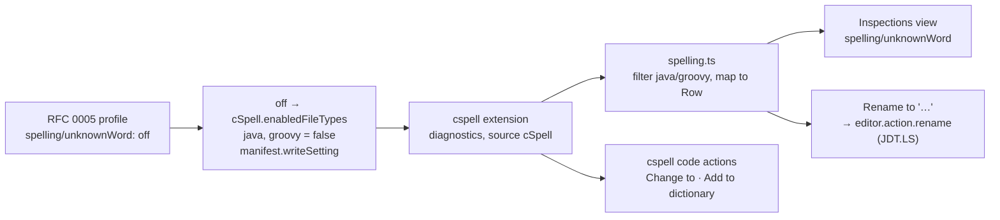
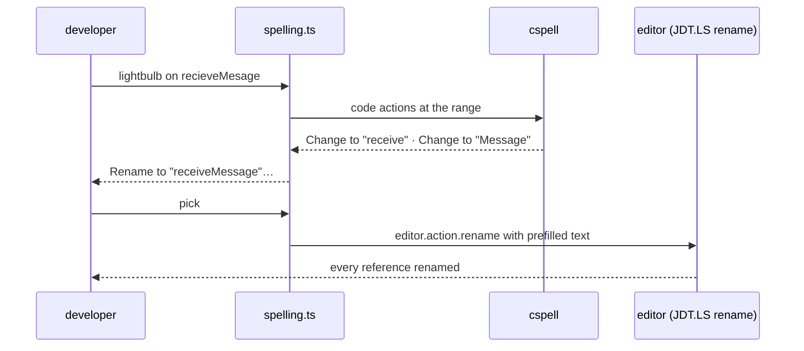

# RFC 0013 — Spell checking in code

| Field       | Value                                                        |
| ----------- | ------------------------------------------------------------ |
| Status      | Draft                                                         |
| Short       | Spell checking                                                |
| Settles     | Identifiers and comments spell-check inside the inspections flow, or a bridge to an existing extension |
| Closes      | A.6 — spell-checking in identifiers and comments |
| Author      | Max Batleforc <maxleriche.60@gmail.com>                       |
| Co-author   | —                                                             |
| Created     | 2026-09-18                                                    |
| Revised     | 2026-09-18 — revision 2, after the series was reviewed against its goal (RFC 0001 §7.1): cspell and nothing else — no grammar checking, no severity mapping onto a setting global to every file type, the rename fix pinned to cspell's titles in the nightly matrix, the RFC 0006 dependency dropped |
| Supersedes  | —                                                             |
| Depends on  | RFC 0001 (the inspections bridge and view of §4.2, the coexistence rule, the pack); RFC 0005 (the profile, where `spelling/unknownWord` can be turned `off` with a reason — phase 2 only); needs member `manifest.writeSetting` — [RFC 0001 §5.2 contract changelog](/rfc/0001-java-env#contract-changelog) (phase 2 only). Revision 1 listed RFC 0006 for a project word list under `.batlehub/java/`; nothing is written there (the list is `cspell.json`), so the dependency is gone |
| Touches     | `extensions/java-core/src/inspections/` (new `spelling.ts`, `view.ts`, `bridge.ts`), `src/coexistence.ts`, `extensions/java-pack/package.json`, `tests/heavy/java.mjs`, `docs/guide/java/` |

---

## 1. Summary

IDEA underlines `recieve` in an identifier and in a comment, offers the
correction, and lets a team commit its dictionary. VS Code has that too,
as an extension: `streetsidesoftware.code-spell-checker` (cspell) splits
camelCase, ships the English dictionaries, reads a committed `cspell.json`
and already puts its rows in the Problems panel. What it lacks is a place
in the Java flow: its findings are not in the Inspections view, a team
cannot turn it off for Java with a reason, and a Java newcomer does not
know it exists.

This RFC bridges rather than builds, and its scope is **cspell and nothing
else**. The pack carries cspell (`extensionPack`); the core detects it,
folds its diagnostics into the Inspections view as `spelling/unknownWord`,
and keeps the team's words in cspell's own committed `cspell.json`, which
is the file every other cspell user already has. RFC 0005's profile can
turn the rule `off` for Java and Groovy; it does **not** set its level —
`cSpell.diagnosticLevel` is global to every file type, and a Java profile
must not change Markdown (§4.2). The bundle inspection with its own
dictionary is the alternative this RFC keeps, with the trigger that would
bring it back: a workspace where cspell cannot be installed.

Eighth in RFC 0001 §14's order of work. Team A uses cspell daily, so the
force-install through the pack gives them what they already have; what
they gain is the row in the view and the word list where the Java flow
points at it.

### Before / after

```text
# today
Problems: cSpell  "recieve": Unknown word.          ← there, if the developer installed it; nowhere in the Java panel
Inspections view: 11 rules                           ← no spelling row

# with this RFC
Inspections view: 12 rules — spelling/unknownWord (3 in 2 files, via cspell)
Quick fix on recieve: "receive"  ·  Add to project dictionary (cspell.json)  ·  Rename symbol…
.batlehub/java/inspections.json: "spelling/unknownWord": { "severity": "off", "why": "…" }   ← off only; the level stays cspell's
```

---

## 2. Motivation

1. **The gap is real and already listed.** RFC 0001 §14 names
   `spell-checking` with the trigger "phase 6"; phase 6 landed. IDEA
   ships it on by default; a Java developer coming from IDEA notices its
   absence in the first hour.
2. **Building it is a dictionary problem, not an AST problem.** The
   bundle can split `recieveMesage` into words in ten lines; what it
   cannot do cheaply is ship and update a 100 000-word English dictionary
   plus the technical words every Java code base uses (`hashcode`,
   `iterable`, `jdbc`), the locale variants, and the per-language word
   lists for the comments' natural language. cspell maintains exactly
   that, and is on Open VSX.
3. **Two spell checkers is one too many.** A developer with cspell
   installed who also got a bundle inspection would see every typo twice
   with two different quick fixes — the coexistence problem RFC 0001 §4.2
   solves for the Maven and Gradle views, created anew.
4. **A spelling finding is an inspection to the developer.** A team wants
   to turn it off where it is noise (a legacy module, generated DTOs) with
   the reason written down, and it should show in the same view as
   `unused/privateField`. Today it is in a different extension's world.

### 2.1 Use cases

1. **A newcomer gets spell checking with the pack.** A workspace has
   `batlehub.java-pack` installed (which now carries cspell in its
   `extensionPack`) and a
   `maven-multi` fixture with `Greeter.java` containing
   `String recieveMesage` and a comment `// retuns the greeting`. Proof:
   after activation the Problems panel has three rows with source
   `cSpell` (`recieve`, `Mesage`, `retuns`); the Inspections view has a
   `spelling/unknownWord` rule row with count 3, origin `via cspell <version>`; the `BatleHub Java` channel logs `spelling: cspell <version> detected, bridged`.
2. **cspell absent: one row that says how to get it, nothing else.** The
   same workspace without cspell. Proof: the Inspections view shows
   `spelling/unknownWord — not available (install Code Spell Checker)` with
   an install action that opens the extension's page; no diagnostic, no
   notification, no second prompt on the next activation
   (`batlehub.java.coexistence` records the answer as the hide-views
   prompt does).
3. **The profile turns spelling off for a legacy module.** The repository
   commits `.batlehub/java/inspections.json` with
   `"spelling/unknownWord": { "severity": "off", "why": "generated DTOs, see #77" }`.
   Proof: the three `cSpell` rows disappear from the Problems panel (the
   core writes `cSpell.enabledFileTypes: { "java": false, "groovy": false }`
   at workspace scope through `manifest.writeSetting`, recorded in the
   core's manifest); a typo in the fixture's `README.md` **keeps its
   `cSpell` row** — the Java profile did not reach Markdown; the view row
   reads `off — profile: generated DTOs, see #77`; `Java: Remove BatleHub
   settings` restores the key to its previous value. With `"severity":
   "warning"` instead, nothing is written and the view row reads `level is
   cspell's (info) — a per-language level does not exist yet`.
4. **The quick fix adds to the project dictionary.** The developer applies
   `Add "Mesage" to project dictionary` from the lightbulb on
   `recieveMesage`. Proof: `cspell.json` at the workspace root contains
   `"words": ["Mesage"]` (created if absent, with `"version": "0.2"`),
   the row is gone, `git status` shows only `cspell.json` modified; the
   core wrote nothing under `.batlehub/java/`. Before that fix the
   workspace had no `cspell.json` and the core had created none.
5. **The rename fix goes through JDT.** From the same lightbulb the
   developer picks `Rename to "receiveMessage"…`. Proof: the editor's
   rename input opens prefilled with `receiveMessage` (the corrected
   words re-joined in the identifier's case), the rename is JDT.LS's
   (every reference in `maven-multi` updated), and the rows for
   `recieve` and `Mesage` are gone without touching the dictionary. The
   step first asserts cspell's code-action titles against the pinned
   pattern (`SPELL-TITLES-OK`), so a rewording fails there, by name.
6. **A comment's typo is fixed in place.** On `// retuns the greeting`
   the quick fix offers `Change to "returns"`. Proof: the line reads
   `// returns the greeting` and the row is gone; the fix is cspell's own
   (the core adds nothing for comments — there is no symbol to rename).

---

## 3. Goals / non-goals

**Goals**

- Spelling findings appear in the Inspections view as one rule,
  `spelling/unknownWord`, with a count, files and occurrences like every
  bundle rule.
- RFC 0005's profile can turn that rule off for Java and Groovy with a
  reason, and the effect is visible in the Problems panel, not only in the
  view — and in no other file type.
- The fixes a developer expects: correction, add to the project
  dictionary, rename the identifier.
- A newcomer gets it installed by the pack and told what to do when it is
  missing.

**Non-goals**

- Shipping a dictionary or a spell-checking engine in the bundle or the
  core (kept as the alternative, §8, with its trigger).
- A BatleHub-owned word list under `.batlehub/java/`: cspell's `cspell.json`
  `words` is that list, already committed by every cspell user, read by
  cspell's own CLI in CI. A second file would need syncing to the first.
- **Grammar checking.** Natural-language grammar or style, translations of
  comments: LanguageTool/Grazie was considered and dropped (§8). The scope
  is cspell and nothing else.
- **Mapping the profile's severity onto `cSpell.diagnosticLevel`.** The key
  is global to every file type; deferred until cspell offers a per-language
  level (§4.2, decision 3).
- **Live compiler errors** — "syntax checking" in the team's words —
  already come from JDT.LS as the developer types; nothing here touches
  them. Growing the inspections themselves is
  [RFC 0016](/rfc/0016-inspections-growth).
- Spelling in files that are not Java or Groovy: cspell checks them anyway;
  the bridge only *shows* Java and Groovy findings in the Inspections
  view.

---

## 4. User-facing design

### 4.1 Configuration

No new `batlehub.java.*` key. The rule's level is cspell's own (`info`
unless the developer changed `cSpell.diagnosticLevel` themselves); the
profile of RFC 0005 or `batlehub.java.inspections.severityOverrides` can
set `spelling/unknownWord` to `off`, and any other severity there is shown
in the view as not applicable (§4.2).

cspell's configuration is cspell's:

```jsonc
// cspell.json — the team's dictionary, committed; the quick fix creates it
{
  "version": "0.2",
  "language": "en",
  "words": ["Mesage", "batlehub", "jdtls"],
  "ignorePaths": ["target/**", "build/**"]     // added by the quick fix when it creates the file, never otherwise
}
```

The pack (`extensions/java-pack/package.json`) adds
`streetsidesoftware.code-spell-checker` to `extensionPack`, so a pack
install force-installs it — accepted: the team this is built for uses it
daily — and a core-only install gets use case 2's row.

### 4.2 Behaviour rules

- **Detection**: at activation and on `extensions.onDidChange`, the core
  looks for `streetsidesoftware.code-spell-checker`; present and active
  means bridged. Its version is logged and shown as the rule's origin.
- **Rows**: `vscode.languages.onDidChangeDiagnostics` filtered to source
  `cSpell` on `java` and `groovy` documents; each becomes a `Row` with
  `code: "spelling/unknownWord"`, `area: "spelling"`, the word in the
  message, and no `fixTitle` (cspell's own code actions are the fixes).
  The row's severity is the diagnostic's — cspell's, which the core does
  not own and does not rewrite.
- **`off`, and only `off`, reaches cspell** (phase 2): the profile's `off`
  → `cSpell.enabledFileTypes` gains `"java": false, "groovy": false` at
  workspace scope, merged into the object's other keys, through
  `manifest.writeSetting` (needs member `manifest.writeSetting` — [RFC 0001 §5.2 contract changelog](/rfc/0001-java-env#contract-changelog)),
  so it lands in the core's one manifest and applies §7.1's default-on
  rule: shown once in the panel with its undo, never over a value the user
  set for those two keys. The key is per file type, so Markdown, YAML and
  the rest keep their spell checking.
- **No severity mapping.** `cSpell.diagnosticLevel` is one level for every
  file type cspell checks; a Java profile saying `warning` would change
  the team's Markdown. Any severity other than `off` is therefore not
  applied: the view row says `level is cspell's (<level>)`, nothing is
  written. **Trigger to revisit**: cspell offers a per-language (or
  language-overridable) diagnostic level; then the mapping is one more
  `manifest.writeSetting` call and decision 3 is reopened.
- **The view**: one rule row, grouped by file and occurrence like the
  others; `Fix all` is not offered for it (a bulk "accept every correction"
  is a bad fix), the row's actions are `Open cspell.json` and the profile
  actions of RFC 0005.
- **Quick fixes**: cspell's own (`Change to …`, `Add to workspace
  dictionary`), relabelled by nothing — the core does not wrap them. The
  core contributes one code action of its own on identifiers:
  `Rename to "<corrected>"…`, which joins cspell's first suggestion for
  each misspelt part back into the identifier (camelCase preserved) and
  invokes the editor's rename with the text prefilled, which is JDT.LS's
  rename — RFC 0001 §5.4, nothing new below the command.
- **`cspell.json` has one writer: the quick fix.** When no `cspell.json`
  exists, the core writes nothing — not at activation, not on the first
  finding. The developer's `Add to project dictionary` is the only path
  that creates or edits the file; when that fix *creates* it, `target/**`
  and `build/**` go into `ignorePaths` in the same edit, through
  `jsonc-parser`. A file that already exists gets the word and nothing
  else. The edit is the developer's own, a committed team file: the
  editor's undo and git are its undo, not the manifest.
- **Untrusted workspace**: cspell handles its own restriction; the core
  bridges nothing before trust, as for every other feature.

### 4.3 Validation

Hard errors: none. Everything here degrades.

Warnings (the Inspections view's row states, the channel):

| Condition | Behaviour |
| --- | --- |
| cspell not installed | `not available` row with an install action; no notification; remembered per workspace |
| cspell installed but disabled by the user (`cSpell.enabled: false`, or `java` off in `cSpell.enabledFileTypes`, not written by the core) | `disabled by you` row; nothing is written over the user's choice (RFC 0005 decision 2) |
| the profile says `off` but `cSpell.enabledFileTypes` cannot be written | row `off (profile) — could not quiet cspell: <error>`; the diagnostics stay |
| the profile sets a severity other than `off` | row `level is cspell's (<level>)`; nothing written (§4.2) |
| cspell's code-action titles no longer match the pinned pattern | the rename fix is not offered, one channel line; the nightly matrix has already opened the drift issue (§5.2) |
| `cspell.json` is not parseable when the quick fix would edit it | the quick fix is not offered; cspell shows its own error on the file |

---

## 5. Architecture

### 5.1 The bridge



The invariant: **the core owns no spelling data**. Words, dictionaries,
suggestions, the level and the correction actions are cspell's; the
profile's `off` reaches cspell through one per-file-type setting, recorded
in the core's manifest like every other foreign write, so `Remove BatleHub
settings` leaves cspell exactly as the developer had it.

### 5.2 The rename fix



The core asks cspell for its suggestions through
`vscode.commands.executeCommand("vscode.executeCodeActionProvider")` on
the word's range — the public command, not cspell's internals — and reads
the `Change to "…"` titles. Titles are not an API, so the dependency is
**pinned by a test**: `TITLE = /^Change to "(.+)"$/` lives in one constant,
and `SPELL-TITLES-OK` asserts it against the real cspell — in the heavy
suite on the pinned version and in the nightly matrix of RFC 0001 §13 on
cspell's latest release. A rewording then opens one drift issue naming the
old and new titles the night it ships, and is a one-line fix — not a
feature found dead by a user. Until it is fixed the rename fix is simply
not offered; the row and cspell's own fixes stay.

---

## 6. Detailed design

### 6.1 `extensions/java-core/src/inspections/spelling.ts` (new)

- `toRows(diagnostics)` pure: `cSpell` diagnostics → `Row[]` (message
  `Unknown word "recieve"`, `code: "spelling/unknownWord"`); the word is
  taken from the diagnostic's range text.
- `correctedIdentifier(identifier, parts: { word, suggestion }[])` pure:
  rebuilds the identifier with the case pattern of each part
  (`recieveMesage` + `receive`, `Message` → `receiveMessage`;
  `RECIEVE_MESAGE` → `RECEIVE_MESSAGE`).
- `severityToCspell(override, current)` pure: `off` → the
  `enabledFileTypes` object with `java` and `groovy` false, the other keys
  kept; anything else → `undefined` (not applied, §4.2).
- `TITLE` and `suggestionFrom(title)` pure: the one place cspell's wording
  is known.
- The glue: detection, the diagnostics listener, the code-action provider
  for the rename fix, the one `manifest.writeSetting` call.

### 6.2 `src/inspections/bridge.ts`, `view.ts`

- `Bridge.rows` gains the spelling rows under the same map, keyed by
  document, so `group()` and the view need no change beyond the row
  states of §4.3 and the missing `Fix all` for this rule.
- `refresh()` untouched: spelling rows are pushed by the listener, not
  pulled from the bundle.

### 6.3 `src/coexistence.ts`

- The "cspell not installed" answer is stored under
  `batlehub.java.coexistence.spelling` beside the hide-views answer, so
  the prompt logic (once per workspace) is reused, not duplicated.

### 6.4 `extensions/java-pack/package.json`

- `extensionPack` gains `streetsidesoftware.code-spell-checker`. The
  nightly matrix adds its latest release to the pairs it reads, and runs
  `SPELL-TITLES-OK` against it (§5.2).

### 6.5 `tests/heavy/java.mjs`

- `Greeter.java` of the fixture gains one misspelt identifier and one
  misspelt comment, `README.md` one typo (use case 3's Markdown row);
  steps `SPELL-OK` (use case 1), `SPELL-PROFILE-OK` (3), `SPELL-DICT-OK`
  (4), `SPELL-TITLES-OK` and `SPELL-RENAME-OK` (5). cspell is added to
  `INSTALL_VSIX` from Open VSX, cached like `redhat.java`.

**Deliberately untouched**, so reviewers do not go looking:

- `jdt/batlehub-jdt-core` — no bundle change; a spelling inspection there
  is the alternative of §8.
- `rules.ts` — `group` takes the spelling rows as they are;
  `applyOverrides` is not applied to them beyond `off`.
- `.batlehub/java/` — nothing of this RFC is written there; the profile
  entry is RFC 0005's file, written by a person.
- `src/report/` — cspell's settings keys are not secrets; the zip already
  includes workspace settings.

---

## 7. Security considerations

- **`cspell.json` is attacker-controlled** (it comes with the clone) and is
  read by cspell, not by the core; the core edits it only through the
  quick fix, appending a word to `words` (and, when the fix creates the
  file, paths to `ignorePaths`) through `jsonc-parser` — never evaluating anything in it. cspell's own
  handling of `import` in that file is cspell's trust boundary and is
  covered by the editor's workspace trust, which the core respects.
- **The rename fix executes the editor's rename with a string built from
  cspell's suggestion titles.** The string is an identifier candidate; the
  rename provider (JDT.LS) validates it as a Java identifier and refuses
  otherwise. Nothing is spawned, nothing is written by the core.
- **The one foreign settings write** (`cSpell.enabledFileTypes`, the `java`
  and `groovy` keys) is workspace-scoped, goes through
  `manifest.writeSetting`, is recorded and restored.
- **What an attacker gains from a malicious profile**: silencing spelling
  rows in Java and Groovy files. Nothing else routes through this rule,
  and no other file type is reachable from it.
- **No text leaves the machine.** cspell checks locally against bundled
  dictionaries; this is half of why grammar checking was dropped (§8).

### Red lines

- **Every write is in the manifest.** One foreign setting,
  `cSpell.enabledFileTypes` (`java`, `groovy`), at workspace scope through
  `manifest.writeSetting` — needs member `manifest.writeSetting` — [RFC 0001 §5.2 contract changelog](/rfc/0001-java-env#contract-changelog) —
  recorded with its previous value in the core's one manifest and undone
  by `Java: Remove BatleHub settings`. The `cspell.json` edit is the
  developer's own quick fix on a committed team file: a source-like edit,
  the editor's undo and git's, not the manifest's.
- **The token is the core's.** Does not apply: no registry credential is
  involved.
- **Memory.** None started by this RFC. cspell's own server is cspell's
  process, started by cspell; the pack's default set of RFC 0001 §7.1
  (JDT.LS plus one framework server) is unchanged by it, and its RSS is
  read in the resource diagnostic like any other extension's.
- **Defaults crossed.** One, by the rule that permits it: the profile's
  `off` writes a foreign setting without a prompt — at workspace scope,
  through the manifest, shown once in the panel with its undo, never over
  a value the user set. Bridge rather than rebuild is the RFC itself;
  the extension downloads nothing (the pack's dependency is installed by
  the editor from the gallery); no source or comment text is sent to a
  third party — cspell is local, and a grammar service is not configured
  by anything here.

---

## 8. Alternatives considered

| Alternative | Why rejected |
| --- | --- |
| **A bundle inspection** (`spelling/unknownWord` in `jdt/batlehub-jdt-core`): camelCase splitting over identifiers and comments in the AST, a bundled English word list, a committed `.batlehub/java/words.txt`, fixes as `ASTRewrite` renames and comment edits | Everything cspell already maintains would be rebuilt: dictionaries (size, licence, updates), locale, the technical word lists, suggestion ranking. In the VSIX that is tens of megabytes beside the 25 MB Groovy server. **Kept as the fallback with one trigger**: a workspace that cannot install cspell (a gallery without it, an air-gapped image) — then the bundle rule ships with a small dictionary and the same `spelling/unknownWord` id, so the profile does not change. |
| Wrap cspell's diagnostics into the `batlehub` DiagnosticCollection (re-emit them with the profile's severity) | Every typo twice in the Problems panel (cspell's row and ours) unless cspell is silenced, and then its quick fixes go with it. Setting cspell's own level is one write and keeps its fixes. |
| A BatleHub word list under `.batlehub/java/` synced into `cspell.json` | Two files for one list; cspell's CLI in CI reads only its own. |
| **Grammar checking** beside spelling (LanguageTool, or JetBrains' Grazie, which is what IDEA bundles) — considered this session and dropped | No Appendix A row asks for it and no team did; the maintained VS Code bridges either send text to a public LanguageTool service — comment text would never go to a public service, RFC 0001 §7.1 — or need a local LanguageTool server, a JVM of several hundred MiB inside a pod whose memory budget is already spoken for. **Returns only on a team diary request** (`docs/diary/`, three dated entries, RFC 0001 §7.1), and then as a local server started through the managed process, never a public endpoint. |
| Map the profile's severity onto `cSpell.diagnosticLevel` (revision 1's decision 3) | The key is global to every file type: a Java profile would change Markdown. **Deferred with one trigger**: cspell offers a per-language level. |
| Recommend cspell in the docs and do nothing in the core | The gap of A.6 is the *flow*: no row in the view, no `off` in the profile, no rename fix, and a newcomer never learns the extension exists. |

---

## 9. Rollout and compatibility

- **Default behaviour**: with the pack, cspell is installed and spelling
  rows appear at cspell's own level (`info`); without cspell, one informative row in the
  view and nothing else.
- **Config migration**: none.
- **Operator prerequisites**: cspell reachable on the gallery the editor
  installs from (Open VSX has it; a BatleHub mirror of Open VSX serves
  it).
- **Rollback**: remove the profile entry; `Remove BatleHub settings`
  restores `cSpell.enabledFileTypes`. cspell itself is a pack member:
  disabling it is the editor's, and yields the `disabled by you` row.

---

## 10. Test plan

- **Unit** (`extensions/java-core/test/spelling.test.ts`): `toRows` on
  fixture diagnostics (Java kept, Markdown dropped); `correctedIdentifier`
  on camelCase, PascalCase, `UPPER_SNAKE`, a single-word identifier, a
  part with no suggestion (fix not offered); `severityToCspell` for the
  five values (`off` merges into an existing `enabledFileTypes`, the four
  others return nothing); `suggestionFrom` on the pinned titles and on a
  reworded one (no suggestion, no throw).
- **Layer 2** (`test-host/`): with a fake extension registered as
  `streetsidesoftware.code-spell-checker` publishing one `cSpell`
  diagnostic — the row reaches `Bridge.rows`; the profile's `off` writes
  `cSpell.enabledFileTypes` and `Remove BatleHub settings` restores it
  (the workspace ends identical to its pristine copy); a profile `warning`
  writes nothing; no `cspell.json` appears without the quick fix.
- **Heavy** (`tests/heavy/java.mjs`): §6.5 against the real cspell.
- **Nightly matrix**: `SPELL-TITLES-OK` against cspell's latest release; a
  failure is one drift issue, as for a `redhat.java` bump.
- **Existing suites** that must pass unchanged: `inspections.test.ts`;
  `INSPECTIONS-OK` (the bundle's four rows are still exactly four when
  the spelling rows are counted separately).

---

## 11. Decisions and open questions

### Resolved

| # | Question | Decision |
| --- | --- | --- |
| 1 | Build or bridge? | **Bridge cspell.** The dictionary is the cost, and it is maintained elsewhere; the bundle rule stays as the fallback with an explicit trigger. |
| 2 | Where does the team's word list live? | **`cspell.json`**, cspell's own committed file — one list, read by its CLI in CI too. |
| 3 | How does the profile's severity reach the Problems panel? | **Only `off` does, through `cSpell.enabledFileTypes` for `java` and `groovy`** (`manifest.writeSetting`); never by re-emitting diagnostics. The mapping of other severities onto `cSpell.diagnosticLevel` (revision 1) is **deferred**: the key is global to every file type, so a Java profile would change Markdown. Trigger: cspell offers a per-language level. |
| 4 | What does the core add of its own? | **The row in the view and the rename fix.** Corrections and dictionary additions are cspell's. |
| 5 | Rule id | **`spelling/unknownWord`**, stable across the bridge and the fallback. |
| 6 | Grammar checking too? (revision 2) | **No — cspell and nothing else.** LanguageTool/Grazie was considered and dropped; it returns only on a team diary request, and never through a public service (§8). |
| 7 | Recommended or force-installed? (revision 2) | **`extensionPack` member, force-installed.** The team that switches first uses cspell daily. |
| 8 | The rename fix reads code-action titles — what when they change? (revision 2) | **A test pinned to the current titles runs in the nightly matrix**; a rewording is a drift issue with a one-line fix, not a dead feature. |
| 9 | Who writes `cspell.json`? (revision 2) | **The quick fix, and nothing else.** No file is created when none exists; `ignorePaths` is added only in the edit that creates the file. |
| 10 | Default level (was open question 1) | **cspell's own (`info`); the core does not set it** — a consequence of decision 3. A developer who wants `warning` sets `cSpell.diagnosticLevel` themselves, knowing it is global. |
| 11 | Does RFC 0006 remain a dependency? (revision 2) | **No.** Nothing is written under `.batlehub/java/`; the word list is `cspell.json`. |

### Still open

1. Whether Groovy files should be bridged before `java-groovy` exposes a
   language id to the core's contract (`registerLanguage` gives it).
   Recommendation: yes, by language id `groovy`, since the satellite
   already registers it.

---

## 12. Implementation phases

| Phase | Content |
| --- | --- |
| 1 | Pack membership (`extensionPack`, force-installed); detection and the row in the Inspections view with the `not available` state through `coexistence.ts`; the team word list in `cspell.json` (cspell's own fix, `Open cspell.json` on the row, `ignorePaths` when the fix creates the file); `SPELL-OK`, `SPELL-DICT-OK`; the docs page. No foreign setting is written. Useful alone — and what Team A asked for. |
| 2 | With RFC 0005 and contract member `manifest.writeSetting`: the profile's `off` through `cSpell.enabledFileTypes`; layer 2's removal assertion; `SPELL-PROFILE-OK` with the Markdown row. |
| 3 | The rename fix with `SPELL-TITLES-OK` pinned in the heavy suite and the nightly matrix; `SPELL-RENAME-OK`. |
| — | Deferred: severity mapping, until cspell offers a per-language level (decision 3). |
