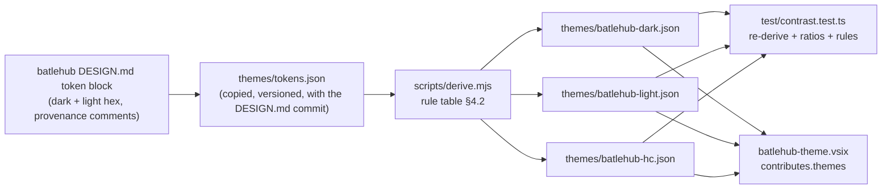
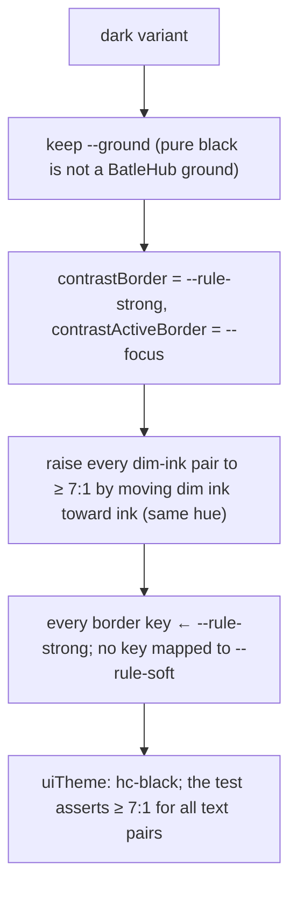

# RFC 0014 — BatleHub colour theme

| Field       | Value                                                        |
| ----------- | ------------------------------------------------------------ |
| Status      | Implemented — revision 3, 2026-09-19; phases 1–4 landed and proven in a real editor (`HEAVY_ONLY=java`, `ALL-OK`: `THEME-DARK-OK`, `THEME-PANEL-OK`, `THEME-LIGHT-OK`, `THEME-HC-OK`, `THEME-TOKENS-OK`). One question left open, and it needs eyes rather than code (§11) |
| Short       | BatleHub theme                                                |
| Settles     | A BatleHub colour theme extension (dark, light, high-contrast) derived from BatleHub's DESIGN.md; on the gallery for whoever wants it — the pack neither installs nor recommends it |
| Closes      | Product — BatleHub's identity in the editor |
| Author      | Max Batleforc <maxleriche.60@gmail.com>                       |
| Co-author   | —                                                             |
| Created     | 2026-09-18                                                    |
| Revised     | 2026-09-19 — revision 3, written as it was built: open questions 2 and 3 answered from the first derivation, `PAIRS` replaced by a rule that needs no table, the keys the sweep and the Java panel forced into §4.2 recorded, the panel's focus ring corrected to the 1px java-core draws. 2026-09-18 — revision 2, after the series was reviewed against its goal (RFC 0001 §7.1): what a Product RFC is, crimson no longer means both "do this" and "this is broken", the cursor is ink, the contrast test covers inherited keys, `tokens.json` drift is watched nightly |
| Supersedes  | —                                                             |
| Depends on  | RFC 0001 (§4.2 "The Java panel's look": the panel takes `--vscode-*` tokens and the identity goes into a theme; the pack; the three-theme screenshots of the heavy suite). The palette is BatleHub's `DESIGN.md` (`batleforc/batlehub`, "Design System: BatleHub", §Colors), not this repository's |
| Touches     | `extensions/batlehub-theme/` (new: `package.json`, `themes/tokens.json`, `themes/base-defaults.json`, `themes/batlehub-*.json`, `scripts/color.mjs`, `scripts/base-defaults.mjs`, `scripts/derive.mjs`, `test/contrast.test.ts`, `README.md`), `.github/workflows/nightly.yaml` (one job), `tests/heavy/java.mjs` and `tests/heavy/view.sh` (the theme phases beside the panel phase), `docs/guide/theme.md`, `docs/.vitepress/config.ts`, `extensions/java-pack/README.md` (a mention; the pack manifest is unchanged) |

---

## 1. Summary

A theme extension, `batlehub.batlehub-theme`, with three variants —
**BatleHub Dark**, **BatleHub Light**, **BatleHub High Contrast** — whose
colours are *derived*, not drawn: a script reads the token block of
BatleHub's `DESIGN.md` (ground, sunk, raised, ink, dim ink, the two rules,
crimson, counter-ink, copper, amber) and maps each token onto the editor's
`colors` keys and a small `tokenColors` / `semanticTokenColors` set by a
fixed rule written in this RFC. The generated JSON is committed; a unit
test re-derives it and asserts the contrast ratios `DESIGN.md` promises
(ink 16.9:1, dim ink ≥ 5.3:1, crimson ≥ 5.6:1, amber focus 13:1 on dark)
on the surfaces they land on. The extension contains **no runtime code**
— `contributes.themes` only — and **the pack neither installs nor
recommends it**: it is on the gallery for whoever wants it. The heavy
suite's panel phase, which already screenshots the Java panel under three
stock themes, gains the three BatleHub ones and asserts one rendered
colour per variant.

**This is a Product RFC** (its `Closes` row). RFC 0001 §7.1: a Product RFC
serves BatleHub's identity rather than a gap a Java developer feels; it is
**exempt from Appendix A tracing**, **bound by the red lines** like every
other (§7), and **never on the path of a traced row** — no feature that
closes an Appendix A row may depend on the theme being installed or
selected, and the Java panel stays correct under any theme. It sits
**outside the order of work** (RFC 0001 §14): independent, built whenever,
and never ahead of something a team is waiting for.

### Before / after

```text
# today
- the Java panel renders in Dark Modern / Light Modern / Dark High Contrast
  through --vscode-* tokens; BatleHub has no presence in the editor's chrome
- DESIGN.md's palette lives in BatleHub's web UI only

# with this RFC
- Preferences: Color Theme → BatleHub Dark: the editor ground is DESIGN.md's
  warm near-black, links and the one primary action are Signal Crimson
  (errors are the editor's conventional red, not crimson), focus rings are
  Signal Amber, "pending" (modified files, warnings) is Aged Copper; Java
  keywords, types and strings follow the same four voices
- the same file in Light: same hues, re-derived lightness (DESIGN.md's
  Re-Derived Lightness Rule), the same rule table
- extensions/batlehub-theme/themes/*.json are generated, diffed in review,
  and a test fails when a ratio drops under DESIGN.md's floor
```

---

## 2. Motivation

1. **RFC 0001 made a promise it did not keep.** §4.2 says BatleHub's
   identity "goes into a BatleHub colour theme — a separate, tiny
   extension that the pack recommends. Own RFC (§14)" (this RFC keeps the
   theme and drops the recommendation: §6.2). The panel was
   built token-only on that promise; without the theme the family has
   no visible identity anywhere.
2. **A hand-drawn theme drifts from the design system on day two.**
   `DESIGN.md` is precise to the ratio (`--ink-dim` 5.62:1 on
   near-black, 7.24:1 on paper; copper darkened from L .58 to L .50 to
   reach 5.74:1) and carries rules (In-Gamut, Undependable Fill,
   Counter-Ink, One Synthetic). A theme JSON edited by hand cannot show
   which rule each colour obeys; a derivation script can, and a test can
   hold the ratios.
3. **High contrast is a requirement, not a variant.** The heavy suite
   already asserts the panel under Dark High Contrast; a theme family
   without an HC member would drop the
   editor's HC guarantees for users who need them.
4. **Semantic tokens are where Java is coloured.** `redhat.java` emits
   semantic tokens (`class`, `interface`, `enum`, `method`, `property`,
   `annotation`, `modifier`…); a theme that only sets TextMate scopes
   colours Java by the grammar's guess and the language server's truth
   in two palettes.

### 2.1 Use cases

1. **Select the dark theme.** *Who:* a developer who installed
   the theme from the gallery. *Start:* the `java`
   heavy fixture open, `Greeter.java` in the editor. *Action:*
   `Preferences: Color Theme` → `BatleHub Dark`. *Proof:* the driver
   reads `getComputedStyle(document.body).backgroundColor` of
   `.monaco-workbench` and asserts DESIGN.md's dark `--ground` (the
   committed hex, §4.2), and `--vscode-focusBorder` on `:root` equals the
   amber focus token; a screenshot `NN-java-panel-batlehub-dark.png` is
   kept (`THEME-DARK-OK`).
2. **The Java panel under the theme.** *Start:* case 1. *Action:* open
   the Java panel (RFC 0001's `PANEL-OK` path). *Proof:* the panel's
   selected tab underline is `--vscode-panelTitle-activeBorder` = the
   crimson token (its one "selected edge" job, DESIGN.md), the tab text
   is `--vscode-panelTitle-activeForeground` = ink; no colour in the panel's
   computed styles is outside the theme's `colors` map — the driver lists
   every computed `color`/`background-color`/`border-color` under the
   panel's `body` and checks membership (`THEME-PANEL-OK`). Native form
   controls (`input`, `select`, `textarea`) are left out of the sweep: a
   radio is painted by the user agent, not by a `--vscode-*` token, so it is
   not the theme's to answer for. Making the membership hold is what forced
   `panelTitle.activeForeground`, `panelTitle.inactiveForeground`,
   `input.foreground`, `button.secondary*` and `textBlockQuote.*` into
   §4.2's table.
3. **Light, same rules.** *Action:* `BatleHub Light`. *Proof:* ground is
   the paper token, the selected tab edge is the light crimson
   (`#c50220`-class, DESIGN.md §Primary), the contrast of `--vscode-foreground`
   on `--vscode-editor-background` computed by the driver ≥ 16:1
   (`THEME-LIGHT-OK`).
4. **High contrast keeps the editor's HC contract.** *Action:*
   `BatleHub High Contrast`. *Proof:* `contrastBorder` and
   `contrastActiveBorder` are set (the keys HC themes must define), the
   driver asserts the keyboard-focused tab in the panel shows an outline in
   the amber token on `:focus-visible`, and the screenshot is kept
   (`THEME-HC-OK`). The ring is 1px: that is what `java-core`'s
   `panel.css` draws, and widening it to DESIGN.md's 2px is a `java-core`
   change under RFC 0001, not this one — the theme owns the colour, not the
   width.
5. **Java semantic colours.** *Start:* case 1, JDT.LS in Standard mode
   (`SERVER-OK`). *Action:* none. *Proof:* in `Greeter.java` the driver
   reads the rendered span colours of a class name, a method name, a
   string literal and an annotation and asserts the voices of §4.2:
   ink for the class, dim ink for the method and for `public`, copper for
   the string; and that crimson appears in **no** rendered token colour —
   the One Synthetic Rule. The annotation is read from `MainTest.java`'s
   `@Test`: `Greeter.java` carries none, and it is a golden for the
   formatter, so the fixture is not edited to give this case one
   (`THEME-TOKENS-OK`).
6. **The ratios hold in CI.** *Who:* a maintainer bumping a token.
   *Action:* edit `themes/tokens.json`'s dark `--ink-dim` to a lighter
   value, run `pnpm run derive` then `pnpm test` in the extension. *Proof:*
   `contrast.test.ts` fails naming the pair (`editor.foreground dim on
   editor.background: 4.9:1 < 5.28:1 floor`); `task check` refuses the
   VSIX (unit layer, no editor needed).

---

## 3. Goals / non-goals

**Goals**

- Three variants derived from one token block by one rule table, with
  the derivation script and its output both committed.
- Every ratio `DESIGN.md` states for a pair that lands in the editor is
  asserted by a unit test — and so is every pair the theme *inherits* from
  the base theme and lays on a BatleHub background.
- One hue, one meaning: crimson is the action colour and never the error
  colour.
- Java's semantic tokens coloured by the same four voices as the chrome.
- No runtime code; the VSIX is JSON and an icon.
- Proven by the heavy suite's screenshots. Not a pack member and not a
  pack recommendation: installed by whoever wants it.

**Non-goals**

- **Being a dependency.** A Product RFC is never on the path of a traced
  row (§1): nothing in `java-core` or a satellite reads, requires or sets
  this theme.
- **An icon theme or a product icon theme.** File icons are a separate
  contribution point and a separate design effort; not here.
- **Colouring languages other than Java, Groovy, YAML/properties/XML
  (the build files) and Markdown.** The TextMate rules cover the scopes
  those grammars emit; the rest falls to the theme's defaults.
- **A settings UI or a toggle.** The editor's theme picker is the UI.
- **Matching Monofolio's web rendering pixel for pixel.** The editor is
  not the web UI; the rule table maps *roles*, not screens.
- **Wide-gamut (display-p3) variants.** DESIGN.md's In-Gamut Rule: sRGB
  as written; P3 layers later, if ever.

---

## 4. User-facing design

### 4.1 Configuration

None. `contributes.themes` lists three entries (`uiTheme: vs-dark`,
`vs`, `hc-black`), the user picks one with `workbench.colorTheme`.
`java-pack` is unchanged; `extensions/java-pack/README.md` says which theme
the screenshots use.

### 4.2 Behaviour rules — the derivation table

The token block (dark and light values, each a hex clamped to sRGB as
DESIGN.md's In-Gamut Rule requires; the HC variant is derived from dark,
§5.2) maps as follows. Every editor key not listed inherits the base
theme's default for its `uiTheme`; the test asserts the listed ones **and
the inherited ones**: an inherited foreground lands on a BatleHub
background nobody chose it for, so the test computes the effective colour
of every key the base theme would supply and checks it against the
BatleHub background it sits on (§6.1). A key that fails is promoted, not
waived — by hand into this table when the key is one the theme should have
been naming all along, and otherwise by the derivation itself, which
re-derives its lightness under DESIGN.md's Re-Derived Lightness Rule and
writes it into `colors`. Most of the generated map is that second kind:
around seventy keys in dark, a hundred and forty in light.

| DESIGN.md token | Role | Editor keys (`colors`) |
| --- | --- | --- |
| `--ground` | the page | `editor.background`, `sideBar.background`, `activityBar.background`, `panel.background`, `terminal.background`, `titleBar.activeBackground`, `notifications.background` |
| `--ground-sunk` | masthead, wells | `statusBar.background`, `input.background`, `editorWidget.background`, `quickInput.background`, `dropdown.background`, `button.secondaryBackground`, `textBlockQuote.background` |
| `--ground-raised` | hover, selected cell | `list.hoverBackground`, `list.activeSelectionBackground`, `editor.lineHighlightBackground`, `tab.activeBackground`, `button.secondaryHoverBackground` (a hover moves toward the ink pole: that is what raised means), `statusBarItem.prominentBackground` |
| `--ink` | package names, headings | `foreground`, `editor.foreground`, `list.activeSelectionForeground`, `titleBar.activeForeground`, `tab.activeForeground`, `editorCursor.foreground` (§11 decision 8), `activityBar.foreground`, `panelTitle.activeForeground`, `input.foreground`, `quickInput.foreground`, `button.secondaryForeground`, `statusBarItem.prominentForeground` |
| `--ink-dim` | labels, captions, secondary | `descriptionForeground`, `editorLineNumber.foreground`, `tab.inactiveForeground`, `statusBar.foreground`, `sideBarSectionHeader.foreground`, `editorCodeLens.foreground`, `disabledForeground`, `activityBar.inactiveForeground`, `panelTitle.inactiveForeground` |
| `--rule-soft` | separators | `editorIndentGuide.background`, `editorRuler.foreground`, `panel.border`, `sideBar.border`, `editorGroup.border`, `tree.indentGuidesStroke`, `textBlockQuote.border` |
| `--rule-strong` | interactive boundaries | `input.border`, `dropdown.border`, `button.border`, `checkbox.border`, `widget.border`, `editorWidget.border`, `contrastBorder` (HC only) |
| `--accent` (crimson) | the action colour — its jobs that land in the editor: link, one primary action, selected edge. "Blocked" does not land here (§11 decision 7) | `textLink.foreground`, `button.background`, `badge.background`, `activityBarBadge.background`, `panelTitle.activeBorder`, `tab.activeBorder`, `activityBar.activeBorder` |
| `--accent-ink` | counter-ink on crimson | `button.foreground`, `badge.foreground` (badge background is crimson: a count on the one action), `activityBarBadge.foreground` |
| `--copper` | pending / held / moving the wrong way | `gitDecoration.modifiedResourceForeground`, `editorWarning.foreground`, `list.warningForeground`, `editorGutter.modifiedBackground`, `statusBarItem.warningForeground` (never `warningBackground`: copper is not a fill outside the plate, DESIGN.md), `terminal.ansiYellow` |
| `--focus` (amber) | the focus ring, nowhere else | `focusBorder`, `contrastActiveBorder` (HC only) |
| `error` — **derived, not a DESIGN.md token** | "this is broken" | `errorForeground`, `editorError.foreground`, `list.errorForeground`, `editorOverviewRuler.errorForeground`, `inputValidation.errorBorder`, `terminal.ansiRed` |

The rows past the first draft's are promotions, each forced by a measurement
rather than chosen: the sweep of §4.3 found white activity-bar icons on
paper and white text on a paper status bar, and `THEME-PANEL-OK` found the
five keys the Java panel reads and the theme had left to the editor. Every
other key of the registry is still inherited, and still measured (§4.3).

`error` is the base theme's conventional error red for the `uiTheme`
(`editorError.foreground` of `base-defaults.json`), kept in hue and moved
in lightness until it measures ≥ 4.5:1 on `--ground` (≥ 7:1 in HC). It is
the one colour of the theme that does not come from `DESIGN.md`, and
deliberately: a developer reads red as "broken" in every editor, and the
same crimson on the `Run` button and under a syntax error would say "do
this" and "this is broken" in one hue.

Rules the script enforces, each a test:

- **One Synthetic.** Crimson appears only in the keys listed — every one
  of them an action, a link or a selected edge — in no error key, and in
  no `tokenColors` / `semanticTokenColors` entry. A syntax voice is ink,
  dim ink or copper; `invalid` scopes take `error`.
- **One hue, one meaning.** No key carries both: the set of keys mapped to
  `--accent` and the set mapped to `error` are disjoint, and the two
  colours differ by a stated minimum (the test measures ΔE in OKLab; the
  number is fixed with the first derivation, §11 open 3).
- **Counter-Ink.** Every key whose background is crimson has
  `--accent-ink` as its foreground, and the pair measures ≥ 5.6:1.
- **Undependable Fill.** `--ground-raised` and `--ground-sunk` are never
  the sole cue: every key mapped to them has a border or foreground key
  mapped to a rule or ink in the same component (`list.activeSelection*`
  pairs raised with ink; `input` pairs sunk with `--rule-strong`).
- **Floors.** ink on ground ≥ 16:1; dim ink on ground ≥ 5.28:1 (the
  raised-surface floor DESIGN.md gives), on raised ≥ 5.2:1; crimson on
  ground ≥ 5.6:1; `error` on ground ≥ 4.5:1; amber on ground ≥ 13:1
  (dark) / ≥ 4.4:1 (light); an inherited text key on its BatleHub
  background ≥ 4.5:1, an inherited non-text key ≥ 3:1;
  `--rule-strong` on ground ≥ 3.4:1 (non-text UI, WCAG 1.4.11).

Syntax, through semantic tokens first (`semanticHighlighting: true`) and
TextMate scopes as the fallback for the same roles:

| Voice | Semantic tokens (Java, from `redhat.java`) | TextMate scopes |
| --- | --- | --- |
| ink | `class`, `interface`, `enum`, `record`, `typeParameter`, `namespace` | `entity.name.type`, `entity.name.namespace` |
| ink, bold | `method.declaration`, `class.declaration` | `entity.name.function` in a declaration |
| dim ink | `method`, `property`, `parameter`, `variable`, `keyword`, `modifier`, `operator`, punctuation | `keyword`, `storage`, `variable`, `punctuation` |
| dim ink, italic | `comment` | `comment` |
| copper | `string`, `number`, `annotation`, `annotationMember`, `enumMember` | `string`, `constant.numeric`, `storage.type.annotation`, `constant.other.enum` |
| `error` | — | `invalid`, `invalid.illegal` only |

Keywords in dim ink is a deliberate choice (DESIGN.md: dim ink "carries
everything ordinary"); §11 open 1 asks whether ink+bold for keywords
reads better in the real editor, which is what the screenshots are for.

### 4.3 Validation

Hard errors (the unit test, so `task check` fails):

| Condition | Rationale |
| --- | --- |
| A floor of §4.2 not met by the generated JSON | the theme's only promise is the ratios; a lower one is a regression in accessibility |
| Crimson in any token colour, or on any error key | One Synthetic Rule; one hue, one meaning |
| An inherited key under its floor on the BatleHub background it lands on | the base theme chose that colour for another ground; the theme owns the pair the moment it changes the ground |
| A `tokens.json` value that is not sRGB hex | In-Gamut Rule: the value that ships is the one the test measured |
| `base-defaults.json` recorded for another VS Code version than the heavy suite's pin | the inherited pairs would be computed against defaults nobody runs |
| A crimson-background key without `--accent-ink` foreground | Counter-Ink Rule |
| A `themes/*.json` that differs from `scripts/derive.mjs`'s output | the committed file is the derivation, or the derivation is decoration |

Warnings: none at runtime — there is no runtime. Out of band, the nightly
opens one drift issue when `DESIGN.md` has moved past the commit
`tokens.json` records (§9).

---

## 5. Architecture

### 5.1 From the design system to the VSIX



The invariant: **the JSON is never edited by hand.** `tokens.json` is the
only input (a copy of the token block with the `DESIGN.md` commit hash it
came from, because the two repositories do not share a checkout); a
palette change is a `tokens.json` bump, a re-run, a diff of three JSON
files, and a green test. A copy can fall behind silently, so the nightly
compares the recorded hash with upstream (§9).

### 5.2 High contrast, derived from dark



HC keeps the hues and the ground (the editor's own HC themes are not
pure black either) and changes three things: every boundary becomes a
strong rule, every text pair is lifted to AAA (7:1), and the two
`contrast*Border` keys the editor uses to outline every widget in HC are
set. That is the whole HC derivation; it is a function of the dark
tokens, not a fourth palette.

---

## 6. Detailed design

### 6.1 `extensions/batlehub-theme`

```
package.json            contributes.themes (three), no activationEvents, no main; version, icon, categories: ["Themes"]
themes/tokens.json      the DESIGN.md token block: { source: { repo, path, commit }, dark: {…}, light: {…}, provenance: the authored oklch() }
themes/batlehub-dark.json / batlehub-light.json / batlehub-hc.json   generated
themes/base-defaults.json   the colour-registry defaults of vs-dark, vs and hc-black for the pinned VS Code: { vscode: "<version>", "vs-dark": {…}, … }
scripts/color.mjs       sRGB, WCAG luminance, HSL and OKLCH — the model derive.mjs and base-defaults.mjs share
scripts/base-defaults.mjs  the colour registry out of a VS Code web build; run when the heavy suite's pin moves
scripts/derive.mjs      reads tokens.json, applies §4.2 and the inherited sweep, writes the three files; `pnpm run derive`
test/contrast.test.ts   vitest: derive() in memory === committed files; every floor and rule of §4.2 over the committed files
package.nls.json        the three theme labels
README.md               what the colours mean, how the files are generated, what the test holds
```

- `derive.mjs` holds the two tables of §4.2 as data and the sweep; the
  colour maths is beside it in `scripts/color.mjs`, because
  `base-defaults.mjs` needs the same model to resolve the registry's
  transforms and a second implementation would be a second thing to be
  wrong. WCAG relative luminance, sRGB compositing, HSL for the registry's
  `darken`/`lighten`, and OKLCH for the Re-Derived Lightness Rule — no
  dependency; the formulas are the spec. The HC lift is that same
  re-derivation, not a second mechanism: §5.2's "same hue" and DESIGN.md's
  named rule are the same instruction, and one function is fewer things to
  be wrong than a linear-RGB lift beside an OKLCH one. JSON with stable key
  order.
- `base-defaults.json` is extracted once per VS Code pin (the version the
  heavy suite downloads) by `scripts/base-defaults.mjs` from the web
  build's colour registry, and regenerated in the PR that moves that pin.
  It reads the `registerColor` calls out of the workbench bundle as text
  and evaluates their defaults — hex, a reference to another colour, and
  the six transforms (`darken`, `lighten`, `transparent`, `opaque`,
  `oneOf`, `lessProminent`) — against the colour model of
  `scripts/color.mjs`. Every minified name it needs is discovered from the
  bundle rather than written down, so a renamed helper fails loudly here
  instead of quietly yielding half a registry. 967 colours for VS Code
  1.136.1.
- **`PAIRS` is gone; nothing replaced it but a rule.** A table naming one
  background per key would need a row for each of those 967, would be a
  new decision for every colour VS Code adds, and would be wrong the first
  time a key is painted somewhere else. Instead: a key with a background of
  its own — a badge, the debugging status bar — is measured on that one, and
  if the theme did not set that background either, the pair is skipped
  because both halves are still the base theme's and nothing about them
  changed. Every other key is measured against **all three** grounds the
  theme introduces (`--ground`, `--ground-sunk`, `--ground-raised`), because
  the theme cannot know which one the editor will paint it over and owes the
  floor on all of them. That is stricter than one row per key, cannot go
  stale, and sweeps a colour the editor adds tomorrow on the day it appears.
- **Three floors, by what the key draws.** Text owes 4.5:1 (7:1 in HC); an
  icon or a mark owes WCAG 1.4.11's 3:1; a hairline — a border, a guide, a
  ruler, a whitespace dot — owes what a *BatleHub* separator reaches on the
  same ground (1.75:1 dark, 1.72:1 light, 3.67:1 HC, computed from
  `panel.border`, not written down). DESIGN.md is explicit that a soft rule
  "is not a contrast-carrying value": holding an inherited hairline to 3:1
  when the theme's own separator measures 1.75:1 would fail the theme
  against a bar it does not set for itself. `minimap.foregroundOpacity` is
  skipped by name: it is an alpha channel wearing a colour's clothes, and
  re-deriving its lightness would change the minimap's opacity, not its
  contrast.
- **Promotion keeps the editor's meaning.** A failing key is re-derived by
  DESIGN.md's Re-Derived Lightness Rule — same hue, same chroma as far as
  the gamut allows, lightness moved the shorter way until the floor holds on
  every ground. The editor's blue stays blue and its orange stays orange.
  Alpha is raised only when no lightness of that hue can reach the floor
  through the veil, and then only as far as the floor needs, so a hairline
  the editor drew at 15% does not become a solid line.
- `contrast.test.ts` imports `derive.mjs`, compares to the committed
  files byte for byte, then walks the rule table, then walks **every key
  of `base-defaults.json`** through the same sweep the derivation used —
  one generator, `inheritedPairs`, feeds both, so the test cannot be
  measuring a different set from the one the promotion fixed. The ratio
  function is the same one; a second implementation in the test would be a
  second thing to be wrong.
- `package.json` scripts: `build` = `derive`, `lint` = prettier on the
  JSON, `test` = vitest, `package` = `vsce package`; the `ext:*` tasks
  pick the directory up unchanged (RFC 0001 §6.3 "touched once").
- No `l10n`: theme labels are the three names, in `package.nls.json`
  for the day a second language comes.

### 6.2 `extensions/java-pack`

- Unchanged: the theme is neither in `extensionPack` nor in
  `extensionRecommendations` (revision 2, decided with the maintainer: no
  recommendation, the theme just exists). A colour theme is a personal
  choice; the README mentions it and says how to pick it.

### 6.3 `tests/heavy/java.mjs`

- The panel phase's theme loop (`setTheme(page, name)`, today `Dark
  Modern`, `Light Modern`, `Dark High Contrast`) gains the three BatleHub
  names when the theme VSIX is installed (`INSTALL_VSIX` in `view.sh`),
  reads the computed colours of §2.1 and keeps the screenshots as
  `NN-java-panel-batlehub-{dark,light,hc}.png`. The pixel comparison RFC
  0001 declined stays declined; the assertions are computed colours,
  which do not depend on the renderer.

**Deliberately untouched:**

- `extensions/java-core/media/panel/panel.css` — tokens only, as RFC 0001
  §4.2 requires; the theme is what gives the tokens values. A panel rule
  that names a colour would be the bug this RFC exists to avoid.
- `DESIGN.md` itself — read, copied with its commit, never edited from
  here; a ratio that fails is fixed in BatleHub's repository first.

---

## 7. Security considerations

There is no code path: a theme is JSON read by the editor's own theme
service, with no activation, no filesystem or network access, and no
setting written. The only trust edge is the derivation script, which runs
at build time in this repository over a committed file. The VSIX carries
three JSON files and an icon; the size budget of RFC 0001 §13 applies and
is trivially met. The nightly drift check reads a public repository's
commit list with the workflow's own token and writes one issue here.

### Red lines

- **Every write is in the manifest.** Does not apply, because nothing is
  written: no setting, no file, no mode. The pack does not set
  `workbench.colorTheme` (§6.2); the user's pick is the user's setting and
  `Java: Remove BatleHub settings` has nothing to undo.
- **The token is the core's.** Does not apply: a theme has no code and no
  registry credential is within reach of it.
- **Memory.** None — no process, no activation, no extension-host code.
- **Defaults crossed.** None. No foreign setting is written, nothing is
  downloaded at runtime, nothing leaves the machine. *Every feature traces
  to a row of Appendix A* is not crossed but does not bind: this is a
  Product RFC, exempt from tracing by RFC 0001 §7.1, on the two conditions
  §1 states — bound by these red lines, never on the path of a traced row.

---

## 8. Alternatives considered

| Alternative | Why rejected |
| --- | --- |
| Hand-authored theme JSON, "like every other theme" | §2 point 2: it cannot show which rule a colour obeys, and the ratios rot silently. The script is 150 lines and the test is the point. |
| `workbench.colorCustomizations` written by `java-core` instead of a theme | Writes user settings the removal command would then own; overrides every theme the user picks; RFC 0001 §4.2 chose a theme precisely so the core never touches the chrome. |
| One theme, dark only | The heavy suite asserts three stock themes for a reason; a family without light and HC members is a recommendation that drops accessibility. |
| Read `DESIGN.md` at build time from the BatleHub checkout (`BATLEHUB_SRC`) | CI has no checkout of the other repository (RFC 0001 §13 runs the hub as release binaries); a committed copy with its commit hash is reproducible and reviewable. |
| Semantic tokens off, TextMate only | Java is coloured by the grammar's guess instead of JDT.LS's truth; `redhat.java` emits the tokens, using them costs one map. |
| Crimson for errors too (revision 1: "blocked" is one of its four jobs) | The same hue on `button.background` and under a syntax error means "do this" and "this is broken" at once. In BatleHub's web UI "blocked" is a verdict beside a package; in an editor red is already "broken", everywhere. Errors take the conventional red, derived for contrast; crimson stays the action colour. |
| Crimson for keywords (it is the brand colour) | One Synthetic Rule: crimson has its jobs and none is "the most common token on screen". Brand identity is the ground and the ink, not a keyword colour. |

---

## 9. Rollout and compatibility

- **Default behaviour**: nothing until the user picks the theme; the
  pack neither installs it nor changes a setting.
- **Config migration**: none.
- **Prerequisites**: `redhat.java` ≥ 1.56.0 for the semantic token
  types named (the pinned minimum already); older servers get the
  TextMate fallback.
- **Rollback**: pick another theme; uninstall the extension. Nothing
  persisted beyond `workbench.colorTheme`, which the user set.
- **Palette updates**: `tokens.json` bumped with the `DESIGN.md` commit,
  `pnpm run derive`, the three diffs reviewed, the test green; the
  CHANGELOG names the upstream commit.
- **Palette drift**: the existing nightly workflow (RFC 0001 §13) gains
  one step — the newest upstream commit touching `DESIGN.md`
  (`gh api 'repos/batleforc/batlehub/commits?path=DESIGN.md&per_page=1'`)
  against `tokens.json`'s `source.commit`. Different: it opens **one** drift
  issue (found by title, updated rather than duplicated) with the compare
  link. It never bumps by itself; a palette change is reviewed.
- **Order**: outside RFC 0001 §14's order of work — built whenever, behind
  anything a team is waiting for.

---

## 10. Test plan

- **Unit** (`extensions/batlehub-theme/test/contrast.test.ts`): the
  committed files equal `derive()`; every floor of §4.2 for every listed
  pair in all three variants; **the inherited pairs** — every key of
  `base-defaults.json` through the sweep of §6.1, text ≥ 4.5:1 (7:1 in HC),
  a mark ≥ 3:1, a hairline ≥ what a BatleHub separator reaches on the same
  ground;
  `base-defaults.json`'s version against the heavy suite's pin; One
  Synthetic (no crimson in any `tokenColors` / `semanticTokenColors`, none
  on an error key; the accent and error key sets disjoint and the two
  colours apart by the stated ΔE); Counter-Ink (every crimson
  background paired with `--accent-ink`); Undependable Fill (every
  raised/sunk key has a partner key); HC: all text pairs ≥ 7:1 and both
  `contrast*Border` keys set; `tokens.json` values in sRGB gamut
  (In-Gamut Rule: each channel 0–255 after parsing, no `oklch` strings).
- **Nightly**: the `DESIGN.md` commit comparison of §9; its failure mode is
  an issue, never a red build.
- **Lint**: `scripts/check-settings-doc.mjs` unaffected (no settings);
  prettier on JSON.
- **Heavy** (`tests/heavy/java.mjs`, panel phase): `THEME-DARK-OK`,
  `THEME-PANEL-OK`, `THEME-LIGHT-OK`, `THEME-HC-OK`, `THEME-TOKENS-OK` as
  in §2.1, with the theme VSIX installed beside the core; screenshots
  kept as artifacts.
- **Existing suites** unchanged: the panel's `PANEL-OK` under the three
  stock themes proves the panel still follows tokens — the theme must
  not make it pass for the wrong reason.

---

## 11. Decisions and open questions

### Resolved

| # | Question | Decision |
| --- | --- | --- |
| 1 | Generated or hand-drawn? | **Generated from a committed token copy**, with the test holding the ratios. |
| 2 | Where does the palette live? | **`themes/tokens.json` with the `DESIGN.md` commit hash**; CI has no BatleHub checkout. |
| 3 | HC as a fourth palette? | **Derived from dark**: strong rules everywhere, text lifted to 7:1, the two `contrast*Border` keys. |
| 4 | Crimson in syntax? | **Never** — revision 2: not even `invalid` scopes, which take the derived `error` red. |
| 5 | Semantic tokens? | **On**, mapped to the four voices; TextMate as the fallback. |
| 6 | Runtime code? | **None.** `contributes.themes` only. |
| 7 | `--accent` on both `button.background` and the error foregrounds? (revision 2; revision 1 mapped both) | **No — one hue, one meaning.** Crimson stays the action colour (link, primary action, selected edge); errors take the editor's conventional red, derived in lightness to meet contrast. DESIGN.md's "blocked" job has no landing in the editor. |
| 8 | The cursor (was open question 1) | **Ink.** Amber is "the focus ring, nowhere else"; `editorCursor.foreground` maps to `--ink` and §4.2's table says so. The screenshots only confirm visibility. |
| 9 | Does the contrast test stop at the listed pairs? (revision 2) | **No — inherited pairs too**: the effective colour of every key the base theme supplies, against the BatleHub background it lands on; a failing key is promoted into the table. |
| 10 | How is `tokens.json` kept from falling behind? (revision 2) | **The existing nightly compares the recorded `DESIGN.md` commit with upstream and opens one drift issue**; it never bumps by itself. |
| 11 | What binds an RFC that closes no Appendix A row? (revision 2) | **It is a Product RFC**: exempt from tracing, bound by the red lines, never on the path of a traced row, outside the order of work (RFC 0001 §7.1, §14). |
| 12 | Terminal ANSI palette (was open question 2) | **The base theme's ANSI defaults, except red and yellow.** Red takes the derived error colour and yellow takes copper; the other fourteen stay the editor's. Sixteen colours cannot come out of a five-voice palette without a terminal that is all warm greys, and `ls --color` is not the place to express an identity. |
| 13 | How far apart are crimson and a conventional red? (was open question 3) | **ΔE ≥ 0.05 in OKLab, and the red moves, never crimson.** The first derivation measured the editor's own error reds at ΔE 0.034 (dark) and 0.056 (light) from crimson: one under what the eye reads as a second colour, one barely over. 0.05 is about twice the OKLab just-noticeable difference and is the most the palette gives before the red reaches copper, which sits at ΔE 0.10–0.12 from crimson. A red under the floor rotates toward orange in 1° steps, capped at hue 45, and is then re-derived for contrast; dark lands on `#f05129` at hue 35 (ΔE 0.050), light keeps `#dd1300` (0.056) and HC `#f48771` (0.054). |
| 14 | `PAIRS`, the table naming a background per inherited key (revision 3) | **Not built.** 967 keys, a new decision for every colour VS Code adds, and wrong the first time a key is painted somewhere else. A key with a background of its own is measured on that one; every other is measured against all three BatleHub grounds. Stricter, and it cannot go stale. §6.1. |

### Still open

1. **Keywords: dim ink or ink+bold?** Dim ink follows DESIGN.md's
   "everything ordinary"; many readers expect keywords to stand out. It
   ships as dim ink, and `NN-java-batlehub-tokens.png` from the heavy run
   now shows what that looks like: types and declarations carry the line in
   ink, `class`, `void`, `new` and `import` sit back with the identifiers,
   and the page reads calm. The cost is that keywords and ordinary
   identifiers share a colour, so control flow does not pop the way a
   developer arriving from IntelliJ expects. That is a taste call on
   BatleHub's own identity, not a measurement, so it stays here for the
   maintainer.
2. **The panel's focus ring is 1px, DESIGN.md's is 2px with a 2px offset.**
   `java-core`'s `panel.css` draws `outline: 1px solid
   var(--vscode-focusBorder)`; the theme supplies the colour and has no say
   in the width. Widening it is a one-line `java-core` change under RFC
   0001 and was deliberately not made from here (§6.3: the panel is
   untouched).

---

## 12. Implementation phases

| Phase | Content | State |
| --- | --- | --- |
| 1 | `tokens.json` from the current `DESIGN.md` commit; `base-defaults.json` for the pinned VS Code; `derive.mjs` with the dark and light tables and the derived `error`; the contrast test over listed and inherited pairs; `themes/*.json` committed; VSIX under the budget; the nightly drift step | **done** — `tokens.json` at `5993e45`, `base-defaults.json` at VS Code 1.136.1 (967 colours), the VSIX 15 KB, `theme-drift` in `nightly.yaml` |
| 2 | HC derivation and its 7:1 test; the three heavy steps with computed-colour assertions and screenshots | **done and green** — HC derived from dark; in the editor the dark ground measured `#030001`, the focus ring the amber token, the panel's selected edge the crimson token with no colour outside the theme's map, ink on paper 16.63:1 read out of the browser, and both `contrast*Border` set with the keyboard-focused tab ringed in amber |
| 3 | Semantic and TextMate tables; `THEME-TOKENS-OK`; open questions 1–3 answered from the screenshots and the first derivation | **done** for the tables and `THEME-TOKENS-OK` — the class in ink, the method and the keyword in dim ink, the string and `@Test` in copper, and crimson in no rendered token colour — and for questions 2–3 (§11 decisions 12 and 13); question 1 is a judgement and stays open with its screenshot |
| 4 | `docs/guide/theme.md`; README with the screenshots (no pack change) | **done** — the guide, the extension README and a mention in the pack README; the screenshots are heavy-run artifacts and are not committed |
