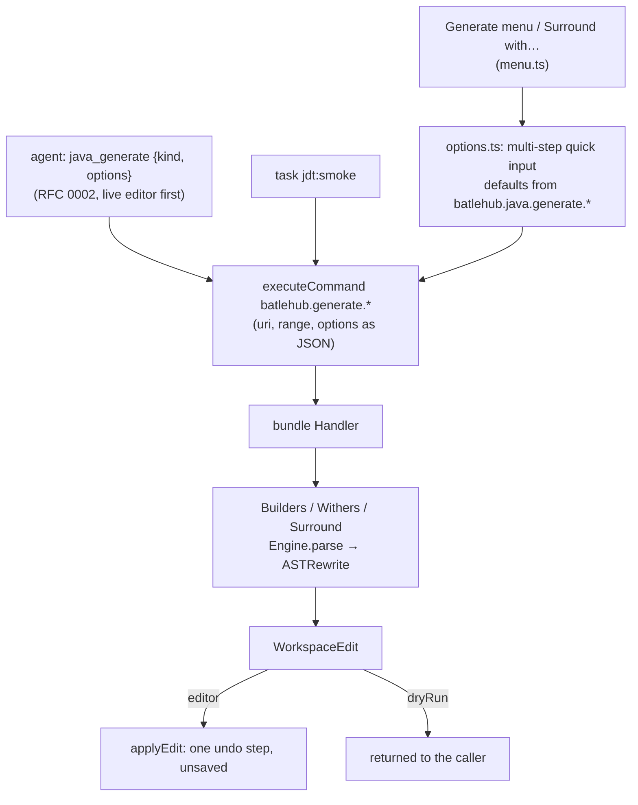
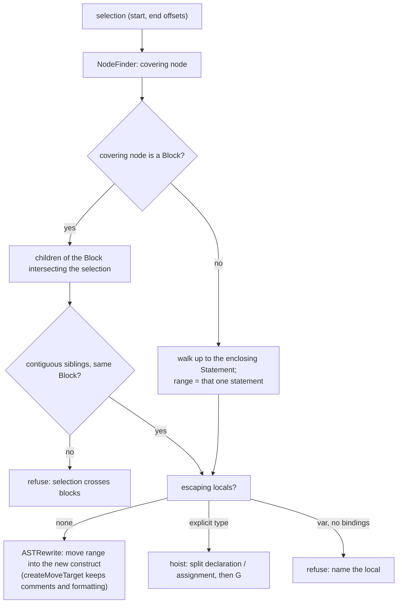

# RFC 0015 — The shortcuts a team lives on: builders, withers, surround-with

| Field       | Value                                                        |
| ----------- | ------------------------------------------------------------ |
| Status      | Draft                                                         |
| Short       | Generate shortcuts                                            |
| Settles     | The code-generation shortcuts Appendix A.8 still owes — the Builder pattern, with-methods, surround-with — each a bundle delegate and so an agent tool, the list taken from Team A's diary rather than guessed |
| Closes      | A.8 — Builder pattern, live templates with surround-with: the shortcuts a team leaving IntelliJ misses first (Team A)                                                                                               |
| Author      | Max Batleforc <maxleriche.60@gmail.com>                       |
| Co-author   | —                                                             |
| Created     | 2026-09-18                                                    |
| Supersedes  | —                                                             |
| Depends on  | RFC 0001 (the bundle of §6.2, the Generate menu of §4.2, the mode gating of decision 36); RFC 0002 for the agent surface; RFC 0007 for the imported live templates this complements |
| Touches     | `jdt/batlehub-jdt-core` (three delegates, `Builders.java`, `Withers.java`, `Surround.java`, golden files), `extensions/java-core` (`src/generate/menu.ts`, new `src/generate/options.ts`, settings), `packages/java-rules/verbs.ts` (three `kind`s of `java_generate`), `tests/heavy/java.mjs` (a `SHORTCUTS-OK` step), `jdt/smoke.mjs`, `docs/guide/java/editing.md` |

---

## 1. Summary

A team leaving IntelliJ does not miss a feature list; it misses the five
keystrokes it makes a hundred times a day. Team A's named example is
generating a builder class with `with…` methods. RFC 0001 Appendix A.8
promised "options + builder" and "snippets + surround-with" for phase 6;
phase 6 landed the accessors delegate and nothing else, and no RFC owned the
rest. This one does. Each shortcut is a delegate of the JDT bundle
(`batlehub.generate.builder`, `batlehub.generate.withers`,
`batlehub.generate.surroundWith`), written with `ASTRewrite` as the accessors
are, its options asked through the same quick-input flow as the Generate
menu, golden-file tested per option set and proven in the real editor. Being
delegates, they are agent tools for free through RFC 0002. **Which shortcuts
are built is Team A's list, not the author's**: two rows are known, eight are
owed, and phase 1 does not start on guessed rows.

### Before / after

```text
# today (java-core 0.5, the bundle of phase 6)
Generate ▸ Getters and setters…          → the bundle's delegate, with options
Generate ▸ Constructor… / toString()…    → Red Hat's prompts, no options
Generate ▸ Builder…                      → (absent)
select three statements, "surround with" → (absent; a snippet cannot see a statement)

# with this RFC
Generate ▸ Builder…        → pick fields · with/set/bare prefix · inner or own file · Lombok @Builder if on the classpath
Generate ▸ With methods…   → pick fields · mutating-fluent or copying (records: copying only)
Surround with…             → if · try/catch · try-with-resources · for · while · synchronized · Runnable
                             over the selection widened to whole statements
agent: java_generate {"kind":"builder", "file":…, "position":…, "options":{…}, "dryRun":true}
```

---

## 2. Motivation

1. **The named shortcut does not exist.** "Builder pattern" is a row of
   Appendix A.8 whose "VS Code today" column reads "builder does not", and
   whose "Handled" column pointed at phase 6 until revision 7 corrected it to
   this RFC. A Team A developer writing a DTO types the builder by hand or
   opens IDEA for thirty seconds, and the second habit is the one that ends a
   migration.
2. **Surround-with cannot be a snippet.** A VS Code snippet sees
   `$TM_SELECTED_TEXT` — characters. It does not know that the selection
   ends mid-statement, that a variable declared inside is used after it
   (wrapping it in `try { }` breaks the build), or what the indentation unit
   of the file is. IDEA's surround-with is a statement-level operation; only
   something holding the AST can do it, and in this project that is the
   bundle.
3. **Phase 6 proved the mechanism and stopped at one generator.**
   `Accessors.java` is ~200 lines over `ASTRewrite` with four golden files
   and a heavy step (`GENERATE-OK`). RFC 0001 §6.2 says "adding one is a
   handler case". The cost of the next three is known; what was missing was a
   list that says which three.
4. **An agent asked for a builder writes one from memory.** It gets the
   field list wrong when the class changes under it, and its style differs
   from the file's. A delegate that takes options and returns a
   `WorkspaceEdit` is deterministic, matches the file's indentation
   (`Engine.indentUnit`) and costs the agent one tool call (RFC 0002).
5. **Guessing the list is how phase 6 ended up with one generator nobody had
   asked for first.** Accessors were built because they were the obvious
   example, not because a team named them. The diary exists (RFC 0001 §7.1,
   "Who pulls a trigger") so that the next ones are named by the people who
   will press the keys.

### 2.1 Use cases

**The list comes first, and it is owed.** `docs/diary/team-a.md` owes "the
ten shortcuts they use most"; at this revision it holds no entry. The table
below is that list with its two known rows. **Phase 1 does not start on a
guessed row**: a row marked *owed* is filled by a dated diary entry, and a
filled row that a snippet, a Red Hat command or an imported live template
(RFC 0007) already covers is closed by pointing at it, not by building.

| # | Shortcut (in the team's words) | IDEA's name | Status | Answered by |
| --- | --- | --- | --- | --- |
| 1 | Builder class with `with…` methods | Generate ▸ Builder (the InnerBuilder plugin, for most teams) | **known** — named by Team A | `batlehub.generate.builder` (this RFC) |
| 2 | Surround-with | Code ▸ Surround With (`Ctrl+Alt+T`) | **known** — Appendix A.8 | `batlehub.generate.surroundWith` (this RFC) |
| 3 | — | — | *owed by Team A* | — |
| 4 | — | — | *owed by Team A* | — |
| 5 | — | — | *owed by Team A* | — |
| 6 | — | — | *owed by Team A* | — |
| 7 | — | — | *owed by Team A* | — |
| 8 | — | — | *owed by Team A* | — |
| 9 | — | — | *owed by Team A* | — |
| 10 | — | — | *owed by Team A* | — |

`with…` methods on an existing class (row 1's second half, IDEA's "wither")
are designed here as `batlehub.generate.withers` because the builder needs
the same member generation; if the list does not name them on their own, the
delegate still exists as the builder's internals and its menu entry is what
is dropped.

The acceptance cases below cover the two known rows. Each is a step of the
`java` heavy half (`SHORTCUTS-OK`) or, where marked, of the bundle's JUnit
layer; a row filled later brings its own case with it.

1. **A builder, inner, with `with` methods.** *Who:* a Team A developer on
   `maven-multi`. *Start:* `Person.java` of `core` with three fields
   (`name`, `age`, `final id`), no builder, cursor inside the class.
   *Action:* `Generate ▸ Builder…`, all fields, prefix `with`, placement
   `inner`. *Proof:* the file gains a `public static Builder builder()`, a
   `private Person(Builder b)` constructor assigning the three fields, and a
   `public static final class Builder` with three `withX` methods returning
   `this` and a `build()`; the file compiles (no JDT error diagnostic on it
   after the edit), indentation matches the file's, and one `Ctrl+Z` removes
   the whole edit.
2. **Re-running does not duplicate.** *Who:* the same, after adding a field
   `email`. *Action:* the same command. *Proof:* only `withEmail`, the
   builder's `email` field and the constructor's assignment are added; every
   existing member is untouched (the accessors delegate's "existing
   accessors kept" rule, applied to the builder).
3. **Lombok on the classpath.** *Who:* a developer on a fixture module that
   depends on `org.projectlombok:lombok`. *Action:* `Generate ▸ Builder…`.
   *Proof:* the first quick-input step offers `@Builder (Lombok)` above
   `Generated code`; choosing it adds the annotation and its import and no
   other member; the same command on `core` (no Lombok) never shows the
   step.
4. **Withers on a record** (layer 1b). *Start:* `record Point(int x, int y)`.
   *Action:* `batlehub.generate.withers` with `style: "copy"`. *Proof:* the
   golden file has `withX(int x) { return new Point(x, this.y); }` and its
   twin; `style: "mutate"` on a record is refused with the reason (a record
   has no assignable field) and returns no edit.
5. **Surround three statements with try/catch.** *Who:* the driver.
   *Start:* `Main.java`, a selection that starts mid-way through the first
   of three statements and ends before the semicolon of the third. *Action:*
   `Surround with… ▸ try / catch`. *Proof:* the three whole statements are
   inside the `try` block, indented one unit; the `catch` names the checked
   exception the statements throw when bindings are available and
   `Exception` otherwise; the cursor is in the catch body.
6. **A selection that cannot be surrounded says so.** *Start:* the same
   file, a selection containing a local declaration that is used after the
   selection. *Action:* `Surround with… ▸ try / catch`. *Proof:* the
   declaration is hoisted above the `try` (split into declaration and
   assignment) when its type is explicit; with `var` and no bindings the
   command refuses with `"<name>" is used after the selection`, and the file
   is unchanged. A selection spanning two blocks is always refused.
7. **Headless, and as a tool.** *Who:* `task jdt:smoke`, then RFC 0002's
   live-editor step. *Action:* `batlehub.generate.builder(uri, position,
   options)` on `Person.java`; `tools/call java_generate {"kind":
   "builder", …, "dryRun": true}`. *Proof:* the smoke prints the edit count
   and stays `SMOKE-OK`; the tool returns the same `WorkspaceEdit` and, with
   `dryRun: false`, leaves the file dirty and unsaved.
8. **LightWeight mode.** *Who:* a developer whose server is in
   `LightWeight`. *Proof:* the three entries are visible and disabled with
   the reason of RFC 0001 decision 36, and the offer to switch mode; no
   command fails.

---

## 3. Goals / non-goals

**Goals**

- The shortcuts Team A names, each one keystroke-complete in the editor:
  pick, options, edit, one undo step.
- Every shortcut a bundle delegate — options in, `WorkspaceEdit` out — so
  the editor, `task jdt:smoke` and an agent call the same code.
- Surround-with that operates on statements, never on characters.
- Lombok respected: where the team already uses `@Builder` / `@With`, the
  shortcut offers the annotation rather than fighting it.
- A list that is the team's. The RFC is complete when every row of §2.1 is
  either built, pointed at what already covers it, or refused with a reason
  the team has read.

**Non-goals**

- **Ten delegates.** Most rows of a real top-ten are already covered —
  `psvm` and `sout` are snippets `redhat.java` ships, `iter` arrives with
  RFC 0007's import, "Generate constructor" is Red Hat's prompt. This RFC
  builds a delegate only where nothing else can do the job.
- **A template language.** IDEA's live templates with `$EXPR$` functions are
  RFC 0007's subject, as snippets, with the functions that have no snippet
  equivalent reported. Surround-with here is a fixed set of constructs
  written in Java against the AST, not user-definable.
- **Replacing Red Hat's constructor / `toString` / `equals` prompts.**
  Their pickers are what those need (RFC 0001 §6.2); an options delegate for
  one of them is built the day a diary row asks.
- **Step builders, staged builders, builders for class hierarchies**
  (`SuperBuilder`). One flat builder. Lombok's `@SuperBuilder` is the answer
  for hierarchies and the annotation path offers it when present.
- **Postfix completion** (`expr.try`, `expr.var`). Related, wanted by some,
  and a completion feature, not a generator; it takes a diary row of its
  own.

---

## 4. User-facing design

### 4.1 Configuration

```jsonc
// defaults of the quick-input steps; each step still shows and is pre-selected
"batlehub.java.generate.builder.methodPrefix": "with",     // with | set | "" (bare: name(...))
"batlehub.java.generate.builder.placement": "inner",       // inner | file
"batlehub.java.generate.builder.lombok": "offer",          // offer | always | never
"batlehub.java.generate.withers.style": "copy",            // copy | mutate
"batlehub.java.generate.surroundWith.catchType": "precise" // precise | Exception
```

- Absent means the default shown. Every key is `batlehub.java.*` (RFC 0001
  decision 35) and none is written by the extension: they are the user's or
  the project's (RFC 0006 may carry them in `project.json`).
- `lombok: "offer"` shows the annotation step only when Lombok is on the
  module's classpath; `"always"` skips the step and writes the annotation
  (still only when Lombok is present — absent, the generated code is
  written and one log line says why); `"never"` hides the step.

### 4.2 Behaviour rules

- **One flow.** `Generate ▸ Builder…` and `With methods…` are entries of
  the existing Generate submenu (`src/generate/menu.ts`), and ask their
  options through the editor's multi-step quick input, as the run editor
  does (RFC 0001 §15.4): fields (multi-pick, non-static, all pre-selected),
  then prefix, then placement. `Esc` at any step writes nothing.
- **Builder, generated form.** A `static Builder builder()` factory, a
  private constructor taking the builder, a `static final class Builder`
  with one field and one prefixed method per selected field, and `build()`.
  `final` fields are included (the builder is how they get set). Existing
  members with the same signature are kept, never rewritten. `placement:
  "file"` writes `<Type>Builder.java` beside the type, in the same package,
  and the constructor becomes package-private.
- **Withers.** `copy` returns a new instance through the canonical
  constructor (records) or the all-fields constructor (classes; when it is
  missing the command offers to generate it first through Red Hat's prompt
  and stops). `mutate` assigns and returns `this`, and is refused on records
  and on `final` fields.
- **Lombok.** Detected from the module's resolved classpath (a
  `lombok-*.jar` entry, read through `redhat.java`'s API the core already
  uses), not from imports in the file. The annotation path adds `@Builder`
  (or `@With`) and the import. It does not remove hand-written members; if
  a hand-written builder exists it says so and stops.
- **Surround-with.** The selection is mapped to a *statement range*: the
  smallest run of sibling statements in one block that covers it. Partial
  statements are widened; an empty selection takes the statement under the
  cursor; a selection crossing block boundaries is refused. Constructs:
  `if`, `if/else`, `while`, `for`, `try/catch`, `try/finally`,
  `try-with-resources` (when the first statement declares an
  `AutoCloseable` — by binding, or by the `new …Stream/Reader/Writer/Connection`
  heuristic without bindings, labelled as a guess), `synchronized`,
  `Runnable` lambda. Locals used after the range are hoisted when their type
  is explicit, else the command refuses (use case 6).
- **Bindings are an upgrade, not a requirement.** The generators are
  syntactic, like the accessors. Surround-with asks `Engine.parse(…,
  bindings = true)` (RFC 0012's entry point) for the precise catch type and
  the `AutoCloseable` test, and falls back to the syntactic answer when the
  project is not resolved — so it works before indexing, less precisely,
  and says which answer it gave.
- **Output is one `WorkspaceEdit`**, applied by the editor as one undo
  step. Nothing is saved.

### 4.3 Validation

Hard errors (notification, no edit):

| Condition | Rationale |
| --- | --- |
| The cursor is not inside a class or record (builder, withers) | there is nothing to generate into; the message names the nearest type |
| Selection crosses block boundaries, or a `var` local escapes it without bindings (surround-with) | any edit would change meaning or break the build; a refused command is cheaper than a wrong one |
| `placement: "file"` and `<Type>Builder.java` exists with other content | never overwrite a source file; the message offers `inner` |

Warnings (`BatleHub Java: JDT` channel, the command still completes):

| Condition | Behaviour |
| --- | --- |
| Delegate absent (bundle not loaded, older bundle) | the entry is hidden — decided from `batlehub.ping`'s command list, as for chain completion; no Red Hat fallback exists for these |
| Server in `LightWeight` / `Hybrid` before Standard | entries disabled with the reason and the switch offer (decision 36) |
| Bindings unavailable for surround-with | syntactic answer, one line `surround: no bindings, catch type is Exception` |
| A field type the builder cannot default (a generic with a wildcard) | copied verbatim; one line naming the field |

---

## 5. Architecture

### 5.1 One shape, three delegates



The invariant: **the bundle never asks a question and never writes a file.**
Options in, edit out (RFC 0001 §6.2). Every interactive step lives in
`options.ts`, so a caller with no UI — the smoke, an agent — supplies the
same JSON and gets the same edit. That is what makes the tool free.

### 5.2 Selection to statement range



`createMoveTarget` rather than re-printing is the point: the statements keep
their comments and inner formatting, and only the indentation changes.

### 5.3 The agent tool

RFC 0002's `java_generate` already exists with `kind: "accessors"`. This RFC
adds three values to `kind` in `packages/java-rules/verbs.ts`; it adds no
tool, so `tools/list` still returns five. The schema shape:

```jsonc
{ "name": "java_generate",
  "inputSchema": { "type": "object", "required": ["kind", "file"],
    "properties": {
      "kind":     { "enum": ["accessors", "builder", "withers", "surroundWith"] },
      "file":     { "type": "string" },
      "position": { "description": "line:col — builder, withers" },
      "range":    { "description": "startLine:col-endLine:col — surroundWith" },
      "options":  { "type": "object", "description": "per kind: fields[], methodPrefix, placement, lombok, style, construct, catchType" },
      "dryRun":   { "type": "boolean", "default": true } } } }
```

Live-editor first (RFC 0002 revision 2): the call goes through the running
JDT.LS, starts no process, and its write is an unsaved edit.

---

## 6. Detailed design

### 6.1 `jdt/batlehub-jdt-core`

- `Builders.java`, `Withers.java`: the shape of `Accessors.java` — parse
  through `Engine.parse`, find the `TypeDeclaration` / `RecordDeclaration`
  at the offset, collect fields, skip members whose signature exists, build
  nodes with the unit's `AST`, insert through `ASTRewrite`'s `ListRewrite`
  at the position rule the accessors use, return edits. `Withers` is called
  by `Builders` for the method bodies. Options are one record each, parsed
  from the JSON argument by the `gson` the bundle already imports.
- `Surround.java`: §5.2, with one small class per construct implementing
  `wrap(AST, Statement[] moved) → Statement`. A new construct is one class
  and one golden file.
- `Handler`: three cases, three ids in `plugin.xml`; `batlehub.ping` lists
  them. A refused operation returns `{ edits: [], refused: "<reason>" }`,
  not an exception — the caller shows the reason.
- `Engine.parse(source, bindings)`: RFC 0012 §6.2's entry point, reused;
  whichever RFC lands first adds it.

### 6.2 `extensions/java-core`

- `src/generate/menu.ts`: `GeneratorKind` gains `builder`, `withers`;
  `DELEGATE` maps them; they have no `REDHAT` entry, so the existing
  "fall back to Red Hat's command" path is skipped and the entry is hidden
  when the ping lacks the id. `Surround with…` is its own command
  (`batlehub.java.surroundWith`) in the editor context menu's Generate
  group, with a keybinding suggestion in the guide, not a default binding
  (the IDEA keymap extension the pack recommends owns `Ctrl+Alt+T`).
- `src/generate/options.ts` (new, no `vscode` import in its pure half):
  `steps(kind, fields, settings, lombokPresent) → Step[]` and
  `toOptions(answers) → json`, unit-tested; the quick-input glue beside it.
- `package.json`: the five settings of §4.1, the two menu entries, the
  command.

### 6.3 `packages/java-rules/verbs.ts`

- The three `kind`s and their option documentation (§5.3). Exists once RFC
  0002 lands; until then the delegates are reachable from the editor and
  the smoke only, and nothing here waits on it.

**Deliberately untouched**, so reviewers do not go looking:

- `Accessors.java` and its golden files — not refactored into a shared base
  until a third generator shows what the base is.
- Red Hat's constructor / `toString` / `equals` prompts and their menu
  entries.
- Snippets: the core ships none. `psvm`/`sout` are `redhat.java`'s; imported
  live templates are RFC 0007's workspace snippets file.
- `src/inspections/*` — a quick fix that *offers* "surround with try/catch"
  on an unhandled exception is JDT's own and stays JDT's.

---

## 7. Security considerations

- **Input is the open file and a JSON options object.** The options come
  from the quick input or from an agent; they are parsed into a closed
  record (unknown keys ignored, enums checked, `fields` matched against the
  type's real fields). A method prefix is validated as a Java identifier
  part before it reaches the AST, so an option cannot inject source.
- **The output is an edit the developer sees.** In the editor it is one
  undoable, unsaved change; from an agent `dryRun` defaults to `true` (RFC
  0002). `placement: "file"` creates one file, in the type's package, never
  over an existing one.
- **Nothing is executed.** Lombok is detected as a jar name on a classpath
  JDT.LS already resolved; it is not loaded by the bundle.
- **A hostile repository gains nothing**: the delegates parse what JDT.LS
  already parses for every keystroke, under the editor's workspace trust.

### Red lines

- **Every write is in the manifest.** This RFC writes no setting and no
  configuration file. Its output is source edits — including the one new
  `<Type>Builder.java` — and red line 1 says in terms that those are not the
  manifest's: the editor's undo and git are their undo.
- **The token is the core's.** No registry, no credential, no network call
  is involved.
- **Memory.** None: no process is started. The delegates run inside the
  JDT.LS that is already up; a parse with bindings is bounded by one
  compilation unit.
- **Defaults crossed.** One, *bridge rather than rebuild*, and only in
  part: builder and surround-with have no maintained extension to bridge
  (the marketplace's builder generators are regex over text, unmaintained,
  and cannot be called by an agent). Where a bridge exists it is used —
  Lombok's annotation instead of generated code, Red Hat's prompts,
  `redhat.java`'s snippets, RFC 0007's imported templates. Nothing is
  downloaded, no foreign setting is written, no text leaves the machine.

---

## 8. Alternatives considered

| Alternative | Why rejected |
| --- | --- |
| Snippets for everything | A snippet cannot read the class's fields (builder) or find statement boundaries (surround-with). It is the right answer for `psvm`, `sout`, `fori`, and those stay snippets. |
| Generate in TypeScript from `documentSymbol` | No AST: field types with generics, annotations, existing members and comments are all guessed from text. The accessors went to the bundle for this reason (decision 6). |
| Code actions only (`source.generate.builder`) instead of a menu | Discoverable only by someone who knows to press `Ctrl+.` on a class name. They are registered *as well* — cheap — but the Generate menu is the surface an IDEA user looks for. |
| Always Lombok | Team A's projects may not use it, and adding a compile-time dependency is a team decision, not a generator's. Offered when present, never introduced. |
| Bridge a marketplace "Java builder generator" | Text-based, no options JSON, no headless call, none with a release in the last two years. A bridge to something unmaintained is a rebuild with a delay. |
| Ask upstream (`eclipse.jdt.ls`) for a builder generator | Worth an issue; JDT UI has none to port, so it is new work upstream too, with no options-as-JSON contract. If it lands, `DELEGATE`'s entry points at Red Hat's command and `Builders.java` is deleted. |
| Build ten delegates now, from IDEA's own top-ten | The guess this RFC refuses (§2 point 5). |

---

## 9. Rollout and compatibility

- **Default behaviour**: two new Generate entries and one command, visible
  when the bundle's ping lists the delegates. Nothing changes for a
  workspace that never invokes them.
- **Compatibility**: `ASTRewrite`, `NodeFinder` and `RecordDeclaration` are
  in every `org.eclipse.jdt.core` the nightly matrix covers (`redhat.java`
  ≥ 1.55.0). A bundle older than the extension lacks the ids and the entries
  hide.
- **Rollback**: none needed — nothing persists. An unwanted edit is
  `Ctrl+Z`.
- **Docs**: `docs/guide/java/editing.md` gains "Builder", "With methods"
  and "Surround with", each with its options, its Lombok behaviour and its
  ceiling; the IDEA-to-BatleHub shortcut table there is §2.1's table once
  the team has filled it.

---

## 10. Test plan

- **Layer 1b** (`jdt/batlehub-jdt-core/src/test/…`, `task jdt:test`):
  `BuildersTest` — one golden file per option set (`with`/`set`/bare ×
  `inner`/`file`, final fields, re-run adds only the new field, existing
  member kept); `WithersTest` — class copy, class mutate, record copy,
  record mutate refused; `SurroundTest` — per construct, plus the range
  mapping table (partial statement, empty selection, two blocks refused,
  hoisted local, `var` refused), over `ASTParser`-built units like the 19
  that exist.
- **Unit** (`extensions/java-core/test/options.test.ts`, vitest): `steps()`
  with and without Lombok, settings as defaults, `toOptions` round trip,
  the hide/disable decision from the ping and the server mode.
- **Headless** (`task jdt:smoke`): use case 7's first half on `Person.java`.
- **Heavy** (`tests/heavy/java.mjs`, `SHORTCUTS-OK`): use cases 1, 2, 5, 6
  and 8 through the driver; use case 3 needs a Lombok module in
  `maven-multi` (one dependency, one class).
- **Existing suites that must pass unchanged**: `AccessorsTest` and its four
  golden files; `GENERATE-OK`; `INSPECTIONS-OK`; the performance gate (the
  delegates run on demand and must not move `readyMs`).

---

## 11. Decisions and open questions

### Resolved

| # | Question | Decision |
| --- | --- | --- |
| 1 | Who decides which shortcuts are built? | **Team A's diary.** Two rows are known; phase 1 waits for the list and does not start on guessed rows. A row something else already covers is closed by pointing at it. |
| 2 | Where does a shortcut live? | **In the bundle, as a delegate over `ASTRewrite`**, like the accessors: options in, `WorkspaceEdit` out, no UI. |
| 3 | How are options asked? | **The editor's multi-step quick input**, the Generate menu's flow, with settings as pre-selected defaults. No webview. |
| 4 | Is there a separate agent surface? | **No — `kind`s of RFC 0002's `java_generate`.** The tool count stays five; live editor first. |
| 5 | Lombok | **Offered when on the classpath, never introduced.** `redhat.java` supports Lombok, so the annotation is a complete answer where the team already made that choice. |
| 6 | Surround-with as snippets? | **No.** It needs a selection → statement-range mapping only the AST gives. RFC 0007's imported live templates are snippets and complement it; they do not replace it. |
| 7 | Bindings | **Optional.** Generators are syntactic; surround-with uses bindings when available for the catch type and says when it did not. |

### Still open

1. **Builder placement default**: inner static class or a separate
   `<Type>Builder.java`? IDEA's built-in "Replace constructor with builder"
   writes a separate file; the InnerBuilder plugin most teams actually use
   writes an inner class, and an inner builder can call a private
   constructor. Recommendation: `inner`, confirmed or overturned by Team A's
   row 1 entry.
2. **`with` on records.** Withers returning copies are the only form a
   record allows, and JEP 468 (derived record creation) may one day make
   them redundant. Recommendation: build `copy` for records now — it is
   forty lines — and delete it the day the language feature is final on the
   team's JDK.
3. **LightWeight mode.** The generators are syntactic and could in
   principle run without a full server, but the bundle is loaded only in
   Standard. Options: disabled with the reason and the switch offer (what
   decision 36 does for every delegate today), or a fallback outside the
   bundle. Recommendation: disabled with the reason; a fallback is a second
   implementation, and RFC 0018 (parked) is the only place a pre-index tier
   is even discussed.
4. **Rows 3–10.** Owed. The RFC leaves Draft when the table has no *owed*
   cell.

---

## 12. Implementation phases

| Phase | Content |
| --- | --- |
| 0 | Team A fills §2.1 in `docs/diary/team-a.md`; each row is classified — delegate, already covered (and by what), or refused with a reason. No code. Open questions 1 and 4 close here. |
| 1 | `Builders.java` + `Withers.java`, their golden files, the two menu entries and `options.ts`, the Lombok step, `SHORTCUTS-OK` use cases 1–3, the smoke. Useful alone: it is the named example. |
| 2 | `Surround.java` with the range mapping and the constructs, `batlehub.java.surroundWith`, use cases 5–6; bindings through `Engine.parse` if RFC 0012 phase 2 has landed it, syntactic-only otherwise. |
| 3 | Whatever rows 3–10 classified as *delegate*, one handler case and one golden set each; the guide's shortcut table. |
| 4 | With RFC 0002: the three `kind`s in `verbs.ts` and the live-editor half of use case 7. |
