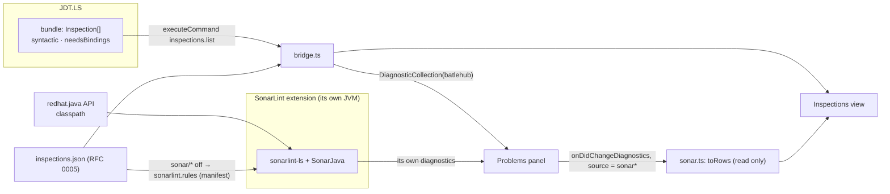
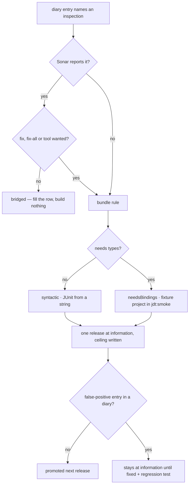

# RFC 0016 — Inspections: bridge for breadth, bundle for fixes

| Field       | Value                                                        |
| ----------- | ------------------------------------------------------------ |
| Status      | Draft                                                         |
| Short       | Inspections growth                                            |
| Settles     | Where inspections come from: SonarLint bridged for breadth, the bundle grown only where a team diary names a missing rule or a quick fix; type-aware rules, how they are proven, and the admission policy that keeps a wrong rule out |
| Closes      | A.9 — inspections and quality, the moat RFC 0001 §2 names                                                                                                                                                           |
| Author      | Max Batleforc <maxleriche.60@gmail.com>                       |
| Co-author   | —                                                             |
| Created     | 2026-09-18                                                    |
| Supersedes  | —                                                             |
| Depends on  | RFC 0001 (the bundle of §6.2, the Inspections view, the manifest, the resource diagnostic of decision 30, the memory rule of §7.1); RFC 0013 (the diagnostics-bridge pattern this reuses); RFC 0012 (`Engine.parse` with bindings); RFC 0005 (the profile that silences a bridged rule, with its reason); RFC 0007 (imported reasons) |
| Touches     | `extensions/java-core/src/inspections/` (new `sonar.ts`; `bridge.ts`, `view.ts`, `rules.ts`), `src/detect/resources.ts`, `src/coexistence.ts`, `extensions/java-pack` (a recommendation, not a member of the default set), `jdt/batlehub-jdt-core` (`Inspection` gains `needsBindings` and `ceiling`), `jdt/smoke.mjs` and `jdt/fixtures/`, `tests/heavy/java.mjs` (`SONAR-OK`), `docs/guide/java/inspections.md` |

---

## 1. Summary

Inspections are IntelliJ's moat (RFC 0001 §2 point 4): hundreds of rules,
each with a fix, in one view. The bundle of phase 6 has eleven, all
syntactic, and hand-writing IDEA-grade inspections is years of work for one
maintainer. The series' default is bridge, not rebuild, so this RFC does
**both, with a border**. *Breadth* comes from SonarLint for VS Code
(`SonarSource.sonarlint-vscode`), bridged: an opt-in pack member pointed at
the core's JDK, its findings shown as rows of the same Inspections view by
reading its diagnostics — never re-emitted, no connected mode configured,
nothing sent anywhere. The *bundle* grows only where a bridge cannot reach:
a rule a team diary names that Sonar lacks, or a rule where a quick fix, a
fix-all or an agent tool is wanted. Type-aware rules enter through the
bindings entry point shared with RFC 0012 and are proven in the real server,
one fixture project per rule area. An admission policy — one release at
`information`, the ceiling written beside the rule, promotion only over an
empty false-positive record — keeps a wrong rule from costing the view its
credibility.

### Before / after

```text
# today (java-core 0.5)
Inspections view: 11 rules (batlehub) — unused/privateField (1) · style/redundantThis (1) · …
SonarLint installed by hand: a second list in Problems, its own JVM on whatever java it finds,
                             unknown to the resource diagnostic

# with this RFC
Inspections view: 11 rules (batlehub) + 38 rules with findings (via SonarLint 4.x)
  ▸ collections/sizeIsZero (2)              Fix all          — batlehub
  ▸ sonar/java:S2259 Null pointers … (1)    Open rule        — via SonarLint (its own quick fix, if any)
  ▸ sonar/java:S1135 TODO tags              off — profile: "tracked in the forge, not in the IDE"
Resource diagnostic: JDT.LS 1024 MiB + SonarLint ~512 MiB (estimated) of 8192 MiB requested
```

---

## 2. Motivation

1. **"Syntax checking", in the teams' words, is three things**, and only one
   is unowned. Live compiler errors are JDT.LS's and exist. Spelling is RFC
   0013's, bridged to cspell. *Inspections* — "this is legal Java and
   probably wrong" — are this RFC. Naming the three keeps a diary entry that
   says "syntax checking is worse than IDEA" mappable to the right one.
2. **Eleven rules against several hundred is not a gap that closes by
   typing.** Each own rule is a visitor, a fix, positive/negative/fix tests
   and a ceiling (RFC 0001 §6.2). At a generous two rules a week with
   nothing else to do, a maintainer reaches SonarJava's ~700 Java rules in
   seven years, without its taint or symbolic-execution engines ever.
3. **A mature analyser exists, is maintained, runs in VS Code and on Open
   VSX, and is free.** SonarLint brings bug, code-smell and security rules
   with descriptions, in the editor, on the fly. Appendix A.9 already said
   "bridge; the tools stay external"; what it did not say is which tool
   first, how it shares the view, and what it costs in memory.
4. **A bridge gives rows; it does not give fixes, fix-all or tools.** The
   core cannot add a quick fix to Sonar's rule, cannot batch-apply its
   findings, and cannot hand its analysis to an agent through RFC 0002. The
   phase 6 `Fix all` is the thing IDEA users notice in week one. That is the
   border: where the *action* matters, the rule is the bundle's.
5. **Installed by hand, SonarLint is an unaccounted JVM.** It runs its own
   language server on the first `java` it finds (in a Che workspace with
   only `mise`, possibly none), with a heap the resource diagnostic does not
   know. The memory rule (RFC 0001 §7.1) says the likeliest way to lose a
   team is an OOM-killed pod; an inspections feature must not be the cause.
6. **One wrong rule discredits the other ten.** A false positive at
   `warning` teaches a team to ignore the view. IDEA earned trust over
   twenty years; a newcomer's view has one release. The policy that admits a
   rule matters more than the count.

### 2.1 Use cases

**The list comes first, and it is owed.** `docs/diary/team-a.md` owes "the
inspections they rely on"; Team B's diary owes nothing yet. Until those
entries exist, the table has placeholders, and **no own rule is written
against a guessed row** — the bridge (phases 0–2) does not need the list;
the bundle's growth (phase 4) does.

| # | Inspection the team relies on (IDEA's name) | Named by | Sonar has it? | Fix / fix-all / tool wanted? | Lands as |
| --- | --- | --- | --- | --- | --- |
| 1 | — | *owed by Team A* | — | — | — |
| 2 | — | *owed by Team A* | — | — | — |
| 3 | — | *owed by Team A* | — | — | — |
| 4 | — | *owed by Team A* | — | — | — |
| 5 | — | *owed by Team A* | — | — | — |
| … | — | *owed by Team B, once it switches* | — | — | — |

The last three columns are the border of §4.2 applied per row: *Sonar has
it and no fix is wanted* → bridged, nothing built; *Sonar lacks it*, or *a
fix is wanted* → a bundle rule under the admission policy.

Acceptance cases, each a step of the `java` heavy half (`SONAR-OK`) unless
marked:

1. **Opt-in, pointed at the core's JDK.** *Who:* a developer on
   `maven-multi` with `SonarSource.sonarlint-vscode` installed and
   `batlehub.java.inspections.sonar: "auto"`. *Start:* `sonarlint.ls.javaHome`
   absent at every scope. *Action:* activation (trusted). *Proof:* the
   channel logs `wrote sonarlint.ls.javaHome`, the workspace `settings.json`
   has the core's resolved JDK home, `.batlehub/java/written.json` lists it,
   the panel shows the write once with its undo, and `Java: Remove BatleHub
   settings` restores absence. A user value at any scope is never
   overwritten.
2. **One view, two sources, no duplicate.** *Start:* `Greeter.java` with
   the four known `batlehub` findings and one Sonar finding (a `TODO`
   comment, `java:S1135`). *Proof:* the Inspections view has the four
   bundle rows and one `sonar/java:S1135` row with origin
   `via SonarLint x.y`; the Problems panel has **five** rows for the file, not six —
   the core re-emits nothing; the Sonar row has no `Fix all`.
3. **Not installed: one row that says so.** *Start:* the same workspace
   without the extension, setting `"auto"`. *Proof:* one informational row
   `SonarLint is not installed — breadth comes from it` with an install
   action; no notification, no write; `"off"` hides the row.
4. **Counted in the resource diagnostic.** *Start:* use case 1's state.
   *Proof:* `Report a problem` and the panel's resources tab list
   `SonarLint language server` with its cap — read from an `-Xmx` in
   `sonarlint.ls.vmargs` when the user set one, else the estimate, marked
   *estimated* — in the sum against the memory request.
5. **A noisy bridged rule is silenced by the team, with the reason.**
   *Start:* `.batlehub/java/inspections.json` (RFC 0005) holds
   `"sonar/java:S1135": { "severity": "off", "why": "tracked in the forge" }`.
   *Proof:* the core writes `sonarlint.rules` → `{"java:S1135": {"level":
   "off"}}` at workspace scope through the manifest; the Problems row
   disappears; the view shows the rule as `off — profile: tracked in the
   forge`. The same entry without `why` is refused by RFC 0005's validator.
6. **Nothing leaves the machine.** *Proof:* after the run, no
   `sonarlint.connectedMode.*` key exists in any scope the core can write,
   and the manifest holds exactly the writes of use cases 1 and 5.
7. **A type-aware own rule, proven in the server** (`task jdt:smoke`).
   *Start:* the fixture project `jdt/fixtures/nullness/`. *Action:*
   `batlehub.inspections.list` on its one source file. *Proof:* exactly the
   expected findings with their lines; the same file through the syntactic
   entry point yields none of them; `SMOKE-OK`.
8. **Admission** (vitest + the view). *Start:* a rule whose descriptor says
   `since: <this release>`. *Proof:* its effective severity is
   `information` whatever its declared default; its row shows the ceiling
   text; a profile may raise it (the team's call, with the rule's age
   shown).

---

## 3. Goals / non-goals

**Goals**

- Several hundred Java rules in the Inspections view in the release this
  lands, by bridging, with the memory cost declared before it is paid.
- One view and one profile for bundle rules and bridged rules; one Problems
  row per finding.
- A written border that says, for any requested rule, whether it is bridged
  or built — so the bundle grows by diary entries, not by enthusiasm.
- Type-aware own rules, with a proof layer that loads them into the exact
  server they ship in.
- An admission policy that makes a false positive cheap.

**Non-goals**

- **Parity with IDEA's inspection count.** Not reachable, not claimed.
- **Re-emitting Sonar's diagnostics** under the `batlehub` source, wrapping
  its language client, or adding fixes to its rules. The core reads what
  `vscode.languages` publishes and nothing else.
- **Connected mode** (SonarQube Server / Cloud). A team that wants it
  configures it itself; the core neither writes nor reads those keys.
- **Bundling SonarLint or any part of it.** It is LGPL-3.0; it is
  recommended by the pack, installed by the user's gallery, never inside a
  BatleHub VSIX.
- **Error Prone, PMD, Checkstyle, SpotBugs bridges** — not first (§8).
- **Project-wide batch inspection** ("Inspect code…"). Sonar analyses open
  files; the bundle's `inspections.list` is per file. A batch mode is RFC
  0002's `java_inspect` over a file set.

---

## 4. User-facing design

### 4.1 Configuration

```jsonc
"batlehub.java.inspections.sonar": "auto",          // auto | off
"batlehub.java.inspections.sonar.writeJavaHome": true,
"batlehub.java.inspections.sonar.estimatedCapMiB": 512,

// written by the core, workspace scope, through the manifest
"sonarlint.ls.javaHome": "/home/user/.local/share/mise/installs/java/21",
"sonarlint.rules": { "java:S1135": { "level": "off" } }   // only from a profile entry
```

- `"auto"` (default) bridges when the extension is installed and active,
  and shows use case 3's row when it is not. `"off"` reads no Sonar
  diagnostic, writes nothing and removes what the core wrote.
- **Opt-in is the installation.** The pack *recommends* SonarLint; it is
  not in `extensionPack`, because the pack's default set is JDT.LS plus one
  framework server (the memory rule) and a second JVM is the developer's
  decision per workspace.
- `estimatedCapMiB` is the figure the diagnostic uses when no `-Xmx` is in
  `sonarlint.ls.vmargs`. 512 is a starting estimate, replaced by phase 0's
  measurement.

### 4.2 Behaviour rules

- **The border.**

  | The team asks for… | Sonar has the rule | Sonar lacks it |
  | --- | --- | --- |
  | a finding in the view | **bridged** — nothing is built | **bundle rule**, if a diary entry names it |
  | a quick fix, fix-all or an agent tool on it | **bundle rule** (the Sonar twin is silenced in the default profile, reason: `superseded by <area>/<id>`) | **bundle rule** |

  The eleven existing rules stay: each has a fix or predates the border.
  Where one duplicates a Sonar rule the Sonar twin is silenced the same
  way, so a finding is never listed twice.
- **Rows by reading, never by writing.** As RFC 0013 does for cspell:
  `vscode.languages.onDidChangeDiagnostics`, filtered to Sonar's `source` on
  `java` documents, mapped to `Row { code: "sonar/<ruleKey>", area: "sonar",
  origin: "via SonarLint x.y" }`. The Problems panel already shows
  Sonar's diagnostic; the core adds no second one.
- **Key form: `sonar/<ruleKey>`**, e.g. `sonar/java:S2259`. It satisfies
  RFC 0005's `area/ruleId` shape, cannot collide with a bundle area, and
  the part after the slash is pasted unchanged into `sonarlint.rules`.
- **Severity belongs to the owner.** A bridged rule's level is changed
  through Sonar's own setting — `off` → `sonarlint.rules[key].level =
  "off"`, recorded in the manifest — not by rewriting diagnostics. Sonar
  exposes on/off per rule, not a severity; a profile entry asking for
  `warning` on a bridged rule is accepted as "on" and the view says the
  level is Sonar's.
- **Silencing needs the reason.** RFC 0005's rule applies unchanged: `off`
  carries a `why`. A reason that came from an IDEA profile through RFC 0007
  is marked *imported* in the view, so nobody mistakes a migrated default
  for a team decision.
- **Actions on a bridged row**: go to occurrence, `Open rule description`
  (Sonar's own command), and the profile actions. Sonar's quick fixes stay
  where they are, in the lightbulb. No `Fix all`.
- **Admission of an own rule.** Its descriptor carries `since` and a
  `ceiling` sentence. For the release named by `since` the effective default
  is `information`. It is promoted to its declared severity in the next
  release **only if no diary holds a false-positive entry against it**; one
  entry keeps it at `information` until the entry is answered by a fix and
  a regression test (`docs/diary/index.md` states the same rule). The
  ceiling is shown in the rule row's tooltip and in the guide.
- **Type-aware rules degrade, never guess.** A rule with `needsBindings`
  is skipped — not run syntactically — when the unit's project is
  unresolved; the view shows `waiting for the project` on it.
- **LightWeight mode**: the bundle is absent (decision 36). Sonar's Java
  analysis also needs the full server for its classpath and says so
  itself; the view shows both as unavailable with the one switch offer.

### 4.3 Validation

Hard errors: none. Inspections are advisory; nothing here may block
editing.

Warnings (the `BatleHub Java` channel and, where noted, the view):

| Condition | Behaviour |
| --- | --- |
| SonarLint installed, core's JDK older than the version its server needs | `javaHome` not written; one row naming the required version |
| `sonarlint.ls.javaHome` set by the user to something else | left alone; logged once with the path |
| Declared caps + the Sonar estimate exceed the memory request | the resource diagnostic's existing warning, naming SonarLint as the opt-in to drop first |
| A `sonar/…` profile key Sonar never reports | kept (RFC 0005's unknown-rule row); the core has no rule catalogue to check against |
| Sonar's `source` string differs from the known ones | no rows; one line naming the sources seen — phase 0 pins the accepted set |
| A `needsBindings` rule on an unresolved project | skipped, shown as waiting |

---

## 5. Architecture

### 5.1 Two sources, one view



The invariant: **every finding has exactly one diagnostic, published by
whoever computed it.** The core publishes for the bundle, reads for Sonar,
and the view is a projection over both.

### 5.2 Deciding where a rule lands



---

## 6. Detailed design

### 6.1 `extensions/java-core/src/inspections/sonar.ts` (new)

- `toRows(diagnostics, version)` pure: filters by `source`, takes the rule
  key from `diagnostic.code` (a string, or `{ value }`), emits `Row`s with
  `code: "sonar/" + key`. No `vscode` import in the pure half.
- `toSonarRules(profile)` pure: the profile's `sonar/*` entries →
  the `sonarlint.rules` object; merges under, never over, keys the user
  already has.
- The glue: detection on activation and `extensions.onDidChange`; the
  diagnostics listener; the two manifest writes (`writeExtSetting`, the
  path RFC 0013 adds); `coexistence.ts` remembers a dismissed "not
  installed" row.

### 6.2 `bridge.ts`, `view.ts`, `rules.ts`, `resources.ts`

- `Bridge.rows` takes the Sonar rows under the same per-document map as the
  spelling rows; `group()` is unchanged. `view.ts` renders origin, the
  *imported* mark, the ceiling tooltip and hides `Fix all` when the row has
  no `fixTitle`.
- `rules.ts`: `effectiveDefault(descriptor, release)` — the admission rule,
  pure, tested.
- `src/detect/resources.ts`: one more contributor,
  `{ name: "SonarLint language server", capMiB, estimated }`, present only
  when the extension is active.

### 6.3 `jdt/batlehub-jdt-core`

- `Inspection` gains two default methods: `needsBindings()` (`false`) and
  `ceiling()` (a sentence; the eleven get theirs from the comments that
  already state them). `batlehub.inspections.list` returns `since`,
  `ceiling` and `needsBindings` in each descriptor.
- `Engine.parse(source, bindings)` — RFC 0012 §6.2's entry point, shared.
  `Handler` parses **once** per request: with bindings if any enabled rule
  needs them and the project is resolved, syntactically otherwise, and runs
  the rules the parse can serve.
- **Why type-aware rules are not in `task jdt:test`.** Layer 1b builds
  units with `ASTParser` from a string: no project, no classpath, so
  `resolveBinding()` returns `null` and a type-aware rule would be tested
  against its own fallback. RFC 0012 chose `AbstractProjectsManagerBasedTest`
  for its one class; for rules, this RFC extends `task jdt:smoke` instead:
  `jdt/fixtures/<area>/` — a minimal Maven project, one source file with
  `// expect: <ruleId>` markers — per rule *area* (nullness, resources,
  collections…), not per rule. The smoke imports each, lists, and diffs
  against the markers. It is slower (seconds per fixture, one server start
  shared), and it is the only layer that loads the rule into the exact
  JDT.LS it ships in: the repository's "real client" rule applied to the
  bundle.

**Deliberately untouched**, so reviewers do not go looking:

- SonarLint's language client, its commands, its quick fixes, its
  connected-mode settings.
- The eleven rules' logic and their 19 JUnit tests.
- `java.errors.*` / JDT null analysis — Appendix A.9's nullability row is
  a setting of `redhat.java`, handled where phase 6 put it.

---

## 7. Security considerations

- **No source leaves the machine.** Standalone SonarLint analyses locally.
  Connected mode is what would send data to a server, and the core never
  writes a `sonarlint.connectedMode.*` key; use case 6 asserts it.
  SonarLint's own telemetry is its setting and its trust — the guide names
  `sonarlint.disableTelemetry`; the core does not write it by default,
  because a foreign write needs a reason tied to a feature (open question
  3).
- **The bridge reads diagnostics any extension can read** and executes
  nothing. A rule key goes from a committed profile into a settings object
  as a JSON *key*; it is validated against `^[a-z]+:[A-Za-z0-9_-]+$` first,
  so a hostile profile cannot write an arbitrary setting.
- **`javaHome` points at a JDK the core resolved from outside the
  workspace** (RFC 0001 §7.1: a fact, not an input). A workspace cannot
  make the core point SonarLint at a binary the workspace supplies.
- **Own type-aware rules** resolve bindings on the classpath JDT.LS already
  resolved and execute nothing.
- **Licence.** SonarLint for VS Code is LGPL-3.0. It is a recommended
  extension installed from the user's gallery; no Sonar code or jar ships in
  a BatleHub VSIX, and `THIRD-PARTY.md` (decision 22) does not change.

### Red lines

- **Every write is in the manifest.** Two foreign settings, both at
  workspace scope through the core's manifest and undone by `Java: Remove
  BatleHub settings`: `sonarlint.ls.javaHome`, and `sonarlint.rules` when a
  profile silences a bridged rule. Fix-all output is source edits — undo
  and git, not the manifest.
- **The token is the core's.** No registry credential is involved; no Sonar
  token is ever configured by the core.
- **Memory.** One long-lived process appears: SonarLint's language server,
  a JVM. **The core does not start it** — SonarLint's extension does — so it
  cannot go through the managed process, and this RFC does not pretend
  otherwise. What the core does: the process is opt-in (not in the pack's
  default set), its cap is read from the user's `-Xmx` or estimated
  (512 MiB until phase 0 measures), it is counted in the resource
  diagnostic's sum *before* the developer enables it, and it is the first
  thing the diagnostic offers to drop. Peak RSS is not recorded, since the
  core does not own the pid — the named ceiling.
- **Defaults crossed.** None. Bridged, not rebuilt; nothing downloaded by
  us; `javaHome` written by default under the default-on rule (workspace
  scope, manifest, shown once with its undo, never over the user's value);
  no source or comment text sent to a third party.

---

## 8. Alternatives considered

| Alternative | Why rejected |
| --- | --- |
| Bundle only | §2 point 2: years, for one maintainer, to reach a breadth that exists today. The project's threat is a missing feature; this spends the scarce resource on the thing that can be had for a recommendation. |
| Sonar only, freeze the bundle | No fix-all, no fixes on the team's named rules, nothing for RFC 0002's agents, nothing before Sonar's server is up, and rule choice owned by a vendor. The eleven rules and their `Fix all` are already what week-one users notice. |
| Error Prone first | The best bug-pattern set for Java, but a `javac` plugin: findings arrive from a *build*, not while typing, and need per-project build configuration. A later bridge through the build tool's output, if a team already runs it. |
| PMD or Checkstyle first | Both have VS Code extensions of uneven maintenance; Checkstyle is style conformance (largely RFC 0007's formatter import), PMD overlaps Sonar with fewer rules and its own ruleset XML to configure. A team that already commits a `checkstyle.xml` is the trigger, and the same `toRows` pattern applies. |
| SpotBugs | Bytecode analysis: needs compiled classes, so a post-build tool with its own JVM. Same answer as Error Prone. |
| Rewrite rules in TypeScript (tree-sitter or regex) in the extension host | No types ever, a second parser to keep in step with the language, and none of it callable from the headless engine. The bundle exists so that rules live beside the compiler. |
| Re-emit Sonar's findings under `batlehub` for a uniform Problems panel | Doubles every row or requires suppressing Sonar's — wrapping its client. RFC 0013 rejected the same for cspell. |
| Make SonarLint a full pack member (installed by default) | A second JVM in every workspace breaks the memory rule's default set. |

---

## 9. Rollout and compatibility

- **Default behaviour**: with SonarLint absent, one informational row and
  nothing else. With it present, `javaHome` is written once (shown, with
  undo) and its findings join the view.
- **Compatibility**: the bridge depends on three facts about SonarLint —
  its diagnostics' `source`, the `code` shape, and the two setting names —
  all checked in phase 0 and pinned by `SONAR-OK`; SonarLint joins the
  nightly matrix so a rename (the product is being rebranded "SonarQube for
  IDE") is seen as a drift issue, not as a user report.
- **Rollback**: `sonar: "off"`, or `Java: Remove BatleHub settings`.
- **Docs**: `docs/guide/java/inspections.md` — the three meanings of
  "syntax checking", the border, how to silence a rule with a reason, the
  memory cost, each own rule's ceiling.

---

## 10. Test plan

- **Unit** (`extensions/java-core/test/sonar.test.ts`, vitest): `toRows`
  from recorded diagnostics (string and object `code`, unknown source →
  none); `toSonarRules` (merge under user keys, key validation);
  `effectiveDefault` (the admission table); the resources contributor with
  and without a user `-Xmx`.
- **Layer 1b** (`task jdt:test`): the descriptor fields on the eleven;
  every syntactic rule added later — positive, negative, fix.
- **Headless** (`task jdt:smoke`): the fixture-per-area loop (use case 7);
  the existing `Greeter.java` assertions unchanged.
- **Heavy** (`tests/heavy/java.mjs`, `SONAR-OK`): use cases 1–6 with
  SonarLint's VSIX installed in the web build — if its server runs there;
  if phase 0 finds it cannot, the step moves to the desktop leg of the
  matrix and the RFC says so here.
- **Existing suites that must pass unchanged**: the 19 JUnit tests,
  `INSPECTIONS-OK`, `BUNDLE-OK`, and the performance gate — the listener
  must not move `activationMs`.

---

## 11. Decisions and open questions

### Resolved

| # | Question | Decision |
| --- | --- | --- |
| 1 | Bridge or build? | **Both, with a border.** SonarLint for breadth; the bundle where a diary names a rule Sonar lacks, or where a fix, fix-all or agent tool is wanted — what a bridge cannot give. |
| 2 | How do bridged findings reach the view? | **By reading diagnostics, never re-emitting.** One finding, one diagnostic, published by who computed it. |
| 3 | Pack member? | **Recommended, opt-in, outside the default set** — it runs its own JVM. Its cap is declared or estimated and counted in the resource diagnostic. |
| 4 | What does the core write? | **`sonarlint.ls.javaHome`** under the default-on rule, and **`sonarlint.rules`** only from a profile entry. No connected mode, ever. |
| 5 | Key form for bridged rules | **`sonar/<ruleKey>`.** Fits RFC 0005, pastes into Sonar's setting. |
| 6 | How is a type-aware rule proven? | **`task jdt:smoke`, one fixture project per rule area.** `ASTParser`-built units have no bindings; the smoke is slower and is the only layer loading the rule into the server it ships in. |
| 7 | How is a new own rule admitted? | **One release at `information` with its ceiling written; promoted only over an empty false-positive record in the diaries.** |
| 8 | Which rules does the bundle grow? | **The teams' list (§2.1), owed.** No own rule against a guessed row. |

### Still open

1. **Does Sonar's Java analysis reuse JDT.LS's classpath?** It consumes
   `redhat.java`'s API for it, which is why it needs Standard mode — stated
   here from its documentation, **to verify in phase 0** on `maven-multi`
   (a finding that needs a dependency's type is the test). If false, Sonar
   runs with a degraded classpath and the breadth claim shrinks to its
   syntactic rules.
2. **The cap.** Read-only estimate (this draft), or write an `-Xmx` into
   `sonarlint.ls.vmargs` through the manifest so the cap is *declared*
   rather than guessed? Recommendation: measure in phase 0; write it only
   if the unbounded default is measurably the quarter-of-RAM heap that
   killed the heavy suite once (todo.md, feedback).
3. **Telemetry.** Write `sonarlint.disableTelemetry: true` by default? It
   matches the spirit of "nothing sent", but it is a foreign write not
   needed by the feature. Recommendation: no write; the guide says how.
4. **Licence, confirmed.** LGPL-3.0 as a recommended extension, nothing
   bundled, is believed clean; confirm against the `ext:licenses` policy
   before the pack's `package.json` names it.
5. **The list.** §2.1's rows. The RFC leaves Draft for phases 4–5 only when
   they are filled; phases 0–3 do not wait.

---

## 12. Implementation phases

| Phase | Content |
| --- | --- |
| 0 | Verification, no product code: SonarLint from Open VSX in che-code and the web build; its `source` and `code` shape; classpath reuse (open question 1); peak RSS on `maven-multi` and on a Team A project; licence check. The estimate and §9's pinned facts are corrected from it. |
| 1 | `sonar.ts` read path, rows in the view, the "not installed" row, the resources contributor. Useful alone: one view. |
| 2 | The `javaHome` write through the manifest; `sonar/*` profile entries → `sonarlint.rules` (needs RFC 0005 phase 1; until then the key form is reserved and silencing is by hand); `SONAR-OK`. |
| 3 | The admission policy: `since`, `ceiling`, `effectiveDefault`, the ceilings of the eleven surfaced in the view and the guide. |
| 4 | `needsBindings`, the single-parse `Handler`, `jdt/fixtures/<area>/` and the smoke loop — with the first type-aware rule a diary names, not before. |
| 5 | Growth, row by row from §2.1, each rule through the border and the admission policy. Never finished; each row is its own small change. |
