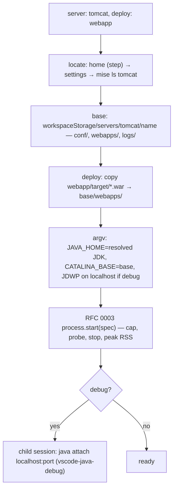

# RFC 0017 — Application server kinds: Tomcat, Jetty, WildFly, Karaf

| Field       | Value                                                        |
| ----------- | ------------------------------------------------------------ |
| Status      | Parked                                                        |
| Short       | Server kinds                                                  |
| Settles     | Tomcat, Jetty, WildFly and Karaf as managed-process kinds over RFC 0003's orchestrator — split out of RFC 0003, parked until someone on a team deploys to one |
| Closes      | A.4 — application server configurations (Tomcat, Jetty, WildFly, Karaf) |
| Author      | Max Batleforc <maxleriche.60@gmail.com>                       |
| Co-author   | —                                                             |
| Created     | 2026-09-18                                                    |
| Revised     | 2026-09-18 — revision 2, after the series was reviewed against its goal (RFC 0001 §7.1): filled in from what RFC 0003 revision 1 carried, parked behind a diary trigger, JDWP on `localhost` for every kind, the `server.xml` edit's parser named, each kind's memory cap declared |
| Supersedes  | —                                                             |
| Depends on  | [RFC 0003](/rfc/0003-server-run-step-kinds) (the `server` step, the `RunStepKind` interface, the managed process, the probes, the attach); RFC 0001 (the JDK resolution, `Java: Install a tool`, the `batlehub-java` `package` task, the heavy suite) |
| Touches     | `extensions/java-core/src/run/servers/` (new: `tomcat.ts`, `jetty.ts`, `wildfly.ts`, `karaf.ts`), `src/run/configs.ts` (the `server` template), `package.json` (the `servers` setting), `tests/heavy/` (a `webapp` fixture module, a pinned Tomcat in the java half), `docs/guide/java/servers/` |

---

## 1. Summary

**Parked.** No team of the series deploys a war, an ear or a bundle to an
application server today: Team A runs Spring Boot and Quarkus, whose dev
modes are RFCs 0010 and 0011. RFC 0001 §7.1 un-parks a draft on **three
dated diary entries** ([`docs/diary/`](/diary/)) — here, someone on a team
who deploys to Tomcat, Jetty, WildFly or Karaf and wrote down what was
missing. Until then this document is the design kept ready, not work
scheduled, and RFC 0003 waits on nothing in it.

What it designs: four **kinds** for RFC 0003's `server` step, each one file
of pure functions over `RunStepKind`. A kind locates an installation, lays
out a per-workspace base directory under the editor's workspace storage,
deploys the module's artifact, and hands an argv to the managed process —
which brings the declared memory cap, the readiness probe, the clean stop
and the JDWP attach on `localhost`. Hot redeploy is the server's own
deployment scanner fed by the `batlehub-java` `package` task. Nothing is
downloaded by the extension (RFC 0001 decision 10's argument applies to
servers as it does to JDKs); the heavy suite downloads a pinned Tomcat to
prove the whole chain.

### Before / after

```jsonc
// today — by hand: edit catalina.sh arguments, copy the war, attach the debugger

// with this RFC — one step of an RFC 0003 run
{
  "type": "batlehub-run", "request": "launch", "name": "Acceptance: webapp on Tomcat",
  "steps": [
    { "task": "batlehub-java: maven package" },
    { "server": "tomcat", "deploy": "webapp", "debug": true,
      "ready": { "http": "http://localhost:8080/webapp/health" } },
    { "launch": "Run IT" }
  ]
}
```

Run it: the war is built, Tomcat starts in a terminal, `/health` answers
`200`, the debugger attaches, `Run IT` runs to completion, Tomcat is stopped
— and the debug console reads `step 3 exited 0 · stopped 2, 1`.

---

## 2. Motivation

1. **Application servers have no run configuration at all** (RFC 0001
   Appendix A.4: Ultimate territory). A servlet or OSGi developer in a Che
   workspace edits `catalina.sh` arguments by hand, copies the war into
   `webapps/` by hand and attaches the debugger by hand, three things IDEA
   Ultimate does from one dialog.
2. **The hand-made version leaks into the installation.** Started from
   `CATALINA_HOME`, a server writes its logs, its `work/` and the deployed
   war into the installation itself; two workspaces on one installation
   collide, and the documented base-directory split that prevents it is the
   part nobody sets up by hand.
3. **An application server is the largest process a workspace starts.**
   WildFly idles above half a GiB. Started by hand it is outside every sum;
   as a kind it declares a cap and goes through the memory rule (RFC 0001
   §7.1) like everything else.

What is *not* a motivation, and is why this is parked: nobody waiting on the
series has asked for it.

### 2.1 Use cases

Each is an acceptance case; the proof is what the driver asserts.

1. **A servlet app on Tomcat, from the run editor.** Starting state: the
   `maven-multi` fixture with a new `webapp` module (a `war` with one
   servlet at `/health` answering `200 ok`), `batlehub.java.servers.tomcat.home`
   pointing at a Tomcat 11 the suite downloaded, the debugger installed. Action:
   `Java: New run configuration` → template "Server (Tomcat)" → module
   `webapp`. Proof: `launch.json` gains a `batlehub-run` entry with one
   `server` step; F5 on it → a terminal titled `Tomcat: webapp` shows
   `Server startup in [` … `] milliseconds`, `curl localhost:8080/webapp/health`
   answers `ok`, the status bar segment reads `Tomcat ● :8080`, and the
   `BatleHub Java: Run` channel has `step 1 ready (http 200 in 3.2 s)`.
2. **Breakpoint in the servlet.** Same run with `"debug": true`. Action: a
   breakpoint on the servlet's `doGet`, `curl` the endpoint. Proof: the Run
   view shows a child session `Attach: Tomcat: webapp` under the run, the
   editor stops on the line, the call stack names `HealthServlet.doGet`;
   `ss -ltn` shows the JDWP port on `127.0.0.1` only.
3. **The acceptance run.** Steps: `task` (`maven package`), `server`
   (Tomcat, deploy `webapp`, ready by HTTP), `launch` (`Run IT`). Proof: as
   RFC 0003 §2.1 case 2, with `stopping 2 (tomcat) … stopped` and Tomcat's
   log showing `Pausing ProtocolHandler`; the port is free afterwards.
4. **A bundle on Karaf.** Starting state: `karaf.home` set, a `bnd` bundle
   module (the `batlehub-jdt-core` layout of RFC 0001 §6.2 is the pattern).
   Action: a `server: karaf` step with `deploy: <module>`. Proof: the jar
   appears in `<base>/deploy/`, Karaf's log shows `Started bundle … ` for
   its symbolic name, `ready: { "log": "Started bundle .*batlehub" }`
   fires.
5. **Hot redeploy.** Run of case 1 kept running; edit the servlet's reply,
   run the `batlehub-java: maven package` task. Proof: the war under
   `<base>/webapps/` has a new mtime, Tomcat logs `Reloading Context`,
   `curl` returns the new text; the run's steps did not restart.
6. **The port is rewritten, the installation is not.** A `tomcat` step with
   `port: 9090`. Proof: `<base>/conf/server.xml` has `port="9090"` on the
   HTTP connector and its shutdown port set to `-1`; `<home>/conf/server.xml`
   is byte-identical to before.

---

## 3. Goals / non-goals

**Goals**

- Tomcat, Jetty, WildFly and Karaf runnable, deployable and debuggable from
  a configuration the run editor writes, an installation being given.
- The installation never written to: every mutable file lives in a base
  directory in workspace storage.
- Each kind a declared memory cap, started through RFC 0003's managed
  process and through nothing else.
- The whole chain proven in the heavy suite with a real Tomcat.

**Non-goals**

- **Downloading a server.** As for JDKs (RFC 0001 decision 10): `mise`
  carries `tomcat`; the other three are a link to the guide. Download with
  checksums and mirrors is a later revision if a user without any of them
  asks.
- **The orchestrator, the probes, the stop, the attach.** RFC 0003's; a kind
  is pure functions and adds no process handling.
- **Equinox without Karaf.** A plain `process` step running `java -jar
  org.eclipse.osgi.jar -console` with a `log` probe covers it.
- **Remote servers, server administration** (users, datasources, JNDI). A
  base copied from the installation inherits its defaults; configuring the
  server beyond the port is the developer's edit of the base's files.
- **GlassFish, Liberty, Payara.** A fifth kind is one file when a diary
  entry names it.

---

## 4. User-facing design

### 4.1 Configuration

A `server` step of RFC 0003 §4.1, with a built-in kind:

```jsonc
{ "server": "tomcat",                                              // tomcat | jetty | wildfly | karaf
  "deploy": "webapp",                                              // a module name (its packaged artifact), or a path inside the workspace
  "home": "/opt/tomcat",                                           // optional; else batlehub.java.servers.<kind>.home
  "port": 8080, "debug": true, "jvmArgs": ["-Xmx512m"],
  "memoryMiB": 768,                                                // optional; else the kind's default (§6.1)
  "ready": { "http": "http://localhost:8080/webapp/health", "status": 200, "timeoutMs": 90000 } }
```

Settings:

```jsonc
"batlehub.java.servers": {                      // where installations are; absent: the mise install for tomcat, else an error
  "tomcat":  { "home": "/home/user/.local/share/mise/installs/tomcat/11.0.13" },
  "jetty":   { "home": "…" }, "wildfly": { "home": "…" }, "karaf": { "home": "…" }
}
```

`home` on a step or in workspace settings is a path the *workspace* names;
it is read after trust only, like everything a run does (§7).

### 4.2 Behaviour rules

- **The base directory** is `<workspaceStorage>/servers/<kind>/<name>/`
  (RFC 0003 §6.4) — never inside the repository, so nothing to gitignore
  and no manifest entry; `Java: Remove BatleHub settings` deletes it, the
  installation is untouched. It is laid out on the first run and reused;
  `Java: Reset server base` deletes it for a clean start.
- **Deploy is a copy** of the module's packaged artifact into the kind's
  deploy directory, before the start. `deploy` is validated by RFC 0003
  §4.3: a path outside the workspace is a hard error.
- **Hot redeploy is the server's own scanner.** While the run lives, the
  core watches nothing; the `batlehub-java` `package` task ends by copying
  the artifact into the base of every running `server` step that deploys
  that module, and the server reloads it.
- **Debug binds `localhost`**, every kind (RFC 0003 §4.2). WildFly's
  `--debug <port>` binds `127.0.0.1` by default; the other three get
  `address=localhost:<port>` explicitly.
- **The `log` probe cannot miss its line.** Jetty's and Karaf's default
  probes are log lines printed within the first second; RFC 0003 attaches
  the matcher to the process's streams *before* the spawn, so the line
  cannot scroll past an attach that came late. A kind never tails a log
  file for readiness.
- **Stop** is the kind's graceful command where one exists and works
  without a port of its own (`jboss-cli.sh --connect :shutdown`, `karaf
  stop`); Tomcat's shutdown port is disabled in the base (`-1`) and Tomcat
  is stopped by `SIGTERM`, which it handles as a clean shutdown. Then RFC
  0003's `SIGTERM` → `SIGKILL`.
- **Memory.** Each kind declares a default cap (§6.1); the step's
  `memoryMiB` overrides it; the sum and the skip offer are RFC 0003's.

### 4.3 Validation

Hard errors (the run does not start; a notification names the step), on top
of RFC 0003 §4.3:

| Condition | Rationale |
| --- | --- |
| no installation for the kind (`home` absent, setting absent, no `mise` install) | the message links the guide and, for Tomcat, offers `mise use tomcat@11` through `Java: Install a tool` |
| `home` does not look like the kind (`bin/catalina.sh`, `start.jar`, `bin/standalone.sh`, `bin/karaf` missing) | starting the wrong script under a server's name is worse than not starting |
| `deploy` names a module whose artifact is not what the kind takes (`target/*.war`, `build/libs/*.war`; `target/*.jar` for Karaf) | say "run `maven package` first (a `task` step does)" rather than deploy nothing |
| Tomcat: `server.xml` has no single HTTP `<Connector` the rewrite can identify (§6.2) | a port written to the wrong connector is a server on a port nobody probes; the message names the base file to edit by hand |

Warnings (channel `BatleHub Java: Run`, and the debug console):

| Condition | Behaviour |
| --- | --- |
| a probe's `timeoutMs` under the kind's measured start (Tomcat 11 cold on this workspace: 2.1 s; WildFly: 12 s on a laptop) | the run proceeds; the console prints the measured time so the next edit is informed |
| a `javax` war on Tomcat 10/11 (the war holds `javax/servlet` classes or a `web.xml` of the 4.0 namespace) | the run proceeds; the console says the app needs Tomcat 9 or the Jakarta migration — a 404 with no explanation otherwise |
| `jvmArgs` carries an `-Xmx` above the declared cap | the run proceeds; both numbers are printed |

---

## 5. Architecture

### 5.1 A server step



The invariant: **a kind starts nothing and writes nothing outside its
base.** It is three pure functions — how a base is laid out, where an
artifact goes, what argv starts it — plus a default probe and a default
cap; the process, the probe, the stop and the attach are RFC 0003's. Because
the only I/O a kind does is `prepare()` into a directory the core chose, the
installation cannot be modified and no process can exist outside RFC 0003's
`processes.json`.

---

## 6. Detailed design

### 6.1 `src/run/servers/` — the kinds

Each file exports one `RunStepKind` (RFC 0003 §6.4) and is registered at
activation through `registerRunStepKind`, the call a satellite uses.

| Kind | Base layout (`prepare`) | Deploy target | Start (`argv`) | Default probe | Debug | Default cap |
| --- | --- | --- | --- | --- | --- | --- |
| `tomcat` (10/11) | `conf/` copied from `home/conf` with `server.xml` port rewritten (§6.2), `webapps/`, `logs/`, `temp/`, `work/` — the documented `CATALINA_BASE` split | `webapps/<module>.war` | `home/bin/catalina.sh run` with `CATALINA_BASE=base`, `JAVA_HOME`; `CATALINA_OPTS` carries `jvmArgs` | `log: "Server startup in"` | `JAVA_OPTS=-agentlib:jdwp=transport=dt_socket,server=y,suspend=n,address=localhost:<port>` | 768 MiB (`-Xmx512m` added when `jvmArgs` has none) |
| `jetty` (12) | `jetty.base` initialised once with `java -jar home/start.jar --add-modules=server,http,ee10-deploy` (the documented `JETTY_BASE`), `webapps/` | `webapps/<module>.war` | `java -jar home/start.jar jetty.http.port=<port>` in `base` | `log: "Started oejs.Server"` | the same agent string, in `jvmArgs` | 512 MiB (`-Xmx384m`) |
| `wildfly` (36) | a copy of `home/standalone` into `base` (the documented `-Djboss.server.base.dir`) | `deployments/<module>.war` + `<module>.war.dodeploy` marker | `home/bin/standalone.sh -Djboss.server.base.dir=base -Djboss.http.port=<port>` | `log: "WFLYSRV0025"` (started) | `--debug <port>` (the script's own flag; binds `127.0.0.1`) | 1 280 MiB (`JAVA_OPTS` with `-Xmx768m`; the script's own default is unbounded metaspace) |
| `karaf` (4.4) | `etc/` copied from `home/etc`, `deploy/`, `data/` — `KARAF_BASE` / `KARAF_DATA` | `deploy/<module>.jar` | `home/bin/karaf server` with `KARAF_BASE=base`, `KARAF_DATA=base/data`, `KARAF_ETC=base/etc` | `log: "Started bundle"` naming the deployed symbolic name | `KARAF_DEBUG=true` with `JAVA_DEBUG_OPTS` set explicitly to the same `address=localhost:<port>` agent string — the script's own default address has changed between Karaf releases and is not trusted | 768 MiB (`JAVA_MAX_MEM=512M`) |

The caps are the summary's "design kept ready": they are estimates until
§12 phase 1 measures them through RFC 0003's peak RSS, which is what the
history is for. A kind adds its `-Xmx` only when the step's `jvmArgs` has
none; it never overrides the user's.

Jetty's one-time `start.jar --add-modules` is a short-lived child run by
`prepare()` through the core's `io.ts` (RFC 0003 §5.2: short-lived calls are
not managed), with the resolved JDK and no workspace-controlled argument.

### 6.2 The `server.xml` port rewrite

Tomcat has no command-line port. The base's copy of `conf/server.xml` is
edited; the installation's is never opened for writing.

- **Parser: the regex-and-string approach of RFC 0007** (`src/idea/import.ts`
  — no DTD, no entities beyond the five predefined, no XML library with
  external-entity resolution in the tree). The file is the *installation's*,
  not the workspace's, so it is not attacker-controlled; the reason is the
  same dependency rule, and that a string edit leaves every comment and
  every other byte of the file as the vendor shipped it, which a parse and
  re-serialise does not.
- `rewritePort(xml, port): string | undefined` — pure. It blanks comments to
  same-length spaces for matching only (Tomcat's stock file carries a
  commented-out `<Connector`), finds `<Connector` elements whose `protocol`
  is absent, `HTTP/1.1` or an `Http11` class name and that have no
  `SSLEnabled="true"`, requires **exactly one**, and replaces the value of
  its `port="…"` attribute at the matched offsets in the original string.
  Zero or several → `undefined` → the hard error of §4.3.
- `<Server port="8005"` → `port="-1"` by the same function: no shutdown
  port, so two bases never collide on it and nothing local can ask the
  server to stop with the string `SHUTDOWN`.
- What it does not handle, by decision: a `server.xml` that sets the port
  from a `${property}`. The attribute is replaced all the same; the property
  becomes unused.

### 6.3 Run editor and status bar (`src/run/configs.ts`, `editor.ts`)

- `TEMPLATES` gains `server` ("Server (Tomcat / Jetty / WildFly / Karaf)"),
  asking kind, module (from `ProjectService.modules`), port and debug — four
  quick inputs, the same form pattern as today. The kinds live in the core,
  so the template is added to the table directly.
- RFC 0003's status bar segment reads `Tomcat ● :8080` while a built-in
  kind runs, clickable to the terminal.

### 6.4 Heavy suite

- `tests/heavy/fixtures/maven-multi/webapp/`: a `war` module, one servlet,
  `pom.xml` with `maven-war-plugin`; the parent lists it.
- `view.sh` java half: Tomcat 11 downloaded once into `~/.cache/batlehub-heavy`
  (sha256 pinned, the `groovy:fetch` pattern), `batlehub.java.servers.tomcat.home`
  in the editor's settings; the steps `SERVER-RUN-OK` (case 1),
  `SERVER-DEBUG-OK` (case 2), `SERVER-ACCEPT-OK` (case 3) added to
  `java.mjs`, each asserting the terminal rows, the channel lines and the
  port state as §2.1 lists them. Cases 4, 5 and 6 are unit and host-layer
  tests: they need no browser.

**Deliberately untouched**, so reviewers do not go looking:

- `src/run/orchestrator.ts`, `src/process/` — RFC 0003's; a kind needs no
  change there, which is the test of that RFC's interface.
- The contract — the kinds use `registerRunStepKind`
  ([RFC 0001 §5.2 contract changelog](/rfc/0001-java-env#contract-changelog),
  asked by RFC 0003); this RFC needs no member of its own.
- The installation directory — read, never written.
- `src/build/tasks.ts` — gains the post-`package` copy of §4.2 and nothing
  else.

---

## 7. Security considerations

- **What is attacker-controlled: the `server` step in a committed
  `launch.json`, and workspace settings naming a `home`.** A hostile `home`
  is a directory whose `bin/catalina.sh` is anything — the standing of a
  `process` step, behind the same gate: nothing runs untrusted (RFC 0001
  §7.1, enforced in RFC 0003's `process.start`). `locate` and `prepare` run
  after that check, never before.
- **`deploy` cannot leave the workspace** (RFC 0003 §4.3): a run cannot be
  made to copy a home-directory file into `webapps/` and serve it.
- **The JDWP agent listens on `localhost`, every kind.** Revision 1 had
  `address=*` in Tomcat's row; it is gone. Karaf's script default is
  overridden for the same reason (§6.1).
- **Tomcat's shutdown port is closed** in the base (§6.2), not left on 8005
  for any local process to use.
- **Server bases live in workspace storage**, outside the repository:
  nothing this RFC writes can be committed by accident, and a `conf/` copied
  from `home` inherits the installation's defaults — no manager users are
  added, no ports opened beyond the one configured. The HTTP port itself
  binds as the server's default does (every interface); inside a Che pod it
  is reachable from outside only through an endpoint the devfile declares.
- **XML is edited as a string, not evaluated** (§6.2): no entity is ever
  resolved.
- **Nothing is downloaded** by the extension: an installation the user
  points at is trusted as the user's own; the heavy suite's download is
  pinned by sha256.
- **What an attacker gains from a bypassed check: nothing new.** Running a
  process in a trusted workspace is what a task already does.

### Red lines

- **Every write is in the manifest.** Nothing is written outside the
  extension's own storage: the base directory is workspace storage, removed
  by `Java: Remove BatleHub settings` with no manifest entry because nothing
  pre-existed. The installation is never written. `batlehub.java.servers`
  is our own setting, written only by the user. The `launch.json` entry is
  the run editor's, on the user's action; git is its undo.
- **The token is the core's.** No registry credential is involved: a kind
  deploys what a build already produced and resolves nothing.
- **Memory.** Four long-lived processes, one per kind, each through RFC
  0003's managed process and only through it: Tomcat 768 MiB, Jetty 512,
  WildFly 1 280, Karaf 768 declared (§6.1), overridable per step, summed
  against the 8 GiB budget before the start with the skip offered. None is
  in the pack's default set; a server runs only when a run names it.
- **Defaults crossed.** *Bridge a maintained extension; do not rebuild it* —
  crossed: Red Hat's Community Server Connectors (`redhat.vscode-rsp-ui`)
  exist. The reason (§8): RSP is a second long-lived JVM of about 60 MB that
  starts servers itself, outside the managed process, so bridging it breaks
  the memory rule, and its adapters download servers, which breaks *nothing
  downloaded at runtime*. The other defaults hold: nothing downloaded, no
  foreign setting written, no source text sent anywhere.

---

## 8. Alternatives considered

| Alternative | Why rejected |
| --- | --- |
| Starting servers through their own VS Code extensions (Community Server Connectors, `redhat.vscode-rsp-ui`) | RSP is a Java server process of its own with a JSON-RPC protocol, ~60 MB, started outside the managed process, and its adapters download servers; a kind is three pure functions per server. If RSP's adapter set ever matters (GlassFish, Liberty), an `rsp` kind can wrap it — with RSP itself declared in the sum. |
| Downloading Tomcat/Jetty/WildFly/Karaf from the vendor | RFC 0001 decision 10 and the `jdk-direct-download` deferral: checksums, mirrors, an air-gapped guide. `mise` has Tomcat; the rest is a link until a user asks. |
| Run from `home` directly, no base | The installation fills with this workspace's logs and wars, two workspaces collide, and the port can only be changed by editing the installation. Every one of the four documents the base split for this reason. |
| Rewrite `server.xml` with an XML library | A new dependency with entity resolution to switch off, and a re-serialised file that no longer diffs against the vendor's. RFC 0007 already made this choice for `.idea` files. |
| Pass Tomcat's port as a system property (`-Dport.http=…` with `${port.http}` in `server.xml`) | The stock `server.xml` has a literal `8080`; the file must be edited once either way, and a literal port in the base is what the developer reads when debugging. |
| A file watcher of ours for hot redeploy | Each server ships a deployment scanner that already handles partial writes and ordering; ours would race it. |
| Keep the kinds in RFC 0003 | They are the part no team asked for, and they hid the part every satellite waits on. |

---

## 9. Rollout and compatibility

- **Un-parking trigger**: someone on a team deploys a war, an ear or a
  bundle to one of these servers, recorded as **three dated entries** in
  that team's diary ([`docs/diary/`](/diary/)) mapped to Appendix A.4's
  application-server row — RFC 0001 §7.1's rule, not a judgement call. The
  status then moves to Draft and §12 starts at the kind the entries name;
  the other kinds stay unbuilt until they have entries of their own.
- **Default behaviour**: nothing until a `server` step names a built-in
  kind; RFC 0003's runs are unaffected by this RFC's presence or absence.
- **Config migration**: none.
- **Prerequisites**: RFC 0003 phases 1–4 shipped; an installation per kind
  (Tomcat through `mise`); the debugger for `debug: true`.
- **Rollback**: remove the entries; `Java: Remove BatleHub settings`
  deletes the server bases in workspace storage. Installations and
  `launch.json` entries the user keeps are untouched.
- **Contract**: no member of its own (§6.4).

---

## 10. Test plan

- **Unit** (`extensions/java-core/test/servers.test.ts`,
  `serverxml.test.ts`): per kind, the base layout, the deploy path and the
  argv for a fixed home/base/JDK (golden objects), the WildFly marker file,
  Karaf's env, **`address=localhost` asserted in every kind's debug argv
  and `*` asserted absent**; `rewritePort` over Tomcat 10's and 11's stock
  `server.xml` (byte-identical outside the two attribute values), with the
  commented-out connector, with an added TLS connector, with two HTTP
  connectors (→ `undefined`); the `javax` detection.
- **Host** (`test-host/`): a fake kind whose "server" is a `node -e` script
  — `prepare` writes only under the base, the installation fixture's mtime
  tree is unchanged after a run; cases 4, 5 and 6 of §2.1 with stub
  servers.
- **Heavy** (`tests/heavy/java.mjs`): cases 1, 2, 3 of §2.1 with a real
  Tomcat 11.
- **Existing suites** that must pass unchanged: RFC 0003's — the kinds are
  registered through the public call, so its contract test is the
  regression signal that the interface was enough.

---

## 11. Decisions and open questions

### Resolved

| # | Question | Decision |
| --- | --- | --- |
| 1 | Is this scheduled? | **No — Parked.** Closes a real row of Appendix A.4 that no team has hit; three diary entries un-park it (RFC 0001 §7.1). |
| 2 | Where do server bases live? | **Workspace storage**, never the repository nor the installation: no gitignore, no manifest entry, deleted by the remove command. |
| 3 | Download servers? | **No.** `mise` for Tomcat, a link for the rest; RFC 0001 decision 10's reasoning. |
| 4 | Tomcat generation? | **10 and 11 (Jakarta)**; a `javax` app on Tomcat 9 is a `home` the user points at, the base layout is identical, and a `javax` war on 10/11 gets a warning instead of a silent 404. |
| 5 | Equinox as a kind? | **No** — a `process` step with a `log` probe is the kind; Karaf is the OSGi kind. |
| 6 | Hot redeploy mechanism? | **The server's own scanner**, fed by the `package` task; no file watcher of ours. |
| 7 | How is `server.xml` edited? | **As a string, RFC 0007's approach**, one connector or a hard error; no XML library. |
| 8 | JDWP bind address? | **`localhost` for all four**; Karaf's script default overridden. |
| 9 | Bridge RSP instead? | **No, and the default is crossed knowingly** (§7 red lines): RSP sits outside the memory rule and downloads at runtime. |

### Still open

1. **WildFly in a pod.** 12 s to start and an unmeasured resident size on a
   laptop; unknown in a pod beside JDT.LS. RFC 0003 now counts it in the
   sum (revision 1's recommendation, adopted there), so what is open is
   only the number: is 1 280 MiB declared honest? Phase 3 measures it
   through the recorded peak; if it is above 1.5 GiB, the template should
   say so before the developer picks the kind.
2. **The acceptance fixture's size**: Tomcat 11 is 14 MB; the heavy suite
   already downloads a 26 MB Groovy server jar. Cache it like the others,
   or make the server cases nightly if the java half crosses the 20-minute
   gate of RFC 0001 §13.
3. **The HTTP connector binds every interface** (§7). Rewriting
   `address="127.0.0.1"` into the base's connector is one more attribute
   for `rewritePort`, but a Che endpoint forwards to the pod IP, so it would
   break the preview URL. Recommendation: leave the vendor default, document
   it.
4. **Does one kind un-park all four?** §9 says no — the entries name the
   kind. Open whether Jetty should ride with Tomcat (same artifact, same
   probe family, a day's work) once Tomcat is asked for.

---

## 12. Implementation phases

None is scheduled while the status is Parked. Once un-parked, the order is
the diary's; absent a preference:

| Phase | Content |
| --- | --- |
| 1 | `servers/tomcat.ts`, `rewritePort`, the `server` template, the status bar label; the `webapp` fixture; heavy cases 1–3 green with a pinned Tomcat 11; Tomcat's measured peak replaces its estimated cap. Useful on its own. |
| 2 | `servers/jetty.ts`; unit tests; the guide's page. |
| 3 | `servers/wildfly.ts`, `servers/karaf.ts`; unit tests per kind; open question 1 answered from the measurement; the guide's page per server. |
