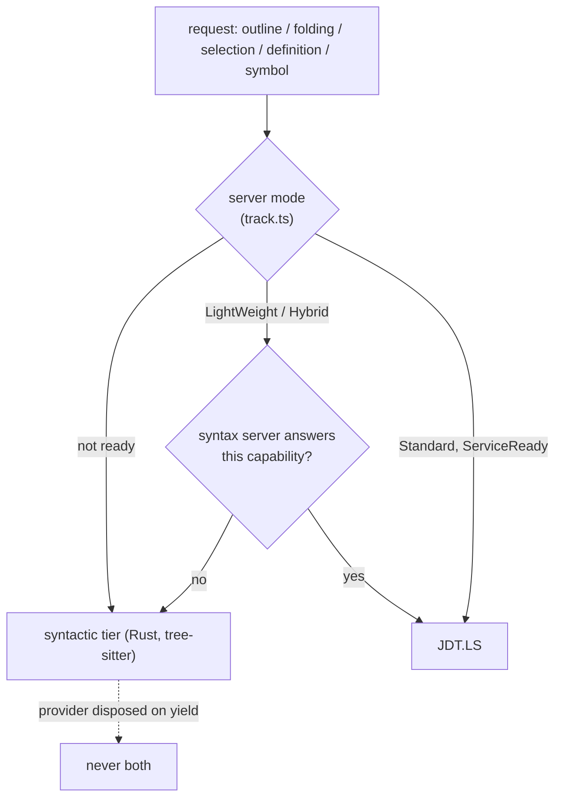
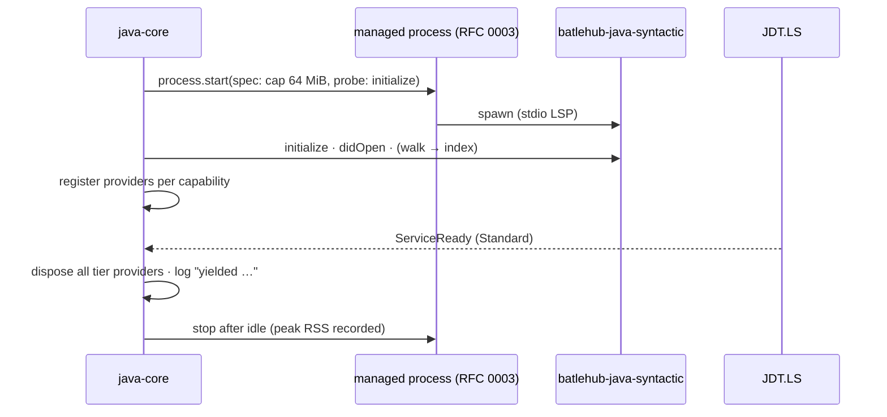

# RFC 0018 — A syntactic Rust tier for the time before indexing

| Field       | Value                                                        |
| ----------- | ------------------------------------------------------------ |
| Status      | Parked                                                        |
| Short       | Rust syntactic tier                                           |
| Settles     | A small standalone Rust language server (tree-sitter: outline, symbols, folding, file-level navigation) beside the Red Hat server, never instead of it; parked behind the memory measurement of RFC 0001 decision 1 |
| Closes      | A.13 — usable before indexing |
| Author      | Max Batleforc <maxleriche.60@gmail.com>                       |
| Co-author   | —                                                             |
| Created     | 2026-09-18                                                    |
| Supersedes  | —                                                             |
| Depends on  | RFC 0001 (decision 1 and its four red flags, decision 20, decision 36, the memory rule of §7.1); RFC 0003 (the managed process — what starts it, and what makes the un-park measurement free) |
| Touches     | nothing while parked. If un-parked: a new `syntactic/` crate, `extensions/java-core` (`src/syntactic/`: start, per-capability yield), `.tasks/syntactic.yaml`, the release workflow (per-platform VSIX, signing), `tests/heavy/java.mjs` (a `PREINDEX-OK` step) |

---

## 1. Summary

The maintainer considered replacing the Red Hat Java server with one written
in Rust, because of pod memory. **This RFC is not that**, and its first job
is to record why. RFC 0001 decision 1 stands — depend on `redhat.java` — and
a replacement is reopened only by one of four red flags quoted in §2. What
this RFC *is*: a small standalone Rust LSP binary over `tree-sitter-java`
that answers outline, folding, selection ranges and name-based go-to in tens
of megabytes while JDT.LS is still importing or sits in LightWeight mode,
and yields to JDT.LS, capability by capability, the moment the real server
is ready. It is **Parked**: it closes a row that phase 2 already closed in
part (A.13, "usable before indexing"), it would cross decision 20 (one
universal VSIX), and no diary entry asks for it. It is kept so the idea and
its honest cost are not re-derived under pressure, and so that the day a red
flag fires there is a written starting point instead of a rewrite decided in
an afternoon.

### Before / after

```text
# today — open a 400-module project in a fresh Che workspace
0 s … ~90 s   JDT.LS importing: Outline "No symbols found", Ctrl+Shift+O empty, no folding by
              structure, Go to Definition does nothing. The core answers JDK, structure, build files.
~90 s →       everything

# with this RFC (if ever un-parked)
0.3 s … ~90 s outline · folding · selection ranges · go-to within the file · workspace symbol by
              simple name — from batlehub-java-syntactic (~30 MiB RSS), marked "syntactic"
~90 s →       JDT.LS's answers only; the tier's providers are unregistered per capability
```

---

## 2. Motivation

1. **The question was asked, so it gets a written answer.** "Replace the
   Red Hat server with a Rust one" was examined at revision 7 of RFC 0001
   and rejected; decision 1 records the verdict in one sentence. A verdict
   without its reasoning is re-litigated every time a pod is OOM-killed.
   §2.3 is the reasoning.
2. **The time before indexing is real and is where a newcomer's first
   minute goes.** On a large import the editor has no outline, no
   structural folding and no navigation for as long as JDT.LS takes. Phase 2
   of RFC 0001 made the *core* useful in that window (JDK, structure, build
   files); the *editor* still is not.
3. **LightWeight mode is the memory lever of last resort, and it is
   poor.** `java.server.launchMode: LightWeight` is what a developer on a
   tight pod is told to use (decision 36 follows it); in it, syntax-server
   features are thin. A tier that costs tens of megabytes would make the
   cheap mode liveable.
4. **None of this has been measured or asked for.** `docs/diary/team-a.md`
   owes the memory measurement on the team's largest real project and holds
   no entry. Building ahead of it would be answering a feeling.

### 2.1 Use cases

Acceptance scenarios for the day this is un-parked; a `PREINDEX-OK` step of
the `java` heavy half unless marked.

1. **Outline before the server.** *Who:* a newcomer opening `maven-multi`
   with JDT.LS held before `ServiceReady` (the suite delays it). *Action:*
   open `Greeter.java`, focus the Outline. *Proof:* the class, its fields
   and methods are listed within one second of the file opening;
   `Ctrl+Shift+O` lists the same; the status item reads `Java: syntactic`.
2. **Yield, no duplicates.** *Action:* release the delay; JDT.LS reaches
   `ServiceReady`. *Proof:* within two seconds the Outline holds each symbol
   **once** (JDT.LS's), a workspace-symbol query for `Greeter` returns one
   row, and the channel logs `syntactic: yielded documentSymbol, folding,
   selectionRange, definition, workspaceSymbol`.
3. **Go-to by simple name says what it is.** *Start:* before ready; two
   classes named `Config` in different packages. *Action:* Go to Definition
   on a `Config` usage. *Proof:* a peek with both candidates, each labelled
   `by name`; no silent jump to a guess.
4. **LightWeight.** *Start:* `java.server.launchMode: LightWeight`.
   *Proof:* the tier stays registered for the capabilities the syntax
   server does not answer, and yields the ones it does.
5. **Before trust.** *Start:* an untrusted workspace. *Proof:* the tier
   runs (it reads files and executes nothing); JDT.LS's restricted mode is
   unchanged.
6. **Memory, declared and held** (managed process). *Proof:* the process is
   listed in `Report a problem` with its declared cap (64 MiB) and a peak
   RSS under it on `maven-multi`; on a 10 000-file synthetic tree the index
   stays under the cap or the tier drops the workspace index and says so.
7. **Hostile input** (crate, `cargo fuzz`, not the heavy suite). *Proof:*
   an hour of fuzzing the document-sync and parse path with no panic, no
   hang past the per-file parse budget, no growth past the cap.

### 2.2 The four red flags (RFC 0001 §11 decision 1)

Replacing the server altogether is reopened only by **any one** of:

1. on a team's largest real project, the editor, a tuned JDT.LS, one
   framework server and a running build together peak **above 6 GiB** —
   three quarters of the 8 GiB memory *request* a Java workspace is
   scheduled with; the 16 GiB limit is burst, not budget;
2. `redhat.java` **removes the internal commands or the `javaExtensions`
   loading** the bundle rests on, with no replacement;
3. the project goes **unmaintained or its licence changes**;
4. the server **prevents a feature the register ranks P2 or higher** from
   being built at all.

None has fired. The measurement of (1) is free once every process starts
through the managed process (RFC 0003), which records peak RSS.

### 2.3 What a full replacement would have to replace

Stated once, honestly, so the size of the idea is on the page:

| What JDT.LS provides today | What a Rust server would need |
| --- | --- |
| The ECJ front end: a complete, incremental, error-recovering Java parser and compiler, current to each JDK release | a Java compiler front end, kept current every six months |
| Type resolution, overload resolution, generics inference, lambdas, flow analysis | the hard half of the JLS; ECJ and `javac` still disagree on corners after twenty years |
| Jar, `jmod` and module reading; the JDK's own classes; source attachment | a class-file reader and a module system |
| m2e and Buildship: the Maven and Gradle project models, profiles (decision 14's spike), workspace resolution between modules | both build tools' semantics, or a JVM beside the server to ask them — the memory again |
| Annotation processing | running `javac` processors — in a JVM |
| Hosting `java-debug` and `java-test` as OSGi plugins | a debugger adapter and a test runner integration, rebuilt |
| Lombok's compiler hook (a Java agent patching ECJ) | nothing to hook: Lombok would simply stop working |
| The Spring Boot and MicroProfile/Quarkus servers, which talk to JDT.LS | both satellites (RFC 0010, RFC 0011) lose their bridge |
| This project's own OSGi bundle: accessors, eleven inspections, fix-all, chain completion (RFC 0012), the shortcuts (RFC 0015), every agent tool of RFC 0002 | all of it, rewritten; `ASTRewrite` has no Rust twin |

RFC 0001 §7.1 names the project's practical threat: *a missing feature, not
an attacker* — and not, first, memory. A Rust server would trade a memory
problem, which has levers (§8), for the features problem, which is the one
that loses teams, multiplied by every row above. That is the rejection.

---

## 3. Goals / non-goals

**Goals**

- An editor that shows structure and navigates by name from the first
  second, at a memory cost that is noise beside one JVM.
- Exactly one answer per capability at any time: the tier's before JDT.LS
  is ready, JDT.LS's after.
- A standalone crate with a plain LSP surface over stdio — testable without
  VS Code, usable by another editor.
- The reasoning against a full replacement, written down once.

**Non-goals**

- **Replacing JDT.LS**, now or by increments. No completion, no
  diagnostics, no rename, no hover types, no references: anything needing a
  type is the real server's, and a syntactic guess at it would be the
  wrong-answer machine §2.3 warns about.
- **Designing for the replacement.** If a red flag ever fires, this crate
  *may* become the base of one. That possibility earns exactly one thing —
  the crate is standalone with a plain LSP surface, which it would be
  anyway — and **nothing else is designed for it today**: no plugin seam, no
  type-model placeholder, no "phase 2: semantic". YAGNI; a future server's
  architecture is decided by whichever flag fired.
- **Kotlin, Groovy, Scala grammars.** Their satellites have their own
  servers.
- **Outliving decision 1.** The tier exists only while the project stays on
  the Red Hat server; if that decision changes, this RFC is superseded by
  whatever replaces it.

---

## 4. User-facing design

### 4.1 Configuration

```jsonc
"batlehub.java.syntactic": "auto",        // auto | off
"batlehub.java.syntactic.capMiB": 64      // the declared cap handed to the managed process
```

- `"auto"`: started at activation when a `java` file is open and JDT.LS is
  not yet ready or is in LightWeight; stopped five minutes after a full
  yield in Standard mode (it is restarted if the server is).
- No path setting: the binary is the one in the platform VSIX.

### 4.2 Behaviour rules

- **Capabilities**: `documentSymbol` (outline, breadcrumbs), `foldingRange`
  (by structure, imports, comments), `selectionRange` (expand/shrink by
  AST node), `definition` within the file (locals, parameters, members of
  the enclosing types, resolved by scope walk), and across the workspace by
  **simple-name index** (type and member names → locations), and
  `workspace/symbol` from the same index.
- **Every cross-file answer is labelled `by name`** and returns all
  candidates. The tier never picks one.
- **Yield per capability.** The core registers the tier's providers itself
  (it is the LSP client) and disposes each one when JDT.LS can answer it:
  all on `ServiceReady` in Standard; only those the syntax server covers in
  LightWeight/Hybrid. The source of truth is the server mode the core
  already tracks (`src/server/track.ts`), not a timer.
- **The index** is built from a file walk honouring `.gitignore` and
  skipping `target/`, `build/`, `node_modules/`, bounded by file count and
  by the cap; when it would not fit, cross-file answers are dropped, in-file
  ones remain, and the status tooltip says so.
- **Per-file parse budget** (100 ms) and a size limit (2 MiB): a file past
  either gets no answer from the tier.

### 4.3 Validation

Hard errors: none — the tier failing must never be visible as anything but
"today's behaviour".

| Condition | Behaviour |
| --- | --- |
| No binary for this platform (universal fallback VSIX) | tier off, one log line; nothing else changes |
| The declared cap does not fit the resource diagnostic's sum | not started; it is the first thing skipped — 64 MiB is never worth a JVM's place |
| Crash | restarted once by the managed process, then off for the session with one line |
| Index over budget | cross-file answers dropped, stated in the tooltip |

---

## 5. Architecture

### 5.1 Who answers



The invariant: **for each capability, at most one provider is registered
for `java` beside `redhat.java`'s, and it is disposed before JDT.LS's first
answer can be merged with it.** VS Code merges providers' results; the only
way to have no duplicates is to not be registered.

### 5.2 Lifecycle



---

## 6. Detailed design

### 6.1 `syntactic/` (the crate, if un-parked)

- One binary, `batlehub-java-syntactic`: `tree-sitter` +
  `tree-sitter-java`, `lsp-server` (rust-analyzer's synchronous stdio
  scaffold — no async runtime for five request types), `ignore` for the
  walk. Incremental re-parse on `didChange` through tree-sitter's edit API.
- `symbols.rs` (tree → `DocumentSymbol`), `folding.rs`, `selection.rs`,
  `scope.rs` (in-file definition), `index.rs` (simple-name map, bounded).
  Each is a pure function over a tree, tested with `insta` snapshots over
  the fixtures the heavy suite already has.
- No configuration file, no network, no child process, no write.

### 6.2 `extensions/java-core/src/syntactic/`

- `start.ts`: the `process.start` spec, binary lookup
  (`bin/<platform>-<arch>/`), the restart-once rule.
- `yield.ts` (pure, no `vscode`): `owners(mode, ready) → Set<capability>`,
  the table of §5.1, unit-tested; the glue registers and disposes providers
  from its diff.
- A plain `vscode-languageclient` is **not** used: it would register every
  capability wholesale. The core speaks the five requests itself over the
  stdio pair — about 150 lines — so that disposal is per capability.

### 6.3 Release

- Per-platform VSIX for `java-core` (`linux-x64`, `linux-arm64`,
  `darwin-x64`, `darwin-arm64`, `win32-x64`) plus the universal one without
  the binary; cross-compilation in CI, ARM runners or `cross`; a checksum
  per binary in the release notes (RFC 0001 §7.1, Distribution) and
  signing where the platform asks for it (macOS notarisation, or the binary
  is quarantined).

**Deliberately untouched**, so reviewers do not go looking:

- The bundle, the inspections, every delegate — nothing semantic moves.
- `redhat.java`'s own syntax server and `java.server.launchMode` — followed
  (decision 36), never written.
- RFC 0002's engine: it is Node over a real JDT.LS, and stays so.

---

## 7. Security considerations

- **It parses attacker-controlled bytes in a native process.** That is new
  for this series (RFC 0001 §5.3 removed the native binary from v1 to avoid
  exactly this list). Rust bounds the memory-safety half; tree-sitter's
  generated C parser is the other half, which is why fuzzing the
  document-sync and parse path is a release gate, not a nice-to-have.
- **Denial of service** is bounded by the per-file budget, the file-size
  limit, the index bound and the managed process's cap; the failure mode is
  "the tier is off", which is today.
- **It reads workspace files only and executes nothing**: no build file is
  evaluated, no wrapper is run, no `PATH` lookup happens. So it is safe
  before workspace trust, and is one of the few things that is.
- **A per-platform binary is a supply-chain surface**: built in CI from a
  pinned toolchain and `Cargo.lock`, `cargo audit`/`cargo deny` in `task
  audit`, checksums published. Nothing is downloaded at runtime — the
  binary ships in the VSIX.

### Red lines

- **Every write is in the manifest.** The tier writes nothing — no setting,
  no file, no cache on disk (the index is in memory). Does not apply beyond
  that.
- **The token is the core's.** No registry, no credential, no network.
- **Memory.** One long-lived process, `batlehub-java-syntactic`, started
  through the core's managed process (RFC 0003) with a declared cap of
  64 MiB, a readiness probe (`initialize`), a clean stop after yield, and
  its peak RSS recorded. It is outside the pack's default set only in the
  sense that the resource diagnostic skips it first.
- **Defaults crossed.** Two, which is most of why this is parked.
  *Bridge rather than rebuild*: nothing maintained offers a pre-index Java
  tier to bridge, so this is a build. And RFC 0001 **decision 20 / 23 — one
  universal VSIX** — is crossed: a native binary brings the platform matrix,
  signing and fuzzing that §5.3 of RFC 0001 deleted from v1. Nothing is
  downloaded at runtime; no foreign setting is written; no text leaves the
  machine.

---

## 8. Alternatives considered

| Alternative | Why rejected |
| --- | --- |
| A full Rust Java server, now | §2.3. It trades a memory problem for the features problem that is the project's real threat, and takes the Spring and Quarkus bridges, Lombok, the debugger, the test runner and this project's own bundle with it. Reopened only by a red flag (§2.2). |
| **Tune JDT.LS first** | Not rejected — **this is the first lever, and part of the measurement**. Heap sized to the project rather than the default `-Xmx2G` (the heavy suite runs at `-Xmx1G`); `-XX:+UseSerialGC` in a container with few cores; class-data sharing for start-up; LightWeight until a semantic feature is first needed; stopping idle satellite servers through the managed process. Red flag 1 is defined on a *tuned* JDT.LS for this reason: the number that counts is the one after the cheap levers. None of it needs this RFC. |
| **`web-tree-sitter` in the extension host (TypeScript), no Rust** | The honest comparison. *For it*: one universal VSIX (decision 20 intact), no signing, no cross-compilation, no new process, the WASM grammar is ~200 KB, per-capability registration is native to the host, and it runs in the web build. *Against it*: it shares the extension host's heap and thread, so a 10 000-file index competes with every other extension and a slow parse blocks them; WASM parsing is slower, though not by an amount an outline notices. **If this RFC is ever un-parked, this is likely the lazier and better answer**, and the Rust crate is justified only if the measurement shows the workspace index does not fit the host — or if a red flag has made the crate a starting point worth having. |
| Rely on `redhat.java`'s syntax server (Hybrid mode) | Already what happens; it is what the "today" column describes. It is a JVM, it starts in seconds rather than milliseconds, and its coverage before import is the gap. Worth an upstream issue before any build. |
| Do nothing | The current answer, and a defensible one: the window is a minute, once per workspace start. That is why the status is Parked. |

---

## 9. Rollout and compatibility

- **Default behaviour while parked**: nothing exists. If un-parked: `"auto"`
  on platforms with a binary, silently absent elsewhere.
- **Compatibility**: a universal VSIX stays published for galleries and
  platforms outside the matrix; che-code on `linux-x64`/`arm64` is what CI
  proves.
- **Rollback**: `syntactic: "off"`; nothing persists.
- **Docs**: a section of `docs/guide/java/resources.md` — what the tier
  answers, that `by name` means by name, and the JDT.LS tuning levers of §8
  ahead of it.

---

## 10. Test plan

- **Crate** (`cargo test`, `insta`): snapshots of symbols, folding and
  selection ranges over the existing fixtures plus records, sealed types,
  text blocks, broken files (error recovery must still outline the intact
  members); the index bound; `cargo fuzz` targets for sync and parse (use
  case 7) on a nightly schedule.
- **Unit** (`extensions/java-core/test/yield.test.ts`, vitest):
  `owners(mode, ready)` for every mode × readiness.
- **Heavy** (`PREINDEX-OK`): use cases 1–6, with JDT.LS's readiness held by
  the suite; the performance gate gains `outlineMs` and must not move
  `readyMs` or `activationMs`.
- **Existing suites that must pass unchanged**: all of them — in Standard
  mode after yield the editor must be indistinguishable from today's.

---

## 11. Decisions and open questions

### Resolved

| # | Question | Decision |
| --- | --- | --- |
| 1 | Replace the Red Hat server with a Rust one? | **No.** RFC 0001 decision 1 stands; reopened only by one of the four red flags of §2.2. §2.3 is what it would cost. |
| 2 | What is this RFC, then? | **A syntactic tier beside JDT.LS, never instead of it**: outline, folding, selection, name-based go-to, until the server is ready. |
| 3 | Status | **Parked.** Un-parked by the memory measurement (free through RFC 0003's managed process) showing LightWeight is where teams must live, or by **three dated diary entries** about the editor being unusable before indexing. |
| 4 | Duplicate results? | **Impossible by construction**: per-capability providers, disposed on yield. |
| 5 | Designed as the seed of a replacement? | **No.** Standalone crate, plain LSP surface, and nothing else — YAGNI. |
| 6 | First lever on memory | **Tuning JDT.LS**, outside this RFC, and part of the measurement red flag 1 is defined over. |

### Still open

1. **Rust or `web-tree-sitter`?** §8's comparison leans TypeScript. It is
   left open because the deciding fact — does a real project's name index
   fit comfortably in the extension host — is the un-parking measurement
   itself. If the answer is TypeScript, this RFC is renamed and loses its
   §6.3 and half its §7.
2. **Is the window long enough to matter?** `readyMs` on `maven-multi` is
   seconds; on a team's largest project it is unknown. One number in one
   diary entry answers it.
3. **Upstream first?** An issue asking `redhat.java`'s syntax server for
   earlier `documentSymbol` costs nothing and could close the gap with no
   code here.

---

## 12. Implementation phases

Not started while parked. Recorded so the un-parking conversation begins
from a plan.

| Phase | Content |
| --- | --- |
| 0 | The measurement: peak RSS per process from the managed process on Team A's largest project, tuned (§8) and untuned; `readyMs` there; the upstream issue. Decides un-parking **and** open question 1. Useful alone — it is owed to decision 1 regardless. |
| 1 | The five capabilities in-file (no index), per-capability yield, `PREINDEX-OK` use cases 1, 2, 5 — in whichever language phase 0 chose. |
| 2 | The simple-name index, `by name` answers, LightWeight behaviour, the bounds (use cases 3, 4, 6). |
| 3 | Rust only: the platform matrix, signing, fuzzing as a release gate, the universal fallback. |
