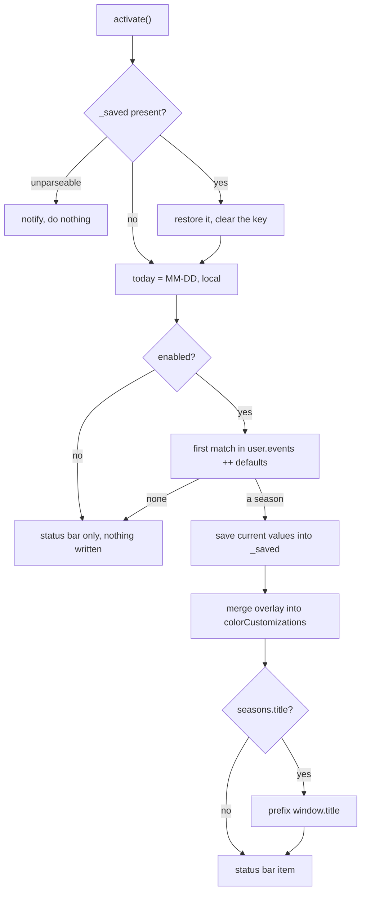

# RFC 0019 — BatleHub seasons

| Field       | Value                                                        |
| ----------- | ------------------------------------------------------------ |
| Status      | Implemented — revision 3, 2026-10-09; phases 1–5 landed and proven in a real editor (`task heavy:view:seasons`, `ALL-OK`: `SEASONS-OK`, `UNDO-OK`, `PERSIST-OK`). One question left open, and it needs eyes rather than code (§11) |
| Short       | Seasons                                                       |
| Settles     | A seasonal ambiance extension: six dated windows that tint the workbench through a global colourCustomizations overlay and put a glyph in the window title, every write saved and restored from one settings key |
| Closes      | Product — the editor remembers the day it is                  |
| Author      | Max Batleforc <maxleriche.60@gmail.com>                       |
| Co-author   | Claude Opus 5 — co-owner of the design session this document records |
| Created     | 2026-10-08                                                    |
| Revised     | 2026-10-09 — revision 2, written from the implementation: phases 1–5 are in the tree (`extensions/batlehub-seasons/`, 109 unit tests, the `seasons` half of `tests/heavy/view.sh`). Six things this document had wrong or had not said are corrected — Halloween's pair failed the 4.5:1 gate it is subject to and is now `#a8470a` (§4.2); the catalogue is `en` only, since RFC 0001 revision 3 dropped `fr` (§4.2); the one `onDidChangeConfiguration` listener is named (§6.4); the heavy phase asserts the workbench ground rather than an editor a no-folder window does not have, and drives the undo from the palette (§10); `.vscodeignore` follows java-core's, because che-clipboard's would drop `package.nls.json` and `l10n/` from the VSIX (§6.5). **Not Implemented**: the `SEASONS-OK` half has never been run against a real editor, and open question 1 is still open. |
| Supersedes  | —                                                             |
| Depends on  | RFC 0014 (the theme the overlay sits *on top of*, and the contrast-ratio posture its `test/contrast.test.ts` sets). Nothing depends on this RFC, and nothing may: `Closes` is `Product`, so it is never on the path of a traced row |
| Touches     | `extensions/batlehub-seasons/` (new), `cog.toml` (one `[monorepo.packages]` block), `tests/heavy/` (one phase), `docs/guide/seasons.md`, `docs/.vitepress/config.ts` |

---

## 1. Summary

A new extension, `batlehub.batlehub-seasons`, that makes the editor notice
what day it is. Six dated **windows** ship as defaults — Halloween,
Christmas, New Year, April Fools, Fête de la Musique, Fête Nationale — each
`{ name, from, to }` with `MM-DD` bounds and a palette. While a window is
active the extension writes a small **overlay** into the user's global
`workbench.colorCustomizations` (the title bar, activity bar and status bar
only — never the editor surface) and prefixes `window.title` with a glyph, so
the pumpkin shows in the browser tab of a che-code workspace — and in the
title bar itself when the command centre is off, since with it on the title
bar renders the command centre rather than the window title. A status bar item names the season and is the off
switch. Everything the extension writes outside its own settings is first
copied into one key, `batlehub.seasons._saved`, and that key is checked on
**every** activation — so a window closed on 31 October and reopened in
March finds its own leftovers and removes them.

**This is a Product RFC** (its `Closes` row). RFC 0001 §7.1: a Product RFC
serves BatleHub's identity rather than a gap a Java developer feels; it is
**exempt from Appendix A tracing**, **bound by the red lines** like every
other (§7), and **never on the path of a traced row**. It sits outside the
order of work (RFC 0001 §14) and is never built ahead of something a team is
waiting for. Like the theme, it is **not in `java-pack`** — and unlike the
theme it is not on the gallery either: v1 is the author's own VSIX (§3,
decision 5).

### Before / after

```text
# today
- 31 October, 24 December, 14 July: the editor looks exactly as it does on
  the 3rd of February
- VS Code offers no API to repaint the workbench; the only route to seasonal
  chrome is the user's own settings.json

# with this RFC
- 24 Oct → 01 Nov: the title bar, activity bar and status bar turn pumpkin;
  the title bar and the browser tab read "🎃 Greeter.java — batlehub-vsx";
  the status bar reads "🎃 Halloween"
- click that status bar item → "Seasons: off until next year"
- 02 Nov, first window opened: the overlay is gone, window.title is the
  string it was on 23 Oct, batlehub.seasons._saved is absent
- settings.json, to add your own:
    "batlehub.seasons.events": [
      { "name": "Release week", "from": "03-10", "to": "03-14",
        "glyph": "🚢", "background": "#1b3a8f", "foreground": "#f4f7ff" }
    ]
```

---

## 2. Motivation

1. **The theme gave BatleHub a face and no calendar.** RFC 0014 put
   DESIGN.md's palette in the editor and holds it to the ratio; it is
   deliberately static, because a design system that drifts is not a design
   system. A seasonal tint is the thing the theme must *not* do and that
   someone still wants: it belongs beside the theme, in its own extension,
   layering on top rather than editing `tokens.json`.
2. **Every existing route to this leaves a mess.** Peacock — the nearest
   prior art — writes `workbench.colorCustomizations` into
   `.vscode/settings.json` and is driven by the project, not the clock; its
   failure mode is a colour committed to a repository. The approach is right
   and the scope is wrong twice over, and getting the *undo* right is most
   of the work this RFC specifies (§5.2, §6.3).
3. **In a Che workspace, workspace scope is a commit.** The workspaces this
   repository targets check `.vscode/` in. An ambiance feature that writes at
   workspace scope puts an orange title bar in `git status`, which is how a
   toy becomes a nuisance for everyone who pulls. The scope decision is
   therefore not a preference; it is the feature's main constraint
   (decision 11).
4. **A repository must not be able to choose your colours.** Any setting this
   extension reads is a setting a hostile `.vscode/settings.json` can set.
   An unconstrained `events` array means a repository could pick the
   workbench colours and the *window title string* of anyone who opens it
   (§7).

---

## 3. Goals / non-goals

**Goals**

- On the days that matter, the editor's chrome and its title say so, without
  the user doing anything.
- Which days, and what they look like, are editable in `settings.json` by
  someone who has never read this document.
- Nothing the extension writes outlives the season, including across a
  crash, a killed pod, or an uninstall-and-forget.
- The logic that decides "is today in a window" is testable as plain Node,
  per `docs/contributing/testing.md`.

**Non-goals**

- **Not a reminder.** No notification, no countdown, no "Halloween in 3
  days". This RFC is ambiance only (decision 1); the information channel is a
  different feature and would be a different document.
- **No moving feasts.** Easter, Thanksgiving, "the third Thursday of
  November" and the lunar calendars need either arithmetic or a table, and
  neither is in v1 (decision 7).
- **The editor surface is never tinted.** No `editor.background`, no
  `editor.foreground`, no `tokenColors`. RFC 0014's contrast test guarantees
  hold for the surface you read code on; an overlay there would void them
  silently (§5.3).
- **No asset authoring.** No seasonal icon font, no `productIconTheme`, no
  images. Glyphs are emoji (decision 12).
- **Not for the teams, not yet.** v1 is the author's own VSIX. Team A and
  Team B are mid-migration off IntelliJ; an extension that edits their
  settings is not what buys their goodwill (decision 5). A request from one
  of them is the trigger that reopens it.
- **No second trust model, no process, no network.** Nothing is downloaded,
  nothing is started, nothing leaves the machine (§7).

---

## 4. User-facing design

### 4.1 Configuration

Every setting is `"scope": "application"` — user settings only. A workspace
cannot set any of them, which is what answers §2 point 4.

```jsonc
{
  // the master switch; false restores and clears on the next activation
  "batlehub.seasons.enabled": true,

  // also prefix window.title with the season's glyph
  "batlehub.seasons.title": true,

  // your own windows. These are checked BEFORE the shipped defaults,
  // so an entry here shadows a default it overlaps (decision 10).
  "batlehub.seasons.events": [
    {
      "name": "Release week",   // shown in the status bar, not translated
      "from": "03-10",          // MM-DD, inclusive
      "to": "03-14",            // MM-DD, inclusive; < from means it wraps
      "glyph": "🚢",            // one or two grapheme clusters
      "background": "#1b3a8f",  // chrome background
      "foreground": "#f4f7ff"   // chrome foreground
    }
  ],

  // written by the extension, read by the extension. Not for hand-editing;
  // delete it only if you want the overlay to stay where it is.
  "batlehub.seasons._saved": null
}
```

`events` **absent** and `events` **empty** mean the same thing: the six
defaults apply. There is no way to express "no seasons at all" through
`events`; that is what `enabled: false` is for, and keeping the two separate
is why an empty array is not a kill switch by accident.

### 4.2 The six shipped windows

The six names come from `l10n/bundle.l10n.json` — the runtime catalogue, since
a status bar label is resolved by `vscode.l10n.t` and not by a `%key%` — and the
setting and command strings from `package.nls.json`; `ext:l10n:check` admits no
other source for either. `en` only, as everywhere else in this repository
(RFC 0001 revision 3 dropped `fr`): a second language is a file, not a
refactor. The palettes are chosen so each pair is
**self-contained** — the extension sets background *and* foreground, so the
pair does not have to work against the active theme, which is why one
palette per season is enough rather than a dark/light pair (decision 15).

| Key | Window | Glyph | Background | Foreground |
| --- | --- | --- | --- | --- |
| `season.halloween` | 10-24 → 11-01 | 🎃 | `#a8470a` | `#fff6ec` |
| `season.christmas` | 12-15 → 12-26 | 🎄 | `#14532d` | `#f2fbf5` |
| `season.newyear` | 12-28 → 01-02 | 🎆 | `#1e2a5a` | `#f5f3ff` |
| `season.aprilfools` | 04-01 → 04-01 | 🃏 | `#a21068` | `#fff0f8` |
| `season.musique` | 06-21 → 06-21 | 🎶 | `#5b2d8e` | `#f6f0ff` |
| `season.nationale` | 07-14 → 07-14 | 🇫🇷 | `#1b3a8f` | `#f4f7ff` |

New Year is the wrapping case (`12-28` > `01-02`) and April Fools the
single-day case (`from == to`); both are in the unit tests for that reason
(§10). The palettes are proposed, not seen — §11 open question 1.

### 4.3 Behaviour rules

- **The clock.** Local date, `MM-DD`, year discarded. Read **once per
  activation** and never again (decision 14): a season appears the next time
  you reload the window, and nothing rewrites your settings while you work.
- **Resolution.** `[...user.events, ...defaults]`, first match wins. One
  season is active, or none.
- **Boundaries** are inclusive at both ends. `from == to` is one day.
- **The wrap.** `from > to` means the window is `from..12-31` plus
  `01-01..to`. One expression covers both cases (§5.1) rather than the
  defaults special-casing New Year into two entries.
- **The overlay** is additive: eight keys merged into whatever
  `workbench.colorCustomizations` already holds, the rest of the object
  untouched.
- **The title** is not additive — `window.title` is one string — so the
  glyph is prefixed to the *current effective* value and the previous one is
  saved verbatim.
- **A malformed entry is skipped, never fatal.** A decoration extension that
  refuses to start because a date is misspelt is worse than no decoration.

### 4.4 Commands

| Command | Does |
| --- | --- |
| `Seasons: Remove BatleHub seasons settings` | Replays `_saved` backwards, clears it, lists what it will do and asks — the same shape as `Java: Remove BatleHub settings` (RFC 0001 §7.1) |
| `Seasons: Disable` | The status bar item's click target: sets `enabled: false` and restores immediately |

### 4.5 Validation

There are no hard errors that disable the feature; ambiance never blocks the
editor. The one condition that stops the extension from acting is a
`_saved` it cannot trust:

| Condition | Behaviour |
| --- | --- |
| `_saved` present and unparseable | **Apply nothing, restore nothing.** One notification naming the key and the command of §4.4. Guessing here is how a user's own `window.title` gets destroyed |

Warnings (output channel `BatleHub Seasons`, plus one notification on the
first offending entry):

| Condition | Behaviour |
| --- | --- |
| `from`/`to` not `MM-DD`, or an impossible date (`02-31`) | Entry skipped |
| `background`/`foreground` not a hex colour | Entry skipped |
| `glyph` longer than two grapheme clusters | Truncated to two, counted with `Intl.Segmenter` and not by `.length` — 🇫🇷 is one cluster, two code points and four UTF-16 units, and `.length` would cut it in half into a lone regional indicator |
| Two entries with the same `name` | Both kept; first match still wins |
| `foreground` on `background` under 4.5:1 | Entry still applied — it is the user's choice on their own machine — and logged. The *shipped* palettes are gated by a test instead (§10) |

---

## 5. Architecture

### 5.1 One expression decides the day



The restore runs **before** the resolve, unconditionally, every activation.
That ordering is the whole correctness argument: the extension never has to
reason about whether its last run finished, because it begins by assuming it
did not. An overlay left behind by a killed pod is removed by the next
window regardless of the date, and an overlay that *is* still in season is
simply re-applied a moment later from the same inputs.

The window test, the only arithmetic in the extension:

```ts
// src/calendar.ts — imports nothing from "vscode"
const inWindow = (today: string, from: string, to: string): boolean =>
  from > to ? today >= from || today <= to : today >= from && today <= to;
```

`MM-DD` strings compare correctly as strings, which is why the config shape
of decision 6 was chosen over an anchor plus day counts: there is no date
arithmetic to get wrong, and no timezone in it beyond "which day is it here".

### 5.2 `_saved` is this extension's manifest

RFC 0001's red line 1 is answered by the core's one manifest,
`.batlehub/java/written.json`. This extension cannot use it — the manifest is
a workspace file and these writes are global, and `java-core` is not
necessarily installed beside this extension at all. So it keeps the *rule*
and not the file: one key, in the same scope as the writes it records,
holding the value that was there before.

```jsonc
"batlehub.seasons._saved": {
  "season": "season.halloween",
  "colors": {
    // present with the value it had, or null meaning "this key did not exist"
    "titleBar.activeBackground": null,
    "statusBar.background": "#007acc"
  },
  "title": "${dirty}${activeEditorShort}${separator}${rootName}"
}
```

The distinction between **absent** and **present-with-a-value** is the part
that matters: restoring by deletion would remove a `statusBar.background`
the user set themselves, and restoring by writing back would invent a
`titleBar.activeBackground` that never existed. `null` means delete the key;
a value means write it back.

Living next to what it restores is also why `_saved` is a setting and not
`globalState`: `globalState` is cleared by the same kinds of event that
prevent the undo from running in the first place, so a backup kept there is
missing in exactly the scenarios it exists for (§8).

### 5.3 What the overlay may touch

Eight keys, all chrome:

```
titleBar.activeBackground      titleBar.activeForeground
titleBar.inactiveBackground    titleBar.inactiveForeground
activityBar.background         activityBar.foreground
statusBar.background           statusBar.foreground
```

The invariant: **no key the overlay writes affects a surface RFC 0014's
contrast test makes a promise about.** The theme guarantees ink on ground at
16.9:1 and dim ink at ≥ 5.3:1 where code is read; the overlay replaces
background *and* foreground together on four widgets that hold short labels
and no code. A ninth key on the editor surface would quietly turn those
ratios into whatever the season felt like, and no test in either extension
would notice — which is why the list is fixed in code rather than
configurable.

---

## 6. Detailed design

Four modules. Three of them import nothing from `vscode`, so the rules live
where `task ext:test` can reach them as plain Node.

### 6.1 `extensions/batlehub-seasons/src/calendar.ts`

- `type Season = { key: string; name: string; from: string; to: string; glyph: string; background: string; foreground: string }`
- `DEFAULTS: Season[]` — §4.2's six, names as `%season.*%` keys resolved by the caller.
- `parse(raw: unknown): Season | { error: string }` — §4.5's validation, one entry at a time.
- `activeSeason(today: string, user: Season[], defaults = DEFAULTS): Season | undefined` — the concat and the first match.
- `inWindow(...)` — §5.1.

No `vscode` import. This is the module a bug in this extension is most likely
to live in, and it is the one that costs nothing to test.

### 6.2 `extensions/batlehub-seasons/src/overlay.ts`

- `COLOR_KEYS: readonly string[]` — §5.3's eight, not configurable.
- `patch(season: Season): Record<string, string>` — the eight keys for a season.
- `withGlyph(title: string, glyph: string): string` — prefix, idempotent: a
  title that already starts with this glyph is returned unchanged, so a
  double activation cannot produce `🎃 🎃 `.

No `vscode` import.

### 6.3 `extensions/batlehub-seasons/src/settings.ts`

The only module that touches the editor's configuration, and the only one
the `vscode` mock is needed for.

- `apply(season)` — reads the current values of the eight keys and of
  `window.title`, writes `_saved` **first**, then the overlay. The order is
  deliberate: a crash between the two leaves a `_saved` describing a state
  that is still current, which the next activation restores harmlessly. The
  reverse order can leave an overlay with no record of what it replaced.
- `restore()` — replays `_saved`, `null` meaning delete; clears `_saved` last.
- Every write is `ConfigurationTarget.Global`. There is no code path in this
  extension that passes `Workspace` (decision 11), and a unit test asserts
  the mock never saw one.

### 6.4 `extensions/batlehub-seasons/src/extension.ts`

`activate()` in the order of §5.1's diagram, then one
`window.createStatusBarItem` following `java-core/src/statusbar.ts:39`'s
shape. The item shows `<glyph> <name>`, its tooltip the window's dates, its
`command` the one of §4.4. Out of season, with `enabled: false`, the item is
hidden rather than empty.

One `onDidChangeConfiguration` listener, bounded to the three settings a
person edits — `enabled`, `events`, `title` — and deliberately **not** to
`_saved`: those three are only ever written by a human or by the command
above, whose intent is the same, while reacting to any change would mean
reacting to this extension's own writes and looping. Editing your windows
therefore takes effect without a reload; the *clock* is still read once
(decision 14), so a window that begins at midnight still waits for the next
start. Revision 2 had this bounded to `enabled` alone, and the real-editor run
is what showed why that is not enough: a seasons entry typed into settings did
nothing at all until the window was reloaded.

`deactivate()` does **not** restore. A reload would then flicker the overlay
off and on, and §5.1's startup restore already covers every case
`deactivate` would have — including the ones where it is never called.

### 6.5 Packaging

`extensions/batlehub-seasons/` copied from `extensions/che-clipboard/` (the
smallest TypeScript extension: `package.json`, `tsconfig.json`,
`vitest.config.ts`, `.prettierrc`, `esbuild.mjs`), `publisher: batlehub`,
`engines.vscode: ^1.96.0`, `activationEvents: ["onStartupFinished"]`,
`capabilities.untrustedWorkspaces.supported: true` (it reads no workspace
input, so it is correct in Restricted Mode), `virtualWorkspaces: true`.

`.vscodeignore` follows `java-core`'s rather than `che-clipboard`'s: the
latter's allowlist is `dist/extension.js` and `README.md`, which would drop
`package.nls.json` and `l10n/` from the VSIX and ship an extension whose
labels render as `%config.enabled%`.

One manual entry outside the folder: a `[monorepo.packages.batlehub-seasons]`
block in `cog.toml`, and `batlehub-seasons` added to the list in
`scripts/check-l10n.mjs`, which names its extensions explicitly. The pnpm workspace glob, every `ext:*` task, the CI
`.vsix` glob and the release tag resolver all pick a new extension up
without being told (`docs/contributing/layout.md:30`).

**Deliberately untouched**, so reviewers do not go looking:

- `extensions/batlehub-theme/` — no change at all. The overlay sits on top of
  whatever theme is active and knows nothing about this one; `tokens.json`,
  `scripts/derive.mjs` and the three generated themes are not read, not
  imported and not extended.
- `extensions/java-pack/package.json` — the pack does not install this, and
  not merely because of decision 5: a Product RFC is never on the path of a
  traced row, and a pack entry would put it there.
- `extensions/java-core/` — the core's manifest is not used (§5.2) and no
  contract member is added or called. This extension does not know the Java
  family exists.

---

## 7. Security considerations

- **Nothing attacker-controlled reaches a decision.** Every setting is
  `"scope": "application"`, so `events`, `enabled`, `title` and `_saved` can
  only come from the user's own settings file. Without that scope, a
  repository's `.vscode/settings.json` would be able to pick the workbench
  colours of anyone who opens it and — worse, because it is free text —
  write their `window.title`, which is the string a person reads to know
  which project they are in. `application` scope is the whole defence, and
  the test of §10 asserts it on the manifest rather than trusting it to stay.
- **Nothing is executed, fetched or sent.** No process, no network, no file
  outside the editor's own settings. The six palettes and six date pairs are
  literals in `calendar.ts`.
- **The glyph is not a format string.** `withGlyph` concatenates; it does not
  interpolate, so a `${...}` in a user's `glyph` is two characters of text
  and not a title variable.

### Red lines

- **Every write is in the manifest.** This extension writes two things
  outside its own settings — eight keys of `workbench.colorCustomizations`
  and `window.title`, both at global scope — and both are recorded, with the
  value that preceded them and with absence distinguished from emptiness, in
  `batlehub.seasons._saved` before either is written (§5.2). It is replayed
  backwards by `Seasons: Remove BatleHub seasons settings`, and unlike the
  core's manifest it is also replayed **automatically at every activation**,
  because the thing it protects against is the undo never running. It is not
  the core's manifest and does not try to be: that file is workspace-scoped
  and belongs to a family this extension has no dependency on (§6.5).
- **The token is the core's.** Does not apply: no registry credential is
  read, written, held or logged. The extension touches no credential target.
- **Memory.** None. No long-lived process, no interval, no timer of any kind
  (decision 14) — the clock is read once in `activate()`. Nothing to declare
  and nothing to cap.
- **Defaults crossed.** One, in three places, and this is the sharp entry
  §1 promises:
  - *A foreign setting written by default only at workspace scope* — **crossed
    deliberately**: the writes are **global**. Ambiance follows the
    developer, not the repository, and in a che-code workspace
    `.vscode/settings.json` may be tracked by git, so workspace scope would
    make an orange title bar a commit (§2 point 3). The protection workspace
    scope was giving — "a mistake is confined to one project" — is replaced
    by the startup restore of §5.1, which is strictly stronger: it also
    covers the project you never open again.
  - *Never over a value the user already set* — **crossed for one key**:
    `window.title` is a single string, so a glyph cannot be added without
    replacing it. The previous value is saved verbatim and restored verbatim
    (§5.2), and `batlehub.seasons.title: false` opts out entirely. The eight
    colour keys are *not* crossed: the overlay merges, and a key the user had
    set is saved and written back.
  - *Shown once with its undo* — honoured by the status bar item, which is
    present for the whole season and whose click target is the undo (§4.4).
  - The remaining defaults hold unchanged: nothing is downloaded at runtime,
    no source or comment text goes anywhere, and there is no maintained
    extension being rebuilt (§8).
  - *Every feature traces to Appendix A* — exempt: `Closes` is `Product`.

---

## 8. Alternatives considered

| Alternative | Why rejected |
| --- | --- |
| A reminder instead — notification, countdown, "Halloween in 3 days" | A different feature. The want was the editor *feeling* like the season, not being told about it (decision 1); §3 keeps the door open as a separate document |
| Ship seasonal colour themes and swap `workbench.colorTheme` | Total control, and the only option that crosses into another package: a season would mean reaching into `batlehub-theme`'s `tokens.json` and its 26k `scripts/derive.mjs` from a different extension, or duplicating the generator. It also replaces the user's chosen theme wholesale instead of tinting it |
| A seasonal `productIconTheme` — pumpkins in the activity bar | The most charming option, and an authored icon font per season, six times over, with no `productIconTheme` in `batlehub-theme` to fork |
| Explorer badges via `FileDecorationProvider` | Reverses RFC 0010 decision 12 ("a decoration is a contract member for one consumer"), and a 🎃 on every row is noise by the second day |
| `contributes.icons` — register a custom icon font, use `$(pumpkin)` | Real asset work for something emoji already express |
| A webview panel with falling snow | The only way to draw anything free-floating, and a pane nobody keeps open |
| Decorate nothing the extension does not own — status bar only, zero writes | Nothing to restore and nothing to get wrong, and it is not ambiance: one corner changes, the editor does not. Kept as phase 2, which ships on its own if the rest is ever abandoned (§12) |
| Workspace scope for the overlay | `.vscode/settings.json` is tracked in the workspaces this repository targets; the colour becomes a commit (§2 point 3) |
| Back up into `globalState` | Cleared by the same events that stop the undo running, so it is empty exactly when it is needed (§5.2) |
| No backup — delete the eight keys and reset `window.title` to undefined | Silently destroys a `window.title` or a `statusBar.background` the user had set |
| `setInterval`, so a season appears mid-session | A timer that rewrites your global settings unprompted at 00:00. A decoration appearing on the next window reload is not a defect (decision 14) |
| `onDidChangeWindowState`, recheck on refocus | Nearly free, and it means a browser-tab refocus can rewrite `settings.json` — the kind of thing you debug once and regret |
| `{ name, date, before, after }` — an anchor and day counts | More compact, and it needs arithmetic and an idea of "the day itself" that only the rejected reminder feature would use (decision 6) |
| Whole-month seasons | Throws away 25 December versus 26 December, the one distinction people actually feel |
| Forbid the year wrap; ship New Year as two entries | The general case is *smaller* than the special case here — one ternary (§5.1) — and forbidding it pushes the bug onto whoever writes a wrapping entry of their own |
| Compute the moving feasts (Easter, "third Thursday") | Arithmetic nobody can check by eye. If Pâques is ever wanted, five literal entries that run out in 2031 are more obviously correct (decision 7) |
| A remote calendar feed (iCal, a BatleHub-hosted JSON) | The only option that adds network I/O and a trust boundary to an extension that has neither, to buy correctness for feasts that can simply be written down |
| Fold it into `batlehub-theme` | 0014 has no `main` and no `activationEvents`; this would give a code-free theme a runtime for the first time, to host a feature that shares nothing with it |
| Fold it into `batlehub-vsx` | Couples a decoration to the extension that holds the registry credential. A crash in the pumpkin path should not be anywhere near that host |
| A dark palette and a light palette per season | The overlay sets background *and* foreground on every widget it touches, so each pair is self-contained and the active theme does not enter into it (decision 15). Twelve palettes to taste-check instead of six, for no legibility gained |
| Publish to the gallery for Team A and Team B now | They are mid-migration off IntelliJ. An extension that edits their settings is not what earns the trust that migration needs; a request from one of them is the trigger (decision 5) |

---

## 9. Rollout and compatibility

- **Default behaviour, unconfigured.** `enabled: true`, the six defaults,
  `title: true`. The extension does something on the day it is installed or
  it never gets configured.
- **Config migration.** None; nothing exists to migrate from.
- **Operator prerequisites.** None. No network, no credential, no sidecar.
- **Rollback.** `enabled: false`, or the command of §4.4, or uninstalling
  after either. **Uninstalling while a season is active leaves the overlay
  behind** — the extension is gone and cannot run its undo — and this is the
  one sharp edge of the design. It is named in `docs/guide/seasons.md` with
  the two settings keys to delete by hand, and `_saved` is a *setting* partly
  so that recovering from it needs no extension at all.
- **Distribution.** Not in `java-pack`, not on the gallery in v1 (decision
  5). `task ext:package` produces `batlehub-seasons.vsix` like any other.

---

## 10. Test plan

- **Unit** (`extensions/batlehub-seasons/test/calendar.test.ts`), no `vscode`:
  the wrap (`12-30` and `01-01` both inside `12-28 → 01-02`; `11-15`
  outside), both boundaries inclusive, the single-day window
  (`04-01 → 04-01` on `04-01` and `03-31`), a user entry shadowing an
  overlapping default, array order deciding between two user entries, no
  match returning `undefined`, and each §4.5 malformed shape skipped rather
  than thrown.
- **Unit** (`test/overlay.test.ts`), no `vscode`: the patch is exactly §5.3's
  eight keys and no others; `withGlyph` prefixes, is idempotent, and leaves
  `${...}` variables in the user's title intact.
- **Unit** (`test/contrast.test.ts`): each of the six shipped
  `foreground`/`background` pairs clears 4.5:1 — the gate on taste being
  wrong in a way that hurts. The relative-luminance helper is ~15 lines
  copied into the test rather than imported from
  `batlehub-theme/scripts/color.mjs`, because that package has no `main` and
  a workspace dependency on a theme to run a test is a worse trade than a
  duplicated formula; the duplication is noted in the file.
- **Unit** (`test/settings.test.ts`), against the hand-written `vscode` mock
  of `test/vscode-mock.ts`: `_saved` written before the overlay; absent keys
  recorded as `null` and restored by deletion; present keys restored by
  value; an unparseable `_saved` touching nothing (§4.5); a stale `_saved`
  from another season restored at activation before the new one is applied;
  and the mock never observing a `ConfigurationTarget` other than `Global`.
- **Manifest** (`test/manifest.test.ts`): every setting in `package.json`
  carries `"scope": "application"` — §7's defence asserted rather than
  assumed — and every user-visible string resolves through
  `package.nls.json`.
- **Real editor** (`tests/heavy/seasons.mjs`, the `seasons` half of
  `tests/heavy/view.sh`, `task heavy:view:seasons`). Three phases:
  **`SEASONS-OK`** — a one-day `batlehub.seasons.events` entry covering today
  is *typed* into the user settings through `Preferences: Open User Settings
  (JSON)`, and `getComputedStyle` on the title bar, activity bar and status bar
  equals that entry's `background` while `--vscode-editor-background` does not
  (§5.3, asserted against the editor rather than the code); `document.title` is
  the glyph in front of the user's own `window.title`; the status bar item
  carries the glyph and the window's name. **`UNDO-OK`** — `Seasons: Disable
  until next year` run **from the command palette**, the status bar item's own
  command and the path a person takes: every colour back to the theme's, the
  user's `window.title` back verbatim, the item gone. **`PERSIST-OK`** — the
  window reloaded: still the theme's colours, still the user's title, still no
  item, which is the claim `_saved` exists for, asserted behaviourally rather
  than by reading a record.

  Three things the first runs of this half taught, each now a comment where it
  bites. **The settings cannot be seeded from a file**: every setting is
  `scope: "application"`, and the web build keeps user settings in the browser,
  not in the server's data dir — a `settings.json` written to either data
  directory is read by nobody, which also means the *file* cannot be the
  assertion and the DOM has to be. **`Developer: Reload Window` is not a
  reload** for this purpose: it left the extension host alive (one `exthost1`
  in the server's logs for a whole run) so the extension never activated a
  second time; the driver navigates the page instead. **A window with no
  folder open paints its status bar from `statusBar.noFolderBackground`**,
  which is not a key the overlay owns, so the half opens an (empty) folder like
  every real window has.

  `SEASONS_BG`, `SEASONS_FG`, `SEASONS_GLYPH` and `SEASONS_NAME` override the
  probe's palette, which is how a shipped pair gets looked at in a real editor
  (open question 1). The config surface is its own
  test seam — a one-day user entry needs no date-forcing hook — which is the
  reason there is no `batlehub.seasons.force` setting. This phase is what
  makes the item done under this repository's rule that a real client has to
  have been through it.
- **Existing suites** that must pass unchanged: `task ext:lint` (oxlint +
  prettier + `tsc --noEmit`), `task ext:test`, `task ext:l10n:check` (the six
  season names and the status bar tooltip), `task ext:licenses`,
  `task rfc:index:check`, and the whole of `task check`.

---

## 11. Decisions and open questions

### Resolved

| # | Question | Decision |
| --- | --- | --- |
| 1 | Reminder, ambiance, or both? | **Ambiance.** The want is the editor feeling like the day, not being told about it. A reminder is a separate document (§3) |
| 2 | Its own extension, folded into the theme, or into `batlehub-vsx`? | **Its own.** It shares nothing with the theme, and a decoration has no business in the host that holds the registry credential (§8) |
| 3 | Who owns the calendar — shipped, user, or remote? | **Shipped defaults plus user additions.** A remote feed is the only option that would add network I/O and a trust boundary (§8) |
| 4 | RFC first, or code first? | **RFC first.** This document; no code is written against it until it is signed off |
| 5 | Who installs it? | **The author only, in v1.** Not in `java-pack`, not on the gallery. Team A and Team B are mid-migration; a request from one of them is the trigger that reopens this |
| 6 | What shape is an event? | **`{ name, from, to }` with `MM-DD` bounds.** Strings that compare correctly, no date arithmetic to get wrong (§5.1) |
| 7 | Which windows ship, and do any move? | **Six, all fixed** (§4.2). No computed feast in v1; a lookup table if ever (§8) |
| 8 | What kind of RFC is this? | **Product**, like RFC 0014: exempt from Appendix A tracing, bound by the red lines, never on the path of a traced row (§1) |
| 9 | May a window cross the year? | **Yes.** One ternary covers it and kills the whole class of bug, including in the user's own entries (§5.1) |
| 10 | Two windows at once — who wins? | **User entries beat defaults, then array order.** One `concat` and the same first-match loop; it matches the only intuition anyone has about config |
| 11 | How does seasonal chrome get painted, and at what scope? | **A `workbench.colorCustomizations` overlay at global scope.** VS Code has no API to repaint the workbench; the overlay is the only route that tints the user's theme instead of replacing it, and global is forced by `.vscode/` being tracked in a Che workspace (§2 point 3, §7) |
| 12 | Where do the glyphs go? | **`window.title` and a status bar item.** The title is the ask and reaches the browser tab too; the status bar item is the off switch wearing a costume, so it pays for itself twice (§4.4) |
| 13 | How does it undo itself? | **One settings key, `batlehub.seasons._saved`, replayed at every activation**, not only at the season boundary. The failure to design for is the undo never running (§5.1, §5.2) |
| 14 | When is the clock read? | **Once, in `activate()`.** No timer, no refocus hook: a season appearing on the next reload is not a defect, and settings being rewritten unprompted is (§8) |
| 15 | One palette per season, or a dark and a light one? | **One.** Background and foreground are replaced together, so each pair is self-contained and the active theme does not enter into it (§4.2) |
| 16 | Does the overlay ever touch the editor surface? | **Never.** Eight chrome keys, fixed in code. RFC 0014's contrast guarantees cover the surface code is read on, and an overlay there would void them with no test noticing (§5.3) |

### Still open

1. **The six palettes are proposed, not seen.** §4.2's hex pairs are
   reasoned (saturated chrome, near-white ink, each pair self-contained) and
   the contrast test gates legibility — but not taste, and not whether
   `#a8470a` next to DESIGN.md's warm near-black reads as "October" or as "a
   broken theme". This needs eyes rather than code, the same way RFC 0014's
   last open question did: build phase 2, look at the status bar item for a
   day, then decide the other five. Nothing downstream depends on the answer;
   the palettes are six rows of a literal.

   Halloween's `#a8470a` has now been rendered — `SEASONS_BG=#a8470a
   SEASONS_FG=#fff6ec SEASONS_GLYPH=🎃 SEASONS_NAME=Halloween task
   heavy:view:seasons`, screenshot `02-seasons-applied.png` — and reads as a
   solid pumpkin against Dark Modern. The other five have not been looked at,
   and none has been looked at against BatleHub Dark, which is the pairing
   that matters.

---

## 12. Implementation phases

Each phase leaves `task check` green.

| Phase | Content |
| --- | --- |
| 1 | The extension exists and decides the day. `extensions/batlehub-seasons/` from `che-clipboard`, `calendar.ts` + `overlay.ts` and their three unit tests, the `cog.toml` block. Nothing visible in the editor; all of §5.1's arithmetic is proven as plain Node |
| 2 | **The status bar item alone** — glyph, name, tooltip, hidden out of season. No settings written, nothing to restore, nothing to get wrong. *Useful on its own:* if phases 3–5 never land, this is still a 🎃 in the editor on 31 October, and it is also where open question 1 gets looked at |
| 3 | The overlay and the undo: `settings.ts`, `_saved`, the startup restore, `Seasons: Remove BatleHub seasons settings`, `test/settings.test.ts` and `test/manifest.test.ts`. The risky part, landing with its tests and after the harmless part |
| 4 | `window.title`, behind `batlehub.seasons.title`. Separate from phase 3 because it is the one write that goes over a value the user may have set (§7) |
| 5 | Proof and documentation: the `SEASONS-OK` heavy phase, `docs/guide/seasons.md` (including the uninstall-while-active edge of §9), the sidebar entry, `README.md` |
